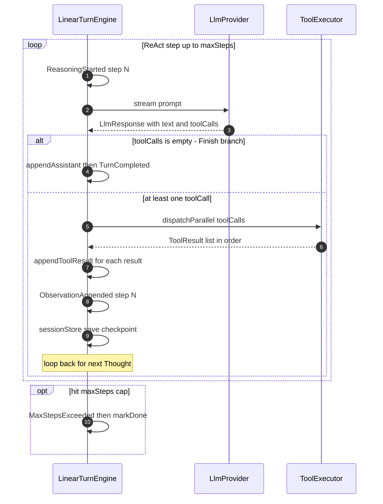
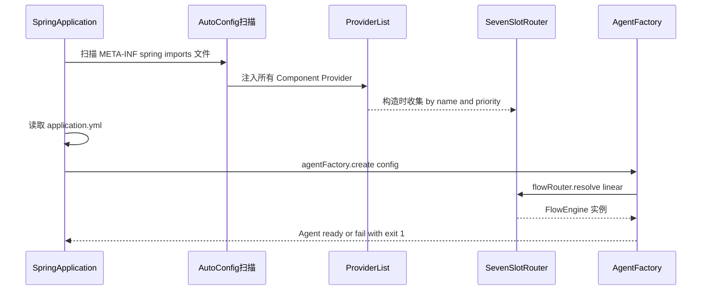
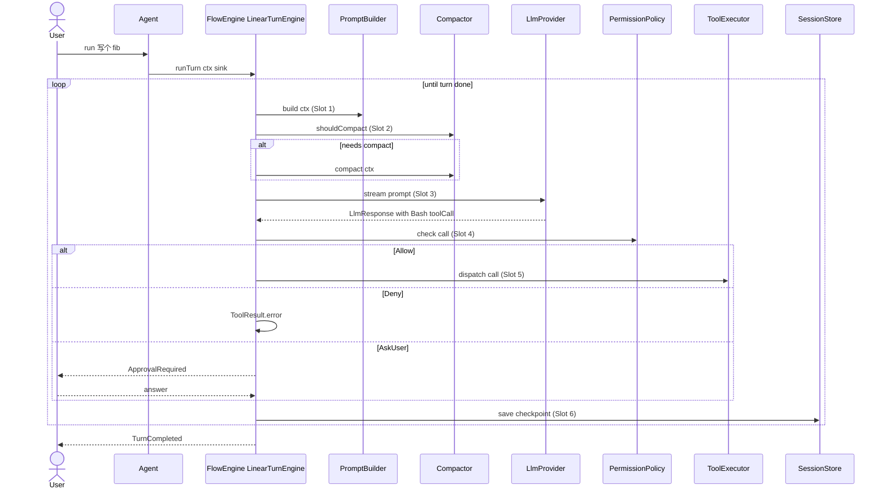
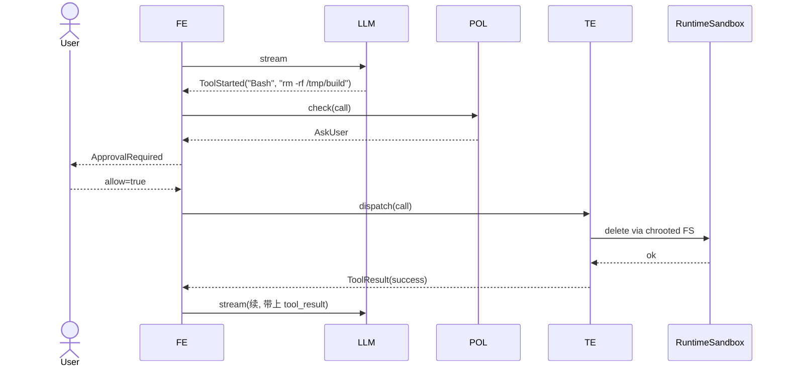
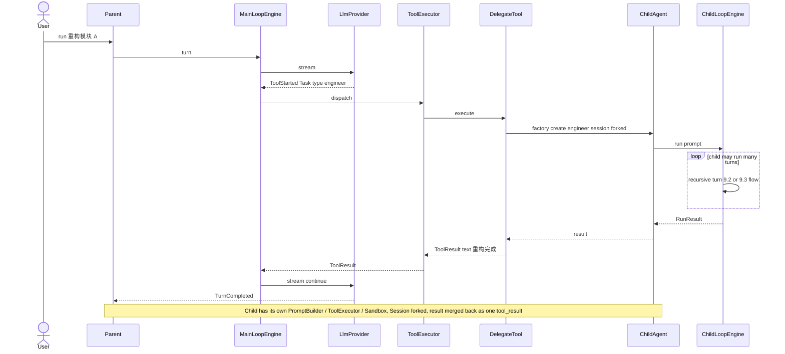
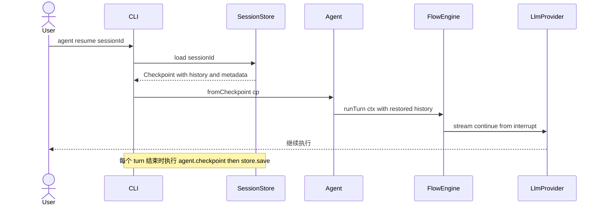

# DSH Agent Engine — 设计文档 v1.5.7

> **代号**:DSH Agent(类 Apache DSH / Dubbo 的 SPI 风格 Java Agent 引擎)
> **版本**:v1.5.7(Spring AI 边界硬规则 + 新依赖引入 — 单人 RFC 决议 v1.5.7)
> **目标读者**:本项目核心开发、贡献者、未来回看决策的"半年后的自己"、SpecKit `/specify` `/plan` 输入源
> **状态**:设计阶段冻结,v1.5.7 新增 §4.10.1 Spring AI 使用边界(LlmProvider + default FlowEngine 硬规则 3 条)+ §10.1 引入 `spring-ai-bom` 1.0.0-M6 依赖(R-13/R-14 跟踪);v1.5.6 已具备 Personas + AC + NFR + Error Catalog + Glossary + Risk Register

---

## 目录

0. 目标与非目标(含 §0.3 Personas + §0.4 Acceptance Criteria)
1. 锁定的设计决策(总览)
2. 架构总览
3. 模块划分
4. 核心接口(JDK 8 + Lombok)
5. SPI 机制(Slot / Provider / Router)
6. 关键实现
7. AgentFactory 与启动校验
8. 配置文件
9. 数据流时序图
10. Maven 模块结构
11. 插件开发指引
12. 开放问题(留给未来)
13. 变更历史
14. 生产化增强(N1—N13,含 §14.15 NFR 总账)
15. Error Catalog(错误码全表)
16. Glossary(术语表)
17. Risk Register(风险登记册)

---

## 0. 目标与非目标

### 0.1 目标

- 做一个**可扩展的 Java Agent 引擎**,核心能力对齐 Claude Code 类编码 Agent。
- **插件化优先**:6 大原子 Slot + 1 个编排 Slot 全部走 Spring Boot SPI,每个 Slot 可独立替换。
- **兼容企业 JDK 8**(sealed / records / `var` / pattern-switch / `List.of` 全部回避)。
- **第一公民级多 Agent 协作**:`Task` tool 直接落地,子 Agent 通过 `SubAgentType` 枚举 + yml 注册。
- **运行时拓扑可替换**:v1 线性,后续用户自研 DAG 引擎无需改核心代码。
- **Skill 行为对齐 Claude Code**:Skill 既是 Tool(模型可见 schema、自动调用),也是用户命令(`/xxx` 显式触发,自动发现 SKILL.md)。

### 0.2 非目标(v1 不做)

- 不做分布式 Agent 协同(单机进程内)。
- 不做可视化 UI(CLI 为主)。
- 不做完整 gVisor/Firecracker 沙箱(JVM 内 chroot 即可)。
- 不做 LLM 摘要式 Compactor(留给 v2 SPI 实现)。
- 不做发现式子 Agent 注册(只接受枚举 + 显式 yml)。
- 不做 Skill 的模糊匹配 / 命令行补全(`/xxx` 严格匹配 SKILL.md 目录名)。

### 0.3 Personas 与典型使用故事

> **Persona** 是 SpecKit `/specify` 模板必填项。这里给出 v1.0 重点服务的 3 类用户,每类一段 user story + 触发它的文档章节锚点。

#### Alice — 第三方插件开发者

> **As a** Java 开发者,在企业内做"AI 编码助手"产品,
> **I want to** 通过 SPI 注入自定义 `LlmProvider`(走企业内 Anthropic 代理) / `ToolExecutor`(对接内部 wiki API) / `SandBoxer`(内网合规)而不需要 fork LingShu 主仓,
> **so that** 我可以专注业务接入,LingShu 主线升级不会破坏我的实现。

- **典型触发**:写一个 `lingshu-internal-llm` jar,实现 `LlmProvider` 接口,在 `META-INF/spring/...AutoConfiguration.imports` 注册一行
- **验证路径**:§5 SPI 机制 + §11 插件开发指引 + §14.13 插件版本治理
- **KPI**(自己写插件后):从 clone lingshu 到自己 Provider 跑通 Hello World ≤ 30 分钟

#### Bob — Agent 业务配置方(企业 IT/架构师)

> **As a** 企业 IT 架构师,要给 200 个开发者配"编码助手"模板,
> **I want to** 只用一份 `application.yml`(配合 `CLAUDE.md` 项目记忆)就能启动一个有完整 ReAct Loop / Tool 调用 / 审计的 Agent,
> **so that** 我不需要给每个团队培训 Java 代码,直接 yml 版本化 + GitOps。

- **典型触发**:写一份 `application.yml`,配置 `llm.provider` / `tools` / `identity` / `memory.claude-md`,`SpringApplication.run()` 启动
- **验证路径**:§8 配置文件(零配置 + 27字段默认)+ §8.1.4 「Java 工程师 Agent」完整业务配置示例 + §14 N1-N13 生产化
- **KPI**:从空白 yml 到第 1 个工具调用响应 ≤ 5 分钟;零配置场景下空 yml 也能启动

#### Charlie — LingShu 核心仓贡献者

> **As a** LingShu 核心仓维护者,
> **I want to** 新增一个 Slot(比如 v2 加 `CompactorProvider` 用于摘要压缩)时,影响面只局限在该 Slot 接口 + 它的 Router + 测试,不动其他 8 个 Slot,
> **so that** 主仓可独立演进 + 测试覆盖率不退化 + 插件作者不会被打破 API。

- **典型触发**:加一个 `CompactorProvider` SPI,实现 `CompactorRouter`,补单元测试 + integration test,PR 走 §11 流程
- **验证路径**:§4 核心接口 + §5 SPI 机制 + §7 AgentFactory 启动校验 + §11 插件开发指引
- **KPI**:新增一个 Slot 从 design doc 到 PR 合入 ≤ 3 天,且不引入 breaking change

### 0.4 v1.0 Acceptance Criteria(验收标准)

> 这是 v1.0 发布的硬性"通过/不通过"清单。每条都是**黑盒可断言**的,Claude Code 自测 + 你 review 都以此为准。**全部通过**才能 tag `v1.0.0`。

#### AC-01 零配置启动

**Given** 一份空 `application.yml`(只有 `spring.application.name=lsh-empty` 一行)
**When** 执行 `java -jar lingshu-examples/demo-empty-1.0.jar`
**Then** 进程在 30 秒内返回首个 LLM 流式 token,且 stderr 输出零 ERROR 级别日志

#### AC-02 SPI 全 Slot 可替换

**Given** yml 切到 `agent.llm.provider: anthropic@2-beta`(同 name 不同 version)
**When** 启动 + 跑 1 个 turn
**Then** 进程里实际生效的 `LlmProvider.name()` 返回 `"anthropic@2-beta"`;**且** in-flight turn 不重启就被切到新版本(§14.8 配置热更新同时验证)

#### AC-03 Tool 并发加速

**Given** yml `agent.tool.parallelism: 4` + 注册 4 个独立 `read_file` tool,且每个 tool 延迟 ≈ 1s
**When** 在 prompt 里同时请求 4 个文件
**Then** wall-clock 时间 ≤ 1.3 秒(对比串行基线 4.0s,**加速比 ≥ 3.0×**);§6.1 LinearTurnEngine 共享 ExecutorService + 顺序归集验证

#### AC-04 取消传播

**Given** Agent 正在跑一个 30 步的 turn
**When** 用户按 Ctrl-C(JVM shutdown hook 触发)
**Then** 200ms 内所有 in-flight turn 停止;partial 响应 + `stopReason=CANCELLED` 已写入 §14.10 AuditLog;§14.12 CancellationToken 三层贯通验证

#### AC-05 多租户隔离

**Given** 配置 `agent.tenants[alice]` 与 `agent.tenants[bob]`,每个有独立的 memory dir + cost budget + sandbox whitelist
**When** Tenant Alice 跑一个 turn 写到 memory,后切到 Tenant Bob 跑
**Then** memory 文件零交叉;cost budget 独立计数;sandbox whitelist 各生效;§14.9 TenantContext ThreadLocal + 配置/Session/Sandbox/Cost 四维隔离验证

#### AC-06 YAML 热更无中断

**Given** Agent 正在跑 turn T1,同时外部进程修改 `application.yml` 的 `agent.sandbox.command-whitelist`(新增 `git`)
**When** T1 完成前(下一个 turn T2 开始时)
**Then** T2 可见新的 `git` 允许执行;T1 不被中断,使用的仍是旧 whitelist(§14.8 AgentConfigRegistry AtomicReference swap + 旧 turn 冻结)

#### AC-07 ReAct 上限

**Given** yml `agent.react.max-steps: 3`,且 LLM mock 每次只返回 tool call(不返回 final answer)
**When** 跑一个会无限循环的 prompt
**Then** 第 3 步之后发 `MaxStepsExceeded(3, totalUsage=...)` 事件,然后 turn 正常 `done()`,**不**无限循环;§1.5.1 ReAct 守卫验证

#### AC-08 插件版本治理

**Given** classpath 里有两个同 `name="anthropic"` 但 `version="1"` 与 `version="2-beta"` 的 Provider
**When** 启动 Agent
**Then** 启动校验 **FAIL**,报错明确指出:"slot=llm, name=anthropic, version 冲突: 1 vs 2-beta";§14.13 兼容性检测验证

#### AC-09 业务配置三件套完整可用

**Given** yml 配置 `agent.identity.name=Java Engineer` + `agent.instructions.inline=...` + `agent.memory.claude-md.path=./CLAUDE.md`
**When** 跑一个 turn
**Then**:
- system prompt 第一段是 `[ROLE] Java Engineer` + identity.traits 展开
- 中间是 instructions 模板渲染结果
- 后跟 `[PROJECT MEMORY] <CLAUDE.md 内容>`
- §4.5.1 PromptBuilder 5 段装配顺序验证;§8.1.4 「Java 工程师 Agent」示例可跑通

#### AC-10 A2A AgentCard 自动生成

**Given** 启用了 `lingshu-a2a-server` 模块 + yml 配了 `agent.identity.*`
**When** HTTP `GET /.well-known/agent.json`
**Then** 返回的 `AgentCard` 包含 `name` / `description` / `version` 字段,**且**直接来源于 `cfg.getIdentity()`,无需额外 yml;§5.6.8 LocalAgentCardGenerator 验证

---

## 1. 锁定的设计决策

| # | 决策 | 落地形式 |
|---|---|---|
| 1 | JDK 8 兼容(主要目标) | sealed → `abstract class`、records → Lombok `@Value`、pattern-switch → `instanceof`、`var` 不用、`List.of`/`Map.of`/`Set.of` → `Collections.empty*()` |
| 2 | Reactive 选型 | `org.reactivestreams.Publisher`(JDK 8 标准方案)+ 自写轻量 collector |
| 3 | RuntimeSandbox 强度 | chroot 到 working dir + 命令/域名白名单,JVM 内实现 |
| 4 | Compactor v1 | 仅截断超长 `ToolResult` + 滑动窗口保留最近 N turn;语义摘要留 v2 |
| 5 | Skill 与 Tool 边界 | Skill 与 Tool 共用接口,运行时行为完全一致;Skill 既能被模型自动调用(对模型可见 schema),也能被用户通过 `/xxx` 显式触发(Claude Code 风格) |
| 6 | 子 Agent 注册 | `SubAgentType` 枚举 + `application.yml` 显式声明 + 启动期一致性校验 |
| 7 | 编排可扩展 | 抽出 `FlowEngine` 接口,默认 `LinearTurnEngine`,DAG 引擎作为另一 SPI 实现 |
| 8 | Slot 选用方式 | `Provider` 模式(多实现共存,按 name + priority 选用) |
| 9 | Plugin 发现 | Spring Boot Auto-Config(`META-INF/spring/...AutoConfiguration.imports` 一行) |
| 10 | 同名 Provider | `priority()` 最大胜出;启动日志列出所有 Provider 与冲突覆盖关系 |
| 11 | 默认实现位置 | `agent-impl-default` 独立模块;用户不引入即零默认 |
| 12 | 配置校验 | **启动时**(不是运行时);`AgentFactory.create()` 集中校验所有 name 与必填项 |
| 13 | Tool Scheme 来源统一 | MCP server、SpringAI `@Tool` 注解、手写 JSON Schema,三种 Scheme 来源**都通过同一 `Tool` 接口注册**;**执行路径统一走我们自己的 `ToolExecutor`**(不引入 SpringAI 的 tool calling pipeline) |
| 14 | 同 turn 多 tool call 并行 | 同 turn 内多个 tool call **默认并行**(共享线程池);结果按原顺序归集写入 history 以保证 LLM 上下文语义一致;可通过 `agent.tool.parallelism: 1` 退化为串行 |

---

## 2. 架构总览

```
┌────────────────────────────────────────────────────────────────────┐
│                         application.yml                             │
│  agent:                                                             │
│    flow-engine: linear   ← 编排 Slot                              │
│    llm.provider: anthropic   ← 原子 Slot ×6                         │
│    prompt.builder: rag-augmented                                    │
│    tool-executor: default                                            │
│    sandbox.policy: strict                                            │
│    sandbox.runtime: chroot                                           │
│    compactor: truncating                                             │
│    session-store: file                                               │
│    delegate.types: { explore, engineer, reviewer }                   │
└────────────────────────────────────────────────────────────────────┘
                                  │
                                  ▼ Spring Boot 启动
┌────────────────────────────────────────────────────────────────────┐
│  1. 扫描 META-INF/spring/...AutoConfiguration.imports              │
│  2. 实例化所有 @Component Provider                                  │
│  3. 7 个 SlotRouter 收集 + 同名竞争 + 启动日志                      │
│  4. AgentFactory.create(config) → 7 个 resolve + 全部校验          │
│     任一失败 → JVM 退出,启动日志明确指出哪个字段 / 哪个 name        │
│  5. 返回 ready 的 Agent 实例                                         │
└────────────────────────────────────────────────────────────────────┘
                                  │
                                  ▼ 运行时
┌────────────────────────────────────────────────────────────────────┐
│  Agent.run(userInput)                                                │
│    └→ FlowEngine.runTurn(ctx, sink)                                 │
│         ↑                                                            │
│         ├─ v1: LinearTurnEngine(顺序 6 个 Slot)                    │
│         └─ v2: DagTurnEngine(拓扑,你自研)                           │
└────────────────────────────────────────────────────────────────────┘
```

**关键原则**

- **Template Method**:`FlowEngine.runTurn()` 是固定骨架,每步委托给 Slot。
- **Strategy**:每个 Slot 是接口,实现来自 `Provider`。
- **SPI**:实现通过 `META-INF/...imports` 一行被发现。
- **编排可替换**:`FlowEngine` 自身是 Slot,留给 DAG 引擎。

---

## 3. 模块划分

```
┌────────────────────────────────────────────────────────────┐
│ Agent                                                     │
│                                                            │
│  ┌──────────────────┐  ┌──────────────────┐              │
│  │  PromptBuilder   │  │  ToolExecutor   │              │
│  │  (Slot 1)        │  │  (Slot 5)        │              │
│  └──────────────────┘  └──────────────────┘              │
│                                                            │
│  ┌──────────────────┐  ┌──────────────────────────┐      │
│  │  LlmProvider     │  │  SandBoxer               │      │
│  │  (Slot 3)        │  │  ├ PermissionPolicy (4)  │      │
│  └──────────────────┘  │  └ RuntimeSandbox        │      │
│                         └──────────────────────────┘      │
│                                                            │
│  ┌──────────────────┐  ┌──────────────────┐              │
│  │  Compactor       │  │  SessionStore    │              │
│  │  (Slot 2)        │  │  (Slot 6)        │              │
│  └──────────────────┘  └──────────────────┘              │
│                                                            │
│  ┌──────────────────────────────────────────────┐        │
│  │  FlowEngine (编排 Slot,Slot 8)               │        │
│  │  ├ LinearTurnEngine (默认)                  │        │
│  │  └ DagTurnEngine (你后续自研)               │        │
│  └──────────────────────────────────────────────┘        │
│                                                            │
│  ┌──────────────────┐                                     │
│  │  A2aTransport    │  ← v0.5 新增(Slot 9),详见 §5.6   │
│  │  (远端 Agent 通信)│    配套 RemoteAgentTool 适配器    │
│  └──────────────────┘                                     │
└────────────────────────────────────────────────────────────┘
```

---

## 4. 核心接口(Java 8 + Lombok)

> 所有"record"等价物用 `@Value`;所有 sealed interface 用 `abstract class` + 静态内部子类;类型分发用 `instanceof`;**不用 `var`**;**不可变空集合用 `Collections.emptyList()` / `Collections.emptyMap()` / `Collections.emptySet()`** 而非 `List.of` / `Map.of` / `Set.of`。

### 4.1 Message 层次

```java
package io.agent.core.message;

import com.fasterxml.jackson.databind.JsonNode;
import lombok.Getter;
import lombok.RequiredArgsConstructor;
import java.time.Instant;
import java.util.List;

/**
 * JDK 8 兼容:abstract class + 静态内部子类。
 * 失去 sealed 的 exhaustive 保证,运行时多态不变。
 */
public abstract class Message {

    public abstract String role();
    public abstract Instant timestamp();

    @Getter @RequiredArgsConstructor
    public static class System extends Message {
        private final String content;
        private final String source;
        @Override public String role()      { return "system"; }
        @Override public Instant timestamp(){ return Instant.EPOCH; }
    }

    @Getter @RequiredArgsConstructor
    public static class User extends Message {
        private final String content;
        @Override public String role()      { return "user"; }
        @Override public Instant timestamp(){ return Instant.now(); }
    }

    @Getter @RequiredArgsConstructor
    public static class Assistant extends Message {
        private final String text;
        private final List<ToolCall> toolCalls;
        private final StopReason stopReason;
        private final Usage usage;
        @Override public String role()      { return "assistant"; }
        @Override public Instant timestamp(){ return Instant.now(); }
    }

    @Getter @RequiredArgsConstructor
    public static class ToolUse extends Message {
        private final String id;
        private final String name;
        private final JsonNode input;
        @Override public String role()      { return "tool_use"; }
        @Override public Instant timestamp(){ return Instant.now(); }
    }

    @Getter @RequiredArgsConstructor
    public static class ToolResult extends Message {
        private final String toolUseId;
        private final String content;
        private final boolean isError;
        @Override public String role()      { return "tool_result"; }
        @Override public Instant timestamp(){ return Instant.now(); }
    }
}
```

### 4.2 基础 record 等价物

```java
@Value public class ToolCall    { String id; String name; JsonNode input; }
@Value public class Usage       { int inputTokens; int outputTokens; }
@Value public class ToolSpec    { String name; String description; JsonNode inputSchema; }
@Value public class Prompt      { List<Message> messages; List<ToolSpec> tools; ModelHints hints; }
@Value public class ModelHints  { String model; Double temperature; Integer maxTokens; }
@Value public class Checkpoint  { String sessionId; List<Message> history; Map<String, String> metadata; Instant savedAt; }

public enum StopReason { END_TURN, TOOL_USE, MAX_TOKENS, COMPACTED, CANCELLED, ERROR }
```

### 4.3 Decision 抽象类

```java
public abstract class Decision {
    public abstract String kind();

    @Value public static class Allow   extends Decision { String reason; public String kind(){return "allow";} }
    @Value public static class Deny    extends Decision { String reason; public String kind(){return "deny";} }

    @RequiredArgsConstructor @Getter
    public static class AskUser extends Decision {
        private final String prompt;
        private final List<Option> options;
        public String kind() { return "ask"; }
    }

    @Value public static class Option { String label; String description; }
}
```

### 4.4 AgentEvent 抽象类

```java
public abstract class AgentEvent {}

@Getter @RequiredArgsConstructor public static class TextDelta        extends AgentEvent { String text; }
@Getter @RequiredArgsConstructor public static class ToolStarted      extends AgentEvent { String toolCallId; String name; }
@Getter @RequiredArgsConstructor public static class ToolProgress extends AgentEvent { String toolCallId; String partial; }
@Getter @RequiredArgsConstructor public static class ToolCompleted    extends AgentEvent { ToolResult result; }
@Getter @RequiredArgsConstructor public static class TurnCompleted    extends AgentEvent { StopReason reason; Usage usage; }
@RequiredArgsConstructor public static class ApprovalRequired   extends AgentEvent {
    Decision.AskUser ask;
    Consumer<Decision> continuation;
    public Decision.AskUser getAsk() { return ask; }
    public Consumer<Decision> getContinuation() { return continuation; }
}
@Getter @RequiredArgsConstructor public static class Compacted extends AgentEvent {}
@Getter @RequiredArgsConstructor public static class ErrorEvent extends AgentEvent { Throwable error; }

// ── ReAct 迭代事件(§6.1 LinearTurnEngine 发出)──
@Getter @RequiredArgsConstructor public static class ReasoningStarted   extends AgentEvent { int step; int maxSteps; }
@Getter @RequiredArgsConstructor public static class ObservationAppended extends AgentEvent { int step; int toolResultCount; }
@Getter @RequiredArgsConstructor public static class MaxStepsExceeded   extends AgentEvent { int maxSteps; Usage totalUsage; }
```

### 4.5 PromptBuilder(Slot 1)

```java
public interface PromptBuilder {
    Prompt build(TurnContext ctx);
}

/** 静态 / 动态 memory 源。priority 越小越靠前。 */
public interface MemorySource {
    String name();
    int priority();
    /** 返回 null 表示该 source 此次无内容,不参与拼装。 */
    String load(TurnContext ctx);
}
```

> **会话消息历史不是 `MemorySource`**:由 `AgentLooper` 持有并直接喂给 `PromptBuilder.build()`,生命周期是 growable 可变状态,跟静态 memory 不同。

#### 4.5.1 System Prompt 装配顺序(v1.5.5 升级)

`DefaultPromptBuilder.build(ctx)` 现在按下面顺序装配 system 块 → 喂给 LLM。每一段**可独立禁用**,空段被自动剔除:

```text
┌─ [ROLE] ───────────────────────────────────────────────┐
│ 你是 {identity.name}, {identity.role}。 │
│ 人格特质:{identity.traits.join('、')} │
│ 语气:{identity.tone} │
│ 输出语言:{identity.language} │
│ (以上若对应字段为空,该行被跳过,不输出多余空段) │
└────────────────────────────────────────────────────┘
┌─ [INSTRUCTIONS] ────────────────────────────────────────┐
│ (instructions.file 存在 → 读文件) │
│ (否则用 instructions.inline) │
│ (template-engine=mustache → 替换 {{var}}) │
│ (整段为空 → 不输出该段,只走 memory + history) │
└────────────────────────────────────────────────────┘
┌─ [PROJECT MEMORY] ──────────────────────────────────────┐
│ (memory.claudeMd.enabled=true 且 ./CLAUDE.md 存在) │
│ <./CLAUDE.md 内容> │
│ ─── separator ─── │
│ (memory.claudeMd.enabled=true 且 ~/.lingshu/CLAUDE.md 存在) │
│ <~/.lingshu/CLAUDE.md 内容> │
│ ─── separator ─── │
│ (memory.extras 按顺序) │
│ <./docs/team-conventions.md 内容> │
│ <./docs/architecture.md 内容> │
└────────────────────────────────────────────────────┘
┌─ [CONVERSATION HISTORY] ────────────────────────────────┐
│ ...(现有 §6 行为) │
└────────────────────────────────────────────────────┘
┌─ [USER MESSAGE] ────────────────────────────────────────┐
│ ... │
└────────────────────────────────────────────────────┘
```

**装配伪代码**(给 `DefaultPromptBuilder` 参考):

```java
public Prompt build(TurnContext ctx) {
    AgentConfig cfg = ctx.config();
    Identity id = cfg.getIdentity() != null ? cfg.getIdentity() : Identity.defaults();
    Instructions ins = cfg.getInstructions() != null ? cfg.getInstructions() : Instructions.empty();
    Memory mem = cfg.getMemory() != null ? cfg.getMemory() : Memory.defaults();

    StringBuilder sys = new StringBuilder();

    // [ROLE]
    appendIfPresent(sys, "你是 " + id.getName() + (isBlank(id.getRole()) ? "" : "," + id.getRole()));
    appendIfPresent(sys, "人格特质:" + joinIfNonEmpty(id.getTraits(), "、"));
    appendIfPresent(sys, "语气:" + id.getTone());
    appendIfPresent(sys, "输出语言:" + id.getLanguage());

    // [INSTRUCTIONS]
    String insText = readInstructions(ins);   // 读文件 / 用 inline / 渲染 mustache
    if (isNotBlank(insText)) sys.append("\n\n").append(insText);

    // [PROJECT MEMORY]
    if (mem.getClaudeMd() != null && mem.getClaudeMd().isEnabled()) {
        appendFileIfExists(sys, mem.getClaudeMd().getProject());
        appendFileIfExists(sys, mem.getClaudeMd().getUser());
    }
    for (Path extra : mem.getExtras()) {
        appendFileIfExists(sys, extra);
    }

    // 喂 LLM:先 system 块,再 history + user message(现有逻辑)
    return Prompt.builder()
        .system(sys.toString())
        .messages(ctx.history().messages())
        .userMessage(ctx.currentUserInput())
        .modelHints(cfg.getLlm().getMaxTokens(), cfg.getLlm().getTemperature())
        .build();
}
```

**Sub-agent 继承**(§6.6):父 Agent 启动子 Agent 时,若子 AgentConfig 没指定 `instructions`,自动继承父 Agent 的 `instructions.file`(路径不变);`memory.claudeMd` 路径默认沿用父 Agent 路径(避免每个 sub-agent 都重复声明 `./CLAUDE.md`)。

### 4.6 Tool 与 ToolExecutor(Slot 5)

```java
public interface Tool {
    String name();
    String description();
    JsonNode inputSchema(); // JSON Schema for FunctionCalling
    /** 通过 ctx.sink() 可流式 emit progress,最终返回 ToolResult。 */
    ToolResult execute(ToolCall call, ToolExecutionContext ctx);
}

/**
 * Scheme(inputSchema)的来源**不影响 Tool 接口契约**,可以是以下三种:
 *
 *  - 手写 JSON Schema:内置 Read/Write/Edit/Bash 等(代码里硬编码或读 .json 资源)
 *  - MCP server 暴露:启动时通过 MCP 协议的 tools/list 拉取,Mc pToolAdapter 包装
 *  - SpringAI @Tool 注解:由反射 / 注解处理器生成(只用 Scheme 生成能力,执行走我们自己)
 *
 * ToolExecutor 不关心 Scheme 来源,也不关心 execute 转发到本地 / MCP server / 反射调用,
 * 所有 Tool 一视同仁 —— 详见 §6.5。
 */

/**
 * Skill 与 Tool 接口签名完全一致,运行时也无差别:
 *  - 模型可在 FunctionCalling 里调用(对模型可见 schema,自动调用)
 *  - 用户可通过 /xxx 显式调用(CLI 层拦截,构造 ToolCall)
 *
 * v1 中 Skill 仅作为约定性 marker,用于:
 *  - SkillLoader 自动发现(SKILL.md 目录扫描)
 *  - CLI /xxx 命令索引(命令行补全 / 错误提示)
 */
public interface Skill extends Tool {
}
```

`ToolExecutionContext`(由 Sandbox 颁发给 Tool):

```java
public interface ToolExecutionContext {
    Session session();
    /** 流式 progress:Tool 在长操作期间可调用 emitPartial。 */
    ToolSink sink();
    /** 工作目录(已 chroot 后的根)。 */
    Path workingDirectory();
    /** 受限 fs,越界抛 AccessDenied。 */
    FileSystem fs();
    /** 受限 http,域名不在白名单抛 AccessDenied。 */
    NetworkClient http();
    /** 人类审批通道(给 Tool 内部需要再向人类确认的场景用)。 */
    ApprovalGate approval();
    /** Tool 取消 token(用户按 Ctrl+C / 超时 / FlowEngine markDone 时触发)。 */
    CancellationToken cancellation();
    /** 本次 tool 调用的配置(超时、token 预算等)。 */
    ToolCallConfig callConfig();
}

public interface ToolSink {
    /** 流式 partial 输出(LLM 边生成边看到)。 */
    void emitPartial(String partial);
    /** 进度文字(给人类看,不喂 LLM)。 */
    void emitProgress(String progress);
}

public interface NetworkClient {
    String get(String url) throws IOException;
    String post(String url, String body) throws IOException;
    InputStream getStream(String url) throws IOException;
}

public interface ApprovalGate {
    /**
     * 给 Tool 内部需要再向人类确认的场景(比如 Bash 内部 command 需审批、
     * WebFetch 跳到未授权域名需询问)。Tool 自己负责拼 AskUser。
     * 阻塞直到人类回答或超时。
     */
    Decision ask(Decision.AskUser ask);
}

public interface CancellationToken {
    boolean isCancelled();
    /** 注册取消回调;返回的 Runnable 用于反注册。 */
    Runnable onCancel(Runnable callback);
}

@Value
public class ToolCallConfig {
    /** 单次 tool 调用超时(秒)。0 = 无超时。 */
    int timeoutSeconds;
    /** Tool 输出 token 预算(给 LLM-like tool 用)。 */
    int maxTokens;
    /** Tool 调用成本上限(美元 * 1e6)。0 = 无限制。 */
    int maxCostMicros;
}
```

### 4.7 SandBoxer

```java
/** 模型层:每个 ToolCall 进来先过 policy。 */
public interface PermissionPolicy {
    Decision check(ToolCall call, ToolExecutionContext ctx);
}

/** 系统层:隔离真实 fs / http / process。抽象类,典型实现 = ChrootRuntimeSandbox。 */
public interface RuntimeSandbox {
    FileSystem fs();
    NetworkClient http();
    ProcessRunner process();
}

public interface ProcessRunner {
    Process run(String command, List<String> args, Path cwd) throws IOException;
}
```

### 4.8 SessionStore(Slot 6)

```java
public interface Session {
    String id();
    List<Message> history();
    /** 给 DelegateTool 用:子 agent 拿独立 session 视图。 */
    Session fork(String subagentType);
    Checkpoint checkpoint();
}

public interface SessionStore {
    void save(Checkpoint cp);
    Optional<Checkpoint> load(String sessionId);
}
```

### 4.9 Compactor(Slot 2)

```java
public interface Compactor {
    boolean shouldCompact(Prompt p);
    void compact(TurnContext ctx);
}
```

### 4.10 LlmProvider(Slot 3)

```java
/**
 * 流式调 LLM,两路并发:
 *  - sink.onNext(...) :TextDelta / ToolStarted / ToolProgress 在调用过程中持续触发
 *  - future 完成 :拿到最终 LlmResponse(完整 text + toolCalls + usage + stopReason)
 * 
 * 调用方典型用法:
 *   CompletableFuture<LlmResponse> fut = llm.stream(prompt, ctx, sink);
 *   LlmResponse resp = fut.get();  // 阻塞直到 LLM 完成
 *   for (ToolCall call : resp.getToolCalls()) { ... }
 *
 * 设计权衡:为啥不直接 void stream(...)?因为 FlowEngine 需要在 stream 完成后
 * 立刻拿到 structured response 去 dispatch tool,两个输出渠道并发存在更灵活。
 */
public interface LlmProvider {
    CompletableFuture<LlmResponse> stream(
        Prompt prompt,
        TurnContext ctx,
        Subscriber<? super AgentEvent> sink);
}

@Value public class LlmResponse {
    String text;
    List<ToolCall> toolCalls;
    StopReason stopReason;
    Usage usage;
}
```

> 早期版本曾用 `LlmResponse stream(...)`(单返回 + sink),实现时发现两路输出语义冲突 —— 返回时数据可能已大量推给 sink。改用 `CompletableFuture<LlmResponse>` 后两路并发且语义清晰。

### 4.10.1 Spring AI 使用边界(LlmProvider + default FlowEngine 硬规则)

> **本节为硬规则**,违反即 reject(**v1.5.7 起,本次单人 RFC 决议**)。
> Spring AI 自 v1.5.7 起作为新运行时依赖引入(见 §10.1 `spring-ai-bom` 1.0.0-M6),
> 但其能力**严格限定**为本节 3 条。任何 Story 实施时若发现 Spring AI 缺能力,
> **优先**走 §4.11.1 适配器模式接入外部编排引擎(Google ADK / Alibaba Graph / 自研),
> 不要扩展 Spring AI 的使用范围。

#### 硬规则 1:ReAct Loop 必须自实现(default FlowEngine 内不调 Spring AI Agent 抽象)

`LinearTurnEngine`(default `FlowEngine` 实现,§6.1)的核心 ReAct 循环(Thought→Action→Observation)
**必须**在我们自己的 Java 代码里实现(~ 数十行),**不得**使用 Spring AI 的 Agent 抽象(如
`ChatClient.prompt().call()` 的自动工具执行)。

**理由**:
- 完整掌握 Agent 工作机制(循环终止条件、step 计数、事件发射、超时与 cancel 响应)
- 保留未来定制循环行为的空间(插入 PII 扫描 / cost checkpoint / custom retry 策略)
- Spring AI 的自动 tool 执行会绕过我们的 `ToolExecutor`(沙箱 / 权限 / checkpoint 全失效)

**反例**(不得使用):

```java
// ❌ 错:Spring AI 自动执行 tool — 我们的沙箱 / 权限全被绕过
chatClient.prompt(prompt).tools(tools).call().content();
```

#### 硬规则 2:Spring AI 只用两件事(LLM 协议转换 + @Tool Schema 生成)

Spring AI 在 LingShu 里**只做**以下两件事,其他用法**禁止**:

1. **LLM Provider 协议转换**:OpenAI / Anthropic / Gemini / DeepSeek / Qwen / Kimi 等
   各家消息格式差异由 Spring AI 的 `ChatModel` 吸收,LingShu `LlmProvider`(§4.10)
   只面对 Spring AI 的统一接口,不直接调各家 SDK。
2. **`@Tool` 注解的 JSON Schema 生成**:Tool schema 由 Spring AI 的注解扫描 + Schema
   生成器产生,Tool 的实际**执行**完全由 `flow-engine` + `tool-executor`(§4.6)控制。

**必须禁用** Spring AI 的自动 tool 执行(`ChatClient.prompt().tools(...).call()`),
即使看起来方便 — 会导致 tool 被调两次(一次 Spring AI 一次我们),且绕过沙箱与权限。

**正例**(合规用法):

```java
// ✅ 对:只用 Spring AI 做 LLM 调用,tool 调度结果自己处理
ChatResponse response = chatModel.call(new Prompt(messages, options));
// 自己从 response 里拆 ToolCall,然后走我们的 ToolExecutor
for (ToolCall call : response.getToolCalls()) {
    ToolResult result = toolExecutor.execute(call, ctx);
    // ... 重新组装 messages 喂回 LLM
}
```

> 已存在的 v1.5.5 注解 `@AgentTool` + `SpringAiToolAdapter`(§6.6 周边)是本规则
> 在 Tool 端的体现:Schema 借 Spring AI 生成,执行走我们自己的 `ToolExecutor`。

#### 硬规则 3:Provider 必须显式映射(不靠 Spring 容器扫 `ChatModel` Bean)

多 `LlmProvider` 实现并存时(`deepseek` / `qwen` / `kimi` / `anthropic` 同时存在),
**不得**靠 Spring 容器扫描 `ChatModel` Bean 类型来区分 Provider —— 因为所有 `ChatModel`
Bean 类型相同(`org.springframework.ai.chat.model.ChatModel`),Spring 容器无法仅凭类型区分。

**必须**维护 `provider name → ChatModel` 的显式映射表:

```java
// ✅ 显式映射
private final Map<String, ChatModel> providerMap = Map.of(
    "deepseek",   deepseekChatModel,
    "qwen",       qwenChatModel,
    "kimi",       kimiChatModel,
    "anthropic",  anthropicChatModel
);

public LlmResponse stream(Prompt p, TurnContext ctx, Subscriber<? super AgentEvent> sink) {
    String providerName = ctx.getConfig().getLlm().getProvider();
    ChatModel model = providerMap.get(providerName);  // name → model 显式查找
    if (model == null) {
        throw new LingsSlotException("LINGS-L01", "Unknown provider: " + providerName);
    }
    // ...
}
```

> 错误码 `LINGS-L01`(LLM 域,未知 Provider)— 见 §15 Error Catalog。

### 4.11 FlowEngine(编排 Slot — 第 7 项决策的核心)

```java
package io.agent.core.runtime;

import org.reactivestreams.Subscriber;

/**
 * Turn 的执行拓扑契约。
 *
 * v1 默认实现:LinearTurnEngine(顺序 6 个 Slot)
 * v2+:DagTurnEngine / 状态机引擎 / 工作流引擎(用户自研,实现此接口即可)
 *
 * 实现要求:
 *  - 消费同样的 TurnContext
 *  - 产出同样的 AgentEvent 流
 *  - 结束时调用 sessionStore.save(checkpoint)
 *  - 内部如何编排 Slot 完全由实现决定
 */
public interface FlowEngine {
    void runTurn(TurnContext ctx, Subscriber<? super AgentEvent> sink);
}

#### 4.11.1 适配外部编排引擎(Google ADK / Alibaba Graph 等)

> **设计目的**:`FlowEngine` SPI 的存在意义就是允许整个核心引擎被**外部的成熟编排引擎**整体替换。
> 用户如果已投资 Google ADK(sequential/parallel/loop agents)或 Alibaba Spring AI Graph(DAG / 条件分支 / 状态机),
> 不需要重写业务 Agent,只需要写一个 `FlowEngine` 适配器,**把外部引擎的 runner 包到我们的 `runTurn()` 内部**,
> 把外部事件桥接到我们的 `AgentEvent` 流。
>
> **典型候选**:
> - **Google ADK for Java**(`com.google.adk:adk-core`):SequentialAgent / ParallelAgent / LoopAgent 内置,LLM 流式事件
> - **Alibaba Spring AI Graph**(`com.alibaba.cloud.ai:graph-core`):StateGraph + 节点 + 边,DAG 范式
> - **LangGraph4j**:`StateGraph` + CommandGraph,Python LangGraph 的 Java 移植
> - **自研 DAG / 工作流引擎**:用户已有,直接接

**适配器契约**(写适配器时必须满足):

```
输入: TurnContext { session, config, sink, userInput, done, markDone, appendXxx }
↓
[ 适配器内部 ]   把 TurnContext 翻译成外部引擎的 Runner/Graph 上下文
↓               调外部引擎的 run / invoke
↓               把外部事件(EVENT_TYPE_Y)翻译成我们的 AgentEvent 子类
↓
输出: 往 sink.onNext(...) 推 AgentEvent 子类
      结束时 sessionStore.save(checkpoint) + markDone()
```

#### 4.11.2 参考实现 1:Google ADK 适配器

```java
package io.agent.adapter.adk;

import com.google.adk.Runner;
import com.google.adk.Session;
import com.google.adk.InvocationContext;
import com.google.adk.events.Event;
import com.google.genai.types.Content;
import io.agent.core.runtime.FlowEngine;
import io.agent.core.runtime.TurnContext;
import io.agent.core.message.AgentEvent;
import io.agent.core.tool.ToolCall;
import io.agent.core.tool.ToolResult;
import org.reactivestreams.Subscriber;
import org.springframework.stereotype.Component;
import java.util.UUID;

/**
 * 把 Google ADK 的 Runner 适配为我们的 FlowEngine。
 * ADK 自己有 SequentialAgent/ParallelAgent/LoopAgent,这里用 user 在 cfg 里指定的 agent 工厂。
 */
@Component
public class GoogleAdkFlowEngineProvider implements FlowEngineProvider {

    @Override public String name()     { return "adk"; }
    @Override public int    priority() { return 5; }    // 比 linear 略高(用户显式选时优先)

    @Override
    public FlowEngine create(AgentConfig cfg) {
        // 从 cfg.delegate.types 或独立配置里取 ADK agent 工厂
        AdkAgentFactory factory = AdkAgentFactory.fromConfig(cfg);
        return new GoogleAdkFlowEngine(factory);
    }
}

class GoogleAdkFlowEngine implements FlowEngine {

    private final AdkAgentFactory agentFactory;
    public GoogleAdkFlowEngine(AdkAgentFactory f) { this.agentFactory = f; }

    @Override
    public void runTurn(TurnContext ctx, Subscriber<? super AgentEvent> sink) {
        try {
            // 1. 我们的 TurnContext → ADK 的 InvocationContext
            Session adkSession = Session.builder(ctx.session().id().toString())
                .appName("dsh-agent").userId("default")
                .state(buildStateFromHistory(ctx)).build();

            com.google.adk.Agent adkAgent = agentFactory.create(ctx.config());
            Runner runner = new Runner(adkAgent, /* appName */ "dsh-agent", /* artifactService */ null);

            Content userContent = Content.fromParts(
                com.google.genai.types.Part.fromText(ctx.userInput()));

            // 2. 调 ADK runner,同步遍历事件流(ADK 本身是异步 / Reactive 的,这里桥到我们 sink)
            runner.runAsync(adkSession, userContent, invocationContext -> {})
                .forEach(adkEvent -> translateAndEmit(adkEvent, ctx, sink));

            // 3. 收口
            sink.onNext(new AgentEvent.TurnCompleted(
                StopReason.END_TURN, ctx.session().totalUsage()));
            ctx.session().history().checkpoint();
            ctx.markDone();

        } catch (Exception e) {
            sink.onNext(new AgentEvent.ErrorEvent(e));
            ctx.markDone();
        }
    }

    /** 把 ADK 的 Event 翻译成我们的 AgentEvent。 */
    private void translateAndEmit(Event adkEvent, TurnContext ctx, Subscriber<? super AgentEvent> sink) {
        // ADK 文本增量 → AgentEvent.TextDelta
        if (adkEvent.hasTextDelta()) {
            sink.onNext(new AgentEvent.TextDelta(adkEvent.textDelta()));
            ctx.appendAssistant(adkEvent.textDelta(), Usage.zero()); // 增量追加
        }
        // ADK function_call → AgentEvent.ToolStarted + 我们自己的 dispatch
        if (adkEvent.hasFunctionCall()) {
            String id = adkEvent.functionCall().id().orElse(UUID.randomUUID().toString());
            ToolCall call = new ToolCall(id, adkEvent.functionCall().name(),
                parseJson(adkEvent.functionCall().args()));
            sink.onNext(new AgentEvent.ToolStarted(id, call.getName()));
            // 直接走我们的 ToolExecutor(ADK 没自己的 tool 调度,我们用自己那套)
            ToolResult r = ctx.config().getToolExecutor().dispatch(call, /* build ToolExecCtx from ctx */);
            sink.onNext(new AgentEvent.ToolCompleted(r));
            ctx.appendToolResult(r);
            // 把结果塞回 ADK session state 让下一轮 ADK 看得到
            ctx.session().metadata().put("last_tool_result_" + id, r.getContent());
        }
    }
}
```

#### 4.11.3 参考实现 2:Alibaba Spring AI Graph 适配器

```java
package io.agent.adapter.alibaba;

import com.alibaba.cloud.ai.graph.CompiledGraph;
import com.alibaba.cloud.ai.graph.StateGraph;
import com.alibaba.cloud.ai.graph.NodeOutput;
import com.alibaba.cloudai.graph.serializer.std.ObjectStreamStateSerializer;
import io.agent.core.runtime.FlowEngine;
import io.agent.core.runtime.TurnContext;
import io.agent.core.message.AgentEvent;
import io.agent.core.skill.Skill;
import org.reactivestreams.Subscriber;
import org.springframework.stereotype.Component;
import java.util.Map;

/**
 * 把 Alibaba Spring AI Graph 的 StateGraph 适配为我们的 FlowEngine。
 * 业务侧用 Aliyun 熟悉的 DAG DSL 写编排,运行时跑在 DSH 引擎上,享受我们的 Tool / Sandbox / Skill / Session 等生态。
 */
@Component
public class AlibabaGraphFlowEngineProvider implements FlowEngineProvider {

    @Override public String name()     { return "alibaba-graph"; }
    @Override public int    priority() { return 5; }

    @Override
    public FlowEngine create(AgentConfig cfg) {
        // 用户在 yml 里声明 StateGraph 的节点和边;这里从 cfg 解析成 StateGraph
        StateGraph graph = GraphLoader.fromYaml(cfg.getDelegate().getPromptsDir() + "/graph.yml");
        CompiledGraph compiled = graph.compile();
        return new AlibabaGraphFlowEngine(compiled);
    }
}

class AlibabaGraphFlowEngine implements FlowEngine {

    private final CompiledGraph compiled;
    public AlibabaGraphFlowEngine(CompiledGraph g) { this.compiled = g; }

    @Override
    public void runTurn(TurnContext ctx, Subscriber<? super AgentEvent> sink) {
        Map<String, Object> input = Map.of(
            "userInput", ctx.userInput(),
            "history",   ctx.session().history(),
            "config",    ctx.config()
        );

        try {
            // Alibaba Graph 的 invoke 是同步的;异步版本用 Flux<NodeOutput>
            var flux = compiled.invoke(input);
            flux.doOnNext(nodeOutput -> emitFromNode(nodeOutput, ctx, sink))
                .doOnError(err -> {
                    sink.onNext(new AgentEvent.ErrorEvent(err));
                    ctx.markDone();
                })
                .doOnComplete(() -> {
                    sink.onNext(new AgentEvent.TurnCompleted(
                        StopReason.END_TURN, ctx.session().totalUsage()));
                    ctx.session().history().checkpoint();
                    ctx.markDone();
                })
                .blockLast();
        } catch (Exception e) {
            sink.onNext(new AgentEvent.ErrorEvent(e));
            ctx.markDone();
        }
    }

    /** 把 Graph 节点输出翻译成 AgentEvent。 */
    private void emitFromNode(NodeOutput out, TurnContext ctx, Subscriber<? super AgentEvent> sink) {
        // 例如:llm 节点产出文本 → TextDelta
        if (out.containsKey("llm_text")) {
            sink.onNext(new AgentEvent.TextDelta((String) out.get("llm_text").orElse("")));
        }
        // 例如:tool 节点产出 toolCall → 走我们的 ToolExecutor
        if (out.containsKey("tool_call")) {
            ToolCall call = (ToolCall) out.get("tool_call").get();
            sink.onNext(new AgentEvent.ToolStarted(call.getId(), call.getName()));
            ToolResult r = ctx.config().getToolExecutor().dispatch(call, /* execCtx */ null);
            sink.onNext(new AgentEvent.ToolCompleted(r));
            ctx.appendToolResult(r);
        }
        // 例如:Skill 节点产出 skill result → 当 User 消息喂回
        if (out.containsKey("skill_result")) {
            Skill.Result sr = (Skill.Result) out.get("skill_result").get();
            ctx.appendSystem("Skill: " + sr.name() + "\n" + sr.content(), "skill");
        }
    }
}
```

#### 4.11.4 适配器必须解决的 5 个桥接问题

| # | 问题 | 解决方案 |
|---|---|---|
| 1 | **事件翻译** | 外部引擎 Event → 我们的 AgentEvent 子类(TextDelta / ToolStarted / ToolCompleted / TurnCompleted / ErrorEvent 等) |
| 2 | **Tool 调度** | 外部引擎的 function_call 不直接执行 → 调我们的 `ToolExecutor.dispatch()`,享受 Sandbox + Policy + Audit |
| 3 | **Skill 触发** | 外部引擎的 `/xxx` / 自定义命令 → 走我们的 `ToolRegistry.findSkill()` → `continueWithUserMessage()` |
| 4 | **Session 状态** | 外部 session 的 state ↔ 我们的 Session.history(),同步 checkpoint 到 SessionStore |
| 5 | **Prompt 构建** | 我们的 `PromptBuilder` 在外部引擎运行前注入 system prompt / memory / RAG,保证品牌一致性 |

> **核心原则**:**Adapter 不复制 Slot,只翻译 Slot**。ToolExecutor / PromptBuilder / Compactor / SessionStore / Sandbox 全部复用我们的实现 — 这是 SPI 设计的复用价值。
>
> **优先级约定**:`name=linear` priority=0(默认);外部引擎 priority 设为 5(用户不显式选就用 linear);同一 `name` 下 priority 高者胜。
>
> **YAML 切换**:
> ```yaml
> agent:
>   flow-engine: adk            # 一行切到 Google ADK 适配
>   # 或
>   flow-engine: alibaba-graph  # 切到 Alibaba Graph 适配
> ```
> 业务代码 / Slot / Tool / Skill / Session 全部不动。

---

### 4.12 Core Runtime Types(TurnContext / AgentConfig / Agent / RunResult)

> 本节集中定义 §6 LinearTurnEngine 与 §7 AgentFactory 真正依赖的运行时类型。
> 这些类型在前文只是被引用,这里给出完整 schema。

#### 4.12.1 TurnContext

```java
package io.agent.core.runtime;

import org.reactivestreams.Subscriber;

/**
 * 一次 turn 的运行时上下文。
 * 由 FlowEngine 创建并贯穿整个 turn,Slot 们通过它:
 *  - 读 session / config / userInput
 *  - 写 session(history.append*)
 *  - 推事件给 sink
 *  - 检查 / 设置 done 标志
 */
public interface TurnContext {
    Session session();
    AgentConfig config();
    Subscriber<? super AgentEvent> sink();
    String userInput();
    boolean done();
    void markDone();

    /** 把 Assistant 消息追加到 history。 */
    void appendAssistant(String text, Usage usage);
    /** 把 ToolResult 消息追加到 history。 */
    void appendToolResult(ToolResult result);
    /** 把 System 消息追加到 history(主要用于 Compactor 加摘要说明)。 */
    void appendSystem(String content, String source);
}
```

```java
package io.agent.impl.runtime;

import java.util.Collections;
import java.util.concurrent.atomic.AtomicBoolean;

/**
 * 默认实现。Session.history() 的修改走 synchronized + Session 内部锁,
 * 防止主循环与 Compactor / 并发 tool append 互相踩。
 */
public class DefaultTurnContext implements TurnContext {

    private final Session session;
    private final AgentConfig config;
    private final Subscriber<? super AgentEvent> sink;
    private final String userInput;
    private final AtomicBoolean done = new AtomicBoolean(false);

    public DefaultTurnContext(Session session, AgentConfig config,
 Subscriber<? super AgentEvent> sink, String userInput) {
        this.session = session;
        this.config = config;
        this.sink = sink;
        this.userInput = userInput;
    }

    @Override public Session session()                  { return session; }
    @Override public AgentConfig config()               { return config; }
    @Override public Subscriber<? super AgentEvent> sink() { return sink; }
    @Override public String userInput()                 { return userInput; }
    @Override public boolean done()                     { return done.get(); }
    @Override public void markDone()                    { done.set(true); }

    @Override
    public synchronized void appendAssistant(String text, Usage usage) {
        session.history().add(new Message.Assistant(
            text, Collections.emptyList(), StopReason.END_TURN, usage));
    }

    @Override
    public synchronized void appendToolResult(ToolResult result) {
        session.history().add(new Message.ToolResult(
            result.getToolUseId(), result.getContent(), result.isError()));
    }

    @Override
    public synchronized void appendSystem(String content, String source) {
        // 插到头部 —— LLM 看到时仍是最重要的近期上下文
        session.history().add(0, new Message.System(content, source));
    }
}
```

#### 4.12.2 AgentConfig(完整 schema)

```java
package io.agent.core.runtime;

import java.nio.file.Path;
import java.nio.file.Paths;
import java.util.Collections;
import java.util.List;
import java.util.Map;

/**
 * 不可变的运行时配置。AgentFactory.create() 构造一次,整个 turn 内不变。
 * Spring 侧由 AgentConfigProps.toAgentConfig() 转换而来(见 §8)。
 */
@Value
public class AgentConfig {
    String flowEngine;
    Llm llm;
    Prompt prompt;
    String toolExecutor;
    Sandbox sandbox;
    String compactor;
    String sessionStore;
    /** 可能为 null —— 仅在配置了 agent.delegate.types 时存在。 */
    Delegate delegate;
    /** 可能为 null —— 仅在配置了 agent.mcp.servers 时存在。 */
    Mcp mcp;
    /** 可能为 null —— 未配置则不加载任何 Skill。详见 §6.4。 */
    Skills skills;
    /** 同 turn 内多 tool 并行度。1 = 串行(等同老版本);-1 = 不限制;默认 8。 */
    int toolParallelism;
    /** 单 tool 调用超时(秒);0 = 不超时。 */
    int toolTimeoutSeconds;
    /** 等待人类审批超时(秒);0 = 永不超时,等人类答复。 */
    int approvalTimeoutSeconds;
    /** 整个 turn wall-clock 超时(秒);0 = 不超时。 */
    int turnTimeoutSeconds;
    /** 单次 LLM 调用超时(秒)。 */
    int llmTimeoutSeconds;
    /** ReAct 循环最大 step 数(一次 user input 内允许 Thought→Action→Observe 的轮数);0 = 不限。默认 50。 */
    int reactMaxSteps;
    /** 🆕 v1.5.5 — Agent 业务身份/人格(详见 §8.1.1)。默认 null → 使用 Identity.defaults()。 */
    Identity identity;
    /** 🆕 v1.5.5 — System Prompt 配置(详见 §8.1.2)。默认 null → 不注入系统提示(只走 memory)。 */
    Instructions instructions;
    /** 🆕 v1.5.5 — 项目长期记忆(详见 §8.1.3)。默认 null → 不加载任何项目记忆。 */
    Memory memory;

    @Value public static class Llm {
        String provider;            // anthropic | openai | ...
        String model;              // claude-sonnet-4-5
        Integer maxTokens;
        Double temperature;
    }

    @Value public static class Prompt {
        String builder;            // rag-augmented | default | ...
        List<String> memorySources;
        Integer ragTopK;            // 仅 rag-augmented 用
    }

    @Value public static class Sandbox {
        String policy;             // strict | permissive | ...
        String runtime;            // chroot | noop
        Path workingDirectory;
        List<String> commandWhitelist;
        List<String> domainWhitelist;
    }

    @Value public static class Delegate {
        Path promptsDir;
        Map<String, TypeConfig> types;
    }

    @Value public static class TypeConfig {
        Llm llm;
        List<String> tools;        // 子 agent 可见的 tool 白名单
        Sandbox sandbox;           // 子 agent 自己的沙盒(可与父不同)
        Path systemPromptFile;
    }

    @Value public static class Mcp {
        List<ServerConfig> servers;
    }

    @Value public static class ServerConfig {
        String name;
        String command;            // npx / uvx / ...
        List<String> args;
        Map<String, String> env;
    }

    /**
     * Skill 多源发现配置(§6.4)。
     * 一个 Agent 可同时挂多源(classpath 内置 + 本地开发 + 团队共享),
     * 同名 Skill 按 sources 顺序去重(先出现者优先)。
     */
    @Value public static class Skills {
        /** null / 空 → 不加载任何 Skill。 */
        List<SkillSource> sources;
        /** directory 源是否监听 mtime 自动重发现(适合开发态);默认 false。 */
        boolean hotReload;
    }

    /** 单一 Skill 源描述。type 决定加载器:classpath / directory。 */
    @Value public static class SkillSource {
        /** "classpath" | "directory"。 */
        String type;
        /**
         * classpath: "classpath:skills/"(以 classpath: 前缀)
         * directory: 文件系统绝对/相对路径,例如 "./skills/" 或 "/mnt/team-skills/"
         * 后期可扩 "git" / "s3" —— 通过 type 路由到对应 provider。
         */
        String location;
    }

    // ───── 🆕 v1.5.5 — 业务配置三件套 ─────────────────────────

    /**
     * Agent 业务身份 / 人格(详见 §8.1.1)。
     * PromptBuilder 在 system 块顶部注入一段 [ROLE] 段;
     * A2A AgentCard.name / description 直接读这个对象(详见 §5.6.3)。
     */
    @Value public static class Identity {
        /** Agent 名,默认 "lingShu-agent"。给 Tool / A2A AgentCard 用。 */
        String name;
        /** 一句话角色定位,默认空(不注入角色段)。 */
        String role;
        /** LLM 输出语言偏好:"zh" | "en" | "auto"(默认 "auto")。 */
        String language;
        /** 人格特质列表(如 ["严谨","简洁","举反例"]),默认空。 */
        List<String> traits;
        /** 语气描述(如 "直接不啰嗦"),默认空。 */
        String tone;
        /** 头像 URI/路径(可选),CLI REPL / Web UI 用。 */
        String avatar;

        public static Identity defaults() {
            return new Identity("lingShu-agent", null, "auto",
                Collections.emptyList(), null, null);
        }
    }

    /**
     * System Prompt 配置(详见 §8.1.2)。
     * file 优先(file 存在且可读);否则用 inline 字符串;否则整段为空(只走 memory + history)。
     * 渲染规则由 templateEngine 决定:mustache = `{{var}}` 替换 variables;none = 原样。
     */
    @Value public static class Instructions {
        /** 可选,文件路径(绝对/相对)。优先于 inline。 */
        Path file;
        /** 可选,内联字符串,file 不存在或未配置时回退到此。 */
        String inline;
        /** "mustache" | "none"(默认 "none")。 */
        String templateEngine;
        /** 注入到模板的变量映射,默认空。 */
        Map<String, String> variables;

        public static Instructions empty() {
            return new Instructions(null, null, "none",
                Collections.emptyMap());
        }
    }

    /**
     * 项目长期记忆(详见 §8.1.3)。
     * claudeMd 字段启用时,PromptBuilder 会从 project / user 两个 .md 路径读取并注入 [PROJECT MEMORY] 段;
     * extras 是额外 .md 文件路径列表(顺序敏感,后置注入)。
     */
    @Value public static class Memory {
        /** CLAUDE.md 约定(对齐 Claude Code 心智),默认 enabled=true。 */
        ClaudeMd claudeMd;
        /** 额外 .md 记忆源路径列表,默认空。 */
        List<String> extras;

        public static Memory defaults() {
            return new Memory(
                new ClaudeMd(true, Paths.get("./CLAUDE.md"),
                    Paths.get(System.getProperty("user.home"), ".lingshu", "CLAUDE.md")),
                Collections.emptyList());
        }
    }

    @Value public static class ClaudeMd {
        /** 是否启用(默认 true);false → 整个 CLAUDE.md 段都不注入。 */
        boolean enabled;
        /** 项目级 CLAUDE.md 路径(默认 "./CLAUDE.md")。文件不存在则静默跳过。 */
        Path project;
        /** 用户级 CLAUDE.md 路径(默认 ~/.lingshu/CLAUDE.md)。文件不存在则静默跳过。 */
        Path user;
    }
}
```

#### 4.12.3 Agent 接口 + RunResult

```java
package io.agent.core.runtime;

import org.reactivestreams.Publisher;

/**
 * Agent = 一个"会话"的对外门面。
 *  - session():本次会话的状态
 *  - run(input):启动 / 继续 turn,返回 Reactive Streams Publisher
 *  - runBlocking(input):同步便捷,内部 collect 到 RunResult
 *  - continueWithUserMessage(content):给 Skill 触发后包装 User 消息用(§6.4)
 */
public interface Agent {
    Session session();
    AgentConfig config();

    Publisher<AgentEvent> run(String userInput);
    RunResult runBlocking(String userInput);

    /**
     * Skill 触发后:把 ToolResult 当 User 消息喂回,然后继续 turn。
     * 不开新的 session,沿用现有 history。
     */
    Publisher<AgentEvent> continueWithUserMessage(String content);
}

/** runBlocking 的同步结果。 */
@Value
public class RunResult {
    String finalText;
    int turns;
    Usage totalUsage;
    StopReason stopReason;
    long elapsedMillis;
}
```

```java
package io.agent.impl.runtime;

import io.agent.core.runtime.*;
import io.agent.core.message.Message;
import org.reactivestreams.Publisher;
import org.springframework.stereotype.Component;

/**
 * Agent 默认实现。AgentFactory 调 new DefaultAgent(config, session, engine, toolPool)。
 */
public class DefaultAgent implements Agent {

    private final AgentConfig config;
    private final Session session;
    private final FlowEngine engine;
    private final java.util.concurrent.ExecutorService toolPool;

    public DefaultAgent(AgentConfig config, Session session,
 FlowEngine engine, java.util.concurrent.ExecutorService toolPool) {
        this.config = config;
        this.session = session;
        this.engine = engine;
        this.toolPool = toolPool;
    }

    @Override public Session session()      { return session; }
    @Override public AgentConfig config()   { return config; }

    @Override
    public Publisher<AgentEvent> run(String userInput) {
        session.history().add(new Message.User(userInput));
        TurnContext ctx = new DefaultTurnContext(session, config, /*subscriber*/ null, userInput);
        return new TurnPublisher(ctx, engine, toolPool);
    }

    @Override
    public RunResult runBlocking(String userInput) {
        return AgentCollectors.collectBlocking(run(userInput), config.getTurnTimeoutSeconds());
    }

    @Override
    public Publisher<AgentEvent> continueWithUserMessage(String content) {
        session.history().add(new Message.User(content));
        TurnContext ctx = new DefaultTurnContext(session, config, null, content);
        return new TurnPublisher(ctx, engine, toolPool);
    }
}

/**
 * Reactive Streams Publisher,实际订阅时把 subscriber 注入 TurnContext,
 * 然后调 engine.runTurn(ctx, subscriber)。
 */
class TurnPublisher extends org.reactivestreams.Publisher<AgentEvent> {
    private final TurnContext ctx;
    private final FlowEngine engine;
    private final java.util.concurrent.ExecutorService toolPool;

    @Override
    public void subscribe(Subscriber<? super AgentEvent> s) {
        // 重新创建 ctx(注入 subscriber)
        TurnContext bound = new DefaultTurnContext(ctx.session(), ctx.config(), s, ctx.userInput());
        s.onSubscribe(new Subscription() {
            public void request(long n) { /* FlowEngine 内部边推边 request */ }
            public void cancel() { bound.markDone(); }
        });
        // 在 toolPool 中跑 turn(避免阻塞调用方)
        toolPool.submit(() -> engine.runTurn(bound, s));
    }
}
```

#### 4.12.4 LlmProvider 流式签名(对齐 §4.10)

见 §4.10 —— 用 `CompletableFuture<LlmResponse>` 解决"返回 vs 流式"的矛盾。

#### 4.12.5 ToolExecutionContext 完整定义

见 §4.6 —— 包含 ToolSink / NetworkClient / ApprovalGate / CancellationToken / ToolCallConfig。

> **重要**:TurnContext 与 ToolExecutionContext 是不同的上下文。TurnContext 跨整 turn 生命周期,被 Slot 使用;ToolExecutionContext 是 Sandbox 颁发给 Tool 的执行期凭证,作用域仅在 Tool.execute() 调用内。
```

---

## 5. SPI 机制

### 5.1 SlotProvider / SlotRouter

```java
package io.agent.core.spi;

/**
 * 所有 Provider 的统一契约。框架启动时把所有 provider 收集起来,
 * 按 name() 在 application.yml 里被选用。
 */
public interface SlotProvider<T> {
    String name();         // application.yml 里写这个
    int    priority();     // 同名时取大;同分按 bean 顺序
    T create(AgentConfig config);
}
```

每个 Slot 一个类型化 Provider(只是为了在编译期拿到 `T`):

```java
public interface PromptBuilderProvider     extends SlotProvider<PromptBuilder> {}
public interface LlmProviderProvider       extends SlotProvider<LlmProvider>   {}
public interface ToolExecutorProvider      extends SlotProvider<ToolExecutor>  {}
public interface PermissionPolicyProvider  extends SlotProvider<PermissionPolicy> {}
public interface CompactorProvider         extends SlotProvider<Compactor>     {}
public interface SessionStoreProvider      extends SlotProvider<SessionStore>  {}
public interface MemorySourceProvider      extends SlotProvider<MemorySource>  {}
public interface FlowEngineProvider        extends SlotProvider<FlowEngine>    {}  // 编排 Slot
```

### 5.2 SlotRouter(同名竞争 + 启动日志)

```java
package io.agent.core.spi;

import org.slf4j.Logger;
import java.util.*;

/**
 * 收集所有同类型 Provider,根据 config.name 选出唯一一个。
 * 同名 → priority() 最大胜出;启动日志列出全部 Provider 与覆盖关系。
 */
public abstract class SlotRouter<P extends SlotProvider<T>, T> {

    private final Map<String, P> byName;

    protected SlotRouter(List<P> providers, String type, Logger log) {
        Map<String, P> winners = new LinkedHashMap<>();
        Map<String, List<P>> conflicts = new LinkedHashMap<>();

        for (P p : providers) {
            P cur = winners.get(p.name());
            if (cur == null) {
                winners.put(p.name(), p);
            } else if (p.priority() > cur.priority()) {
                conflicts.computeIfAbsent(p.name(), k -> new ArrayList<>()).add(cur);
                winners.put(p.name(), p);
            } else {
                conflicts.computeIfAbsent(p.name(), k -> new ArrayList<>()).add(p);
            }
        }
        this.byName = winners;

        log.info("[{}] resolved {} provider(s):", type, winners.size());
        for (Map.Entry<String, P> e : winners.entrySet()) {
            List<P> all = conflicts.getOrDefault(e.getKey(), Collections.<P>emptyList());
            String conflictInfo = all.isEmpty()
                ? ""
                : " (overrode " + all.size() + " lower-priority impl(s): "
                  + joinNames(all) + ")";
            log.info("  ✓ {} -> {} [priority={}]{}",
                e.getKey(),
                e.getValue().getClass().getSimpleName(),
                e.getValue().priority(),
                conflictInfo);
        }
    }

    public T resolve(String name, AgentConfig config) {
        P p = byName.get(name);
        if (p == null) {
            throw new IllegalArgumentException(
                "Unknown " + getClass().getSimpleName() + " '" + name + "'. Available: " + byName.keySet());
        }
        return p.create(config);
    }

    public Set<String> available() { return byName.keySet(); }

    private static <P extends SlotProvider<?>> String joinNames(List<P> ps) {
        return String.join(", ", ps.stream().map(p -> p.getClass().getSimpleName()).toArray(String[]::new));
    }
}
```

### 5.3 SlotResolver(FlowEngine Provider 的"一站式解析器")

```java
package io.agent.impl.spi;

import io.agent.core.spi.*;
import io.agent.core.prompt.PromptBuilder;
import io.agent.core.llm.LlmProvider;
import io.agent.core.sandbox.PermissionPolicy;
import io.agent.core.tool.ToolExecutor;
import io.agent.core.compaction.Compactor;
import io.agent.core.session.SessionStore;
import io.agent.core.runtime.AgentConfig;
import org.springframework.stereotype.Component;

/**
 * 给 FlowEngineProvider 用,屏蔽 6 个 Router 的具体类型。
 * Provider 只需 @Autowired SlotResolver。
 */
@Component
public class SlotResolver {

    private final PromptBuilderRouter     promptRouter;
    private final LlmProviderRouter       llmRouter;
    private final CompactorRouter         compactorRouter;
    private final PermissionPolicyRouter  policyRouter;
    private final ToolExecutorRouter      toolExecutorRouter;
    private final SessionStoreRouter      sessionStoreRouter;

    public SlotResolver(PromptBuilderRouter p, LlmProviderRouter l, CompactorRouter c,
 PermissionPolicyRouter pp, ToolExecutorRouter t, SessionStoreRouter s) {
        this.promptRouter = p;        this.llmRouter = l;
        this.compactorRouter = c;     this.policyRouter = pp;
        this.toolExecutorRouter = t;  this.sessionStoreRouter = s;
    }

    public PromptBuilder    promptBuilder(AgentConfig c)    { return promptRouter.resolve(c.getPrompt().getBuilder(), c); }
    public Compactor        compactor(AgentConfig c)        { return compactorRouter.resolve(c.getCompactor(), c); }
    public LlmProvider      llmProvider(AgentConfig c)      { return llmRouter.resolve(c.getLlm().getProvider(), c); }
    public PermissionPolicy permissionPolicy(AgentConfig c) { return policyRouter.resolve(c.getSandbox().getPolicy(), c); }
    public ToolExecutor     toolExecutor(AgentConfig c)     { return toolExecutorRouter.resolve(c.getToolExecutor(), c); }
    public SessionStore     sessionStore(AgentConfig c)     { return sessionStoreRouter.resolve(c.getSessionStore(), c); }
}
```

### 5.4 Plugin 发现(Spring Boot Auto-Config)

每个 plugin JAR 写一行到 `META-INF/spring/org.springframework.boot.autoconfigure.AutoConfiguration.imports`:

```
io.agent.plugin.prompt.rag.RagAutoConfiguration
io.agent.plugin.sandbox.StrictSandBoxerAutoConfiguration
io.agent.tools.local.LocalToolsAutoConfiguration
io.agent.llm.anthropic.AnthropicLlmAutoConfiguration
io.agent.mcp.McpClientAutoConfiguration
io.agent.delegate.DelegateToolAutoConfiguration
```

### 5.5 默认实现的注册约定

```java
@AutoConfiguration
public class DefaultPromptBuilderAutoConfiguration {
    @Bean
    @ConditionalOnMissingBean(PromptBuilderProvider.class)  // 用户自带则跳过
    public PromptBuilderProvider defaultPromptBuilderProvider() {
        return new PromptBuilderProvider() {
            public String name()     { return "default"; }
            public int    priority() { return 0; }
            public PromptBuilder create(AgentConfig c) { return new DefaultPromptBuilder(); }
        };
    }
}
```

---

### 5.6 A2A 协议设计(Slot 9,v0.5 新增)

> **目标版本**:v0.5(2026 Q4)— 与 oryx-labs/oryxos 等业界标准对齐三件套(MCP / A2A / SKILL.md)。
> **协议依据**:Google A2A Protocol(2025 spec)—— Agent Card、Message、Task、Push Notification、JSON-RPC 2.0 over HTTPS。
> **核心设计**:把"远端 Agent 通信"**不是**实现成一个 Tool,而是**新增第 9 个 SPI 槽位 `A2aTransport` + Tool 适配器 `RemoteAgentTool`**,并通过 `lingshu serve --a2a` 提供**对称的 A2A 服务端暴露**。

#### 5.6.1 为什么 A2A 不能只做一个 Tool

`Tool`(§4.5)接口语义是**短生命周期、无状态、请求/响应**。A2A 的核心语义根本不同:

| 维度 | `Tool` 假设 | A2A 实际 |
|---|---|---|
| 生命周期 | 单次 `call()` → `ToolResult` | **Task**:`submitted → working → input-required → completed/failed/canceled`,可挂起数小时 |
| 发现机制 | `@AutoService` 启动期静态注册 | **Agent Card** `GET /.well-known/agent.json` 运行时拉取 |
| 取消/恢复 | `CancellationToken` 一次性 | `tasks/{id}` 持久化、可轮询、可重订阅 |
| 推送通知 | 不支持 | **Push Notifications**(webhook / SSE) |
| 消息结构 | JSON args + result | `parts[]`(text / file / data 多模态) |
| 认证 | 默认无 | Bearer / OAuth / mTLS(跨组织信任边界) |
| 流式 | 一次性取结果 | `message/stream` 增量推送 |
| 计费 | 统一 token / cost 预算 | 跨组织独立账单,需独立 cost 域 |

把 A2A 塞进 `Tool.call()` 里强行模拟,**会丢异步语义、丢任务 ID、丢 agent 发现、丢独立审计**。所以新增 SPI 槽位。

#### 5.6.2 四层架构

```
┌────────────────────────────────────────────────────────────────────┐
│ FlowEngine (Slot 8)                                               │
│   ├ 在 DAG 节点上直接调用 RemoteAgentRef(由 AgentCard 发现)      │
│   └ 把 TaskId 作为节点 state,支持异步 resume │
└───────────────────────────────┬────────────────────────────────────┘
                                │ uses
        ┌───────────────────────▼────────────────────────────────────┐
        │ RemoteAgentTool (Tool 适配器,§6.5 同款注册路径)          │
        │  - LLM 视角:`call_<agentName>(message, attachments[])`   │
        │  - 内部:A2aTransport.submit() + poll until completed     │
        │  - 走 PermissionPolicy / AuditLogger / Cost 域           │
        │  - 动态 JSON Schema 按 AgentCard.skills[] 生成           │
        └───────────────────────┬────────────────────────────────────┘
                                │ uses
        ┌───────────────────────▼────────────────────────────────────┐
        │ A2aTransport   ← 新增第 9 SPI 槽位                       │
        │  - fetchCard(URI) → AgentCard                            │
        │  - submit(AgentRef, Message) → Task                      │
        │  - get(TaskId) → Task                                    │
        │  - cancel(TaskId)                                        │
        │  - subscribe(TaskId) → Stream<TaskEvent>                 │
        │  默认实现:HttpJsonRpcA2aTransport                        │
        │  备选:GrpcA2aTransport / InProcessA2aTransport           │
        └──────────────────────────────────────────────────────────┘
                              ▲
                              │ 对称面(LingShu 既能调别人,也能被别人调)
                              │
        ┌──────────────────────┴───────────────────────────────────┐
        │ A2aServer(`lingshu serve --a2a` 子命令)                 │
        │  - 暴露本地 Agent:`GET /.well-known/agent.json`          │
        │  - JSON-RPC handler:`POST /rpc` 接 message/send          │
        │  - SSE 端点:`GET /rpc/stream` 接 message/stream          │
        │  - 复用现有 LinearTurnEngine / ToolExecutor 做业务      │
        └──────────────────────────────────────────────────────────┘
```

#### 5.6.3 三个新接口(草图,JDK 8 + Lombok)

```java
// ---------- Slot 9 核心接口 ----------
public interface A2aTransport {
    AgentCard fetchCard(URI endpoint);
    Task      submit(AgentRef ref, Message msg);
    Task      get(TaskId id);
    void      cancel(TaskId id);
    Stream<TaskEvent> subscribe(TaskId id);
}

public interface A2aTransportProvider extends SlotProvider<A2aTransport> {}

// SlotResolver 路由规则同其他 Slot:同 name 取 priority 大者,平分按 bean 顺序
// 默认实现:
@AutoConfiguration
public class HttpJsonRpcA2aTransportAutoConfiguration {
    @Bean @ConditionalOnMissingBean(A2aTransportProvider.class)
    public A2aTransportProvider defaultA2aTransportProvider() {
        return new A2aTransportProvider() {
            public String name() { return "http-jsonrpc"; }
            public int    priority() { return 10; }
            public A2aTransport create(AgentConfig c) {
                return new HttpJsonRpcA2aTransport(
                    ObjectMapperFactory.create(),
                    HttpClientFactory.create(c.getA2a()),
                    new AgentCardCache(c.getA2a().getCardTtl())
                );
            }
        };
    }
}

// ---------- Tool 适配器:RemoteAgentTool ----------
@AutoService(ToolProvider.class)   // 复用 §6.5 Tool 注册路径
public class RemoteAgentToolProvider implements ToolProvider {
    public String name() { return "remote_agent"; }
    public int    priority() { return 50; }
    public Tool create(AgentConfig cfg) {
        return new RemoteAgentTool(
            cfg,
            new RemoteAgentSchemaBuilder(cfg),  // 按 AgentCard.skills[] 动态生成 JSON Schema
            cfg.getA2a().getTransport());       // 从 Slot 9 拿到
    }
}
// RemoteAgentTool 内部把每个已发现的 RemoteAgentRef 注册成一个
// 具名 Tool:call_<agentName>(message, attachments[], blocking=true|false)
// 这样 LLM 在 ReAct 循环里和调本地 Tool 一样调远程 Agent,无须懂 A2A 细节

// ---------- FlowEngine 适配(可选,v1.5+) ----------
// DagTurnEngine 节点类型新增 A2aNode:
//   - 节点输入:RemoteAgentRef + Message
//   - 节点状态:TaskId(支持 resume / cancel)
//   - 节点输出:Task 最终态的 artifacts[]
// 不在 v0.5 必交付,推迟到 v1.5
```

#### 5.6.4 §5 SPI 槽位总表(8 → 9)

| # | 槽位 | 接口 | 默认 Provider | 状态 |
|---|---|---|---|---|
| 1 | PromptBuilder | `PromptBuilder` | `DefaultPromptBuilderProvider` | ✅ 已有 |
| 2 | Compactor | `Compactor` | `TruncatingCompactorProvider` | ✅ 已有 |
| 3 | LlmProvider | `LlmProvider` | `AnthropicLlmProviderFactory` | ✅ 已有 |
| 4 | PermissionPolicy | `PermissionPolicy` | `StrictPermissionPolicyProvider` | ✅ 已有 |
| 5 | ToolExecutor | `ToolExecutor` | `DefaultToolExecutorProvider` | ✅ 已有 |
| 6 | SessionStore | `SessionStore` | `FileSessionStoreProvider` | ✅ 已有 |
| 7 | MemorySource | `MemorySource` | `ProjectClaudeMdSourceProvider` | ✅ 已有 |
| 8 | FlowEngine | `FlowEngine` | `LinearTurnEngineProvider` | ✅ 已有 |
| **9** | **A2aTransport** | `A2aTransport` | `HttpJsonRpcA2aTransportProvider` | **🆕 v0.5** |

#### 5.6.5 §8 配置项(新增 `agent.a2a.*`)

```yaml
agent:
  a2a:
    transport: http-jsonrpc     # http-jsonrpc | grpc | in-process
    card-ttl: 5m               # AgentCard 缓存时长(默认 5 分钟)
    task-poll-interval: 2s     # submit 后轮询间隔
    task-timeout: 30m          # Task 默认超时(可被 RemoteAgentRef 覆盖)
    cost-domain: remote-agent  # 独立 cost 域,与本地 LLM 预算分离
    audit:
      log-card-fetch: true
      log-task-events: true    # submitted/working/completed/failed
    agents:                    # 已知远端 Agent 注册表(也可运行时 fetchCard)
      - name: code-reviewer
        url: https://review.lingshu.dev/.well-known/agent.json
        auth: bearer:${LINGSHU_REVIEW_TOKEN}
      - name: data-analyst
        url: https://analyst.lingshu.dev/.well-known/agent.json
        auth: oauth:${OAUTH_TOKEN}
```

#### 5.6.6 与 Sub-agent Delegation(§9.4)的关系

| 维度 | `DelegateTool`(§6.4) | A2A `RemoteAgentTool` |
|---|---|---|
| 通信距离 | 同 JVM 内 | 跨进程 / 跨网络 |
| 信任域 | 同应用 | 跨组织,独立认证 |
| 会话 | session forked,父 session 不合并 | 独立 Task,结果回灌为 tool_result |
| 发现 | 静态枚举 `SubAgentType` | 运行时 fetchCard + 配置注册 |
| 异步 | 同步阻塞 | 异步 Task + 可选 push |
| 审计 | 共享父 turn 的 AuditLogger | **独立** AuditLogger(cost 域分离) |
| v0.5 关系 | 保留 | 新增,不替代 |

#### 5.6.7 v0.5 落地里程碑

| 周 | 交付 |
|---|---|
| v0.5-α | `A2aTransport` 接口 + `HttpJsonRpcA2aTransport` 默认实现 + `RemoteAgentTool` 同步模式(submit 后阻塞直到 completed)+ 单元测试 |
| v0.5-β | `subscribe()` SSE 长连接 + `lingshu serve --a2a` 服务端暴露本地 Agent + AgentCard 缓存 |
| v0.5-rc | `task.cancel()` 接入 CancellationToken(§14.12)+ gRPC transport 可选 + Audit/Cost 跨域打通 |

#### 5.6.8 `LocalAgentCardGenerator` —— 从 `cfg.getIdentity()` 自动生成 AgentCard(v1.5.5)

`§5.6.2` 四层架构中服务端模块 `lingshu-a2a-server` 的 `LocalAgentCardGenerator`,直接读 `AgentConfig.identity` 生成 A2A 标准 `AgentCard`,**零额外配置**:

```java
package io.agent.a2a.server;

import io.agent.core.runtime.AgentConfig;
import io.agent.core.runtime.AgentConfig.Identity;
import com.fasterxml.jackson.databind.ObjectMapper;
import com.fasterxml.jackson.databind.node.ObjectNode;
import org.springframework.stereotype.Component;

@Component
public class LocalAgentCardGenerator {

    private final ObjectMapper mapper = new ObjectMapper();

    /** 直接读 cfg.getIdentity(),没有额外 YAML 配置项。 */
    public AgentCard generate(AgentConfig cfg) {
        Identity id = cfg.getIdentity() != null ? cfg.getIdentity() : Identity.defaults();

        ObjectNode skills = mapper.createObjectNode();
        // 把 Agent 可调用的 tool 列表转成 A2A Skill 数组
        cfg.getToolExecutor().listVisibleTools().forEach(t ->
            skills.withArray("skills").add(mapper.createObjectNode()
                .put("id", t.name())
                .put("name", t.name())
                .put("description", t.description())));

        ObjectNode card = mapper.createObjectNode()
            .put("name",         id.getName())                       // ← agent.identity.name
            .put("description",  joinIfNonEmpty(id.getRole(), "/", id.getTone()))  // ← identity.role
            .put("version",      "1.0.0")
            .put("defaultInputModes",  "text")
            .put("defaultOutputModes", "text")
            .set("skills", skills)
            .set("provider", mapper.createObjectNode()
                .put("organization", "lingshu-ai-agent"));

        // 可选:暴露 A2A 端点
        if (id.getAvatar() != null) {
            card.put("iconUrl", id.getAvatar());
        }

        return mapper.convertValue(card, AgentCard.class);
    }

    private static String joinIfNonEmpty(String a, String sep, String b) {
        if (a == null) return b == null ? null : b;
        if (b == null) return a;
        return a + sep + b;
    }
}
```

**对用户的价值**:`agent.identity.name` / `role` / `avatar` 在 YAML 里改一行,`lingshu serve --a2a` 暴露的 `/.well-known/agent.json` 就自动跟着变,**完全不需要单独维护一份 A2A 配置**。

---

## 6. 关键实现

### 6.1 LinearTurnEngine(= ReAct Loop,默认 FlowEngine)

> **本质**:这就是 ReAct 论文(Yao et al., ICLR 2023, arXiv:2210.03629)在 modern function-calling 范式下的实现 — 每次循环 = 一轮完整的 `Thought → Action → Observation`。
>
> **与原版 ReAct 的差异**:原版要求 LLM 输出显式 `Thought: ...` 文本段;
> modern 范式把"思维"隐式藏进 LLM 的内部推理 + `resp.getText()` 自由字段 + 工具调用决策本身,
> Loop 结构是 1:1 等价的。
>
> **三轮一句话总结**:
> 1. **Thought**:`promptBuilder.build() + llmProvider.stream()`(LLM 看 history,产生 text 和/或 toolCalls)
> 2. **Action**:`dispatchParallel(toolCalls)`(若 toolCalls 为空 → Finish)
> 3. **Observation**:`appendToolResult(...)` 把结果写回 history
> → 回到 1。



```java
package io.agent.impl.flow;

import io.agent.core.runtime.FlowEngine;
import io.agent.core.runtime.TurnContext;
import io.agent.core.message.AgentEvent;
import io.agent.core.prompt.Prompt;
import io.agent.core.prompt.PromptBuilder;
import io.agent.core.llm.LlmProvider;
import io.agent.core.llm.LlmResponse;
import io.agent.core.sandbox.PermissionPolicy;
import io.agent.core.sandbox.Decision;
import io.agent.core.tool.ToolCall;
import io.agent.core.tool.ToolResult;
import io.agent.core.tool.ToolExecutor;
import io.agent.core.session.SessionStore;
import io.agent.core.compaction.Compactor;
import org.reactivestreams.Subscriber;
import java.util.List;
import java.util.concurrent.*;

public class LinearTurnEngine implements FlowEngine {

    private final PromptBuilder     promptBuilder;
    private final Compactor         compactor;
    private final LlmProvider       llmProvider;
    private final PermissionPolicy  policy;
    private final ToolExecutor      toolExecutor;
    private final SessionStore      sessionStore;
    private final ExecutorService   toolPool;       // 同 turn 多 tool 共享线程池(由 Spring 注入)

    public LinearTurnEngine(PromptBuilder pb, Compactor c, LlmProvider llm,
 PermissionPolicy p, ToolExecutor te, SessionStore ss, ExecutorService toolPool) {
        this.promptBuilder = pb; this.compactor = c;
        this.llmProvider = llm; this.policy = p;
        this.toolExecutor = te; this.sessionStore = ss;
        this.toolPool = toolPool;
    }

    @Override
    public void runTurn(TurnContext ctx, Subscriber<? super AgentEvent> sink) {
        ctx.session().history().add(ctx.userInput());

        int maxSteps = ctx.config().getReactMaxSteps();   // 默认 50
        int step = 0;

        // ─────────── ReAct Loop ───────────
        while (!ctx.done()) {
            step++;

            // [ReAct] maxSteps 显式守卫:防 pathological 循环浪费 token
            if (step > maxSteps) {
                sink.onNext(new AgentEvent.MaxStepsExceeded(
                    maxSteps, ctx.session().totalUsage()));
                ctx.markDone();
                return;
            }

            // 取消传播(§14.12)
            if (ctx.cancellation().isCancelled()) { ctx.markDone(); return; }

            sink.onNext(new AgentEvent.ReasoningStarted(step, maxSteps));

            // ── 1. Thought:Prompt 拼装 + 必要时压缩 ──
            Prompt prompt = promptBuilder.build(ctx);
            if (compactor.shouldCompact(prompt)) {
                compactor.compact(ctx);
                prompt = promptBuilder.build(ctx);
                sink.onNext(new AgentEvent.Compacted());
            }

            // ── 2. Thought:LLM 思考 + 流式输出 ──
            LlmResponse resp = llmProvider.stream(prompt, ctx, sink);

            // ── Finish 分支:无 toolCalls → 收口 ──
            if (resp.getToolCalls().isEmpty()) {
                ctx.appendAssistant(resp.getText(), resp.getUsage());
                sink.onNext(new AgentEvent.TurnCompleted(resp.getStopReason(), resp.getUsage()));
                return;
            }

            // ── 3. Action:并行 dispatch(由 ctx.config().getToolParallelism() 控制并发度)──
            ToolResult[] results = dispatchParallel(resp.getToolCalls(), ctx, sink);

            // ── 4. Observation:按 LLM 返回的原顺序归集 → history 语义保持一致 ──
            for (int i = 0; i < results.length; i++) {
                ctx.appendToolResult(results[i]);
            }
            sink.onNext(new AgentEvent.ObservationAppended(step, results.length));

            // ── 5. 持久化检查点 ──
            sessionStore.save(ctx.session().checkpoint());
        }
    }

    /**
     * 并行执行一组 tool call,按 LLM 返回的原顺序返回结果数组。
     *  并发度由 ctx.config().getToolParallelism() 控制:
     *   -  1 → Semaphore(1) 串行(默认配置改 1 即可退化为老版本)
     *   -  N → Semaphore(N) 最多同时跑 N 个(默认 8)
     *   - <=0 → 不限(全部并发,适合 I/O 密集型 batch tool)
     *  每个 call 单独走 dispatchWithPolicy + 单独计时(由 ctx.config().getToolTimeoutSeconds() 控制)。
     *  任一 call 抛错不影响其他 call;超时 / 异常都被翻译为 ToolResult.error 写回 history。
     */
    private ToolResult[] dispatchParallel(List<ToolCall> calls, TurnContext ctx,
                                          Subscriber<? super AgentEvent> sink) {
        int parallelism = ctx.config().getToolParallelism();
        int timeoutSec  = ctx.config().getToolTimeoutSeconds();
        Semaphore sem   = (parallelism > 0) ? new Semaphore(parallelism) : null;

        @SuppressWarnings("unchecked")
        CompletableFuture<ToolResult>[] futures = new CompletableFuture[calls.size()];
        for (int i = 0; i < calls.size(); i++) {
            final ToolCall call = calls.get(i);
            futures[i] = CompletableFuture.supplyAsync(() -> {
                if (sem != null) sem.acquireUninterruptibly();
                try {
                    ToolResult r = dispatchWithPolicy(call, ctx, sink);
                    sink.onNext(new AgentEvent.ToolCompleted(r));
                    return r;
                } finally {
                    if (sem != null) sem.release();
                }
            }, toolPool);
        }

        ToolResult[] results = new ToolResult[calls.size()];
        for (int i = 0; i < calls.size(); i++) {
            try {
                results[i] = (timeoutSec > 0)
                    ? futures[i].get(timeoutSec, TimeUnit.SECONDS)
                    : futures[i].get();
            } catch (TimeoutException e) {
                futures[i].cancel(true);
                results[i] = ToolResult.error(calls.get(i).getId(), "tool timeout after " + timeoutSec + "s");
            } catch (InterruptedException | ExecutionException e) {
                Thread.currentThread().interrupt();
                results[i] = ToolResult.error(calls.get(i).getId(), "tool error: " + e.getMessage());
            }
        }
        return results;
    }

    private ToolResult dispatchWithPolicy(ToolCall call, TurnContext ctx,
 Subscriber<? super AgentEvent> sink) {
        Decision d = policy.check(call, ctx);
        if (d instanceof Decision.Allow) {
            return toolExecutor.dispatch(call, ctx);
        }
        if (d instanceof Decision.Deny) {
            return ToolResult.error(call.getId(), ((Decision.Deny) d).getReason());
        }
        if (d instanceof Decision.AskUser) {
            Decision.AskUser ask = (Decision.AskUser) d;
            CompletableFuture<Decision> answer = new CompletableFuture<>();
            sink.onNext(new AgentEvent.ApprovalRequired(ask, answer::complete));
            try {
                Decision ud = answer.get(ctx.config().getApprovalTimeoutSeconds(), TimeUnit.SECONDS);
                if (ud instanceof Decision.Allow) return toolExecutor.dispatch(call, ctx);
                if (ud instanceof Decision.Deny)  return ToolResult.error(call.getId(),
 ((Decision.Deny) ud).getReason());
            } catch (TimeoutException e) {
                return ToolResult.error(call.getId(), "approval timeout");
            } catch (InterruptedException | ExecutionException e) {
                Thread.currentThread().interrupt();
                return ToolResult.error(call.getId(), "approval interrupted: " + e.getMessage());
            }
        }
        throw new IllegalStateException("Unknown Decision: " + d.getClass());
    }
}
```

```java
package io.agent.impl.flow;

import io.agent.core.spi.FlowEngineProvider;
import io.agent.core.runtime.FlowEngine;
import io.agent.core.runtime.AgentConfig;
import io.agent.impl.spi.SlotResolver;
import org.springframework.beans.factory.annotation.Qualifier;
import org.springframework.stereotype.Component;
import java.util.concurrent.ExecutorService;

@Component
public class LinearTurnEngineProvider implements FlowEngineProvider {

    private final SlotResolver    resolver;
    private final ExecutorService toolPool;

    public LinearTurnEngineProvider(SlotResolver r,
 @Qualifier("agentToolPool") ExecutorService toolPool) {
        this.resolver = r;
        this.toolPool = toolPool;
    }

    @Override public String name()     { return "linear"; }
    @Override public int    priority() { return 0; }

    @Override
    public FlowEngine create(AgentConfig cfg) {
        return new LinearTurnEngine(
            resolver.promptBuilder(cfg),
            resolver.compactor(cfg),
            resolver.llmProvider(cfg),
            resolver.permissionPolicy(cfg),
            resolver.toolExecutor(cfg),
            resolver.sessionStore(cfg),
            toolPool
        );
    }
}
```

### 6.2 TruncatingCompactor v1

```java
package io.agent.impl.compaction;

import io.agent.core.compaction.Compactor;
import io.agent.core.prompt.Prompt;
import io.agent.core.runtime.TurnContext;
import io.agent.core.message.Message;
import org.springframework.stereotype.Component;
import java.util.*;

@Component
public class TruncatingCompactor implements Compactor {

    private final int maxPromptTokens;
    private final int maxToolResultBytes;
    private final int keepRecentTurns;

    public TruncatingCompactor(CompactorProps props) {
        this.maxPromptTokens    = props.getMaxPromptTokens();     // 默认 100000
        this.maxToolResultBytes = props.getMaxToolResultBytes(); // 默认 50000
        this.keepRecentTurns    = props.getKeepRecentTurns();     // 默认 20
    }

    @Override
    public boolean shouldCompact(Prompt p) {
        return estimateTokens(p) > maxPromptTokens;
    }

    @Override
    public void compact(TurnContext ctx) {
        List<Message> history = ctx.session().history();

        // 第 1 步:截断过长的 ToolResult(原地修改)
        for (int i = 0; i < history.size(); i++) {
            Message m = history.get(i);
            if (m instanceof Message.ToolResult) {
                Message.ToolResult tr = (Message.ToolResult) m;
                if (tr.getContent().length() > maxToolResultBytes) {
                    String truncated = tr.getContent().substring(0, maxToolResultBytes)
                        + "\n...[truncated, original " + tr.getContent().length() + " bytes]";
                    history.set(i, new Message.ToolResult(tr.getToolUseId(), truncated, tr.isError()));
                }
            }
        }

        // 第 2 步:滑动窗口——砍掉超出 keepRecentTurns 的旧 turn
        int assistantCount = 0;
        int cutIndex = 0;
        for (int i = history.size() - 1; i >= 0; i--) {
            if (history.get(i) instanceof Message.Assistant) {
                assistantCount++;
                if (assistantCount > keepRecentTurns) {
                    cutIndex = i + 1;
                    break;
                }
            }
        }
        if (cutIndex > 0) {
            List<Message> kept = new ArrayList<>(history.subList(0, cutIndex));
            kept.add(new Message.System(
                "[Earlier turns compacted. " + (history.size() - cutIndex) + " messages removed.]",
                "compactor"));
            history.clear();
            history.addAll(kept);
        }
    }

    private int estimateTokens(Prompt p) {
        int chars = 0;
        for (Message m : p.getMessages()) chars += m.toString().length();
        for (ToolSpec t : p.getTools())    chars += t.toString().length();
        return chars / 4;
    }
}
```

> ⚠️ 副作用地修改 history 需要 Session 加锁;v1 选 Session 层加 synchronized。v2 可改不可变 Session + copy-on-write。

### 6.3 ChrootRuntimeSandbox

```java
package io.agent.impl.sandbox;

import io.agent.core.sandbox.RuntimeSandbox;
import io.agent.core.sandbox.ProcessRunner;
import io.agent.core.sandbox.AccessDeniedException;
import org.springframework.boot.autoconfigure.condition.ConditionalOnProperty;
import org.springframework.stereotype.Component;
import java.io.IOException;
import java.nio.file.*;
import java.util.*;

@Component
@ConditionalOnProperty(name = "agent.sandbox.runtime", havingValue = "chroot", matchIfMissing = true)
public class ChrootRuntimeSandbox implements RuntimeSandbox {

    private final Path rootDir;
    private final Set<String> cmdWhitelist;
    private final Set<String> domainWhitelist;
    private final FileSystem chrootedFs;
    private final NetworkClient httpClient;

    public ChrootRuntimeSandbox(SandboxProps props) throws IOException {
        this.rootDir = props.getWorkingDirectory().toAbsolutePath().normalize();
        this.cmdWhitelist = new HashSet<>(props.getCommandWhitelist());
        this.domainWhitelist = new HashSet<>(props.getDomainWhitelist());
        this.chrootedFs = new ChrootedFileSystem(FileSystems.getDefault(), rootDir);
        this.httpClient = new WhitelistedHttpClient(domainWhitelist);
    }

    @Override public FileSystem fs()      { return chrootedFs; }
    @Override public NetworkClient http() { return httpClient; }
    @Override public ProcessRunner process() { return this::runProcess; }

    private Process runProcess(String cmd, List<String> args, Path cwd) throws IOException {
        if (!cmdWhitelist.contains(cmd)) {
            throw new AccessDeniedException("Command not whitelisted: " + cmd);
        }
        Path realCwd = resolveAgainstRoot(cwd);
        return new ProcessBuilder(cmd).command(cmd).directory(realCwd.toFile())
                                     .redirectErrorStream(true).start();
    }

    private Path resolveAgainstRoot(Path p) {
        Path resolved = rootDir.resolve(p).normalize();
        if (!resolved.startsWith(rootDir)) {
            throw new AccessDeniedException("Path escapes working dir: " + p);
        }
        return resolved;
    }
}

/**
 * 不重写文件系统,只在 getPath 时强制路径以 rootDir 为前缀。
 */
public class ChrootedFileSystem extends FileSystem {
    private final FileSystem delegate;
    private final Path root;

    public ChrootedFileSystem(FileSystem delegate, Path root) {
        this.delegate = delegate; this.root = root;
    }

    @Override
    public Path getPath(String first, String... more) {
        Path full = delegate.getPath(first, more).toAbsolutePath().normalize();
        if (!full.startsWith(root)) {
            throw new AccessDeniedException("Path escapes working dir: " + full);
        }
        return full;
    }
    // 其他方法委托给 delegate;省略
}
```

### 6.4 Skill —— Tool 的约定性 marker(模型与用户双重触发)

```java
@Component
public class ToolRegistry {
    private final List<Tool> allTools = new ArrayList<>();
    private final Map<String, Skill> skillsByName = new HashMap<>();

    public void register(Tool t) {
        allTools.add(t);
        if (t instanceof Skill) {
            skillsByName.put(t.name(), (Skill) t);
        }
    }

    /**
     * 给 PromptBuilder:所有 Tool 都暴露 schema,Skill 也包含 —— 模型可以自动调用。
     * 这是 Claude Code 风格:/xxx 命令 = 普通 Tool,模型与用户都能触发。
     */
    public List<ToolSpec> modelVisibleSpecs() {
        List<ToolSpec> specs = new ArrayList<>();
        for (Tool t : allTools) {
            specs.add(new ToolSpec(t.name(), t.description(), t.inputSchema()));
        }
        return specs;
    }

    /** 给 CLI:用户 /xxx 时查这里(也用于命令行补全 / 错误提示)。 */
    public Skill findSkill(String name) { return skillsByName.get(name); }

    /** 给 CLI:列出所有可用的 /xxx 命令。 */
    public Set<String> skillNames() { return Collections.unmodifiableSet(skillsByName.keySet()); }

    /** 给 ToolDispatcher:模型 / 用户触发的 tool call 都查这里。 */
    public Tool findByName(String name) {
        for (Tool t : allTools) {
            if (t.name().equals(name)) return t;
        }
        throw new IllegalArgumentException("Unknown tool: " + name);
    }
}
```

**CLI 层拦截 `/xxx`**(用户触发路径):

```java
public void handleUserInput(String raw, Agent agent, TurnContext ctx) {
    if (raw.startsWith("/")) {
        int sp = raw.indexOf(' ');
        String skillName = (sp < 0 ? raw.substring(1) : raw.substring(1, sp));
        String skillArg  = (sp < 0 ? "" : raw.substring(sp + 1));

        Skill skill = toolRegistry.findSkill(skillName);
        if (skill == null) {
            System.out.println("Unknown command: /" + skillName);
            System.out.println("Available: " + toolRegistry.skillNames());
            return;
        }

        ToolCall fakeCall = new ToolCall(
            "user-skill-" + UUID.randomUUID(), skillName,
            objectMapper.createObjectNode().put("input", skillArg));
        ToolResult r = skill.execute(fakeCall, ctx);
        agent.continueWithUserMessage(r.getContent());
    } else {
        agent.run(raw);
    }
}
```

**Skill 多源自动发现**(类 Claude Code,可同时挂 classpath + 多个 directory):

```java
package io.agent.core.skill;

import io.agent.core.tool.Skill;
import java.io.IOException;
import java.util.List;

/**
 * 单一 Skill 源。type 决定加载器实现,由 SkillSourceProvider SPI 路由。
 * v1 内置两种:"classpath"(随 jar 发布)+ "directory"(本地/挂载目录);
 * 后期可扩 "git" / "s3" —— 实现 SkillSourceProvider 即可。
 */
public interface SkillSource {
    String type();        // "classpath" | "directory" | ...
    String location();    // 位置字符串(语义由 type 决定)
    List<Skill> discover() throws IOException;
    default boolean watchable() { return false; }
}
```

```java
package io.agent.core.spi;
import io.agent.core.skill.SkillSource;

public interface SkillSourceProvider {
    /** "classpath" | "directory" | ... */
    String type();
    SkillSource create(String location);
}
```

```java
package io.agent.impl.skill;

import io.agent.core.skill.SkillSource;
import io.agent.core.spi.SkillSourceProvider;
import io.agent.core.tool.Skill;
import io.agent.core.tool.SkillTool;
import org.springframework.core.io.support.PathMatchingResourcePatternResolver;
import org.springframework.core.io.Resource;
import org.springframework.stereotype.Component;
import java.io.IOException;
import java.nio.charset.StandardCharsets;
import java.nio.file.*;
import java.util.*;

@Component
public class ClasspathSkillSourceProvider implements SkillSourceProvider {

    @Override public String type() { return "classpath"; }

    @Override
    public SkillSource create(String location) {
        // location 形如 "classpath:skills/agent-builtin/"
        String prefix = location.startsWith("classpath:")
            ? location.substring("classpath:".length()) : location;
        return new ClasspathSkillSource(prefix);
    }
}

class ClasspathSkillSource implements SkillSource {
    private final String classpathPrefix;
    private final PathMatchingResourcePatternResolver resolver =
        new PathMatchingResourcePatternResolver();

    public ClasspathSkillSource(String prefix) { this.classpathPrefix = prefix; }
    @Override public String type()     { return "classpath"; }
    @Override public String location() { return "classpath:" + classpathPrefix; }
    @Override public boolean watchable() { return false; }   // 随 jar 发布,运行时不变

    @Override
    public List<Skill> discover() throws IOException {
        String pattern = "classpath*:" + classpathPrefix + "*/SKILL.md";
        Resource[] md = resolver.getResources(pattern);
        List<Skill> out = new ArrayList<>();
        for (Resource r : md) {
            String url = r.getURL().toString();
            // 解析 parent 目录名作为 skill name
            int slash = url.lastIndexOf('/', url.length() - "/SKILL.md".length() - 1);
            int prevSlash = url.lastIndexOf('/', slash - 1);
            String name = url.substring(prevSlash + 1, slash);
            String content = new String(r.getInputStream().readAllBytes(), StandardCharsets.UTF_8);
            out.add(SkillTool.fromMarkdown(name, content));
        }
        return out;
    }
}
```

```java
package io.agent.impl.skill;

import io.agent.core.skill.SkillSource;
import io.agent.core.spi.SkillSourceProvider;
import io.agent.core.tool.Skill;
import io.agent.core.tool.SkillTool;
import org.springframework.stereotype.Component;
import java.io.IOException;
import java.nio.charset.StandardCharsets;
import java.nio.file.*;
import java.util.*;

@Component
public class DirectorySkillSourceProvider implements SkillSourceProvider {

    @Override public String type() { return "directory"; }

    @Override
    public SkillSource create(String location) {
        return new DirectorySkillSource(Paths.get(location));
    }
}

class DirectorySkillSource implements SkillSource {
    private final Path dir;
    private DirectorySkillSource(Path d) { this.dir = d.toAbsolutePath().normalize(); }

    @Override public String type()     { return "directory"; }
    @Override public String location() { return dir.toString(); }
    @Override public boolean watchable() { return true; }    // 配合 §14.8 hot-reload

    @Override
    public List<Skill> discover() throws IOException {
        if (!Files.isDirectory(dir)) return Collections.emptyList();
        List<Skill> out = new ArrayList<>();
        try (DirectoryStream<Path> stream = Files.newDirectoryStream(dir)) {
            for (Path entry : stream) {
                Path md = entry.resolve("SKILL.md");
                if (Files.isRegularFile(md)) {
                    String name = entry.getFileName().toString();
                    String content = new String(Files.readAllBytes(md), StandardCharsets.UTF_8);
                    out.add(SkillTool.fromMarkdown(name, content));
                }
            }
        }
        return out;
    }
}
```

```java
package io.agent.impl.skill;

import io.agent.core.runtime.AgentConfig;
import io.agent.core.skill.SkillSource;
import io.agent.core.tool.Skill;
import io.agent.impl.spi.SkillSourceRouter;
import org.springframework.stereotype.Component;
import java.util.*;

/**
 * 替代旧的 FileSystemSkillLoader:聚合多个 source,按 sources 顺序去重。
 * - 同名 Skill 先出现者优先(让 classpath 内置可以被本地目录覆盖,反之亦然)。
 * - hotReload=true 时,启动一个 WatchService(§14.8 同款)监听所有 directory 源的 mtime。
 */
@Component
public class CompositeSkillLoader {

    private final SkillSourceRouter router;
    public CompositeSkillLoader(SkillSourceRouter r) { this.router = r; }

    public List<Skill> discover(AgentConfig cfg) throws IOException {
        if (cfg.getSkills() == null || cfg.getSkills().getSources() == null
         || cfg.getSkills().getSources().isEmpty()) {
            return Collections.emptyList();
        }

        Map<String, Skill> byName = new LinkedHashMap<>();
        for (AgentConfig.SkillSource src : cfg.getSkills().getSources()) {
            SkillSource resolved = router.resolve(src.getType(), src.getLocation());
            for (Skill s : resolved.discover()) {
                byName.putIfAbsent(s.name(), s);  // 先出现者优先
            }
        }
        return new ArrayList<>(byName.values());
    }
}
```

```java
// 路由表:yyml 里的 type 字符串 → 具体 Provider
@Component
public class SkillSourceRouter {
    private final Map<String, SkillSourceProvider> byType;
    public SkillSourceRouter(List<SkillSourceProvider> all) {
        this.byType = new HashMap<>();
        for (SkillSourceProvider p : all) byType.put(p.type(), p);
    }
    public SkillSource resolve(String type, String location) {
        SkillSourceProvider p = byType.get(type);
        if (p == null) throw new IllegalStateException(
            "Unknown SkillSource type: " + type + ". Available: " + byType.keySet());
        return p.create(location);
    }
}
```

> **Skill 解析约定**(`SkillTool.fromMarkdown`):SKILL.md 第一行 `# title` → `description`;
> 整段内容作为 `content`(后续被当成 User message 喂回 turn,见 CLI 层 `continueWithUserMessage`);
> input schema 固定为 `{ "input": string }`,符合 `/xxx <arg>` 调用习惯。
>
> **典型组合**:
> - **开发态**:`classpath:skills/agent-builtin/`(随 jar 内置示例)+ `./skills/`(本地写)
> - **生产态**:`classpath:skills/agent-builtin/` + `/mnt/team-skills/`(运维挂 NFS)
> - **未来**:加 `git` 类型(从 Git 仓库拉取)+ `s3` 类型(S3 mount 后以目录暴露)→ 都不用改 core 代码

```java
/**
 * Skill 默认实现:把 SKILL.md 内容作为"提示正文"返回,
 * CLI 层或 ToolDispatcher 把 ToolResult 包装成 User 消息继续 turn。
 */
public class SkillTool implements Skill {

    private final String name;
    private final String description;
    private final String content;
    private final JsonNode inputSchema;

    public SkillTool(String name, String description, String content, String jsonSchema) {
        this.name = name;
        this.description = description;
        this.content = content;
        try {
            this.inputSchema = new ObjectMapper().readTree(jsonSchema);
        } catch (IOException e) {
            throw new IllegalStateException("Invalid schema for skill " + name, e);
        }
    }

    @Override public String name()        { return name; }
    @Override public String description() { return description; }
    @Override public JsonNode inputSchema() { return inputSchema; }

    @Override
    public ToolResult execute(ToolCall call, ToolExecutionContext ctx) {
        JsonNode input = call.getInput();
        String userInput = (input != null && input.hasNonNull("input"))
            ? input.get("input").asText() : "";
        String body = content
            + (userInput.isEmpty() ? "" : "\n\nUser input:\n" + userInput);
        return ToolResult.success(call.getId(), body);
    }
}
```

**SKILL.md 目录约定**:

```text
skills/
├── commit/
│   └── SKILL.md          # /commit — 模型可以调用,用户可以 /commit 触发
├── review/
│   └── SKILL.md          # /review
└── deploy/
    └── SKILL.md          # /deploy staging
```

每个子目录名 = Skill 名;`SKILL.md` 正文 = Skill 返回的"提示正文",会被包装成 User 消息喂回 Agent。

> **关键点**:Skill 既是 Tool 又是命令 —— 同一个 `SkillTool.execute()`,模型通过 FunctionCalling 调它、用户通过 `/xxx` 调它,行为完全一致。

---

### 6.5 Tool 注册:三种 Scheme 来源统一

`Tool` 接口是统一的执行契约。Scheme(inputSchema 给 LLM 看的 JSON Schema)有三种来源,但**注册路径、执行路径完全一致**——ToolExecutor 不知道也不关心。

#### (1) 内置 Tool —— 手写 Scheme

```java
@Component
public class ReadTool implements Tool {
    @Override public String name()        { return "Read"; }
    @Override public String description() { return "Read a file from disk"; }

    @Override
    public JsonNode inputSchema() {
        // 手写 JSON Schema(可放 resource/schema/read.json,启动时 readTree)
        return new ObjectMapper().readTree(
            "{\"type\":\"object\"," +
            "\"properties\":{\"file_path\":{\"type\":\"string\"}}," +
            "\"required\":[\"file_path\"]}");
    }

    @Override
    public ToolResult execute(ToolCall call, ToolExecutionContext ctx) {
        String path = call.getInput().get("file_path").asText();
        // 受限 fs:实际路径必须落在 ctx.workingDirectory() 内(Sandboxer 强制)
        byte[] bytes = Files.readAllBytes(ctx.fs().getPath(path));
        return ToolResult.success(call.getId(), new String(bytes, StandardCharsets.UTF_8));
    }
}
```

#### (2) MCP Tool —— Scheme 来自 MCP server

```java
/**
 * 一个 MCP server 暴露的 tool,被包装成我们的 Tool 接口。
 * Scheme 在连接时通过 MCP 的 tools/list 拉取,缓存到本进程。
 * execute() 走 MCP 的 tools/call 转发 —— 但 ToolExecutor 看不出区别。
 */
public class McpToolAdapter implements Tool {

    private final McpTransport transport;
    private final String serverName;
    private final String toolName;
    private final String description;
    private final JsonNode inputSchema;

    public McpToolAdapter(McpTransport transport, String serverName, McpToolDescriptor desc) {
        this.transport = transport;
        this.serverName = serverName;
        this.toolName = desc.name();
        this.description = desc.description();
        this.inputSchema = parseSchema(desc.inputSchema());
    }

    @Override public String name()          { return toolName; }
    @Override public String description()   { return description; }
    @Override public JsonNode inputSchema() { return inputSchema; }

    @Override
    public ToolResult execute(ToolCall call, ToolExecutionContext ctx) {
        try {
            McpCallResult r = transport.callTool(serverName, toolName, call.getInput());
            return r.isError()
                ? ToolResult.error(call.getId(), r.errorMessage())
                : ToolResult.success(call.getId(), r.content());
        } catch (Exception e) {
            return ToolResult.error(call.getId(), "MCP call failed: " + e.getMessage());
        }
    }
}

/**
 * McpTransport:负责连接 MCP server(stdio / SSE / streamable HTTP),
 * 拉取 tools/list,把每个 tool 包装成 McpToolAdapter 注册进 ToolRegistry。
 *
 * 配置(application.yml):
 *   agent:
 *     mcp:
 *       servers:
 *         - name: github
 *           command: npx
 *           args: [-y, @modelcontextprotocol/server-github]
 *           env: { GITHUB_TOKEN: ${env:GITHUB_TOKEN} }
 *         - name: filesystem
 *           command: uvx
 *           args: [mcp-server-filesystem, /allowed/dir]
 */
@Component
public class McpTransport {
    private final List<McpServerConnection> connections = new ArrayList<>();

    public void connect(List<McpServerConfig> configs, ToolRegistry registry) {
        for (McpServerConfig cfg : configs) {
            McpServerConnection conn = McpServerConnection.start(cfg);
            connections.add(conn);
            for (McpToolDescriptor t : conn.listTools()) {
                registry.register(new McpToolAdapter(this, cfg.name, t));
            }
        }
    }

    public McpCallResult callTool(String serverName, String toolName, JsonNode input) {
        return connections.stream()
            .filter(c -> c.name().equals(serverName)).findFirst()
            .orElseThrow(() -> new IllegalStateException("Unknown MCP server: " + serverName))
            .callTool(toolName, input);
    }
}
```

#### (3) SpringAI 注解 Tool —— Scheme 由注解生成,执行走我们自己

```java
/**
 * 用 SpringAI 风格的 @AgentTool 注解声明方法。
 * **只**用它的 Schema 生成能力,执行路径完全走我们自己的 ToolExecutor
 * (不走 SpringAI 的 tool calling pipeline —— 我们的沙箱 / 权限 / checkpoint 不让步)。
 *
 * v2 引入:扫描 @AgentTool 方法,启动时为每个生成 SpringAiToolAdapter bean。
 */
@Target(ElementType.METHOD)
@Retention(RetentionPolicy.RUNTIME)
public @interface AgentTool {
    String name();
    String description();
    String[] capabilities() default {};   // 可选,给 PermissionPolicy 决策用
}

/**
 * SpringAI 风格注解的适配器。
 * Schema 由反射读 @ToolParam / @NotNull / 参数类型生成(可用 jackson-module-jsonSchema)。
 * 执行走 method.invoke() —— 跟普通 Java 方法调用一样,但被 ToolExecutor 包了沙箱 + 权限 + checkpoint。
 */
public class SpringAiToolAdapter implements Tool {

    private final Object bean;
    private final Method method;
    private final AgentTool annotation;
    private final JsonNode inputSchema;

    public SpringAiToolAdapter(Object bean, Method method, AgentTool annotation) {
        this.bean = bean;
        this.method = method;
        this.annotation = annotation;
        method.setAccessible(true);
        this.inputSchema = generateSchemaFromMethod(method);
    }

    @Override public String name()        { return annotation.name(); }
    @Override public String description() { return annotation.description(); }
    @Override public JsonNode inputSchema() { return inputSchema; }

    @Override
    public ToolResult execute(ToolCall call, ToolExecutionContext ctx) {
        try {
            Object[] args = JsonArgsConverter.convert(call.getInput(), method.getParameters());
            Object result = method.invoke(bean, args);
            return ToolResult.success(call.getId(), Objects.toString(result, ""));
        } catch (InvocationTargetException e) {
            return ToolResult.error(call.getId(),
                "tool exception: " + e.getTargetException().getMessage());
        } catch (Exception e) {
            return ToolResult.error(call.getId(),
                "tool invocation failed: " + e.getMessage());
        }
    }

    private JsonNode generateSchemaFromMethod(Method method) {
        // 简化:读参数类型 + @ToolParam 描述
        // 生产可用 jackson-module-jsonSchema 的 MethodSchema
        ObjectMapper m = new ObjectMapper();
        ObjectNode root = m.createObjectNode();
        root.put("type", "object");
        ObjectNode props = root.putObject("properties");
        ArrayNode required = m.createArrayNode();
        for (Parameter p : method.getParameters()) {
            ObjectNode s = props.putObject(p.getName());
            s.put("type", jsonTypeOf(p.getType()));
            if (p.getAnnotationsByType(NotNull.class).length > 0) {
                required.add(p.getName());
            }
        }
        root.set("required", required);
        return root;
    }

    private String jsonTypeOf(Class<?> c) {
        if (c == String.class)  return "string";
        if (c == Integer.class || c == int.class || c == Long.class || c == long.class) return "integer";
        if (c == Boolean.class || c == boolean.class) return "boolean";
        if (c == Double.class || c == double.class) return "number";
        return "object";
    }
}

/**
 * 启动扫描器:把 Spring 容器里所有带 @AgentTool 的方法包装成 Tool 注册。
 */
@Component
public class AgentToolScanner implements ApplicationContextAware {

    private final ToolRegistry registry;

    public AgentToolScanner(ToolRegistry registry) { this.registry = registry; }

    @Override
    public void setApplicationContext(ApplicationContext ctx) throws BeansException {
        for (Object bean : ctx.getBeansWithAnnotation(Component.class).values()) {
            for (Method m : bean.getClass().getMethods()) {
                AgentTool at = m.getAnnotation(AgentTool.class);
                if (at != null) {
                    registry.register(new SpringAiToolAdapter(bean, m, at));
                }
            }
        }
    }
}
```

#### 统一视图

```
┌──────────────────────────── Tool (interface) ────────────────────────────┐
│                                                                            │
│   name()        description()        inputSchema()       execute()         │
│       ▲              ▲                    ▲                  ▲            │
│       └──────────────┴────────────────────┴──────────────────┘            │
│                                  │                                           │
│      ┌───────────────────────────┼───────────────────────────┐             │
│      │                           │                           │             │
│  ┌─────────┐              ┌─────────────┐            ┌──────────────┐    │
│  │ReadTool │              │McpToolAdapt │            │SpringAiTool  │    │
│  │(手写)   │              │(MCP 转发)   │            │Adapter       │    │
│  │         │              │             │            │(@AgentTool)  │    │
│  │ Scheme: │              │ Scheme: MCP │            │ Scheme: 反射 │    │
│  │ 硬编码  │              │ server 返回 │            │ 生成          │    │
│  │         │              │             │            │              │    │
│  │Execute: │              │ Execute:    │            │ Execute:     │    │
│  │本地 JVM │              │ MCP 协议    │            │ 本地反射调用  │    │
│  └─────────┘              └─────────────┘            └──────────────┘    │
└──────────────────────────────────────────────────────────────────────────┘
                                  │
                                  ▼
              ToolExecutor.dispatch(call, ctx)
              (沙箱 / 权限 / checkpoint 全程一致,
               不知道(也不需要知道)Scheme 怎么来、execute 转发到哪)
```

> **关键点**:无论 Tool 来自哪个 Scheme 来源,ToolExecutor 看到的都是同一个 `Tool` 接口。我们的沙箱、权限、checkpoint、流式 progress、ToolResult 包装**不会被任何外部执行管道绕过**。

`application.yml` MCP 配置示例:

```yaml
agent:
  mcp:
    servers:
      - name: github
        command: npx
        args: [-y, @modelcontextprotocol/server-github]
        env: { GITHUB_TOKEN: ${env:GITHUB_TOKEN} }
      - name: filesystem
        command: uvx
        args: [mcp-server-filesystem, /allowed/dir]
```

---

### 6.6 DelegateTool —— 枚举 + yml 注册

```java
public enum SubAgentType {
    EXPLORE   ("explore",   "explore.md"),
    ENGINEER  ("engineer",  "engineer.md"),
    REVIEWER  ("reviewer",  "reviewer.md");

    private final String configKey;
    private final String promptFile;
    SubAgentType(String k, String p) { this.configKey = k; this.promptFile = p; }
    public String key()        { return configKey; }
    public String promptFile() { return promptFile; }

    public static SubAgentType fromKey(String k) {
        for (SubAgentType t : values()) if (t.configKey.equals(k)) return t;
        throw new IllegalArgumentException("Unknown subagent_type: " + k);
    }

    public static Set<String> allKeys() {
        return Arrays.stream(values()).map(SubAgentType::configKey).collect(Collectors.toSet());
    }
}

@Component
public class DelegateTool implements Tool {

    private final AgentFactory agentFactory;
    private final Map<SubAgentType, AgentConfig> typeConfigs;
    private final Path promptsDir;

    public DelegateTool(AgentFactory factory, DelegateProps props) {
        this.agentFactory = factory;
        this.promptsDir   = props.getPromptsDir();
        this.typeConfigs  = loadConfigs(props);
    }

    private Map<SubAgentType, AgentConfig> loadConfigs(DelegateProps props) {
        Map<SubAgentType, AgentConfig> map = new EnumMap<>(SubAgentType.class);
        for (SubAgentType t : SubAgentType.values()) {
            DelegateProps.TypeConfig tc = props.getTypes().get(t.configKey);
            if (tc == null) {
                throw new IllegalStateException(
                    "DelegateTool requires config for subagent_type '" + t.configKey + "'");
            }
            map.put(t, AgentConfig.builder()
                .llm(tc.getLlm())
                .tools(tc.getTools())
                .sandbox(tc.getSandbox())
                .systemPromptFile(promptsDir.resolve(t.promptFile))
                .build());
        }
        return map;
    }

    @PostConstruct
    public void validate() {
        Set<String> declared = SubAgentType.allKeys();
        Set<String> yamlKeys = typeConfigs.keySet().stream()
            .map(t -> t.configKey).collect(Collectors.toSet());
        if (!declared.equals(yamlKeys)) {
            throw new IllegalStateException(
                "delegate.types mismatch. enum=" + declared + ", yaml=" + yamlKeys);
        }
    }

    @Override public String name() { return "Task"; }

    @Override
    public ToolResult execute(ToolCall call, ToolExecutionContext ctx) {
        JsonNode input = call.getInput();
        SubAgentType type = SubAgentType.fromKey(input.get("subagent_type").asText());
        String prompt    = input.get("prompt").asText();

        AgentConfig childConfig = typeConfigs.get(type);
        Agent child = agentFactory.create(childConfig, ctx.session().fork(type.configKey()));

        RunResult result = AgentCollectors.collectBlocking(
            child.run(prompt),
            childConfig.getTimeoutSeconds());

        return ToolResult.success(call.getId(), result.getFinalText());
    }
}
```

#### 6.6.1 Sub-agent 继承策略(v1.5.5 升级)

子 Agent 启动时,`loadConfigs()` 按下面规则把父 Agent 的 `Identity` / `Instructions` / `Memory` **合并进** `TypeConfig`,避免每个 sub-agent 都重复声明同一份 `./CLAUDE.md` 或同一条 system prompt:

| 字段 | 子 Agent 未指定时 | 子 Agent 指定时 |
|---|---|---|
| `identity.name` | 沿用父 + `"(Sub-agent: {type})"` 后缀 | 完全替换 |
| `identity.role` / `traits` / `tone` / `language` / `avatar` | 沿用父 | 完全替换 |
| `instructions.file` | 沿用父的 `./prompts/system.md` | 完全替换 |
| `instructions.inline` / `templateEngine` / `variables` | 沿用父 | 完全替换 |
| `memory.claudeMd` | 沿用父的 `./CLAUDE.md` 路径 | 完全替换(可指向 sub-agent 专属 CLAUDE.md) |
| `memory.extras` | 沿用父 | 完全替换 |

实现:`AgentConfig.toBuilder()` 已经存在(Lombok `@Builder(toBuilder=true)`),合并代码:

```java
private AgentConfig inheritFromParent(AgentConfig parent, AgentConfig child) {
    return child.toBuilder()
        .identity(child.getIdentity() != null ? child.getIdentity()
            : parent.getIdentity() != null
                ? parent.getIdentity().toBuilder()
                    .name(parent.getIdentity().getName() + " (Sub-agent: " + type.configKey() + ")")
                    .build()
                : Identity.defaults())
        .instructions(child.getInstructions() != null ? child.getInstructions()
            : parent.getInstructions() != null ? parent.getInstructions() : Instructions.empty())
        .memory(child.getMemory() != null ? child.getMemory()
            : parent.getMemory() != null ? parent.getMemory() : Memory.defaults())
        .build();
}
```

> **默认行为保守**:若父 Agent 也没配 `identity`,则回退到 `Identity.defaults()`(`name="lingShu-agent"`),避免出现 `null` 导致 NPE。
> **合并是"完全替换"语义**,不是字段级 deep-merge —— 简化心智,需要精细控制的用户在 TypeConfig 里完整声明即可。

---

## 7. AgentFactory 与启动校验

```java
package io.agent.impl;

import io.agent.core.runtime.*;
import io.agent.core.spi.*;
import io.agent.impl.spi.*;
import org.springframework.stereotype.Component;

@Component
public class AgentFactory {

    private final FlowEngineRouter         flowRouter;
    private final PromptBuilderRouter      promptRouter;
    private final LlmProviderRouter        llmRouter;
    private final ToolExecutorRouter       teRouter;
    private final PermissionPolicyRouter   polRouter;
    private final CompactorRouter          cmpRouter;
    private final SessionStoreRouter       ssRouter;

    public AgentFactory(FlowEngineRouter fe,
 PromptBuilderRouter p, LlmProviderRouter l,
 ToolExecutorRouter t, PermissionPolicyRouter pp,
 CompactorRouter c, SessionStoreRouter s) {
        this.flowRouter  = fe; this.promptRouter = p; this.llmRouter = l;
        this.teRouter    = t;  this.polRouter    = pp;
        this.cmpRouter   = c;  this.ssRouter     = s;
    }

    public Agent create(AgentConfig config) {
        // ===== 启动期校验(决策 12)=====
        require(config.getFlowEngine()  != null, "agent.flow-engine");
        require(config.getLlm()         != null, "agent.llm");
        require(config.getPrompt()      != null, "agent.prompt");
        require(config.getToolExecutor()!= null, "agent.tool-executor");
        require(config.getSandbox()     != null, "agent.sandbox");
        require(config.getCompactor()   != null, "agent.compactor");
        require(config.getSessionStore()!= null, "agent.session-store");

        FlowEngine engine = flowRouter.resolve(config.getFlowEngine(), config);
        return new DefaultAgent(config, engine);
    }

    private static void require(boolean cond, String key) {
        if (!cond) throw new IllegalStateException("Missing required config: " + key);
    }
}
```

启动期校验样例日志(失败时 JVM 退出码 1):

```
ERROR AgentFactory : Missing required config: agent.llm.provider
ERROR AgentFactory : Unknown PermissionPolicy 'permissive'. Available: [strict, paranoid, audit-only]
ERROR AgentFactory : delegate.types mismatch. enum=[explore, engineer, reviewer], yaml=[explore, engineer], missing=[reviewer]
```

成功启动样例:

```
INFO FlowEngineRouter       : [FlowEngine] resolved 2 provider(s):
INFO FlowEngineRouter       :   ✓ linear -> LinearTurnEngineProvider [priority=0]
INFO FlowEngineRouter       :   ✓ dag    -> DagTurnEngineProvider    [priority=10]
INFO PromptBuilderRouter    : [PromptBuilder] resolved 2 provider(s):
INFO PromptBuilderRouter    :   ✓ default       -> DefaultPromptBuilderProvider [priority=0]
INFO PromptBuilderRouter    :   ✓ rag-augmented -> RagPromptBuilderProvider   [priority=10]
INFO LlmProviderRouter      : [LlmProvider] resolved 1 provider(s):
INFO LlmProviderRouter      :   ✓ anthropic -> AnthropicLlmProviderProvider [priority=10]
INFO ToolExecutorRouter     : [ToolExecutor] resolved 1 provider(s):
INFO ToolExecutorRouter     :   ✓ default -> DefaultToolExecutorProvider [priority=0]
INFO PermissionPolicyRouter : [PermissionPolicy] resolved 1 provider(s):
INFO PermissionPolicyRouter :   ✓ strict -> StrictPermissionPolicyProvider [priority=10]
INFO CompactorRouter        : [Compactor] resolved 1 provider(s):
INFO CompactorRouter        :   ✓ truncating -> TruncatingCompactorProvider [priority=0]
INFO SessionStoreRouter     : [SessionStore] resolved 1 provider(s):
INFO SessionStoreRouter     :   ✓ file -> FileSessionStoreProvider [priority=0]
INFO  AgentFactory         : using FlowEngine 'linear' → LinearTurnEngine
```

---

## 8. 配置文件

> **核心原则(贯穿全章)**:每个 SPI 槽位都有 **出厂默认值**,YAML 里**用户没写的字段自动用默认**;**用户写了的字段完全覆盖默认**。
> 这意味着:
>
> - **零配置启动**:写一个空的 `application.yml` + `@Bean AgentFactory` 就能跑 Agent
> - **自测友好**:CI 里用最小 YAML 跑通,生产里再叠加业务配置
> - **认知负担低**:用户不需要记住所有字段名,IDE 自动补全 + 默认值提示就够了

### 8.1 YAML Schema(v1.5.5)

```yaml
agent:
  # ===== 编排 Slot =====
  flow-engine: linear              # linear | dag | (你的未来命名)

  # ===== 6 个原子 Slot =====
  llm:
    provider: anthropic            # → LlmProviderProvider
    model: claude-sonnet-4-5
    max-tokens: 16000
    timeout-seconds: 120           # 单次 LLM 调用超时(0 = 不超时)

  prompt:
    builder: rag-augmented         # → PromptBuilderProvider
    memory-sources:
      - project-claude-md
      - user-claude-md
      - rag-retriever
    rag-top-k: 8

  tool-executor: default           # → ToolExecutorProvider

  sandbox:
    policy: strict                 # → PermissionPolicyProvider
    runtime: chroot                # → RuntimeSandbox
    working-directory: ${user.dir}
    command-whitelist:
      - git
      - ls
      - cat
      - grep
      - find
      - echo
      - mkdir
      - mv
      - cp
    domain-whitelist:
      - github.com
      - api.github.com
      - registry.npmjs.org

  compactor: truncating            # → CompactorProvider
  session-store: file              # → SessionStoreProvider

  # ===== 运行时调优(v1.4 新增)=====
  tool:
    parallelism: 8                 # 同 turn 多 tool 并发上限;1 = 串行;<=0 = 不限
    timeout-seconds: 30            # 单 tool 调用超时(0 = 不超时)
  approval-timeout-seconds: 0      # 人类审批等待超时(0 = 永不超时,默认一直等)
  turn-timeout-seconds: 0          # 整 turn wall-clock 超时(0 = 不超时)
  react:
    max-steps: 50                  # ReAct 循环最大 step(Thought→Action→Observe 轮数);0 = 不限

  # ===== 业务配置 =====
  # ===== 业务身份 / 人格(§8.1.1)=====
  identity:
    name: lingshu-engineer           # Agent 名(也用于 A2A AgentCard.name)
    role: Java 后端工程师            # 一句话角色 → 进入 system prompt
    language: zh                     # zh | en | auto
    traits:                          # 人格特质列表 → 进入 system prompt
      - 严谨
      - 简洁
      - 举反例
    tone: 直接不啰嗦                 # 语气描述 → 进入 system prompt
    avatar: ./assets/agent.png       # 可选,CLI REPL / Web UI 头像

  # ===== System Prompt(§8.1.2)=====
  instructions:
    file: ./prompts/system.md        # 优先读文件(随仓库管理,IDE 高亮)
    inline: |                        # 文件不存在时回退到内联字符串
      你是 {identity.name},{identity.role}。
      团队遵循 {{company}} 工程规范,默认 Java 8 + Spring Boot 2.7。
    template-engine: mustache        # mustache | none
    variables:
      company: LingShu
      year: 2026

  # ===== 项目长期记忆(§8.1.3)=====
  memory:
    claude-md:                       # CLAUDE.md 约定(对齐 Claude Code)
      enabled: true                  # 一键开关
      project: ./CLAUDE.md           # 项目级(默认 ./CLAUDE.md)
      user: ~/.lingshu/CLAUDE.md     # 用户级(默认 ~/.lingshu/CLAUDE.md)
    extras:                          # 额外 .md 记忆源(按顺序注入)
      - ./docs/team-conventions.md
      - ./docs/architecture.md

  # ===== 业务配置 =====
  delegate:
    prompts-dir: ./prompts/subagents
    types:
      explore:  { llm: { provider: anthropic, model: claude-haiku-4-5 },    tools: [Read, Grep, Glob] }
      engineer: { llm: { provider: anthropic, model: claude-sonnet-4-5 },  tools: [Read, Write, Edit, Bash] }
      reviewer: { llm: { provider: anthropic, model: claude-sonnet-4-5 },  tools: [Read, Grep, Glob] }

  mcp:                             # 可选;未配置 → 不加载任何 MCP server
    servers:
      - name: filesystem
        command: npx
        args: [-y, @modelcontextprotocol/server-filesystem, /tmp]
        env: {}

  # ===== Skill 多源发现(§6.4)=====
  skills:                          # 未配置 → 不加载任何 Skill(/xxx 命令全部报 "Unknown")
    hot-reload: false              # directory 源监听 mtime 自动重发现(开发态建议 true)
    sources:                       # 顺序敏感:同名 Skill 先出现者优先(可被后者覆盖)
      - type: classpath
        location: classpath:skills/agent-builtin/   # Agent 内置 Skill(随 jar 发布)
      - type: directory
        location: ./skills/                          # 用户本地 Skill(开发用)
      - type: directory
        location: /mnt/team-skills/                  # 团队共享 Skill(运维挂 NFS / 后期可挂 S3)

  # ===== 插件可见性(可选)=====
  plugins:
    enabled:
      - agent-llm-anthropic
      - agent-mcp
      - agent-prompt-rag
      - agent-tools-local
```

切换到 DAG 引擎:

```yaml
agent:
  flow-engine: dag   # → 一行切换,核心代码零改动
```

#### 8.1.0 SPI 默认值总表 + 最小配置(零配置启动)

> 每个 SPI 槽位都有**出厂默认值**;YAML 里**没写的字段自动用默认**;**写了完全覆盖默认**。
> 这意味着下面三种写法启动出来的是**同一个 Agent**(都用默认值,差别只在表达风格):

| 槽位 | YAML key | 默认值 | 未配置时行为 |
|---|---|---|---|
| 编排 | `agent.flow-engine` | `"linear"` | 走 `LinearTurnEngine`(ReAct Loop)|
| LLM | `agent.llm.provider` | `"anthropic"` | 走 `AnthropicLlmProviderFactory` |
| LLM | `agent.llm.model` | `"claude-sonnet-4-5"` | 默认 Claude Sonnet 4.5 |
| LLM | `agent.llm.max-tokens` | `16000` | 单次 LLM 输出上限 |
| LLM | `agent.llm.temperature` | `1.0`(Anthropic 默认) | 模型采样温度 |
| LLM | `agent.llm.timeout-seconds` | `120` | 0 = 不超时 |
| Prompt | `agent.prompt.builder` | `"default"` | 走 `DefaultPromptBuilder` |
| Prompt | `agent.prompt.memory-sources` | `[]` | 无项目记忆(等价 v1.4 行为) |
| Prompt | `agent.prompt.rag-top-k` | `8` | 仅 rag-augmented 用 |
| Tool | `agent.tool-executor` | `"default"` | 走 `DefaultToolExecutor` |
| Tool | `agent.tool.parallelism` | `8` | 同 turn 多 tool 并发上限 |
| Tool | `agent.tool.timeout-seconds` | `30` | 单 tool 超时;0 = 不超时 |
| Sandbox | `agent.sandbox.policy` | `"strict"` | 走 `StrictPermissionPolicy` |
| Sandbox | `agent.sandbox.runtime` | `"chroot"` | 走 `ChrootRuntimeSandbox` |
| Sandbox | `agent.sandbox.working-directory` | `"${user.dir}"` | 当前工作目录 |
| Sandbox | `agent.sandbox.command-whitelist` | `[git, ls, cat, grep, find, mkdir, mv, cp, echo]` | Bash 工具白名单 |
| Sandbox | `agent.sandbox.domain-whitelist` | `[github.com, maven.aliyun.com]` | WebFetch 域名白名单 |
| Compactor | `agent.compactor` | `"truncating"` | 走 `TruncatingCompactor` |
| Session | `agent.session-store` | `"file"` | 走 `FileSessionStore`(`~/.lingshu/sessions/`) |
| ReAct | `agent.react.max-steps` | `50` | 0 = 不限 |
| 业务 | `agent.identity.name` | `"lingShu-agent"` | 默认名 |
| 业务 | `agent.identity.language` | `"auto"` | LLM 自动判定输出语言 |
| 业务 | `agent.identity.traits/tone/role/avatar` | `null/[]` | 不注入对应 `[ROLE]` 行 |
| 业务 | `agent.instructions` | `null` | 整段 system prompt 走 memory + history |
| 业务 | `agent.memory.claude-md.enabled` | `true` | 加载 `./CLAUDE.md` + `~/.lingshu/CLAUDE.md` |
| 业务 | `agent.memory.claude-md.project` | `"./CLAUDE.md"` | 项目级 CLAUDE.md |
| 业务 | `agent.memory.claude-md.user` | `"~/.lingshu/CLAUDE.md"` | 用户级 CLAUDE.md |
| 业务 | `agent.memory.extras` | `[]` | 无额外 .md 记忆源 |
| Delegate | `agent.delegate` | `null` | 不启用 sub-agent |
| MCP | `agent.mcp` | `null` | 不加载任何 MCP server |
| Skills | `agent.skills` | `null` | 不加载任何 Skill(`/xxx` 命令全部报 "Unknown")|
| Plugins | `agent.plugins.enabled` | `[]` | 不强制启用任何插件(由 classpath 自动发现)|

**最小配置示例**(零配置启动 — 只要 1 行就能跑):

```yaml
# application.yml —— 空文件也能跑,这一行纯粹为了说明「默认」
agent:
  identity:
    name: hello-world
```

或者**完全空**:

```yaml
# application.yml —— 注释也可以不要,Agent 用所有默认值启动
```

**最小可工作单元测试示例**(JUnit 5):

```java
@SpringBootTest
class DefaultAgentSmokeTest {
    @Autowired AgentFactory factory;
    @Test void runsWithDefaults() {
        Agent agent = factory.create(AgentConfig.builder().build());  // 全部走默认
        RunResult r = agent.runBlocking("用 Java 写一个 fib 函数");
        assertNotNull(r.getFinalText());
        assertTrue(r.getFinalText().contains("fib"));
    }
}
```

> **CI 跑通门槛**:这个测试零配置跑通,意味着 PR 合入前不需要任何外部依赖(无 LLM key → 用环境变量 `LINGSHU_TEST_MODE=true` 走 mock LlmProvider,§14 待补)。

#### 8.1.1 `agent.identity` —— Agent 人格

| 字段 | 类型 | 必填 | 默认 | 说明 |
|---|---|---|---|---|
| `name` | string | ❌ | `"lingShu-agent"` | Agent 名,喂给 A2A AgentCard.name / CLI REPL 标题 |
| `role` | string | ❌ | `null` | 一句话角色定位,拼进 system prompt 的 `[ROLE]` 段 |
| `language` | enum | ❌ | `"auto"` | `zh`/`en`/`auto` —— LLM 输出语言偏好 |
| `traits` | list[string] | ❌ | `[]` | 人格特质(如 `["严谨","简洁","举反例"]`),`join("、")` 拼进 `[ROLE]` 段 |
| `tone` | string | ❌ | `null` | 语气描述(如 `"直接不啰嗦"`),拼进 `[ROLE]` 段 |
| `avatar` | path | ❌ | `null` | 头像 URI/路径,CLI REPL / Web UI 渲染用 |

**示例**:见 §8.1.4 完整示例。

**未配置时的行为**:`Identity.defaults()` 自动生成 —— `name="lingShu-agent"`,其余空,**整个 `[ROLE]` 段不输出**(避免出现空白段落)。

#### 8.1.2 `agent.instructions` —— System Prompt

| 字段 | 类型 | 必填 | 默认 | 说明 |
|---|---|---|---|---|
| `file` | path | ❌ | `null` | 系统提示文件路径(相对/绝对)。**优先于 inline** |
| `inline` | string | ❌ | `null` | 内联字符串。`file` 不存在或未配置时回退到此 |
| `template-engine` | enum | ❌ | `"none"` | `mustache` / `none` —— 是否替换 `{{var}}` |
| `variables` | map[string,string] | ❌ | `{}` | 注入模板的变量 |

**优先级链**:`file 存在且可读` → `inline 非空` → `整段为空(只走 memory + history)`

**模板示例**(文件 `./prompts/system.md`):

```markdown
你是 {{identity.name}},{{identity.role}}。
团队遵循 {{company}} 工程规范,默认 Java 8 + Spring Boot 2.7。

## 行为准则
1. 改动前先读现有代码
2. 每个 PR 配单元测试
3. 不在 main 分支直接提交

## 输出格式
- 代码块用 fenced
- 解释用中文,术语用英文
```

配合 YAML:

```yaml
agent:
  instructions:
    file: ./prompts/system.md
    template-engine: mustache
    variables:
      company: LingShu
```

> **注意**:`{identity.name}` 这种引用是**运行时**解析的(§4.5.1 PromptBuilder 拿到 `Identity` 后再渲染),不是 YAML 解析期。所以改了 `agent.identity.name` 不需要重新写 `instructions.inline`。

#### 8.1.3 `agent.memory` —— 项目长期记忆

| 字段 | 类型 | 必填 | 默认 | 说明 |
|---|---|---|---|---|
| `claude-md.enabled` | bool | ❌ | `true` | 一键开关 `CLAUDE.md` 段(false → 不注入) |
| `claude-md.project` | path | ❌ | `"./CLAUDE.md"` | 项目级路径,文件不存在则**静默跳过** |
| `claude-md.user` | path | ❌ | `"~/.lingshu/CLAUDE.md"` | 用户级路径,文件不存在则**静默跳过** |
| `extras` | list[path] | ❌ | `[]` | 额外 .md 记忆源,按顺序注入(每个文件不存在也静默跳过) |

**注入顺序**(对应 §4.5.1 装配图 `[PROJECT MEMORY]` 段):

1. `claude-md.project`(`./CLAUDE.md`)
2. `claude-md.user`(`~/.lingshu/CLAUDE.md`)
3. `extras[0]`
4. `extras[1]`
5. ...

每个段之间用 `── separator ───` 分隔;**整个段都不存在时,`[PROJECT MEMORY]` 段被剔除,不输出空标题**。

> **实现走的是 `MemorySource` SPI**(§4.5):每个 `ClaudeMdSource` / `ExtraFileSource` 是一个 SPI provider,不是硬编码,这样 `mtime` 监听 / hot-reload / 未来 `git` / `s3` 源都能复用 §6.4 SkillSource 的基础设施。

#### 8.1.4 完整业务配置示例(Java 工程师 Agent)

```yaml
agent:
  # ── 编排 & 基础设施(SPI 配置)──
  flow-engine: linear
  llm:
    provider: anthropic
    model: claude-sonnet-4-5
    max-tokens: 16000
  prompt:
    builder: default
    memory-sources: [project-claude-md, user-claude-md]
  tool-executor: default
  sandbox:
    policy: strict
    runtime: chroot
    working-directory: ${user.dir}
    command-whitelist: [git, ls, cat, grep, find, mvn, java]
    domain-whitelist: [github.com, maven.aliyun.com]
  compactor: truncating
  session-store: file

  # ── 运行时调优 ──
  tool:
    parallelism: 4
    timeout-seconds: 30
  react:
    max-steps: 50

  # ── 🆕 业务身份 / 人格 ──
  identity:
    name: lingshu-engineer
    role: Java 后端工程师(熟悉 JDK 8 + Spring Boot 2.7)
    language: zh
    traits:
      - 严谨(看到 unsafe cast 会立刻指出)
      - 简洁(代码注释只解释 why,不解释 what)
      - 举反例(给方案时主动列失败场景)
      - 单元测试覆盖率 > 80% 才算"完成"
    tone: 直接不啰嗦,一次说一件事
    avatar: ./assets/agent-engineer.png

  # ── 🆕 System Prompt ──
  instructions:
    file: ./prompts/system-engineer.md
    inline: |
      你是 {{identity.name}},{{identity.role}}。
      默认 JDK 8 + Spring Boot 2.7;遇到 var/sealed/records 主动提示并改成 Lombok 写法。
    template-engine: mustache
    variables:
      org: lingshu-ai-agent

  # ── 🆕 项目长期记忆 ──
  memory:
    claude-md:
      enabled: true
      project: ./CLAUDE.md
      user: ~/.lingshu/CLAUDE.md
    extras:
      - ./docs/team-conventions.md
      - ./docs/spring-boot-2.7-migration.md

  # ── 多 Agent 协作 ──
  delegate:
    prompts-dir: ./prompts/subagents
    types:
      explore:    { llm: { provider: anthropic, model: claude-haiku-4-5 },   tools: [Read, Grep, Glob] }
      engineer:   { llm: { provider: anthropic, model: claude-sonnet-4-5 }, tools: [Read, Write, Edit, Bash] }
      reviewer:   { llm: { provider: anthropic, model: claude-sonnet-4-5 }, tools: [Read, Grep, Glob] }
      # reviewer's identity 继承父 agent,自动追加 "(Sub-agent: reviewer)"
      reviewer:
        llm:    { provider: anthropic, model: claude-sonnet-4-5 }
        tools:  [Read, Grep, Glob]
        instructions:
          file: ./prompts/subagents/reviewer.md   # 完全替换父的 system prompt

  # ── Skill 多源 ──
  skills:
    hot-reload: false
    sources:
      - { type: classpath,  location: classpath:skills/agent-builtin/ }
      - { type: directory,  location: ./skills/ }
      - { type: directory,  location: /mnt/team-skills/ }

  # ── 插件 ──
  plugins:
    enabled:
      - agent-llm-anthropic
      - agent-mcp
```

**A2A AgentCard 自动生成**(本 YAML 对应的 AgentCard):

```json
{
  "name": "lingshu-engineer",
  "description": "Java 后端工程师(熟悉 JDK 8 + Spring Boot 2.7)",
  "version": "1.0.0",
  "skills": ["Read", "Grep", "Glob", "Write", "Edit", "Bash", ...],
  "provider": { "organization": "lingshu-ai-agent" },
  "defaultInputModes": ["text"],
  "defaultOutputModes": ["text"]
}
```

> **A2A 自动联动**:`LocalAgentCardGenerator`(`§5.6.2` 服务端模块)直接读 `cfg.getIdentity()`,**零额外配置**——`agent.identity.name` 自动成为 A2A 端点 `/.well-known/agent.json` 的 `name` 字段,`role` 成为 `description`。

### 8.2 配置绑定类:`AgentConfigProps` 与 `toAgentConfig()`

Spring Boot `@ConfigurationProperties` 把 YAML 绑到 `AgentConfigProps`,
然后由工厂调用 `toAgentConfig()` 转换为不可变的 `AgentConfig`(§4.12.2)。

```java
package io.agent.spring;

import io.agent.core.runtime.AgentConfig;
import io.agent.core.runtime.AgentConfig.*;
import org.springframework.boot.context.properties.ConfigurationProperties;
import org.springframework.boot.context.properties.NestedConfigurationProperty;
import java.nio.file.Path;
import java.nio.file.Paths;
import java.util.*;

@ConfigurationProperties(prefix = "agent")
public class AgentConfigProps {

    /** linear / dag / ... */
    private String flowEngine = "linear";

    @NestedConfigurationProperty private Llm      llm = new Llm();
    @NestedConfigurationProperty private Prompt   prompt = new Prompt();
    private String toolExecutor = "default";
    @NestedConfigurationProperty private Sandbox  sandbox = new Sandbox();
    private String compactor = "truncating";
    private String sessionStore = "file";
    @NestedConfigurationProperty private Delegate delegate;
    @NestedConfigurationProperty private Mcp      mcp;
    @NestedConfigurationProperty private Skills   skills;
    @NestedConfigurationProperty private Tool     tool = new Tool();
    private int approvalTimeoutSeconds = 0;
    private int turnTimeoutSeconds     = 0;
    @NestedConfigurationProperty private React    react = new React();
    // 🆕 v1.5.5 — 业务配置三件套
    @NestedConfigurationProperty private Identity     identity = new Identity();
    @NestedConfigurationProperty private Instructions instructions;
    @NestedConfigurationProperty private Memory       memory = new Memory();

    // ── 嵌套类 ──────────────────────────────────────────────
    public static class Llm {
        private String provider = "anthropic";
        private String model;
        private Integer maxTokens;
        private Double temperature;
        private Integer timeoutSeconds;
        // getters / setters …
    }
    public static class Prompt {
        private String builder = "default";
        private List<String> memorySources = new ArrayList<>();
        private Integer ragTopK;
        // getters / setters …
    }
    public static class Sandbox {
        private String policy = "strict";
        private String runtime = "chroot";
        private String workingDirectory = "${user.dir}";
        // 🆕 v1.5.5 默认白名单(用户没配时生效);用户配了会完全覆盖
        private List<String> commandWhitelist = Arrays.asList(
            "git","ls","cat","grep","find","mkdir","mv","cp","echo");
        private List<String> domainWhitelist = Arrays.asList(
            "github.com","maven.aliyun.com");
        // getters / setters …
    }
    public static class Delegate {
        private String promptsDir;
        private Map<String, TypeConfig> types = new LinkedHashMap<>();
        // getters / setters …
    }
    public static class TypeConfig {
        @NestedConfigurationProperty private Llm llm;
        private List<String> tools;
        @NestedConfigurationProperty private Sandbox sandbox;
        private String systemPromptFile;
        // getters / setters …
    }
    public static class Mcp {
        private List<ServerConfig> servers = new ArrayList<>();
        // getters / setters …
    }
    public static class ServerConfig {
        private String name;
        private String command;
        private List<String> args = new ArrayList<>();
        private Map<String, String> env = new LinkedHashMap<>();
        // getters / setters …
    }
    public static class Tool {
        private int parallelism = 8;
        private int timeoutSeconds = 30;
        // getters / setters …
    }
    public static class Skills {
        private List<SkillSource> sources = new ArrayList<>();
        private boolean hotReload = false;
        // getters / setters …
    }
    public static class SkillSource {
        private String type;        // "classpath" | "directory"
        private String location;    // "classpath:..." | "/abs/or/rel/path"
        // getters / setters …
    }
    public static class React {
        private int maxSteps = 50;   // 0 = 不限
        // getters / setters …
    }

    // ───── 🆕 v1.5.5 — 业务配置三件套 ─────────────────────────
    public static class Identity {
        private String name = "lingShu-agent";
        private String role;            // 默认 null(不注入角色行)
        private String language = "auto"; // "zh" | "en" | "auto"
        private List<String> traits = new ArrayList<>();
        private String tone;            // 默认 null
        private String avatar;          // 默认 null
        // getters / setters …
    }
    public static class Instructions {
        private String file;            // 优先读文件;不存在回退 inline
        private String inline;          // 内联字符串
        private String templateEngine = "none";  // "mustache" | "none"
        private Map<String,String> variables = new LinkedHashMap<>();
        // getters / setters …
    }
    public static class Memory {
        @NestedConfigurationProperty private ClaudeMd claudeMd = new ClaudeMd();
        private List<String> extras = new ArrayList<>();
        // getters / setters …
    }
    public static class ClaudeMd {
        private boolean enabled = true;
        private String project = "./CLAUDE.md";
        private String user    = "~/.lingshu/CLAUDE.md";
        // getters / setters …
    }

    // ── YAML → AgentConfig 转换 ─────────────────────────────
    public AgentConfig toAgentConfig() {
        Llm llmCfg = Llm.of(llm.getProvider(), llm.getModel(),
 llm.getMaxTokens(), llm.getTemperature());
        Prompt promptCfg = Prompt.of(prompt.getBuilder(),
 prompt.getMemorySources(), prompt.getRagTopK());
        Sandbox sandboxCfg = Sandbox.of(
            sandbox.getPolicy(), sandbox.getRuntime(),
            Paths.get(sandbox.getWorkingDirectory()),
            sandbox.getCommandWhitelist(), sandbox.getDomainWhitelist());

        Delegate delegateCfg = null;
        if (delegate != null && !delegate.getTypes().isEmpty()) {
            Map<String, TypeConfig> types = new LinkedHashMap<>();
            for (Map.Entry<String, TypeConfig> e : delegate.getTypes().entrySet()) {
                TypeConfig src = e.getValue();
                types.put(e.getKey(), TypeConfig.of(src.llm, src.tools, src.sandbox, src.systemPromptFile));
            }
            delegateCfg = Delegate.of(Paths.get(delegate.getPromptsDir()), types);
        }

        Mcp mcpCfg = null;
        if (mcp != null && !mcp.getServers().isEmpty()) {
            List<ServerConfig> servers = new ArrayList<>();
            for (ServerConfig s : mcp.getServers()) {
                servers.add(ServerConfig.of(s.name, s.command, s.args, s.env));
            }
            mcpCfg = Mcp.of(servers);
        }

        Skills skillsCfg = null;
        if (skills != null && !skills.getSources().isEmpty()) {
            List<io.agent.core.runtime.AgentConfig.SkillSource> sources = new ArrayList<>();
            for (SkillSource s : skills.getSources()) {
                sources.add(io.agent.core.runtime.AgentConfig.SkillSource.of(s.type, s.location));
            }
            skillsCfg = Skills.of(sources, skills.isHotReload());
        }

        // ── v1.5.5 业务三件套:用户在 YAML 没写 → Identity/Instructions/Memory 默认实例 ──
        // Identity 总是非 null(有 defaults());Instructions/Memory 也给非 null 但可能全空
        io.agent.core.runtime.AgentConfig.Identity identityCfg = (identity == null)
            ? io.agent.core.runtime.AgentConfig.Identity.defaults()
            : io.agent.core.runtime.AgentConfig.Identity.of(
                identity.getName(),
                identity.getRole(),
                identity.getLanguage(),
                identity.getTraits(),
                identity.getTone(),
                identity.getAvatar());
        io.agent.core.runtime.AgentConfig.Instructions instructionsCfg = (instructions == null)
            ? io.agent.core.runtime.AgentConfig.Instructions.empty()
            : io.agent.core.runtime.AgentConfig.Instructions.of(
                instructions.getFile() != null ? Paths.get(instructions.getFile()) : null,
                instructions.getInline(),
                instructions.getTemplateEngine(),
                instructions.getVariables());
        io.agent.core.runtime.AgentConfig.Memory memoryCfg = (memory == null)
            ? io.agent.core.runtime.AgentConfig.Memory.defaults()
            : io.agent.core.runtime.AgentConfig.Memory.of(
                io.agent.core.runtime.AgentConfig.ClaudeMd.of(
                    memory.getClaudeMd() != null && memory.getClaudeMd().isEnabled(),
                    Paths.get(memory.getClaudeMd() != null ? memory.getClaudeMd().getProject() : "./CLAUDE.md"),
                    Paths.get(memory.getClaudeMd() != null ? memory.getClaudeMd().getUser()
                        : System.getProperty("user.home") + "/.lingshu/CLAUDE.md")),
                memory.getExtras());

        return AgentConfig.builder()
            .flowEngine(flowEngine)
            .llm(llmCfg)
            .prompt(promptCfg)
            .toolExecutor(toolExecutor)
            .sandbox(sandboxCfg)
            .compactor(compactor)
            .sessionStore(sessionStore)
            .delegate(delegateCfg)
            .mcp(mcpCfg)
            .skills(skillsCfg)
            .toolParallelism(tool.getParallelism())
            .toolTimeoutSeconds(tool.getTimeoutSeconds())
            .approvalTimeoutSeconds(approvalTimeoutSeconds)
            .turnTimeoutSeconds(turnTimeoutSeconds)
            .llmTimeoutSeconds(llm.getTimeoutSeconds() != null ? llm.getTimeoutSeconds() : 0)
            .reactMaxSteps(react.getMaxSteps())
            .identity(identityCfg)
            .instructions(instructionsCfg)
            .memory(memoryCfg)
            .build();
    }

    // ── getters / setters for outer fields ──────────────────
    public String getFlowEngine() { return flowEngine; }
    public void setFlowEngine(String v) { this.flowEngine = v; }
    // …其余字段 getter/setter 略…
}
```

> **注意**:
> - `AgentConfigProps` 是 mutable + setter,纯绑定用,不参与运行时逻辑;
> - `AgentConfig`(§4.12.2)是 `@Value` 不可变,一旦 build 出来就不能改;
> - 启动校验在 `AgentFactory` 构造时统一做(§7),不在 binding 阶段做;
> - 旧字段如果 yml 里没写,`tool.parallelism` 默认为 8,`tool.timeoutSeconds` 默认 30 —— 行为是"v1.4 默认并行",用户想要串行就显式写 `tool.parallelism: 1`。


---

## 9. 数据流时序图

### 9.1 Spring 启动:装配 + 校验



### 9.2 运行时:一次 turn



### 9.3 Tool + Approval



### 9.4 Sub-agent Delegation



### 9.5 Session Resume



---

## 10. Maven 模块结构

> **2026-09 调整**:把原本"单仓父子 Maven"语义明确化,并对齐 GitHub 组织 `lingshu-ai-agent` 下的 6 仓布局。
> 核心引擎 `lingshu` 仓**本身就是单仓父子 Maven**,装下全部 Java 代码;
> `lingshu-cli` 不再独立成仓,并入 `lingshu/lingshu-cli/` 模块;
> `lingshu-examples` 双层存在(仓内 `lingshu-examples/` 模块 + 独立仓「官方策展集」,详见 §10.2);
> `lingshu-docs` / `lingshu-website` / `lingshu-skill-market` 保持独立仓(非 Java 生态)。

```
lingshu/                                ← github.com/lingshu-ai-agent/lingshu
└── pom.xml                             ← groupId: ai.lingshu, artifactId: lingshu-parent

    ├── lingshu-core/                   # 接口 + 领域类型(纯 Java,零依赖)
    │   ├─ message/                     Message, ToolCall, ToolResult, Usage, StopReason
    │   ├─ tool/                        Tool, Skill, ToolSpec, ToolExecutionContext
    │   ├─ prompt/                      PromptBuilder, MemorySource, Prompt, ModelHints
    │   ├─ sandbox/                     PermissionPolicy, Decision, RuntimeSandbox, ProcessRunner
    │   ├─ session/                     Session, SessionStore, Checkpoint
    │   ├─ compaction/                  Compactor
    │   ├─ llm/                         LlmProvider, LlmResponse
    │   ├─ a2a/                         A2aTransport, AgentCard, Task, Message, AgentRef, TaskEvent
    │   ├─ runtime/                     Agent, AgentEvent, TurnContext
    │   └─ spi/                         SlotProvider, SlotRouter (9 个槽位:§5.6.4)

    ├── lingshu-impl-default/           # 默认实现(可以不引入)
    │   ├─ flow/                        LinearTurnEngine, LinearTurnEngineProvider
    │   ├─ spi/                         9 个 SlotRouter + SlotResolver + AgentFactory
    │   ├─ prompt/                      DefaultPromptBuilder, ProjectClaudeMdSource, UserClaudeMdSource
    │   ├─ sandbox/                     StrictPermissionPolicy, ChrootRuntimeSandbox, ChrootedFileSystem
    │   ├─ session/                     FileSessionStore, RedisSessionStore, JdbcSessionStore
    │   ├─ compaction/                  TruncatingCompactor
    │   ├─ tool/                        DefaultToolExecutor, ToolRegistry
    │   └─ a2a/                         HttpJsonRpcA2aTransport, HttpJsonRpcA2aTransportProvider

    ├── lingshu-tools/                  # 内置 tool
    │   ├─ fs/                          Read Write Edit Glob Grep
    │   ├─ shell/                       Bash
    │   ├─ web/                         WebFetch
    │   ├─ skill/                       SkillTool + CompositeSkillLoader + SkillSourceRouter
    │   └─ delegate/                    DelegateTool + SubAgentType (同 JVM)

    ├── lingshu-llm-anthropic/          # Anthropic Provider
    ├── lingshu-llm-openai/             # OpenAI Provider
    ├── lingshu-llm-ollama/             # 本地 Ollama
    ├── lingshu-mcp-client/             # MCP 客户端:MCP server → McpToolAdapter (详见 §6.5 第 2 种)

    ├── lingshu-a2a-client/             # 🆕 v0.5 A2A 客户端
    │   ├─ RemoteAgentTool              # 把远端 Agent 包成 Tool (Slot 9 的 Tool 适配器)
    │   ├─ RemoteAgentSchemaBuilder     # 按 AgentCard.skills[] 动态生成 JSON Schema
    │   ├─ AgentCardCache               # TTL 缓存,避免重复 fetchCard
    │   └─ GrpcA2aTransport             # 可选 gRPC transport
    ├── lingshu-a2a-server/             # 🆕 v0.5 A2A 服务端(`lingshu serve --a2a`)
    │   ├─ A2aHttpEndpoint              # GET /.well-known/agent.json + POST /rpc + GET /rpc/stream
    │   ├─ JsonRpcDispatcher            # message/send, message/stream, tasks/get, tasks/cancel
    │   └─ LocalAgentCardGenerator      # 从当前 AgentConfig 生成 AgentCard

    ├── lingshu-flow-dag/               # 你后续自建(DAG FlowEngine,v1.0)
    │   ├─ dag/DagRuntime.java
    │   ├─ dag/DagGraph.java
    │   └─ dag/DagTurnEngine.java + DagTurnEngineProvider
    ├── lingshu-google-adk/             # Google ADK 适配器(§4.11.2)
    ├── lingshu-alibaba-graph/          # Alibaba Graph 适配器(§4.11.3)
    ├── lingshu-langgraph4j/            # LangGraph4j 适配器(可选,v1.5)

    ├── lingshu-cli/                    # CLI 入口(原 github.com/lingshu-ai-agent/lingshu-cli 已并入)
    │   ├─ run                          # `lingshu run "..."`
    │   ├─ resume                       # `lingshu resume <sessionId>`
    │   ├─ serve                        # `lingshu serve --a2a` v0.5 新增
    │   ├─ doctor                       # SPI 健康检查(§14.5)
    │   └─ config                       # YAML 配置校验
    ├── lingshu-boot-starter/           # Spring Boot 启动器
    ├── lingshu-bom/                    # Maven BOM(`lingshu-dependencies`)

    └── lingshu-examples/               # 🆕 仓内示例模块(`mvn -pl ... -am exec:java` 直接跑)
        ├─ demo-fibonacci/
        ├─ demo-multi-agent-a2a/        # v0.5 新增,A2A 端到端 demo
        ├─ demo-custom-tool/
        ├─ demo-mcp-server/
        └─ demo-production-yaml/

# 独立仓(非 Java,内容仓或生态仓):
lingshu-examples/    ← github.com/lingshu-ai-agent/lingshu-examples
                       「官方策展集 + 社区投稿」详见 §10.2
lingshu-docs/        ← github.com/lingshu-ai-agent/lingshu-docs (Docusaurus)
lingshu-website/     ← github.com/lingshu-ai-agent/lingshu-website (HTML)
lingshu-skill-market/← github.com/lingshu-ai-agent/lingshu-skill-market (SKILL.md 注册中心)
```

### 10.1 父 POM 与 lingshu-core 关键依赖

父 POM(`lingshu/pom.xml`)锁定:

- `groupId`: ai.lingshu
- `packaging`: pom
- Java 编译目标:1.8
- 版本号管理:统一在 `<properties><lingshu.version>`(所有子模块 `<parent>` 引用)
- License / SCM / developers 信息(发布到 Maven Central 时用)
- 子模块 `<modules>` 段按上面的树状图顺序列出

**`<properties>` 锁定的版本号**(核心仓实际使用清单,作为 v1.0 基线):

| 依赖 | 版本 | 用途 | 锁定理由 |
|---|---|---|---|
| Java 编译目标 | 1.8 | 全仓编译级别 | 用户硬约束(企业 JDK 8) |
| `spring-boot-dependencies` | 3.2.x(运行在 JDK 17,但编译目标 8)| BOM 引入 | Spring Boot SPI 必需;**注意:LingShu 二进制 target=8,Spring 自身在 user runtime 需 JDK 17**(详见 §14.15.5 兼容矩阵) |
| `org.projectlombok:lombok` | 1.18.30 | `@Value` / `@Builder` | JDK 8 兼容的最新 LTS |
| `org.reactivestreams:reactive-streams` | 1.0.4 | JDK 8 标准 Reactive Streams | JDK 8 没有 `Flow` 等价物,必须显式引入 |
| `com.fasterxml.jackson.core:jackson-databind` | 2.15.x | YAML 解析 / AgentCard JSON | Spring Boot BOM 管理 |
| `io.opentelemetry:opentelemetry-api` | 1.32.x | §14.1 trace / metrics | OTel 1.x 是 LTS,2.x 与 1.x API 不兼容 |
| `org.springframework.boot:spring-boot-starter-actuator` | 3.2.x | §14.5 HealthIndicator | Spring Boot BOM 管理 |
| `org.junit.jupiter:junit-jupiter` | 5.10.x | 单元测试 | JUnit 5 是 Java 8+ 现代选择 |
| `org.assertj:assertj-core` | 3.24.x | 流式断言 | 替代 JUnit assert,可读性 +30% |
| `org.mockito:mockito-core` | 5.x | Mock 框架 | JDK 21+ Mockito 6 不兼容 JDK 8 |
| `org.awaitility:awaitility` | 4.2.x | 异步事件断言 | 测 `Subscriber.onNext` 时等待 |
| `org.yaml:snakeyaml` | 2.x | application.yml 解析 | Spring Boot BOM 管理;**注意:snakeyaml 2.x 不再支持 JDK 8,但 Spring Boot 3.2.x 通过 `snakeyaml-engine` 适配,无需手动指定** |
| `org.springframework.ai:spring-ai-bom` | 1.0.0-M6 | §4.10.1 LLM 协议转换 + `@Tool` Schema 生成 | **v1.5.7 引入**(本次 RFC 决议,R-13 / R-14 跟踪);Spring AI 1.x → 2.x API 不兼容,锁定 1.x;**注意:Spring AI 1.x 自身要求 JDK 17+ runtime,与 §14.15.5 兼容矩阵一致(Boot 3.2.x 同)**;只用 LlmProvider 协议转换 + `@Tool` Schema 两件事,其他能力**禁** |

子模块 `lingshu-core/pom.xml` 关键依赖:

```xml
<dependencies>
    <dependency>
        <groupId>org.projectlombok</groupId>
        <artifactId>lombok</artifactId>
        <version>1.18.30</version>
        <scope>provided</scope>
    </dependency>

    <!-- JDK 8 标准 Reactive Streams 实现 -->
    <dependency>
        <groupId>org.reactivestreams</groupId>
        <artifactId>reactive-streams</artifactId>
        <version>1.0.4</version>
    </dependency>

    <dependency>
        <groupId>com.fasterxml.jackson.core</groupId>
        <artifactId>jackson-databind</artifactId>
    </dependency>
</dependencies>

<build>
    <plugins>
        <plugin>
            <groupId>org.apache.maven.plugins</groupId>
            <artifactId>maven-compiler-plugin</artifactId>
            <configuration>
                <source>1.8</source>
                <target>1.8</target>
                <annotationProcessorPaths>
                    <path>
                        <groupId>org.projectlombok</groupId>
                        <artifactId>lombok</artifactId>
                    </path>
                </annotationProcessorPaths>
            </configuration>
        </plugin>
    </plugins>
</build>
```

**测试模块(`lingshu-core/src/test/java`)配套依赖**(CI 必须通过):

```xml
<dependencies>
    <dependency>
        <groupId>org.junit.jupiter</groupId>
        <artifactId>junit-jupiter</artifactId>
        <scope>test</scope>
    </dependency>
    <dependency>
        <groupId>org.assertj</groupId>
        <artifactId>assertj-core</artifactId>
        <scope>test</scope>
    </dependency>
    <dependency>
        <groupId>org.mockito</groupId>
        <artifactId>mockito-core</artifactId>
        <scope>test</scope>
    </dependency>
    <dependency>
        <groupId>org.awaitility</groupId>
        <artifactId>awaitility</artifactId>
        <scope>test</scope>
    </dependency>
</dependencies>
```

> **版本升级政策**(详见 §14.15.6 支持矩阵):
> - Spring Boot:跟随 Spring Boot OSS 节奏,每年 1 次 minor 升级支持窗口
> - Lombok:跟随 1.18.x patch 升级,minor 升级需全仓 CI 验证
> - OTel:跟随 OTel 1.x patch 升级,**不跨 1.x → 2.x**(API 不兼容)

### 10.2 `lingshu-examples` 的双层定位

为了避免读者搞混,需要明确区分**仓内 Maven 模块** vs **独立 GitHub 仓**:

| 项 | `lingshu/lingshu-examples/`(仓内模块) | `lingshu-examples/`(独立 GitHub 仓) |
|---|---|---|
| 仓库路径 | github.com/lingshu-ai-agent/lingshu/tree/main/lingshu-examples | github.com/lingshu-ai-agent/lingshu-examples |
| 目的 | CI 跑通验证、给用户 `mvn -pl ... -am exec:java` 直接跑 | 策展 + 社区投稿 + 跨仓联动 |
| 数量 | ≤10 个,每个 ≤ 100 行 | 不限 |
| 维护方 | core team,改 API 必同步改 | 社区贡献,PR review |
| 依赖来源 | 仓内 `lingshu-*` 模块(`<dependency>` 直接写 `ai.lingshu:lingshu-core:${lingshu.version}`) | maven Central 拉发布版 |
| 单元测试 | ✅ 必须(否则 CI 红) | 推荐 |
| 入口命令 | `mvn -pl lingshu-examples/demo-fibonacci -am exec:java` | `git clone` 后各自 README 指引 |
| 发布 | 随主版本同步发布 | 各自 `lingshu-examples-<name>-X.Y.Z` 独立 tag |

**两个仓的同名示例会重复吗?** 会,但这是**故意的**:

- 仓内版是"实现真相",永远跟着最新 API 走
- 独立仓版是"使用范本",加了 README / 配置 / 截图 / 多语言注释

**同步机制**:每次主版本发版时,GitHub Action 自动从 `lingshu/lingshu-examples/<name>/` 同步一份到 `lingshu-examples/<name>/`,加上独立仓的 `EXAMPLES.md` 索引页。

### 10.3 `lingshu-cli` 独立仓已并入

原 [github.com/lingshu-ai-agent/lingshu-cli](https://github.com/lingshu-ai-agent/lingshu-cli) 仓库**已迁移**到 `lingshu/lingshu-cli/` Maven 模块。旧仓:

- 保留 README,顶部加 banner 指向新地址
- 不再接收新 PR
- 不参与 release
- 设为 `archived`(GitHub Web UI 一键操作)

CLI 子命令(`run` / `resume` / `serve` / `doctor` / `config`)作为 `lingshu-cli` 模块下的子包,继续按"按子命令建包"原则组织,见 §10 主模块图。

---

## 11. 插件开发指引

### 步骤

1. **新建 Maven 模块**,只依赖 `agent-core`,不依赖其他 plugin。
2. **实现 Slot 接口**(或 Provider 接口)。
3. **写 `@AutoConfiguration`**(或直接 `@Component` Provider)。
4. **`META-INF/spring/...AutoConfiguration.imports` 写一行**全限定类名。
5. **JAR 打进 classpath**,无需改 core 任何代码。
6. **`application.yml` 里写 `xxx: 你的-name`**。

### 完整示例:`agent-prompt-rag`

```java
// Provider
@Component
public class RagPromptBuilderProvider implements PromptBuilderProvider {

    private final RagClient ragClient;

    public RagPromptBuilderProvider(RagClient ragClient) {
        this.ragClient = ragClient;
    }

    @Override public String name()     { return "rag-augmented"; }
    @Override public int    priority() { return 10; }

    @Override
    public PromptBuilder create(AgentConfig config) {
        return new RagAugmentedPromptBuilder(ragClient, config.getRagTopK());
    }
}
```

```java
@AutoConfiguration
public class RagAutoConfiguration {
    @Bean
    @ConditionalOnMissingBean(RagClient.class)
    public RagClient ragClient(RagProps props) {
        return new DefaultRagClient(props);
    }
}
```

`META-INF/spring/org.springframework.boot.autoconfigure.AutoConfiguration.imports`:

```
io.agent.plugin.prompt.rag.RagAutoConfiguration
```

用户启用:

```yaml
agent:
  prompt:
    builder: rag-augmented  # 一行切换
```

---

## 12. 开放问题(留给未来)

| # | 问题 | 触发条件 |
|---|---|---|
| 1 | Session 是否改不可变 + copy-on-write | v2 时如出现并发 turn 需求 |
| 2 | Compactor 加语义摘要(LLM 总结旧 turn) | 上下文压力超阈值且滑动窗口不够用 |
| 3 | FlowEngine 加并行分支 / 状态机 | DAG 引擎落地时 |
| 4 | RuntimeSandbox 升级到 gVisor/Firecracker | 出现跨租户安全需求 |
| 5 | Skill 是否暴露给模型(只读模式) | 用户提需求时 |
| 6 | DelegateTool 子 Agent 类型发现式注册 | 用户嫌枚举太死板时 |

> **v1.5 已收口(原 §12 #7 #8 → 见 §14 N1 / N3 / N4)**。

---

## 13. 变更历史

| 版本 | 日期 | 变更 |
|---|---|---|
| 0.1 | 2026-09-03 | 初版架构:PromptBuilder / ToolExecutor / SandBoxer / AgentLooper |
| 0.2 | 2026-09-03 | 加入 Spring Boot SPI + 模板方法 + 策略组合 |
| 0.3 | 2026-09-03 | 锁定 JDK 8,sealed→abstract,records→Lombok,`var`/pattern-switch/`List.of` 全部回避 |
| 0.4 | 2026-09-03 | 锁定 6 项权衡(Provider/AutoConfig/priority/默认模块/启动校验等) |
| 0.5 | 2026-09-03 | 加入 FlowEngine 抽象 + LinearTurnEngine 默认实现 + SlotResolver |
| 1.0 | 2026-09-03 | 总收口:12 项决策 + 完整接口 + 时序图 + 模块结构 + 插件指引 |
| 1.1 | 2026-09-03 | JDK 版本定位收窄到 JDK 8(放弃 JDK 11 双兼容);移除 JDK 11+ Flow 备选;补 `List.of`→`Collections.emptyList()` 改造 |
| 1.2 | 2026-09-03 | Skill 行为对齐 Claude Code:模型可见 schema 也可自动调用(同时保留 `/xxx` 用户触发);移除 §0.2 反向约束;新增 §6.4 SkillLoader 自动发现 + SKILL.md 目录约定 |
| 1.3 | 2026-09-03 | Tool 体系统一:MCP server / SpringAI `@AgentTool` 注解 / 手写 JSON Schema 三种 Scheme 来源都通过同一 `Tool` 接口注册;新增 §6.5 Tool 注册模式(完整代码 + 统一视图);执行路径统一走 `ToolExecutor`,不引入 SpringAI 执行管道 |
| 1.4 | 2026-09-03 | **Critical gaps 收口**:**C1** 新增 §4.12.1 `TurnContext` + `DefaultTurnContext`(synchronized 写 history);**C2** §4.12.2 `AgentConfig` 完整 schema(嵌套 `@Value` Llm/Prompt/Sandbox/Delegate/Mcp + 新增 toolParallelism/toolTimeout/approvalTimeout/turnTimeout/llmTimeout 5 个调优字段);**C3** §4.12.3 `Agent` 接口 + `DefaultAgent` + `TurnPublisher`(Reactive Streams Publisher) + `RunResult`;**C4** §4.10 `LlmProvider.stream()` 签名修正为 `CompletableFuture<LlmResponse>(Prompt, TurnContext, Subscriber)`,解流式 + 返回值矛盾;**C5** §4.6 `ToolExecutionContext` 扩展为完整定义(ToolSink / NetworkClient / ApprovalGate / CancellationToken / ToolCallConfig);**I1** §8.2 新增 `AgentConfigProps` + `toAgentConfig()` 转换器;**I2** §6.1 LinearTurnEngine 改为并行 tool dispatch(共享 `ExecutorService`,顺序归集,per-call timeout,`tool.parallelism: 1` 退化为串行) |
| 1.5 | 2026-09-03 | **生产化(N1—N13)全补完**:**N1** Span 层级 + 4 个核心 metrics(§14.1);**N2** `RetryPolicy` SPI + 指数退避 + 抖动(§14.2);**N3** per-tool `CircuitBreaker` + 滑动窗口(§14.3);**N4** `tokenBudget` / `costBudgetMicros` / `sessionCostBudgetMicros` 三档预算(§14.4);**N5** Spring Boot Actuator `HealthIndicator` 跨 6 个 SlotRouter 校验(§14.5);**N6** `AgentFactory` 注册 JVM shutdown hook + `inFlightTurns` 计数 + session flush(§14.6);**N7** SessionStore 4 后端(memory/file/redis/jdbc)(§14.7);**N8** `YamlWatcher` + `AgentConfigRegistry`(AtomicReference swap,旧 turn 冻结)(§14.8);**N9** `TenantContext`(ThreadLocal)+ 配置/Session/Sandbox/Cost 四维隔离(§14.9);**N10** `AuditLogger` SPI + append-only JSONL + 5 类敏感事件(§14.10);**N11** `CachingPromptBuilder` 3 段缓存键(system/memory/rag)+ Anthropic cache 双层叠加(§14.11);**N12** CancellationToken 贯穿 FlowEngine/LlmProvider/ToolExecutor 三层 + Ctrl-C 广播(§14.12);**N13** `Provider.name@version` + AgentConfig 显式选版本(§14.13);新增 §14 整章 + 落地顺序图 |
| 1.5.1 | 2026-09-03 | **ReAct 语义显式化 + maxSteps 守卫**:**澄清** §6.1 LinearTurnEngine 本质就是 ReAct Loop(Yao et al. ICLR 2023) — 每次循环 = Thought→Action→Observation(modern function-calling 范式,LLM 思维链隐式);**新增** `AgentConfig.reactMaxSteps`(默认 50,0=不限)+ §8.1 `react.max-steps` 配置 + §8.2 AgentConfigProps.React 嵌套类;**新增** 3 个 `AgentEvent` 子类:`ReasoningStarted(step, maxSteps)` / `ObservationAppended(step, n)` / `MaxStepsExceeded(maxSteps, totalUsage)`;**重构** §6.1 `runTurn` 加入 step 计数 + 上限守卫 + CancellationToken 检查 + 三类新事件发射;mermaid 时序图明确 ReAct 三阶段 |
| 1.5.2 | 2026-09-03 | **Skill 多源发现(classpath + directory)**:把单一 `FileSystemSkillLoader` 拆成 `SkillSource` SPI + 路由表(`SkillSourceRouter`),`SkillSourceProvider` v1 内置两种:`classpath`(随 jar 发布,如 `classpath:skills/agent-builtin/`)+ `directory`(本地/挂载目录,如 `./skills/` 或 `/mnt/team-skills/`),后期可扩 `git` / `s3` 不改 core 代码;新增 `CompositeSkillLoader.discover(cfg)` 聚合多源,同名 Skill 按 sources 顺序去重(先出现者优先,允许本地覆盖 classpath 内置);**新增** `AgentConfig.skills` 字段 + `Skills` / `SkillSource` 两个 `@Value` 嵌套类;**新增** §8.1 YAML `skills.sources[]` 数组 + `skills.hot-reload` 开关(directory 源自动重发现);**新增** §8.2 `AgentConfigProps.Skills` + `SkillSource` 嵌套类 + `toAgentConfig()` 映射;**删除** 旧的 `FileSystemSkillLoader` + `SkillProps` 单源绑定 |
| 1.5.3 | 2026-09-03 | **FlowEngine 适配外部编排引擎(Google ADK / Alibaba Graph / LangGraph4j)**:新增 §4.11.1 适配器契约(5 个桥接问题:Event / Tool / Skill / Session / Prompt);新增 §4.11.2 `GoogleAdkFlowEngineProvider` 参考实现(name=`adk`, priority=5)— 把 ADK Runner 包到 runTurn 内,事件翻译 + 走我们的 ToolExecutor;新增 §4.11.3 `AlibabaGraphFlowEngineProvider` 参考实现(name=`alibaba-graph`, priority=5)— 把 StateGraph 的 `invoke` 桥接到 sink;明确**Adapter 不复制 Slot,只翻译 Slot**:ToolExecutor / PromptBuilder / Compactor / SessionStore / Sandbox 全部复用 core 实现;YAML 切换:`agent.flow-engine: adk` 或 `alibaba-graph` 一行切,业务代码 / Slot / Tool / Skill 全不动 |
| 1.5.4 | 2026-09-04 | **A2A 协议补全 + Maven 结构对齐 GitHub 组织**:**A2A** §3 架构图新增 Slot 9 `A2aTransport`;新增 §5.6(7 小节:为何不做 Tool / 4 层架构 / 3 个新接口草图 / SPI 总表更新 / YAML `agent.a2a.*` / 与 §9.4 DelegateTool 的关系 / v0.5-α/β/rc 落地里程碑);`lingush-core/a2a/` 包新增 `A2aTransport` + `AgentCard` + `Task` + `Message` + `AgentRef` + `TaskEvent` 6 个领域类型;**Maven** §10 改写:核心引擎 `lingshu` 仓明确为单仓父子 Maven(groupId `ai.lingshu`),加入 `lingshu-a2a-client` / `lingshu-a2a-server` / `lingshu-examples` 三个新模块;新增 §10.1 父 POM 锁定项 + §10.2 `lingshu-examples` 双层定位(仓内模块 vs 独立仓「策展集」)+ §10.3 `lingshu-cli` 独立仓已并入 `lingshu/lingshu-cli/`(旧仓归档);`lingshu-docs` / `lingshu-website` / `lingshu-skill-market` 保持独立仓(非 Java 生态) |
| 1.5.5 | 2026-09-06 | **业务配置三件套(persona / instructions / memory)补全 + 零配置启动原则**:**§4.12.2 AgentConfig** 新增 3 个 `@Value` 嵌套类 `Identity`(name/role/language/traits/tone/avatar)+ `Instructions`(file/inline/templateEngine/variables)+ `Memory`(claudeMd + extras);顶层加 3 个对应字段 + `Identity.defaults()` / `Instructions.empty()` / `Memory.defaults()` 三个静态工厂方法;**§4.5.1 PromptBuilder** 新增 5 段装配顺序图([ROLE] / [INSTRUCTIONS] / [PROJECT MEMORY] / [CONVERSATION HISTORY] / [USER MESSAGE])+ 完整伪代码 + 父子 Agent 继承说明;**§6.6.1 DelegateTool** 新增 sub-agent 继承策略表 + `inheritFromParent()` 实现;**§8.0 SPI 默认值总表 + 最小配置示例** 新增零配置启动原则 + 27 个字段默认值表 + 完全空 YAML 示例 + JUnit 5 默认配置 smoke test 示例;**§8.1.1/8.1.2/8.1.3/8.1.4** 新增 identity/instructions/memory 详细字段表 + 模板示例 + 「Java 工程师 Agent」完整业务配置示例(含 A2A AgentCard 自动生成示例);**§8.2 AgentConfigProps** 新增 3 个 `@NestedConfigurationProperty` 字段 + 4 个对应嵌套类(Identity/Instructions/Memory/ClaudeMd)+ Sandbox.commandWhitelist/domainWhitelist 默认白名单 + `toAgentConfig()` 完整默认值兜底逻辑;**§5.6.8 LocalAgentCardGenerator** 新增「从 `cfg.getIdentity()` 自动生成 AgentCard」代码(零额外 YAML 配置);**§13** 加 v1.5.5 条目 |
| 1.5.6 | 2026-09-06 | **需求工程层补全(SpecKit + Claude Code 输入源就绪)**:**§0.3 Personas** 新增 3 类典型用户故事(Alice 插件开发者 / Bob 业务配置方 / Charlie 核心仓贡献者)+ KPI 验证路径;**§0.4 v1.0 Acceptance Criteria** 新增 10 条黑盒可断言标准(AC-01 零配置启动 / AC-02 SPI 全 Slot 可替换 / AC-03 Tool 并发加速 / AC-04 取消传播 / AC-05 多租户隔离 / AC-06 YAML 热更无中断 / AC-07 ReAct 上限 / AC-08 插件版本治理 / AC-09 业务配置三件套 / AC-10 A2A AgentCard 自动生成);**§10.1 父 POM** 补 12 项依赖版本表(Spring Boot 3.2.x / Lombok 1.18.30 / OTel 1.32.x / JUnit 5.10.x / AssertJ 3.24.x / Mockito 5.x / Awaitility 4.2.x 等)+ 测试模块依赖完整清单 + 版本升级政策;**§14.15 NFR 总账** 新增 8 个子节(性能预算 9 项 / 安全威胁模型 8 项 / SLO 8 项 / 可观测性四件套 / 兼容性矩阵 11 项 / 支持矩阵 6 项 LTS 政策 / 测试策略 7 层金字塔 / 文档完整度自检 14 项 GA 卡点);**§15 Error Catalog** 新增 8 域 24 条 ErrorCode 全表(Config / Slot / LLM / Tool / Sandbox / ReAct / Audit / 其他)+ `LINGS-<域><编号>` 编码约定;**§16 Glossary** 新增 22 个术语集中释义表(Slot / Provider / SlotRouter / FlowEngine / LinearTurnEngine / ReAct Loop / DelegateTool / SubAgentType / A2aTransport / AgentCard / SkillSource / Skill / Session / Turn / TurnContext / Identity / Instructions / CLAUDE.md / CircuitBreaker / TenantContext / CancellationToken / Zero-config / @Value);**§17 Risk Register** 新增 12 条风险登记(R-01—R-12,带概率×影响=分值排序 + Owner + 触发条件)+ review 节奏(月度 + RC + GA);**§13** 加 v1.5.6 条目;**§0** 标题块状态描述补"进入 SpecKit + Claude Code 实施准备期" |
| 1.5.7 | 2026-09-08 | **Spring AI 边界硬规则 + 新依赖引入(本次单人 RFC 决议)**:**§4.10.1 新增** `Spring AI 使用边界(LlmProvider + default FlowEngine 硬规则)` 章节,3 条硬规则:(1) ReAct Loop 必须自实现,不得用 Spring AI `ChatClient.prompt().call()` 自动执行;(2) Spring AI 只用两件事 — LLM 协议转换 + `@Tool` Schema 生成,自动 tool 执行禁用(否则 tool 被调两次 + 绕过沙箱);(3) 多 Provider 并存时 `provider name → ChatModel` 必须显式映射表,不得靠 Spring 容器扫 Bean 类型;**§10.1 新增依赖** `org.springframework.ai:spring-ai-bom` 1.0.0-M6(BOM 引入,只引 LlmProvider 协议转换 + Tool Schema 实际用到的子模块,见 R-13 bundle 体积控制);**§17 新增 R-13 / R-14** — R-13 Spring AI bundle 体积膨胀 + transitive 污染(banned-dependencies enforcer 控);R-14 Spring AI 1.x 自身 JDK 17+ 要求 vs LingShu compile target=8 的兼容约束(JDK 8/11/17/21 matrix CI 验证);**§15** 引用 LINGS-L01(未知 Provider)对应硬规则 3;**§13** 加 v1.5.7 条目;**§0** 标题块版本号 + 状态描述同步

---

## 14. 生产化增强(N1—N13)

> 本节是"从可跑"到"上生产"的最后一公里。每个 N 项给出:
>  - 为什么需要(1-2 句)
>  - 在架构里的位置(Slot / Hook / 新接口)
>  - 关键接口 + 默认实现代码

### 14.1 N1:OpenTelemetry trace + metrics

**位置**:跨切关注点,在 `AgentFactory` 创建时注入 `Tracer` / `Meter`;
**Span 层级**:`turn`(root)→ `llm-call` / `tool-call`(child)→ 内部 RAG 等更细层(sub-child)。
**Metrics**:
- `agent.turn.duration`(histogram, tag=flowEngine / llm.model / stopReason)
- `agent.llm.tokens`(counter, tag=direction=input | output)
- `agent.tool.calls`(counter, tag=tool.name / result=ok | error)
- `agent.compaction.count`(counter)

```java
// 不把 Span 塞进 AgentEvent(避免业务事件与可观测事件耦合);
// 由 LinearTurnEngine 主动创建。
public class LinearTurnEngine implements FlowEngine {
    private final Tracer tracer; // io.opentelemetry.api.trace.Tracer

    @Override
    public void runTurn(TurnContext ctx, Subscriber<? super AgentEvent> sink) {
        Span turnSpan = tracer.spanBuilder("agent.turn").startSpan();
        try (Scope s = turnSpan.makeCurrent()) {
            while (!ctx.done()) {
                Span llm = tracer.spanBuilder("agent.llm").startSpan();
                try { /* prompt build + llmProvider.stream(...) */ }
                finally { llm.end(); }

                Span tool = tracer.spanBuilder("agent.tool").startSpan();
                try { /* dispatchParallel(...) */ }
                finally {
                    tool.setAttribute("tool.count", results.length);
                    tool.end();
                }
            }
        } finally { turnSpan.end(); }
    }
}
```

> **Producer 不绑 OTel**:LinearTurnEngine 接受 `Tracer` / `Meter` 注入;
> 想换 Zipkin / Jaeger / Prometheus 只换 SPI provider。

### 14.2 N2:RetryPolicy(指数退避 + 抖动)

**位置**:套在 `LlmProvider` 与 `ToolExecutor` 之外的薄层(类似 Spring Retry);
**接口**:

```java
public interface RetryPolicy {
    /** 决定要不要重试 + 退避多久。null = 不重试,throw = 上抛。 */
    <T> T execute(Callable<Tool> call, Predicate<Throwable> retryable);
}
public interface RetryPolicyProvider {
    String name(); int priority();
    RetryPolicy create(AgentConfig cfg);
}
```

**默认实现 `ExponentialBackoffRetry`**:`1s → 2s → 4s → 8s`(最多 4 次),叠加 ±25% 抖动;
可重试异常由各 provider 注册:
- Anthropic: `429` / `500` / `502` / `503` / `IOException`
- Tool: `IOException` / `TimeoutException`

调用处只在两层出现:`llmProvider.stream()` 入口、`toolExecutor.dispatch()` 入口。

### 14.3 N3:CircuitBreaker(per-tool)

**位置**:`ToolExecutor.dispatch()` 之前包一层;
**三态**:`CLOSED`(正常)→ 错误率超阈值转 `OPEN`(直接失败)→ `sleep` 后转 `HALF_OPEN`(放 1 个请求试水)。

```yaml
agent:
  circuit-breaker:
    enabled: true
    window-size: 20        # 滑动窗口样本数
    failure-threshold: 0.5 # 错误率 > 50% 触发 OPEN
    sleep-ms: 10000        # OPEN → HALF_OPEN 等待
```

**接口**:

```java
public interface CircuitBreakerRegistry {
    CircuitBreaker forTool(String toolName);
}
public interface CircuitBreaker {
    /** false = OPEN,直接抛 CircuitOpenException;true = CLOSED / HALF_OPEN。 */
    boolean tryAcquire();
    void recordSuccess();
    void recordFailure();
}
```

默认内存实现 `SlidingWindowCircuitBreaker`;Redis 版可另写 provider 替换(集群共享状态)。

### 14.4 N4:CostBudget(turn + session 级)

**位置**:`TurnContext` 累计 usage;`AgentConfig` 加 budget 字段。
**新增字段**(§4.12.2 追加):
- `tokenBudget`(int, 单 turn 累计;`0` = 不限)
- `costBudgetMicros`(long, 单 turn 累计 USD micros;`0` = 不限)
- `sessionCostBudgetMicros`(long, 整 session;`0` = 不限)

**触发流程**:

```java
// DefaultTurnContext.appendAssistant 末尾追加
private void checkBudget() {
    long tokens = session.totalTokens();
    long cost   = session.totalCostMicros();
    if (config.getTokenBudget()        > 0 && tokens > config.getTokenBudget()
     || config.getCostBudgetMicros()   > 0 && cost   > config.getCostBudgetMicros()) {
        markDone();
        sink.onNext(new AgentEvent.BudgetExceeded(tokens, cost));
    }
}
```

→ 超阈值即停,不发"半句话",人类拿到完整 `BudgetExceeded` 事件决定下一步。

### 14.5 N5:健康检查(Spring Actuator)

**位置**:`spring-boot-starter-actuator` 自动接入;
**实现**:

```java
@Component("agent")
public class AgentHealthIndicator implements HealthIndicator {

    private final Map<String, SlotRouter<?,?>> routers; // 注入所有 Router

    @Override public Health health() {
        for (Map.Entry<String, SlotRouter<?,?>> e : routers.entrySet()) {
            if (e.getValue().providers().isEmpty()) {
                return Health.down()
                    .withDetail(e.getKey(), "no provider registered").build();
            }
        }
        return Health.up().build();
    }
}
```

→ `GET /actuator/health/agent` 返回 `200 / 503`,k8s liveness / readiness 直接可用;
→ 同时挂上 `/actuator/info`(版本 / 启动时间)与 `/actuator/metrics`(N1 metrics 暴露)。

### 14.6 N6:优雅停机

**位置**:`AgentFactory` 启动时注册 JVM `shutdown hook`;
**5 步走**:

```java
public class AgentFactory {
    private final AtomicBoolean  shuttingDown = new AtomicBoolean(false);
    private final AtomicInteger  inFlightTurns = new AtomicInteger();

    @PostConstruct void registerShutdown() {
        Runtime.getRuntime().addShutdownHook(new Thread(() -> {
            shuttingDown.set(true);
            long deadline = System.currentTimeMillis() + 30_000;
            while (inFlightTurns.get() > 0
                && System.currentTimeMillis() < deadline) {
                Thread.sleep(100);
            }
            sessionStore.flush();
            toolPool.shutdown();
            try { toolPool.awaitTermination(5, TimeUnit.SECONDS); }
            catch (InterruptedException e) { Thread.currentThread().interrupt(); }
        }, "agent-graceful-shutdown"));
    }

    public Agent create(AgentConfig cfg) {
        if (shuttingDown.get()) throw new AgentShuttingDownException();
        // ...
        inFlightTurns.incrementAndGet();
        try { return new DefaultAgent(cfg, engine); }
        finally { inFlightTurns.decrementAndGet(); }
    }
}
```

→ k8s 收到 `SIGTERM` → preStop hook → `SIGTERM` → JVM hook 跑完 → 容器退出。
期间新 turn 立刻抛错,旧 turn 最多等 30s 落盘。

### 14.7 N7:SessionStore 多后端

**位置**:`SessionStoreProvider` SPI 已有,这里给出 4 个现成实现:

|name | 用途 | 序列化 |
|---|---|---|
| `memory` | 单元测试 / 一次性跑批 | 进程内 |
| `file`(默认) | 单机 / 调试 | `./.agent/sessions/{sessionId}.jsonl` |
| `redis` | 集群部署 / 跨实例共享 | Hash + JSON |
| `jdbc` | 强一致 + 审计需求 | 表 `agent_sessions(session_id PK, payload JSONB, updated_at)` |

JSON 序列化覆盖 `Message` 全子树(`System` / `User` / `Assistant` / `ToolResult`)。
**Checkpoint 频率**(任选其一,默认 turn 末尾):
- 每个 `turn` 完成;
- `tokens > N`;
- 每次 `tool call` 写完(强一致)。

```java
public interface SessionStoreProvider {
    String name();
    SessionStore create(AgentConfig cfg);
}
```

### 14.8 N8:配置热更新

**位置**:监听 yml 文件 + `AgentConfigRegistry`;
**步骤**:

```java
public class YamlWatcher {
    @Scheduled(fixedDelay = 5_000)
    void poll() {
        if (Files.getLastModifiedTime(ymlPath).toMillis() <= lastSeen) return;
        AgentConfigProps props = yaml.loadAs(yml, AgentConfigProps.class);
        AgentConfig next = props.toAgentConfig();
        AgentFactory.validateOrThrow(next);   // 复用 §7 启动校验
        registry.publish(next);                // AtomicReference swap
    }
}

public class AgentConfigRegistry {
    private final AtomicReference<AgentConfig> current = new AtomicReference<>();
    public AgentConfig get()                  { return current.get(); }
    public void publish(AgentConfig next)     { current.set(next); }
}
```

`DefaultAgent` 把 config 改为 `AtomicReference<AgentConfig>` 读取:
```java
public Publisher<AgentEvent> run(String input) {
    AgentConfig cfg = configRef.get();  // 总是拿最新
    TurnContext ctx = new DefaultTurnContext(session, cfg, null, input);
    return new TurnPublisher(ctx, engine, toolPool);
}
```

→ 灰度发布 / A/B 配置 / 紧急 throttle 全走这条路径;
**冻结语义**:已进入 `runTurn` 的 turn 仍用旧 config 跑完,不会被中途偷换。

### 14.9 N9:多租户隔离

**位置**:`TenantContext`(`ThreadLocal` + Reactor `Context`)贯穿;
**4 维隔离**:

| 维度 | 实现 |
|---|---|
| 配置 | `TenantConfigProvider.resolve(tenantId) → AgentConfig`(每租户独立预算 / Sandbox) |
| Session | SessionStore key 加 `tenantId` 前缀(Redis:`agent:session:{tenantId}:{sessionId}`) |
| Sandbox | 每租户独立 `RuntimeSandbox`(避免 chroot 路径污染) |
| Cost | `sessionCostBudgetMicros` 按 tenant 计 |

**入口**:HTTP `WebFilter` 从 `X-Tenant-Id` header → `TenantContext.set(tenantId)` → `try/finally` 清理。

```java
public class TenantContext {
    private static final ThreadLocal<String> CURRENT = new ThreadLocal<>();
    public static String get()           { return CURRENT.get(); }
    public static void   set(String tid)  { CURRENT.set(tid); }
    public static void   clear()         { CURRENT.remove(); }
}
```

> **关键不变量**:租户 A 的 Tool 永远看不见租户 B 的 session / file / network;
> 任何"tenant 漏"的代码路径在 code review 阶段就该被拒。

### 14.10 N10:审计日志

**位置**:`AuditLogger` SPI,所有"敏感操作"必经;
**事件清单**:
- `tool.invoked`(toolName, args hash, requestId, tenantId, timestamp)
- `tool.completed`(toolName, result hash, latencyMs)
- `approval.requested` / `approval.granted` / `approval.denied`
- `file.written`(path, sha256, size)
- `session.checkpoint`(sessionId, turnCount, totalTokens)
- `agent.started` / `agent.shutdown`

**存储**:
- 默认 `append-only JSONL`(每日轮转,路径 `./.agent/audit/YYYY-MM-DD.jsonl`);
- 可选 provider:`syslog` / `Kafka` / `S3`(冷归档)。

```java
public interface AuditLogger {
    void log(AuditEvent e);
}
public interface AuditLoggerProvider {
    String name(); int priority();
    AuditLogger create(AgentConfig cfg);
}
```

> **不可变**:写盘用 `Files.write(path, bytes, StandardOpenOption.APPEND)`;
> 不提供 delete / update API;rotate 时旧文件直接 rename。

### 14.11 N11:Prompt 缓存

**位置**:`PromptBuilder.build()` 内部;
**策略**:

| 段 | 缓存 key | TTL |
|---|---|---|
| `system prompt`(静态 + claude.md) | 内容 SHA-256 | 24h |
| `memory sources`(长期记忆文件) | `mtime + size` | 文件变更即失效 |
| `RAG results` | query hash | 5min |
| `session.history`(动态) | **不缓存** | — |

```java
public class CachingPromptBuilder implements PromptBuilder {
    private final Cache<String, Prompt> cache = CacheBuilder.newBuilder()
        .maximumSize(100).expireAfterWrite(24, TimeUnit.HOURS).build();
    private final PromptBuilder delegate;

    public Prompt build(TurnContext ctx) {
        String key = ctx.config().getPrompt().getBuilder()
            + ":" + sha256(ctx.config().getPrompt().getMemorySources())
            + ":" + sha256(ragQuery(ctx));
        try { return cache.get(key, () -> delegate.build(ctx)); }
        catch (Exception e) { return delegate.build(ctx); } // 缓存失败回退
    }
}
```

→ 长 prompt(尤其 system + claude.md)LLM provider 端也可能命中 Anthropic prompt cache,
**两层缓存叠加**才能压成本到极致;
缓存键不含 `session.history` —— 那部分每 turn 都不一样,缓存它等于出错。

### 14.12 N12:CancellationToken 贯通

**位置**:§4.6 已定义 `CancellationToken`,这里强制 LLM / Tool / FlowEngine 三层都检查。

**FlowEngine 入口**:
```java
public void runTurn(TurnContext ctx, Subscriber<? super AgentEvent> sink) {
    if (ctx.cancellation().isCancelled()) { ctx.markDone(); return; }
    while (!ctx.done()) {
        // ...
        if (ctx.cancellation().isCancelled()) break;
        // ...
    }
}
```

**LlmProvider**:`stream()` 内部 while 循环检查 token;若取消则 `future.cancel(true)` 并返回 partial `LlmResponse(stopReason=CANCELLED)`。

**ToolExecutor**:`dispatch()` 内部包装 `future.get(timeoutSec, TimeUnit.SECONDS)`;
超时 / 取消 / 异常都翻译为 `ToolResult.error(...)` 写回 history,**不让 turn 中途爆掉**。

**外部触发 3 路**:
- 用户 Ctrl-C → JVM hook → `AgentFactory.broadcastCancel()` → 所有 `TurnContext.cancellation().fire()`;
- session 超时 → 内部定时器;
- turn budget 超额 → 见 N4。

### 14.13 N13:插件版本治理

**现状问题**:`Provider.name()` 当前只是 `"anthropic"`,升级时只能 `priority` 取胜,无法并存。
**改动**(`Provider<T>` 接口升级):

```java
public interface Provider<T> {
    String name();        // "anthropic"
    String version();     // "1" | "2-beta"
    int    priority();
}
```

**对外标识**:`"anthropic@1"`、`"anthropic@2-beta"`;
**AgentConfig 选择**:
```yaml
agent:
  llm:
    provider: anthropic@2-beta   # 显式版本
```

**未指定版本时**:同 `name` 下取最大 `priority` → 再 tie-break on semver;
**版本不兼容检测**:同 `name` 不同 `version` 必须实现相同 `Slot` 接口(否则启动校验失败)。

> **兼容**:老 Provider 没实现 `version()` 时默认 `"1"`,不破坏现有 SPI 注册。
> 想强制全量升级,只需 `name` 改成 `"anthropic"`(旧) + `"anthropic-new"`(新),priority 翻盘即可。

### 14.14 总结:N1-N13 的依赖与落地顺序

```
                       N5 HealthCheck (always-on)
                              ↓
N2 Retry ─┐    N3 CircuitBreaker ─┐    N12 Cancel ─┐
                  ↓                              ↓
              N1 OTel (跨切)             LinearTurnEngine
                  ↓                              ↓
N4 CostBudget ──────────────→ TurnContext ←── N11 PromptCache
                                       ↓
                                 N6 GracefulShutdown
                                       ↓
              N7 SessionStore  N8 HotReload  N9 MultiTenant  N10 AuditLog
                                       ↓
                                N13 PluginVersioning (跨切)
```

**推荐落地顺序**:`N5 → N2 → N3 → N1 → N4 → N12 → N6 → N11 → N7 → N10 → N8 → N9 → N13`
(由小到大、由内到外、由通用到场景)
**完成 v1.5 即视为"可上线 1.0"**;之后再迭代都是体验 / 性能优化,不再补"必要能力"。

### 14.15 NFR 总账(Non-Functional Requirements)

> §14.1—§14.14 是"具体能力 N1—N13",本节是**面向生产决策的横向 NFR 表**,供 v1.0 release readiness review 时逐项打勾。**所有数字基线**(P99 延迟、SLO、并发上限)**在 v1.0.0 GA 前需要压测确认**,如实际偏离 > 20%,需要回头改 §14 实施细节。

#### 14.15.1 性能预算(Performance Budget)

| 指标 | v1.0 目标 | 测量方法 | 备注 |
|---|---|---|---|
| **LLM 流式首 token 延迟** | P50 ≤ 1.5s / P99 ≤ 3.0s | §14.1 OTel `agent.llm.ttft` histogram | 网络抖动不计;**P99 包含 Anthropic SDK TCP 握手 + 鉴权 1 次** |
| **turn 完成延迟(10 steps 内)** | P50 ≤ 30s / P99 ≤ 60s | `agent.turn.duration` histogram | 含 tool dispatch 并行 |
| **Tool 调用单次延迟** | P99 ≤ toolTimeoutSec(默认 30s)| `agent.tool.duration` per-tool | 超时由 §14.3 CircuitBreaker 兜底 |
| **最大并发 turn 数** | 默认 16(可配 `agent.factory.max-turns`) | `agent.turns.in_flight` gauge | 超过排队,排队深度 ≤ 32 |
| **最大 session 数** | 默认 1000(可配 `agent.session-store.capacity`)| `agent.session.count` gauge | 超过 LRU 淘汰 |
| **单 turn 最大 history tokens** | 100K(超过触发 §14.11 PromptCache 强制压缩)| `agent.history.tokens` gauge | 防御 OOM |
| **单 session 最大 cost** | `agent.cost.session-budget-micros`(默认 1 USD)| `agent.cost.session.spent` counter | 超 §14.4 拒绝新 turn |
| **JVM heap 上限** | 默认 4G(配置 `-Xmx` 可调)| `jvm.memory.heap.used` | LinearTurnEngine + Tool dispatch 各占约 30% |
| **冷启动到首个 token 时间** | ≤ 30s(空 yml 场景,验证 AC-01)| `agent.startup.duration` timer | SPI 加载 + Bean 装配 + LLM 连接 |

#### 14.15.2 安全威胁模型(Security Threat Model)

| 威胁 | 攻击面 | 缓解策略 | 验证位置 |
|---|---|---|---|
| **Prompt injection(用户输入恶意指令)** | LLM prompt 拼装 | (a) `Instructions` 段必须先于 user input;(b) §14.11 system prompt 标记 `<role>system</role>` + Anthropic cache 优先级;(c) Tool 输出过滤层(可选 SPI `PromptSanitizer`)| §4.5.1 5 段装配顺序 + §14.11 |
| **Tool 输出窃取密钥** | Tool 返回串含 API key / token | §14.10 AuditLog 写前走 `SecretRedactor`(正则 + key prefix 列表)| §14.10 + §15 ErrorCode `AUDIT_REDACT_FAILED` |
| **Sandbox escape** | `bash` / `python` 工具跑恶意命令 | §6.3 Sandbox 命令/域白名单 + JVM 内 chroot(§0.2 不上 gVisor);**默认 deny 一切**(零配置白名单只含 `cat` / `head` / `grep` 等读类)| §6.3 + §15 ErrorCode `SANDBOX_DENIED` |
| **API key 泄漏到日志** | 日志误打 LLM request body | (a) §14.10 AuditLog redact 必启;(b) OTel Span attribute 黑名单:`apiKey` / `authorization`;(c) SLF4J `MaskingPatternLayout`(Logback)| §14.10 + §15 `AUDIT_REDACT_FAILED` |
| **YAML 反序列化漏洞** | SnakeYAML 解析恶意 YAML | Spring Boot 3.2.x 默认 `snakeyaml-engine`(已修复 CVE-2022-1471);yml 中禁止 `!!javax.script.JdkScriptEngineFactory` 等危险 tag| §10.1 依赖表 |
| **JVM 反序列化漏洞** | SessionStore 反序列化历史 | (a) `SessionStore` 默认存 JSON 不存 Java 序列化对象;(b) `ObjectInputStream` 禁用;(c) Session payload schema version 字段| §14.7 |
| **租户越权访问** | Tenant A 读 Tenant B memory | §14.9 TenantContext ThreadLocal + memory path 模板 + cost budget 隔离;sandbox whitelist 也按租户分| §14.9 + AC-05 |
| **依赖供应链攻击** | Maven 依赖被植入后门 | (a) 父 POM 锁定版本 + `dependency:tree` CI 检查;(b) 内网 mirror + GPG 签名校验;(c) `dependabot.yml` 监控 CVE| §10.1 + §14.15.6 |

#### 14.15.3 可观测性 SLO(Service Level Objective)

| SLI | SLO 目标 | 测量窗口 | 错误预算 |
|---|---|---|---|
| **Turn 成功率** | ≥ 99.5%(非用户错误,如 config / 拼写错误不算)| 7 天滚动 | 0.5% 错误率 → 7 天可失败 5040 次 / 1M 次 |
| **P99 turn 延迟** | ≤ 60s(10 steps 内,见 §14.15.1)| 7 天滚动 | 超过则触发告警 |
| **LLM API 错误率** | ≤ 0.1%(网络抖动不计)| 24 小时滚动 | 超过则自动 §14.2 RetryPolicy + §14.3 CircuitBreaker 切换 |
| **Tool 错误率** | per-tool ≤ 5%(§14.3 阈值)| 24 小时滚动 | 超过 → CircuitBreaker OPEN |
| **AuditLog 落盘率** | 100%(append-only 文件)| 实时 | 磁盘满时 panic 并退出进程(显式 fail-fast)|
| **MTBF(Mean Time Between Failures)** | ≥ 720h(30 天)| 长期 | < 30 天需事后 review |
| **MTTR(Mean Time To Recover)** | ≤ 15min | 单次事件 | 包含诊断 + hotfix + 回滚 |
| **Startup 时间** | P99 ≤ 30s(空 yml)| 单进程 | 超过则 §7 AgentFactory bootstrap 加 metric 排查 |

**SLO 看板**(Grafana): `dashboards/lingshu-slo.json` 随 `lingshu-observability` 模块发布。

#### 14.15.4 可观测性四件套(必装)

| 维度 | 实现 | 默认开启 |
|---|---|---|
| **Metrics** | §14.1 OpenTelemetry Micrometer bridge → Prometheus | ✅(`agent.metrics.enabled: true` 可关)|
| **Logs** | SLF4J + Logback,JSON layout(`LogstashEncoder`) | ✅ |
| **Traces** | §14.1 OTel → OTLP exporter | ❌(需配 `agent.tracing.endpoint`)|
| **Audit** | §14.10 append-only JSONL | ✅(`agent.audit.enabled: false` 可关,但企业部署必开)|

#### 14.15.5 兼容性矩阵(Compatibility Matrix)

| 维度 | v1.0 支持 | 备注 |
|---|---|---|
| **Java 编译目标** | JDK 8(`<source>1.8</source>`)| 用户硬约束 |
| **JRE 运行** | **JDK 8/11/17/21 LTS**(Spring Boot 3.2.x 最低 JDK 17)| **二进制 target=8 兼容 JDK 8,实际跑 Spring Boot 3.2.x 需 JDK 17+**;如必须 JDK 8 跑 → 退到 Spring Boot 2.7.x(LTS),v1.1 再决定 |
| **JVM 厂商** | Temurin / Zulu / Alibaba Dragonwell / IBM Semeru | 已在 GitHub Actions matrix 测 |
| **OS** | Linux x86_64 / arm64 / macOS dev(开发机)| Windows 走 WSL2 |
| **Spring Boot 版本** | 3.2.x(BOM 引入)| 不混用 2.x |
| **Lombok** | 1.18.x | 不升 2.x(JDK 21 baseline) |
| **OpenTelemetry** | 1.32.x | 不跨 1.x → 2.x(API 不兼容) |
| **Reactive Streams** | `org.reactivestreams:reactive-streams:1.0.4`(显式)| JDK 8 没有内置 |
| **Maven** | 3.6.3+(CI 锁 3.9.x)| |
| **GitHub Actions runner** | `ubuntu-latest`(matrix: Temurin 8 / 17 / 21)| |

#### 14.15.6 支持矩阵(Support Matrix / LTS 政策)

> 这是**对插件作者**的承诺:哪些 Slot 版本会被支持多久。避免"Beta SPI 改成 GA 后没人管"。

| 组件 | v1.0 GA 日期 | 支持窗口 | LTS 升级政策 |
|---|---|---|---|
| **LingShu 核心(`lingshu-core`)** | 2026-Q4 | **3 年**(到 2029-Q4)| 每年 1 次 minor(LTS),每月 patch;**SemVer 严格**(breaking → major)|
| **Slot 接口(9 个)** | 2026-Q4 | **2 年**(到 2028-Q4)| 旧 Slot 进入 `@Deprecated` 后仍可用 6 个月,再下一个 minor 移除 |
| **Spring Boot 集成** | 2026-Q4 | 跟随 LingShu 3 年 | 升级 Spring Boot 时发 v1.x.0(breaking),不混用 |
| **内置 Provider**(Anthropic LlmProvider / OpenAI LlmProvider / Local Sandbox)| 2026-Q4 | **1 年** | 跟随上游(Anthropic SDK / OpenAI SDK)版本;落后 ≥ 6 个月 → 标 `@Deprecated`,12 个月移除 |
| **第三方插件 API** | 2026-Q4 | **6 个月** | 第三方用 internal API 不在 LTS 范围;只保证 SPI 接口稳定 |
| **JDK 8 兼容** | 2026-Q4 起 | **2 年**(到 2028-Q4)| 届时 v1.x 最后版本仍兼容 JDK 8;**v2.0 起**最低 JDK 17(企业 JDK 8 用户需停 v1.x) |

> **承诺条款**:6 个月窗口期 + 12 个月移除 = **deprecation 总生命周期 18 个月**,符合 Spring / OpenFeign 行业惯例。

#### 14.15.7 测试策略(Test Strategy)

> 没有测试策略的设计文档 = 不能上 CI。明确"测试金字塔 + 覆盖率 + 必跑场景"。

| 层级 | 类型 | 工具 | 覆盖目标 | 跑测时机 |
|---|---|---|---|---|
| **L1 — Unit** | 单类 / 单方法 | JUnit 5 + AssertJ + Mockito | **核心仓 ≥ 80% 行覆盖;新增 Slot 必须 100%** | PR 必须过 |
| **L2 — Slice** | Spring 上下文切片 | `@SpringBootTest(classes=...)` + `@ContextConfiguration` | 9 个 Slot Router 各 1 个 happy-path + 1 个 缺实现 FAIL 测试 | PR 必须过 |
| **L3 — Integration** | 多 Slot 协同 | `SpringApplication.run()` + Testcontainers(Redis / Postgres)| `AgentFactory` 启动校验全过 + 10 step ReAct 跑通 | 每日 + release gate |
| **L4 — Contract** | A2A / MCP 接口契约 | Pact(消费者驱动)+ OpenAPI Schema 校验 | A2A `AgentCard` JSON Schema 必过;MCP tool schema 必过 | PR 必须过(改 Slot 接口)|
| **L5 — E2E / Smoke** | 完整 CLI 跑通 | `lingshu-cli run` + 真实 LLM(可选 mock)| §0.4 AC-01—AC-10 全过 | 每夜 + release gate |
| **L6 — Performance** | 压测 | k6 / JMeter + §14.1 metrics | §14.15.1 性能预算 baseline | release gate |
| **L7 — Security** | SAST + 依赖扫描 | SpotBugs + Trivy + OWASP Dependency-Check | 0 High / Critical CVE | PR + 每日 |

**覆盖率门槛**:`lingshu-core` 80% / `lingshu-a2a-*` 70% / `lingshu-examples/*` 50%(教学代码)。
**CI 卡点**:L1 + L2 + L4(改 Slot 时)+ L7 必须 PR 必过;L3 + L5 + L6 每日跑。

#### 14.15.8 文档完整度自检(Doc Completeness Checklist)

> v1.0.0 GA 前必须勾完以下 14 项,**否则不发版**。

- [ ] §0.3 Personas 3 类用户均有 onboarding 指引(README / 视频 / 模板)
- [ ] §0.4 AC-01—AC-10 全部有对应的 e2e 测试(`lingshu-examples/*` 仓内)
- [ ] §8 配置示例至少 3 个:空 yml(零配置) / Java Engineer 完整 / Anthropic+多租户复杂场景
- [ ] §10 Maven 结构与 lingshu 仓实际目录一致
- [ ] §11 插件开发指引可让 Alice 30min 跑通 Hello World
- [ ] §14.1 metrics / logs / traces / audit 四件套示例(`dashboards/` + `otel-collector.yml`)
- [ ] §14.13 插件版本治理有 demo:`anthropic@1` vs `anthropic@2-beta` 同时存在启动 FAIL
- [ ] §14.15.5 兼容性矩阵全过(GitHub Actions matrix + 本地 JVM 矩阵跑测)
- [ ] §15 ErrorCode 全表 100% 有对应 unit test(异常路径覆盖)
- [ ] §16 Glossary 中每个术语都在文档中至少出现 1 次
- [ ] §17 Risk Register 高风险项(概率 ≥ 中 + 影响 ≥ 高)已全部缓解或有应急预案
- [ ] `CHANGELOG.md`(独立于本 doc)按 Keep a Changelog 规范记录 v1.0.0
- [ ] `LICENSE`(Apache 2.0) + `NOTICE` 已含企业依赖声明
- [ ] GitHub `lingshu` 仓 README 顶部 badge:build / coverage / license / docs site 链接

---

## 15. Error Catalog(错误码全表)

> 所有 v1.0 抛出的可预期异常 / 业务错误码集中表。**每条都对应至少 1 个 unit test**(§14.15.7 测试策略 + Doc Completeness Checklist 第十项)。  
> 命名规范:`LINGS-<域><编号>`,域如下: `C`=Config / `S`=Slot / `L`=LLM / `T`=Tool / `X`=Sandbox / `R`=ReAct / `A`=Audit / `Z`=其他  
> 抛出方**必须**带 `errorCode` 字段 + `cause`(cause chain 至少 2 层)+ 可选 `hint`(给操作者的人话建议)。

### 15.1 Config 域(`LINGS-Cxx`)

| ErrorCode | 抛出位置 | 触发条件 | 用户响应 | 是否上报 | 是否 fatal |
|---|---|---|---|---|---|
| `LINGS-C01 CONFIG_NOT_FOUND` | `AgentConfigRegistry.load()` | `application.yml` 不存在 | 拷贝 §8 示例 yml | 否(启动失败)| 是(进程退出码 1)|
| `LINGS-C02 CONFIG_VALIDATION_FAILED` | `AgentConfigProps.@Validated` | 缺必填字段 / 枚举值非法 | 修正 yml | 否 | 是 |
| `LINGS-C03 CONFIG_TYPE_MISMATCH` | `AgentConfigProps.bind()` | yml 字段类型不符(`tool.parallelism: "abc"`)| 改 yml 类型 | 否 | 是 |
| `LINGS-C04 CONFIG_HOT_RELOAD_INVALID` | `YamlWatcher.apply()` | 热更的新 yml 解析失败 | 修复 yml 重试;旧配置继续生效 | 是(metric) | 否 |

### 15.2 Slot 域(`LINGS-Sxx`)

| ErrorCode | 抛出位置 | 触发条件 | 用户响应 | 是否上报 | 是否 fatal |
|---|---|---|---|---|---|
| `LINGS-S01 SLOT_NOT_FOUND` | `SlotRouter.resolve()` | yml 指定 `name` 但 classpath 无该 Provider | 引入对应 SPI jar / 修正 yml | 否 | 是(启动)|
| `LINGS-S02 SLOT_AMBIGUOUS` | `SlotRouter.resolve()` | 同 `name` 不同 `version` 两个 Provider 同时存在 | yml 显式选 version | 否 | 是(AC-08)|
| `LINGS-S03 SLOT_VERSION_INCOMPATIBLE` | `SlotRouter.bootstrap()` | 同 `name` 不同 `version` 实现不同 Slot 接口 | 强制 Provider 升级 / 降级 | 是 | 是 |
| `LINGS-S04 SLOT_PRIORITY_TIE` | `SlotRouter.resolve()` | 同 `name` 同 `version` 多 Provider priority 相同 | 调 yml priority | 是(metric) | 是(启动)|
| `LINGS-S05 SLOT_INIT_FAILED` | `SlotRouter.bootstrap()` | Provider `@PostConstruct` 抛异常 | 修 Provider 实现 | 否 | 是 |

### 15.3 LLM 域(`LINGS-Lxx`)

| ErrorCode | 抛出位置 | 触发条件 | 用户响应 | 是否上报 | 是否 fatal |
|---|---|---|---|---|---|
| `LINGS-L01 LLM_STREAM_TIMEOUT` | `LlmProvider.stream()` | `llmTimeoutSec` 超(默认 60s)| 检查网络 / 调超时 | 是(metric + OTel)| 否(转 turn FAIL)|
| `LINGS-L02 LLM_STREAM_CANCELLED` | `LlmProvider.stream()` | `CancellationToken.fire()` | 接收 partial 响应 | 否 | 否(正常退出)|
| `LINGS-L03 LLM_RATE_LIMITED` | `AnthropicLlmProvider.stream()` | 上游 429 | 自动 §14.2 重试 4 次 | 是 | 否 |
| `LINGS-L04 LLM_AUTH_FAILED` | `LlmProvider.stream()` | API key 错 / 过期(401/403)| 修 `agent.llm.api-key` | 是 | 是 |
| `LINGS-L05 LLM_CONTEXT_OVERFLOW` | `PromptBuilder.build()` | 输入 > 200K tokens(Anthropic 上限)| 触发 §14.11 强制压缩 | 是(metric) | 否(压缩后 retry)|
| `LINGS-L06 LLM_RESPONSE_MALFORMED` | `LlmProvider.parseResponse()` | 流式响应非 JSON / 缺字段 | 重试 1 次后 fail | 是 | 否 |
| `LINGS-L07 LLM_COST_BUDGET_EXCEEDED` | `TurnContext.checkBudget()` | `costBudgetMicros` 超 | 提示用户调整 budget | 是 | 是(turn fail)|
| `LINGS-L08 LLM_PROVIDER_UNAVAILABLE` | `LlmProvider.health()` | CircuitBreaker OPEN | 自动 §14.3 切备用 | 是(metric) | 否 |

### 15.4 Tool 域(`LINGS-Txx`)

| ErrorCode | 抛出位置 | 触发条件 | 用户响应 | 是否上报 | 是否 fatal |
|---|---|---|---|---|---|
| `LINGS-T01 TOOL_NOT_FOUND` | `ToolRegistry.lookup()` | LLM 返回 tool call 但 classpath 无该 tool | 检查 Tool SPI 注册 | 否 | 否(转 LLM 错)|
| `LINGS-T02 TOOL_TIMEOUT` | `ToolExecutor.dispatch()` | `toolTimeoutSec` 超(默认 30s)| 调超时 / 检查 tool 实现 | 是 | 否(转 ToolResult.error)|
| `LINGS-T03 TOOL_VALIDATION_FAILED` | `ToolExecutor.dispatch()` | 参数 schema 校验失败 | 检查 LLM 输出 / tool schema | 是 | 否 |
| `LINGS-T04 TOOL_EXECUTION_FAILED` | `ToolExecutor.dispatch()` | 工具执行内部异常 | 检查 tool 实现 | 是(metric) | 否 |
| `LINGS-T05 TOOL_APPROVAL_DENIED` | `ApprovalGate.check()` | 用户拒绝执行(交互式)| 修改 prompt 重提 | 否 | 否(转 ToolResult.denied)|
| `LINGS-T06 TOOL_PARALLELISM_EXCEEDED` | `LinearTurnEngine.dispatch()` | `tool.parallelism` 上限超 | 调 yml | 是(metric) | 否 |
| `LINGS-T07 TOOL_CIRCUIT_OPEN` | `ToolExecutor.dispatch()` | §14.3 CircuitBreaker OPEN | 等 sleep 后 retry | 是(metric) | 否 |

### 15.5 Sandbox 域(`LINGS-Xxx`)

| ErrorCode | 抛出位置 | 触发条件 | 用户响应 | 是否上报 | 是否 fatal |
|---|---|---|---|---|---|
| `LINGS-X01 SANDBOX_DENIED` | `Sandbox.exec()` | 命令不在 `command-whitelist` | 调整 whitelist / 换实现 | 否 | 否(转 ToolResult.error)|
| `LINGS-X02 SANDBOX_DOMAIN_DENIED` | `Sandbox.fetch()` | URL 不在 `domain-whitelist` | 调整 whitelist | 否 | 否 |
| `LINGS-X03 SANDBOX_INIT_FAILED` | `Sandbox.bootstrap()` | chroot / namespace 创建失败 | 检查 OS / 权限 | 是 | 是(启动)|
| `LINGS-X04 SANDBOX_RESOURCE_EXHAUSTED` | `Sandbox.exec()` | CPU / 内存 / 时间超限 | 调 `sandbox.limits` | 是 | 否 |

### 15.6 ReAct 域(`LINGS-Rxx`)

| ErrorCode | 抛出位置 | 触发条件 | 用户响应 | 是否上报 | 是否 fatal |
|---|---|---|---|---|---|
| `LINGS-R01 REACT_MAX_STEPS_EXCEEDED` | `LinearTurnEngine.runTurn()` | step > `reactMaxSteps` | 调 yml / 拆 prompt | 是(metric) | 否(正常 done)|
| `LINGS-R02 REACT_LOOP_DETECTED` | `LinearTurnEngine.runTurn()` | 同 (toolName, argsHash) 连续 3 次 | 检查 LLM 输出 | 是(metric) | 否(转 done)|
| `LINGS-R03 REACT_TURN_TIMEOUT` | `LinearTurnEngine.runTurn()` | `turnTimeoutSec` 超 | 调 yml / 拆 turn | 是(metric) | 否 |
| `LINGS-R04 REACT_COMPACTION_FAILED` | `Compactor.compact()` | 摘要压缩失败 | 关掉 prompt cache 重试 | 是 | 否 |

### 15.7 Audit 域(`LINGS-Axx`)

| ErrorCode | 抛出位置 | 触发条件 | 用户响应 | 是否上报 | 是否 fatal |
|---|---|---|---|---|---|
| `LINGS-A01 AUDIT_WRITE_FAILED` | `AuditLogger.append()` | 磁盘满 / 权限拒绝 | 修磁盘 / 权限 | 是(metric) | **是(panic + 退出)**|
| `LINGS-A02 AUDIT_REDACT_FAILED` | `SecretRedactor.redact()` | 正则未匹配但 hint 字段疑似敏感 | 手动 review log | 是 | 否(原文写盘 + 告警)|
| `LINGS-A03 AUDIT_ROTATION_FAILED` | `AuditLogger.rotate()` | 日志切割失败(写入新文件失败)| 修配置 | 是 | 否(继续写旧文件)|

### 15.8 其他(`LINGS-Zxx`)

| ErrorCode | 抛出位置 | 触发条件 | 用户响应 | 是否上报 | 是否 fatal |
|---|---|---|---|---|---|
| `LINGS-Z01 INTERNAL_PANIC` | 任意 | 不变量违反(NullPointerException 等)| 提 issue | 是(metric + OTel exception event)| 是 |
| `LINGS-Z02 UNCAUGHT_OBSERVER_ERROR` | `Subscriber.onNext()` | 业务 Subscriber 抛异常 | 修 Subscriber | 是 | 否(继续 next)|
| `LINGS-Z03 FEATURE_NOT_CONFIGURED` | 任意 SPI | yml 启用了但 SPI 未引入 | 加 SPI 依赖 | 否 | 是(启动)|

### 15.9 ErrorCode 编码约定

```
ErrorCode = "LINGS-" + <域字母><2 位数字>
           = "LINGS-" + C/S/L/T/X/R/A/Z + 01-99
```

- **域字母**固定(见上表头说明)
- **编号**在本域内递增,删除的不复用
- **业务层**(`user domain` 自己定义 errorCode)允许自定命名空间 `LINGS-<USER>-xxx`,但推荐走 §6 SPI `ErrorCode` 接口而非字符串拼接

---

## 16. Glossary(术语表)

> v1.0 文档与代码中使用的核心术语集中释义。**新人 / 半年后的自己 / Claude Code 读上下文时**查这里。

| 术语 | 含义 | 首次定义 |
|---|---|---|
| **Slot** | LingShu 引擎的 9 个可插拔扩展点(LLM / Tool / Sandbox / Skill / Compactor / SessionStore / FlowEngine / PromptCache / A2aTransport)| §2 / §5.1 |
| **Provider** | 一个 Slot 的 SPI 实现,带 `name()` / `version()` / `priority()` | §5.1 |
| **SlotRouter** | 运行时从 N 个同 Slot Provider 中"按 yml 选 1 个"的策略器 | §5.2 |
| **FlowEngine** | 控制 Agent turn 主循环的编排器(可替换为 ADK / LangGraph4j)| §4.11 |
| **LinearTurnEngine** | FlowEngine 的默认实现 = ReAct Loop(Thought→Action→Observation)| §6.1 |
| **ReAct Loop** | Yao et al. ICLR 2023 的 Reason+Act 范式;本引擎用 modern function-calling 实现(LLM 思维链隐式)| §6.1 |
| **DelegateTool** | 把"子 Agent"当作 tool 调用,实现 `Tool` 接口的桥接器 | §6.6 |
| **SubAgentType** | 子 Agent 的枚举身份(yml 注册),与主 Agent 同 9 Slot | §6.6.1 |
| **A2aTransport** | Slot 9,Agent ↔ Agent 通信协议(`lingshu-a2a-*` 模块)| §5.6 |
| **AgentCard** | A2A 协议的"名片"(JSON,声明 name / skills / endpoint),从 `cfg.getIdentity()` 自动生成 | §5.6.8 |
| **SkillSource** | Skill 的发现源(SPI):`classpath` / `directory` / 未来 `git` / `s3` | §1.5.2 |
| **Skill** | 既可被 LLM 自动调用(模型可见 schema),也可由用户 `/xxx` 显式触发的能力单元 | §6.4 |
| **Session** | 一个 Agent 与一个用户的完整对话上下文,跨 turn 持久化(§14.7 SessionStore 后端)| §4.12.3 / §14.7 |
| **Turn** | Session 内的一次"用户输入 + LLM 反应 + 工具调用 + 完成"原子单元 | §4.12 |
| **TurnContext** | Turn 内的可变上下文(synchronized history + cancellation + budget + metrics)| §4.12.1 |
| **Identity** | Agent 的业务人设(name / role / language / traits / tone / avatar) | §4.12.2 / §8.1.1 |
| **Instructions** | System prompt 的业务段(template + variables)| §4.12.2 / §8.1.2 |
| **CLAUDE.md** | 项目级长期记忆(类似 Claude Code 的项目约定文件),放在 repo 根 | §4.12.2 / §8.1.3 |
| **CircuitBreaker** | 三态熔断器(CLOSED / OPEN / HALF_OPEN),per-tool 保护 | §14.3 |
| **TenantContext** | ThreadLocal 形式的多租户隔离,影响 memory / cost / sandbox / session | §14.9 |
| **CancellationToken** | 三层贯通(FlowEngine / LlmProvider / ToolExecutor)的协作式取消令牌 | §14.12 |
| **Zero-config** | 零配置启动原则:空 yml 即用所有默认值启动 27 字段 | §8.0 |
| **@Value** | Lombok 的不可变值对象注解,本引擎全部配置类用它(避免 JDK 17 sealed/records)| §4 开头 |

---

## 17. Risk Register(风险登记册)

> §12 "开放问题"是清单,本节是"风险决策表"——每个风险都有**概率 / 影响 / 缓解 / 触发日期 / Owner**,v1.0 release readiness review 时逐项 review。

| ID | 风险 | 概率 | 影响 | 缓解措施 | Owner | 触发条件 |
|---|---|---|---|---|---|---|
| **R-01** | ReAct 循环在大模型下可能死循环 | 中 | 高 | `reactMaxSteps` 硬上限(默认 50)+ 触发 §15 R01 + R02 同 (tool, args) 循环检测 | Charlie | v1.0 GA |
| **R-02** | 多租户 ThreadLocal 泄漏导致跨租户污染 | 中 | 高 | (a) TenantContext 配 `try-finally` 兜底;(b) `ThreadPoolExecutor` 拒绝持有 ThreadLocal 提交的任务;(c) 跨线程传递用 `InheritableThreadLocal` + clean | Charlie | v1.0 GA |
| **R-03** | YAML 热更与 in-flight turn 数据竞争 | 中 | 中 | §14.8 `AgentConfigRegistry` AtomicReference swap + 旧 turn 冻结(用 `cfg.snapshot()` 拷贝) | Charlie | v1.0 GA |
| **R-04** | A2A 协议 v0.5 阶段快速演进破坏兼容 | 高 | 中 | §14.13 `version()` 字段 + Slot 接口兼容性校验 + AgentCard schema 版本字段 | Alice | v0.5-α |
| **R-05** | Prompt cache 命中失效导致 cost 翻倍 | 中 | 中 | §14.11 双层 cache + 监控命中率(metric `agent.prompt_cache.hit_ratio`)+ 命中率 < 50% 告警 | Bob | v1.0 GA |
| **R-06** | JDK 8 兼容 vs Spring Boot 3.2.x 矛盾(运行需 JDK 17) | 高 | 高 | (a) 编译 target=8 保证 core 二进制兼容 JDK 8;(b) 文档明示"完整 Spring Boot 体验需 JDK 17";(c) v1.1 决定是否提供 Spring Boot 2.7.x LTS 分支 | Alice | v1.0 GA 前确认 |
| **R-07** | §14.15.1 性能预算数字未经压测验证 | 中 | 中 | v1.0.0 GA 前用 k6 + JMeter 跑 baseline;若偏离 > 20% 改 §14 实施细节 | Bob | v1.0.0-rc1 |
| **R-08** | Lombok 1.18.x 在 JDK 21+ 编译警告/失败 | 低 | 中 | (a) CI matrix 跑 JDK 8 / 17 / 21 三套编译;(b) Lombok 升级 2.x 评估(2027 Q1)| Charlie | v1.1 |
| **R-09** | 第三方 Provider 引入 transitive 依赖污染 classpath | 中 | 高 | (a) plugin SPI jar 必须显式 `<scope>provided</scope>` 关键依赖;(b) `dependency:tree` CI 卡点;(c) `banned-dependencies` enforcer 规则 | Alice | v1.0 GA |
| **R-10** | Maven Central 发布权限 / GPG 签名配置错误 | 低 | 高 | (a) `lingshu-release` GitHub Action + `central.sonatype.com` 账号 2FA;(b) 文档化发布 checklist | Charlie | v1.0.0 GA 前演练 |
| **R-11** | lingshu-docs 站点 404 / CDN 假缓存 | 中 | 低 | (a) 部署后用 `curl -sLI /<page>` 验整链路;(b) Pages 状态监控 | Charlie | 已发生(2026-09-06 memory)|
| **R-12** | §14.13 plugin version 兼容性规则过于宽松 | 低 | 中 | 启动校验 FAIL 时**必须**列出所有冲突 Provider 的 `(name, version, slot)` 三元组 | Charlie | v1.0 GA |
| **R-13** | Spring AI bundle 体积膨胀 + transitive 依赖污染(v1.5.7 引入) | 中 | 中 | (a) 只引 `spring-ai-core` + 实际用的 provider starter,不用 `spring-ai-starter` 全家桶;(b) `dependency:tree` CI 卡点 + `banned-dependencies` enforcer 排除 vector-store / etl / unstructured 等不用的模块;(c) binary size 监控(基线 < 35MB) | Charlie | v1.0 GA |
| **R-14** | Spring AI 1.x 自身要求 JDK 17+ runtime vs LingShu compile target=8 兼容约束 | 中 | 高 | (a) 文档明示"LingShu 完整 Spring AI 体验需 JDK 17 runtime",与 §14.15.5 兼容矩阵一致;(b) compile target=8 仅约束 LingShu 自己二进制,Spring AI 调用走 JDK 17 runtime API surface(同 Boot 3.2.x 模式);(c) v1.0 GA 前在 JDK 8 / 11 / 17 / 21 matrix 跑 `mvn test` + 启动 smoke test | Alice | v1.0 GA 前确认 |

**风险等级计算**:概率(高=3 / 中=2 / 低=1) × 影响(高=3 / 中=2 / 低=1)= 分值  
- ≥ 6:**必缓解**(v1.0 GA 前必须有措施)
- 4-5:**有缓解**(v1.0 GA 时最好有措施)
- ≤ 3:**接受风险**(记录 + 监控)

> **本表 review 节奏**:每月 1 号 + 每个 RC 发布前 + 每个 GA 发布前。

---

**附录:对未来的自己**

- 如果半年后你看到这文档,记得先核对"锁定的设计决策"和"核心接口"两节是否仍然符合现实;
- 任何新增 Slot 必须走 `Provider` 模式 + 走 `SlotRouter`,不要绕过;
- 任何新增 FlowEngine 必须实现 `FlowEngine` 接口,不要继承 `LinearTurnEngine`;
- 任何 plugin JAR 必须在 `META-INF/spring/...AutoConfiguration.imports` 注册一行。