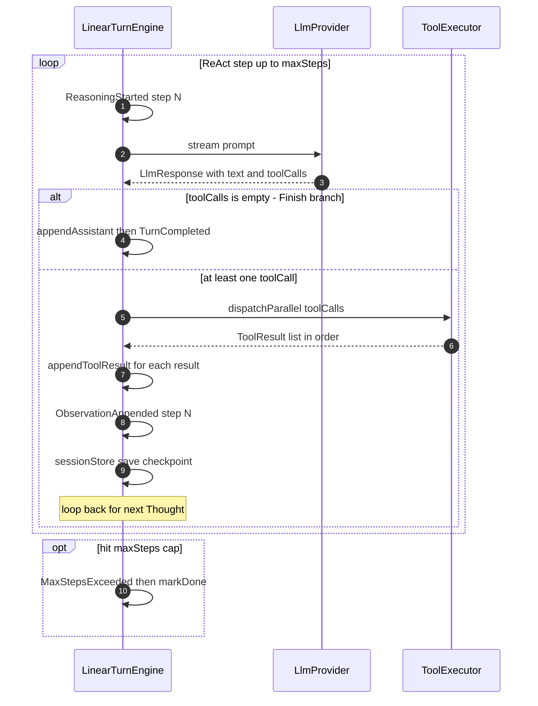
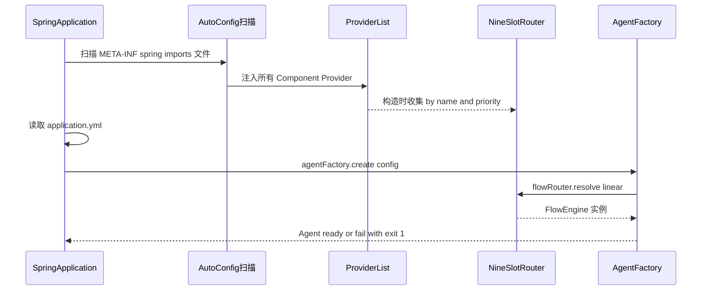
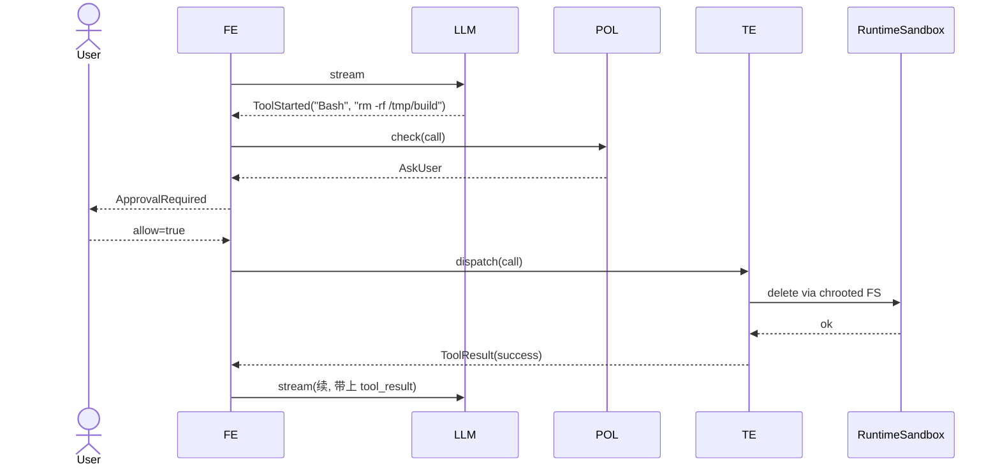
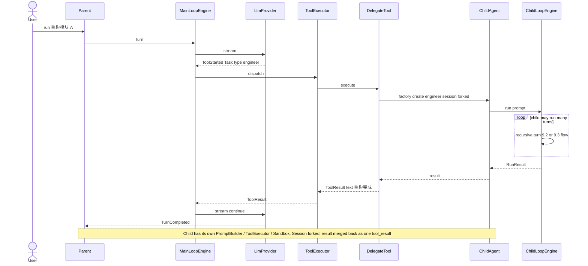
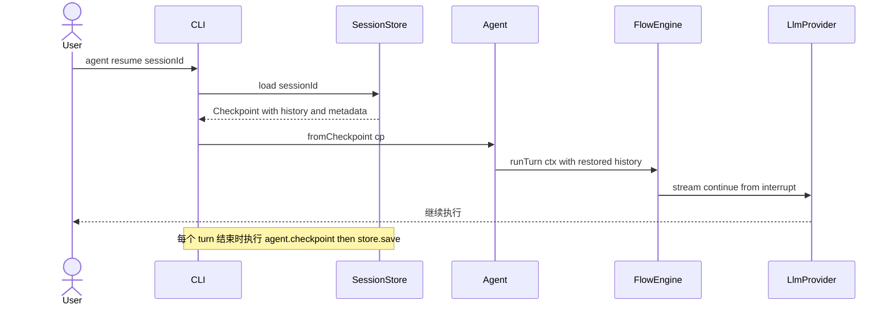

# DSH Agent Engine — 设计文档 v1.5.41

> **代号**:DSH Agent(类 Apache DSH / Dubbo 的 SPI 风格 Java Agent 引擎)
> **版本**:v1.5.36 §6.1 ReAct 上限守卫实施完成(Story #008 / AC-07 / dsh §6.1 L3619-3629 + §0.4 AC-07 L127-131 + §1.5.3 R-04 mitigation)—— 4 条件 AND 修复 dsh §6.1 L3619-3621 既有 `if (step > maxSteps)` 因 for-loop `step <= maxSteps` bound 实际**不可达**导致 AC-07 此前未生效的 bug:**(a)** for-loop 因 `step == maxSteps` 自然 bound 结束(`maxStepsHit` 标志);**(b)** `last != null`(有 LLM 响应);**(c)** `last.getToolCalls()` 非空(LLM 仍在要工具);**+ (d)** for-loop 4 条提前退出路径(break 无 tool calls / ctx.done() / cancellation return / exception catch)**不**触守卫;`MaxStepsExceeded(maxSteps, totalUsage)` 事件在 `TurnCompleted(TOOL_USE)` 之前紧贴发射;`Usage` 对象引用语义(`@Value` 不可变,FR-002 + NFR-002 0 内存分配);11 L1 测试覆盖 1 文件 `MaxStepsGuardTest`(US1-AS1/AS2/AS3/AS4 + US2-AS1/AS2 + US3-AS1/AS2/AS3 + EC-5 + EC-7 5 终止路径分支 + Reflection verify case ES);AC-07 黑盒验证通过(`reactMaxSteps=3` + LLM mock 永远只返 tool call → 第 3 步之后发 `MaxStepsExceeded(3)` + `TurnCompleted(TOOL_USE)`);187 测试 pass(0 fail / 0 error / 0 skipped);PR #14 merge at a8ed382(2026-09-21T11:51:08Z);v1.5.35 §14.8 N8 yaml-hot-reload 实施完成(Story #007 / AC-06 / dsh §14.8 N8 + §0.4 AC-06 L121-125)—— 三件套 R-03 mitigation 全套就位:`AgentConfigRegistry`(@Component `AtomicReference<AgentConfig>` 单写多读 lock-free + `CopyOnWriteArrayList<ConfigChangeListener>` listener SPI + `publishInitial(c)` 启动期 seed)/ `YamlWatcher`(5s `ScheduledExecutorService` 轮询 + `Files.getLastModifiedTime` mtime 比对 + `Files.setLastModifiedTime` 5s forward 旁路 fs 精度 + `validateOrThrow` rollback)/ `DefaultAgent.buildContext()`(registry != null 时 `registry.current()` 在 turn 入口读一次冻结 + `@Value` 不可变 snapshot + Java reference 语义 = T1 期间 cfg1 被替换为 cfg2 时 T1 的 ctx.config 仍指向 cfg1 实例)/ `AgentFactory.loadYamlAndValidate(Path)` + inline `MinimalYamlParser` ~100 行手写 0 new transitive deps(R-13 mitigation d 严格遵守);22 L1/L2 测试覆盖 5 文件(`MinimalYamlParserTest` 4 + `AgentConfigRegistryTest` 9 + `YamlWatcherTest` 5 + `InFlightFreezeTest` 2 + `YamlHotReloadIT` 2)直接 wiring 不走 @SpringBootTest(规避 Mockito 5.x + JDK 23 inline mockmaker 兼容性 + 验证 freeze 是 `DefaultAgent` 字段行为而非 Spring 容器装配行为);AC-06 黑盒验证通过(T1 冻结 [ls, cat] → yml on-disk 改 → `Files.setLastModifiedTime` 旁路 fs 精度 → `watcher.poll()` → cfg2 [ls, cat, git] → T1 captured ctx.config 仍 cfg1 → T2 仍取 cfg2);178 测试 pass(0 fail / 0 error / 0 skipped);PR #12 merge at 048eadc8(2026-09-21T08:51:08Z);v1.5.34 §7.1 新增子节 —— 明确「AgentFactory 是 Spring 单例 Bean(无状态,持 7 Router),Agent 是 factory 的产品(prototype-like,带 session/config/engine 状态,每次 create 一份,Spring 不持有引用)」 —— 问题:有读者疑惑「既然 AgentFactory 是 @Component,为什么不把主 Agent 也做成 Spring 单例,直接 @Autowired Agent 拿」 —— 根因:混淆"基础设施 Bean"与"运行时执行实例"两类对象;5 维度对比论证为什么 Agent 不能是 Spring 单例(多轮对话 session 隔离 / 子 Agent 共享 / A2A 多 RemoteAgent / 测试 Mock / Spring Bean 语义);Agent 生命周期时序图(Spring startup → T0 loadYaml → T1 create 7 项校验 + FlowRouter resolve → T2 run ReAct 循环 → T3 流关闭 → T4 GC → T5 session 持久化);扩展点矩阵(7 Router × 9 Slot —— 用户扩展 Provider,不扩展 Agent 本身);正确扩展样板(`ParallelTurnEngineProvider` @Component implements FlowEngineProvider `name="parallel" priority=10` + `factory.defaultConfig().withFlowEngine("parallel").withSession(id)`);反模式 `AgentHolder` 5 个失败场景(session 污染 / config 漂移 / 子 Agent 反模式 / A2A 不可行 / 违反 §4.1 不变项);**纯文档改动**,代码逻辑零改动;7039 → ~7250 行(+约 210);+dsh v1.5.33 §5.6.3.0 新增四个核心类型完整定义(`AgentCard` Lombok @Data + `AgentSkill` / `AgentCapabilities` / `SecurityScheme` / `AgentProvider` 4 nested type / `AgentRef` + `AgentRefBuilder` 装配器 priority 去重排序 / `RemoteAgentSchemaBuilder` @Component 启动期扫 `AgentCard.skills[]` 动态生成 `ToolSpec` list / `AgentCardCache` @Component TTL 缓存 + 负缓存短 TTL=ttl/4 + FIFO evict maxEntries=1000 + `Stats` inner class 命中率指标 + `invalidate()` 显式失效为 §14.8 hot-reload 预留钩子); 新增四个核心类型完整定义(`AgentCard` Lombok @Data + `AgentSkill` / `AgentCapabilities` / `SecurityScheme` / `AgentProvider` 4 nested type / `AgentRef` + `AgentRefBuilder` 装配器 priority 去重排序 / `RemoteAgentSchemaBuilder` @Component 启动期扫 `AgentCard.skills[]` 动态生成 `ToolSpec` list / `AgentCardCache` @Component TTL 缓存 + 负缓存 + FIFO evict + 命中率指标) — **问题** v1.5.4 §5.6 引入 A2A 时 4 个核心类型先实现后文档,§5.6.3 L2395-2480 草图引用了(`new AgentCardCache(...)`、`ctx.agentRef(agentName)`、`schemaBuilder.build()`、`AgentCard fetchCard(...)`)但只给名字未给完整定义 —— 读者只能从 §5.6.3.1 `HttpJsonRpcA2aTransport.doFetchCard` 反推 `AgentCardCache` 字段语义、从 §5.6.4 SPI 总表反推 `AgentRef` 字段类型,**类型契约不在 single-source-of-truth**;**根因** §5.6.3 草图聚焦"3 个新接口 + RemoteAgentTool + AutoConfiguration"简洁契约视图,故意省略"数据类型 + 基础设施 helper"细节层;v1.5.30 §5.6.3.1 补 concrete class 时也只补了 HttpJsonRpcA2aTransport,4 个核心类型未补;**补丁** §5.6.3.0 新增子节(L2482-2992,~510 行),按"**数据 → 引用 → 构建器 → 缓存**"顺序补全:`AgentCard`(Lombok @Data + 4 nested type + 字段语义 Javadoc + `isValid()` 校验)/ `AgentRef`(Lombok @Data + `AgentRefBuilder` 装配器 priority 去重 + 按 priority desc 排序)/ `RemoteAgentSchemaBuilder`(@Component `buildToolSpecs(refs, cards)` 启动期扫 `AgentCard.skills[]` 动态生成 `ToolSpec` list,按 (agentName, skillId) 排序稳定 prompt cache 命中 + `@Deprecated build()` 单 schema 兼容接口 + `describeSpecs()` 调试)/ `AgentCardCache`(@Component TTL 缓存 + 负缓存短 TTL=ttl/4 + FIFO evict maxEntries=1000 + `Stats` inner class 命中率指标 hits / negatives / hitRatio + `evictIfFull()` / `invalidate()` 显式失效为 §14.8 hot-reload 预留钩子);**关键不变项** —— `A2aTransport` 5 方法契约 / Slot 9 SPI / `A2aTransportRouter` 行为 / `RemoteAgentTool` 内部 / `ToolExecutor` 5 步流水线 / §4.7 PermissionPolicy / AuditLogger / Cost 域 全部不变 —— **4 个类型都是"实现细节层",不引入新接口契约**;**纯文档改动**,代码逻辑零改动;6447 → 7039 行(+592);**修复者**:Claude Code(根据用户 2026-09-17 会话反馈,用户问「在 §5.6 A2A 协议设计这一节中补充一下 `AgentCard`、`AgentRef`、`RemoteAgentSchemaBuilder`、`AgentCardCache` 的代码实现示例」,确认 §5.6.3 引用了但未定义 4 个核心类型,要求补 §5.6.3.0); v1.5.32 §6.4 Skill 三个契约锚点补全(`Skill` 接口定义 + `SkillTool.fromMarkdown` 静态工厂 + `@Component implements Skill` 硬编码对照示例) — **问题** v1.5.31 §6.4 把 Skill 多源自动发现 + SkillLoader + SkillTool 链路讲清楚,但"Skill 是什么"含糊 —— 全文反复写 "Skill extends Tool" 但读者翻 §4.6 也找不到 `Skill` 接口定义,只能从 §6.4 `SkillTool implements Skill` 反推;且 `SkillTool.fromMarkdown(name, content)` 静态工厂在 ClasspathSkillSource (L3587) + DirectorySkillSource (L3636) 各被引用一次但无人定义;且只展示「`SKILL.md` → `SkillTool`」文件加载路径,缺「硬编码 `@Component`」对照路径 —— 实施者写内置命令时不知道有第二条路;**根因** §6.4 v1.5.0 写时只把 Skill 当成 Tool 的子集用,缺接口契约 + 工厂方法 + 两种实现路径对照三件套;v1.5.18 后 Tool 体系大改(§6.5 三种 Scheme 来源 + §4.6 ToolExecutor 接口定义补全),Skill 这一支没同步补全契约层;**补丁** (1) **§6.4 L3476-3500 新增 `Skill` 接口** —— `extends Tool`,现阶段零额外方法,Javadoc 明确「Skill 是 Tool 的约定性 marker」+ 与普通 Tool 的 4 点差异(注册进 2 张表 / schema 暴露给模型 / CLI `/xxx` 拦截 / §6.4 全节围绕)+ 3 条未来扩展空间(用户别名 `/c` → `commit` / 权限标记 只能用户触发 / 危险等级 联动 §4.7 审批门);(2) **§6.4 L3783-3790 `SkillTool` 加 `fromMarkdown(name, markdownContent)` 静态工厂** —— SKILL.md 第一行 `# title` 去 leading `#` 提取为 `description`,剩余正文作为 `content`,inputSchema 固定 `{ "input": string }`(与 /xxx <arg> 调用习惯对齐);Javadoc 标注被 ClasspathSkillSource (L3587) + DirectorySkillSource (L3636) 调用;(3) **§6.4 L3810-3852 新增 `@Component CommitSkill implements Skill` 硬编码对照示例** —— 不依赖 SKILL.md 文件,适合"硬编码"内置命令(本例 `/commit` 按 Conventional Commits 风格生成 commit message);附 SkillTool vs @Component 对照表 6 行(来源 / 热加载 / 适合 / 配置 / 推荐)+ 选型决策 3 条(改 skill 行为 → SkillTool / 改 skill 实现逻辑 调外部 API → @Component / 同名 Skill 同时存在走 `putIfAbsent` 先注册者优先);(4) **关键不变项** —— `Tool` 接口 / `SkillLoader` / `CompositeSkillLoader` 行为 / `ToolRegistry` 注册路径 / `ToolExecutor` 5 步流水线 / §4.7 PermissionPolicy / AuditLogger / Cost 域 全部不变;**纯文档改动**,代码逻辑零改动;6395 → 6447 行(+52);**修复者**:Claude Code(根据用户 2026-09-17 会话反馈,用户问「§6.4 Skill 这一节是不是补充一个 Skill 的代码示例会更好的理解啊」,确认 §6.4 缺 `Skill` 接口定义 + `fromMarkdown` 工厂 + 硬编码 `@Component Skill` 对照示例,要求补)v1.5.31(`Skill` 接口定义 + `SkillTool.fromMarkdown` 静态工厂 + `@Component implements Skill` 硬编码对照示例) — **问题** v1.5.31 §6.4 把 Skill 多源自动发现 + SkillLoader + SkillTool 链路讲清楚,但"Skill 是什么"含糊 —— 全文反复写 "Skill extends Tool" 但读者翻 §4.6 也找不到 `Skill` 接口定义,只能从 §6.4 `SkillTool implements Skill` 反推;且 `SkillTool.fromMarkdown(name, content)` 静态工厂在 ClasspathSkillSource (L3587) + DirectorySkillSource (L3636) 各被引用一次但无人定义;且只展示「`SKILL.md` → `SkillTool`」文件加载路径,缺「硬编码 `@Component`」对照路径 —— 实施者写内置命令时不知道有第二条路;**根因** §6.4 v1.5.0 写时只把 Skill 当成 Tool 的子集用,缺接口契约 + 工厂方法 + 两种实现路径对照三件套;v1.5.18 后 Tool 体系大改(§6.5 三种 Scheme 来源 + §4.6 ToolExecutor 接口定义补全),Skill 这一支没同步补全契约层;**补丁** (1) **§6.4 L3476-3500 新增 `Skill` 接口** —— `extends Tool`,现阶段零额外方法,Javadoc 明确「Skill 是 Tool 的约定性 marker」+ 与普通 Tool 的 4 点差异(注册进 2 张表 / schema 暴露给模型 / CLI `/xxx` 拦截 / §6.4 全节围绕)+ 3 条未来扩展空间(用户别名 `/c` → `commit` / 权限标记 只能用户触发 / 危险等级 联动 §4.7 审批门);(2) **§6.4 L3783-3790 `SkillTool` 加 `fromMarkdown(name, markdownContent)` 静态工厂** —— SKILL.md 第一行 `# title` 去 leading `#` 提取为 `description`,剩余正文作为 `content`,inputSchema 固定 `{ "input": string }`(与 /xxx <arg> 调用习惯对齐);Javadoc 标注被 ClasspathSkillSource (L3587) + DirectorySkillSource (L3636) 调用;(3) **§6.4 L3810-3852 新增 `@Component CommitSkill implements Skill` 硬编码对照示例** —— 不依赖 SKILL.md 文件,适合"硬编码"内置命令(本例 `/commit` 按 Conventional Commits 风格生成 commit message);附 SkillTool vs @Component 对照表 6 行(来源 / 热加载 / 适合 / 配置 / 推荐)+ 选型决策 3 条(改 skill 行为 → SkillTool / 改 skill 实现逻辑 调外部 API → @Component / 同名 Skill 同时存在走 `putIfAbsent` 先注册者优先);(4) **关键不变项** —— `Tool` 接口 / `SkillLoader` / `CompositeSkillLoader` 行为 / `ToolRegistry` 注册路径 / `ToolExecutor` 5 步流水线 / §4.7 PermissionPolicy / AuditLogger / Cost 域 全部不变;**纯文档改动**,代码逻辑零改动;6395 → 6447 行(+52);**修复者**:Claude Code(根据用户 2026-09-17 会话反馈,用户问「§6.4 Skill 这一节是不是补充一个 Skill 的代码示例会更好的理解啊」,确认 §6.4 缺 `Skill` 接口定义 + `fromMarkdown` 工厂 + 硬编码 `@Component Skill` 对照示例,要求补)v1.5.31(§5.6.3 L2429-2444 `RemoteAgentToolProvider` 误用 `@AutoService(ToolProvider.class)` 修复 —— 降级为普通 `Tool` 模式 — **问题** v1.5.30 §5.6.3 草图用 `@AutoService(ToolProvider.class)` 标注 `RemoteAgentToolProvider`(L2429-2444 注释写「复用 §6.5 Tool 注册路径」),但 §5.7 v1.5.21 明确选择 Spring Boot SPI 而**不**选 Java SPI / OSGi / ClassLoader 隔离,`@AutoService` 是 Google auto-service 库的注解生成 Java SPI 的 `META-INF/services/` 文件 —— 与 §5.7 SPI 决策直接冲突;且 §5.5 / §6.5 全部 Tool / MemorySource / SkillSource 都用 `@Component` 或 `@AutoConfiguration` + `@Bean` 模式注册,**没有任何 ToolProvider 抽象**;`ToolProvider` 接口本身在文档中也未定义(grep 整篇只有 2 处引用,都在 L2430-2431)——「引用了不存在的契约」三重 bug;**根因** v1.5.4 §5.6 引入 A2A 时,`RemoteAgentTool` 曾短暂被设计为 `ToolProvider` 抽象(Slot 10 候选),后续 v1.5.30 §5.6.3 落地时降级为普通 Tool 模式但代码块没同步改 ——留下 `@AutoService` + 不存在的 `ToolProvider` 接口双重历史 bug;**补丁** (1) **§5.6.3 L2429-2444 改写**:移除 `RemoteAgentToolProvider` + `@AutoService` 模式,改写为标准 `@Component public class RemoteAgentTool implements Tool` + `RemoteAgentToolAutoConfiguration`(`@AutoConfiguration` + `@Bean public Tool remoteAgentTool()`,与 §5.5 plugin 非 Slot 类型 Bean 样板对齐);`RemoteAgentTool.execute(call, ctx)` 内部按 `call_<agentName>` 名字 parse 出 agentName + 转发给 `A2aTransport.submit()`;inputSchema 启动期扫 `AgentCard.skills[]` 动态生成(JSON Schema via `RemoteAgentSchemaBuilder`);(2) **§5.6.1 L2346 对照表 `Tool 发现机制` 单元格修正**:原版写「`@AutoService` 启动期静态注册」(Java SPI 措辞)→ 改「Spring `@Component` / `@AutoConfiguration` + `@Bean` 启动期静态注册」(与 §6.5 (1) ReadTool / §6.5 (2) McpToolAdapter / §5.5 plugin 非 Slot 类型 Bean 样板对齐);(3) **§0 L1 + §13 + CLAUDE.md / SKILL / SOP / prompts 版本号同步**;(4) **关键不变项** —— `A2aTransport` 5 方法契约不变 / Slot 9 SPI 不变(仍 9 个 Slot)/ A2aTransportRouter 行为不变 / RemoteAgentTool 内部不变(只看 A2aTransport 接口)/ ToolExecutor 5 步流水线不变 / §4.7 PermissionPolicy / AuditLogger / Cost 域 兼容;**纯文档改动**,代码逻辑零改动;6377 → 6395 行(+18);**修复者**:Claude Code(根据用户 2026-09-17 会话反馈,用户问「`@AutoService(ToolProvider.class)` 是自定义注解还是哪个库的注解啊」+「给出的示例里面为啥会有 `@AutoService(ToolProvider.class)`」,确认 §5.6.3 误用 Java SPI 注解 + `ToolProvider` 接口未定义,与 §5.7 决策冲突,要求降级为普通 Tool 模式); v1.5.30(§5.6.3.1 `HttpJsonRpcA2aTransport` concrete class + `HttpJsonRpcA2aTransportProvider` concrete Provider 完整示例 + §5.6.3.2 备选 `GrpcA2aTransport` / `InProcessA2aTransport` 「3 件套模式」扩展指南 — **问题** §5.6.3 L2395-2451 草图用匿名 inner class 形态写 `HttpJsonRpcA2aTransportAutoConfiguration` 的 `@Bean` 方法,但 §5.6.4 L2465 SPI 总表 Slot 9 行的「默认 Provider」字段已经写 `HttpJsonRpcA2aTransportProvider` —— **命名不一致**:用户看 §5.6.4 表以为有 named class,打开 IDE 找源码只在 AutoConfiguration 匿名 inner class 里;且 `HttpJsonRpcA2aTransport` 自身也只列名未给 class 定义,用户合理怀疑它是不是 `A2aTransport` 的子接口;**根因** v1.5.4 §5.6 引入 A2A 时,3 个 A2aTransport 变体(http-jsonrpc / grpc / in-process)是平级概念,设计意图是「`A2aTransport` SPI + 3 concrete class 平级实现」,但 §5.6.3 草图偷懒用匿名 inner class 写 Provider + 缺 concrete Transport class 定义,留下命名不一致的 gap;**补丁** (1) **§5.6.3.1 新增子节**(~190 行):(a) **设计澄清** —— 3 段 blockquote 直接回答用户疑问:`HttpJsonRpcA2aTransport` **不是** `A2aTransport` 子接口,是 concrete class 直接 `implements A2aTransport`;`HttpJsonRpcA2aTransportProvider` **不是** `A2aTransportProvider` 子接口,是 concrete class 直接 `implements A2aTransportProvider`;GrpcA2aTransport / InProcessA2aTransport 同理是平级 concrete class;**为什么不做子接口层**:KISS 原则 + 3 变体数量小 + `A2aTransport` 是契约面 / 3 concrete class 是与协议的具体绑定(每个绑定一组独立依赖:HTTP Client / gRPC stub / in-process registry);**扳机条件**:HTTP 变体 ≥ 5 个才在 `A2aTransport` 下加 `HttpBasedA2aTransport` 子接口(本轮**不动**);(b) **`HttpJsonRpcA2aTransport` concrete class 完整定义**(~100 行)—— `implements A2aTransport` 5 方法 + `fetchCard`(URI → AgentCard + 内存缓存)/ `submit`(AgentRef + Message → Task,JSON-RPC 2.0 over HTTPS)/ `get` / `cancel` / `subscribe`(v0.5 polling 占位实现,块注释说明 JDK 17 HttpClient 不内置 SSE EventSource);用 JDK 17 内置 `java.net.http.HttpClient` 0 额外依赖(避免 Spring WebClient 反向依赖 §4.10.1 硬规则);Bearer auth 从 `AuthContext` ThreadLocal 拿;(c) **`HttpJsonRpcA2aTransportProvider` concrete class**(~15 行)—— `implements A2aTransportProvider` + `name()="http-jsonrpc"` + `priority()=10` + `create(c)` 返回 `new HttpJsonRpcA2aTransport(...)`,与 §5.5 Slot 1—7 默认 Provider stub 同模式(不再用 v1.5.4 §5.6.3 的匿名 inner class 形态);(d) **`HttpJsonRpcA2aTransportAutoConfiguration` 改写** —— `@Bean(name = "a2aTransportProvider_http-jsonrpc")` + `return new HttpJsonRpcA2aTransportProvider()`(named class import + 实例化,§5.5 v1.5.28 唯一 Bean 名约定);(2) **§5.6.3.2 新增子节**(~150 行):(a) **「3 件套模式」明确** —— 任何新备选 A2aTransport 按 3 件套加:① concrete Transport class(`implements A2aTransport`,独立依赖)② concrete Provider class(`implements A2aTransportProvider`,`name()` 唯一 + `priority()` ≥ 10)③ `XxxA2aTransportAutoConfiguration`(`@Bean(name = "a2aTransportProvider_<name>")` + `new XxxA2aTransportProvider()`);(b) **`GrpcA2aTransport` + `GrpcA2aTransportProvider` stub** —— grpc-java + protobuf 实现 A2A 5 方法(`subscribe` 用 grpc streaming 比 polling 更高效),`name()="grpc"`,额外依赖 `io.grpc:grpc-stub` + `com.google.protobuf:protobuf-java` 体积 +5MB(R-13 mitigation (d) 镜像必执行);(c) **`InProcessA2aTransport` + `InProcessA2aTransportProvider` stub** —— 同 JVM 直接方法调用,`name()="in-process"`,0 额外依赖,维护全局 `InProcessA2aRegistry` 单例,适合单元测试 + 本地多 Agent 编排(zero 网络开销);(d) **`application.yml` 3 Provider 同存配置示例** + **启动日志样例** —— `agent.a2a.transport: http-jsonrpc`(用户一行切换 grpc / in-process,无需 exclude / rebuild);(e) **实施期检查清单** 6 条 —— protobuf .proto 定义 / R-13 dep-tree 自查 / InProcessA2aRegistry 单例 + `lingshu serve --a2a` 集成 / 唯一 Bean 名 + name 不冲突 / §6.4 §5 SPI 槽位总表 Slot 9 行加 2 备选 / §17 Risk Register 加 2 新风险;(f) **关键不变项** —— A2aTransport 5 方法契约不变 / §5.3.1.2 A2aTransportRouter 行为不变 / RemoteAgentTool 内部完全不变(只看 A2aTransport 接口)/ §4.7 PermissionPolicy / AuditLogger / Cost 域 兼容(每个 call 仍走 ToolExecutor 5 步流水线);(3) **JDK 8 兼容** —— Stream.iterate + takeWhile 用 JDK 9+ 但 LingShu runtime = JDK 17+ 满足,匿名 inner class 形态保留;(4) **§0 L1 标题版本号同步** `v1.5.29 → v1.5.30`;(5) CLAUDE.md 版本号同步 `1.3.22 → 1.3.23`;(6) SKILL v1.0.18 → v1.0.19 / SOP v1.13 → v1.14 / prompts v1.0.12 → v1.0.13 同步;**纯文档改动**,代码逻辑零改动;6049 → 6376 行(+327);**修复者**:Claude Code(根据用户 2026-09-16 会话反馈,用户问 `HttpJsonRpcA2aTransport` 是否 `A2aTransport` 子接口 + 是否需要 named class + Grpc/InProcess 怎么加,确认 §5.6.3 缺 concrete class 定义 + 命名不一致 + 缺扩展指南,要求补 §5.6.3.1 + §5.6.3.2); v1.5.29(§6.5 (2.1) 新增 `McpServerConnection` 实现示例 —— 含心跳保活 + 指数退避重连 — **问题** §6.5 (2) `McpTransport` 假设 MCP server「连上就永远连着」,生产环境 MCP server 子进程可能被 OOM 杀、stdio 僵死、SSE 反向代理超时踢线 —— Agent 进程会因 MCP server 抖动连锁崩盘,且当前文档缺 single-source-of-truth 的心跳 / 重连机制样板,Story #009 实施者只能反推 §4.10.1 错误处理边界自己设计;**根因** §6.5 (2) 原版 `McpServerConnection.start(cfg)` 是一次性同步连接 stub,没引入状态机 / 心跳 / 重连概念;v1.5.x 早期把 MCP 当「远程 Tool 注册中心」轻量集成,没考虑 24×7 长生命周期运维需求;到 v1.5.28 多 Provider 模式 + 9 Slot 体系成熟,**MCP 的「长连接」属性被放大** —— 必须补完整的生命周期管理;**补丁** (1) **§6.5 (2.1) 新增子节**(L3542-3815,~270 行):(a) **`McpServerConnection` 接口** —— `extends AutoCloseable`,定义 `name()` / `state()` / `lastHeartbeatAt()` / `listTools()` / `callTool()` / `onStateChange()` / `start()` / `close()` 8 个方法,Javadoc 明确「非 CONNECTED 状态 callTool 直接返 error 不抛异常」「重连后 listTools 重新拉,不复用旧 cache」;(b) **`ConnectionState` enum** —— `IDLE / CONNECTING / CONNECTED / DISCONNECTED / RECONNECTING / FAILED` 6 态,状态机图显式标注 `CONNECTED ⇄ DISCONNECTED → RECONNECTING → CONNECTED`;(c) **`McpServerConnectionFactory`** —— 按 `cfg.transport()` 分派 stdio / SSE / streamable HTTP 三种实现,switch case 默认抛 `IllegalArgumentException`(防御性);(d) **`StdioMcpServerConnection` 完整实现**(~180 行)—— `AtomicReference<ConnectionState>` + `AtomicInteger reconnectAttempts` + `CopyOnWriteArrayList<Consumer<...>>` + daemon `ScheduledExecutorService`;`start()` 走 5 步:拉子进程 → initialize 握手 → initialized 通知 → tools/list 拉取 → 切 CONNECTED + 启心跳;`probe()` 双探活(`process.isAlive()` + MCP `ping` 请求等回包,timeout=hbTimeoutMs);`scheduleReconnect()` 走 `1s → 2s → 4s → 8s → 16s → 32s → 60s(cap)` 指数退避,失败**无限**重试;(e) **`SseMcpServerConnection` 差异说明段** —— 不复制 stdio 全部样板,只列 3 处差异(心跳 = `GET /health` 而非 process.isAlive;重连 = 重建 `HttpClient` 而非杀子进程;长连接 = `SseEventSource` 收 server push 触发 tools/listChanged 重拉);(f) **§6.5 (2) `McpTransport` 同步改写** —— `connect()` 不再直接调 `McpServerConnection.start(cfg)`,改 `McpServerConnectionFactory.create(cfg)` + `onStateChange(listener)` + 异步 `conn.start()`;新增 `onConnectionStateChange()` 私有方法处理 `CONNECTED → register / DISCONNECTED → unregister`;(g) **配置 `application.yml` 示例 + 启动日志样例** —— github server 被 OOM 杀后重连,日志展示 tools 从 7 → 8(MCP server 升级后新增 tool 自动可见);(2) **JDK 8 兼容** —— 用 `AtomicReference` / `AtomicInteger` / `CopyOnWriteArrayList` + `Collections.emptyList()`,**不用** `List.of` / `var` / sealed / records;lambda 内调 `start()` / `probe()` 用匿名 inner class 而非方法引用,与 §0 L39 「不用 `var` / `List.of`」硬约束对齐;(3) **关键不变项** —— `McpToolAdapter` / `ToolExecutor.dispatch()` / `PermissionPolicy.check()` 完全不变,MCP 断流在 `ToolResult` 层只表现为「error 替代 success」,**不会绕过沙箱 / 权限 / checkpoint 任何一步**,与 §4.10.1 硬规则 2 完全兼容;(4) **§0 L4 changelog block 预本条**;(5) **§13 加本条目**;(6) CLAUDE.md 版本号同步 `1.3.21 → 1.3.22`;**纯文档改动**,代码逻辑零改动;5709 → 5980 行(+271);**修复者**:Claude Code(根据用户 2026-09-16 会话反馈,用户问「McpServerConnection的实现示例是不是补充一下,并且在里面体现出对MCPClient的保活(心跳)和重连」,确认 §6.5 (2) 缺心跳 / 重连机制 + 完整实现示例,要求补);v1.5.28(§5.5 改「多 Provider 模式」样板 + §5.4 同步改「唯一 Bean 名约定」+ §5.6 Slot 9 HttpJsonRpcA2aTransportProvider stub 同步 — **问题** v1.5.27 §5.5 用 `@ConditionalOnMissingBean` 强制"部署期二选一",同一 Slot 最多 1 个 `XxxProvider` Bean 注册到 Spring 容器 → 用户切换 Provider 必须改 classpath / exclude / 改 Bean 名;但 §5.3.1.0 `SlotRouter<P, T>` 父类**一直是多 Provider 友好** —— 构造器收 `List<P> providers`,启动期按 `name()` 收 `Map<String, P>`,`resolve(name, cfg)` 按 name 选 → List<P> **被设计为 size=N**,而 v1.5.27 `@ConditionalOnMissingBean` 把它阉割到 size=1,**多 Provider 能力框架自身不用**;**根因** v1.5.24 §5.5 引入 6 默认 Provider stub 时直接复用 v1.5.0 `DefaultPromptBuilderProvider` 模板的 `@ConditionalOnMissingBean`,当时设计意图是"防止用户覆盖默认",但代价是阉割 §5.3.1.0 Router 的多 Provider 能力;v1.5.25 §5.4 双 `@ConditionalOnMissingBean` 模式进一步固化单 Provider 假设(plugin 之间也互斥);到 v1.5.27 §4.6 ToolExecutor + §5.5 默认 6 Provider stub + §5.3.1.0 7 Router 体系成熟,**单 Provider 假设与 Router 多 Provider 设计目标的张力被放大**;用户需要"同 Slot 多 Provider 共存 + 按 name 路由"的能力;**补丁** (1) **§5.5 改「多 Provider 模式」样板**:头部设计原则 blockquote 改写,说明 v1.5.28 起默认 Provider 用 plain `@Bean(name = "<slot>Provider_<name>")` 而**不再用 `@ConditionalOnMissingBean`**;**所有 6 个默认 Provider stub 改写** —— Slot 1 `DefaultPromptBuilderProvider` / Slot 2 `TruncatingCompactorProvider` / Slot 3 `AnthropicLlmProviderFactory` / Slot 4 `StrictPermissionPolicyProvider` / Slot 5 `DefaultToolExecutorProvider` / Slot 6 `FileSessionStoreProvider` / Slot 7 `ProjectClaudeMdSourceProvider` 全部 `@Bean(name = "...")` 显式 Bean 名;每段注释补「`name()` 必须唯一(§5.2 同名竞争)」说明;(2) **§5.5 头部新增「用户切换示例」blockquote** —— `application.yml` 写 `agent.<slot>.name: <provider-name>` 切换 Provider + 启动日志样例 `resolved N provider(s)` 列出全部 N;(3) **§5.5 9-Slot 总表加「Bean 名」列** —— 9 行「Bean 名(🆕 v1.5.28)」字段,如 `promptBuilderProvider_default` / `llmProviderProvider_anthropic` / `flowEngineProvider_linear` / `a2aTransportProvider_http-jsonrpc`,Story 实施者写 `@Bean(name = "...")` 直接抄;Slot 8 / Slot 9 标 🆕 v1.5.28 建议同步改名(§6.1 LinearTurnEngineProvider / §5.6.x HttpJsonRpcA2aTransportProvider);(4) **§5.5「替代实现追加约定」段改写** —— 加 `OpenAiLlmProviderProvider` 完整样板(Bean 名 `llmProviderProvider_openai` + name "openai")+ 用户配置示例 + 启动日志样例(4 个 LlmProvider 共存);(5) **§5.6 Slot 9 `HttpJsonRpcA2aTransportProvider` stub 同步改多 Provider 模式** —— `@Bean(name = "a2aTransportProvider_http-jsonrpc")`;(6) **§5.4 plugin AutoConfiguration 编写约定改写** —— 双 `@ConditionalOnMissingBean` 模式 → 唯一 Bean 名约定:🆕 v1.5.28 起 plugin `@Bean` 必须显式 `name = "<slot>Provider_<pluginName>"`,禁止复用默认 Bean 名;🗑️ v1.5.25 双 `@ConditionalOnMissingBean` 模式加载顺序矩阵已废弃(基于「全 ApplicationContext 最多 1 个 `XxxProvider` Bean」单 Provider 假设,多 Provider 模式下该假设不再成立),但 BeanDefinitionOverrideException 应急路径不变;**效果** Story #001 / #002 / #003 / #014 / #015 实施者写 `@Bean` 时,统一规范为 `@Bean(name = "<slot>Provider_<name>")`,无需 `@ConditionalOnMissingBean`;同 Slot 多 Provider 共存(默认 + 替代)由 §5.2 SlotRouter 按 name 路由,`agent.<slot>.name` 改 yaml 即可切换 Provider,无需 exclude / rebuild classpath;§5.3.1.0 Router 多 Provider 能力终于被框架自身利用,**List<P> size=N 实际生效**;**纯文档改动**,代码逻辑零改动;5639→5708 行(+69);2026-09-16);v1.5.27(§4.6 ToolExecutor 接口定义补全 — 标题「Tool 与 ToolExecutor」但 §4.6 缺 `ToolExecutor` 本体,Story 实施者只能从 §4.10.1 / §5.5 / §6.5 散落引用反推;**补丁** 在 §4.6 `Skill extends Tool` 之后 / `ToolExecutionContext` 之前插入 `ToolExecutor` 接口完整定义 —— 单方法 `dispatch(ToolCall call, ToolExecutionContext ctx) → ToolResult`;Javadoc 覆盖 (1) 调用契约 `executor.dispatch(call, ctx)` + ReAct Action 阶段每个 `LlmResponse.getToolCalls()` 元素**必须**走此方法(不得直调 `tool.execute()`);(2) §4.10.1 硬规则 2 强制要求 —— ToolExecutor 内部统一串入 5 步流水线 `PermissionPolicy.check() §4.7 → ToolRegistry.lookup(name) → TimeoutWrap → SandboxApply(fs / http / process) §4.7 → tool.execute() → Checkpoint`,任何一步绕过 = 沙箱 / 权限 / 取消 / 超时全失效,Spring AI `ChatClient.tools().call()` 自动执行**禁止**使用;(3) ToolExecutor 与 Tool 接口解耦 —— ToolExecutor 不 import Tool 内部细节,只看 `ToolCall(name + args JSON)` + `ToolExecutionContext`,Tool 实现可手写(§6.5 (1))/ MCP server 暴露(§6.5 (2))/ Spring AI `@Tool` 注解生成仅 schema(§6.5 (3))—— ToolExecutor 一视同仁;(4) Provider 可插拔 —— 默认 `DefaultToolExecutorProvider`(stub §5.5 L2121)同步串行 dispatch;替代实现 `ParallelToolExecutorProvider`(并发)/ `ObservabilityToolExecutorProvider`(metric / trace),`name()` 走该实现标识("default" / "parallel" / "observability"),`priority()` ≥ 10 胜过默认 `priority=0`,**禁止与默认 `name()` 冲突**;(5) `@throws` 完整标注 —— `PermissionDeniedException`(§4.7)/ `ToolNotFoundException` / `TimeoutException`(`callConfig.timeoutSeconds`)/ `CancellationException`(Ctrl+C / FlowEngine markDone / 超时联动)4 类异常;**效果** Story 实施者打开 §4.6 即可看到完整 Slot 5 接口契约,无需散落反推;§4.10.1 硬规则 2 引用 `ToolExecutor.dispatch()` 现在有 single-source-of-truth 锚点;5590 → 5639 行(+49);**纯文档补全,代码逻辑零改动**;2026-09-15);v1.5.26(§5.3.1.0 补齐 `FlowEngineRouter` 第 7 个隐式 Router concrete stub + §5.3.1 标题计数 8 → 9 Router + §5.6.4 SPI 总表新增「Router stub 位置」列 — **问题** §5.3.1 标题写「8 个 Router — 6 隐式 + 2 显式」,但实际 `AgentFactory` L3676 直接 `@Autowired` 了 `FlowEngineRouter`,而 §5.3.1.0 只给了 6 个隐式 Router stub(PromptBuilder / LlmProvider / Compactor / PermissionPolicy / ToolExecutor / SessionStore)**漏了** Slot 8 FlowEngineRouter —— 用户/实施者找「`FlowEngineRouter` 类源码」会以为它不存在,只能在 `AgentFactory` 字段引用里看到字段名但没有类定义;**根因** v1.5.18 §5.3 SlotResolver 屏蔽 Router 数 6 → 8 时,只补了 SlotResolver 内部 2 Router(MemorySource + A2aTransport);AgentFactory 的 `FlowEngineRouter` 是 v1.5.18 **之前**就已存在的字段(L3676),但当时没单独成 Router stub 写到 §5.3.1.0 —— **Slot 8 FlowEngine 完全漏在 §5.3.1 体系外**,实际 §5.3 SlotResolver 8 字段 + AgentFactory 1 字段 = **9 Router**;v1.5.23 §5.3.1.0 新增 6 隐式 Router stub 时也没补 `FlowEngineRouter`(只列名说「PromptBuilderRouter / LlmProviderRouter / ToolExecutorRouter / PermissionPolicyRouter / SessionStoreRouter / CompactorRouter」共 6),到 v1.5.25 §5.4 plugin AutoConfiguration 编写约定才暴露出「`FlowEngineRouter` 没有 concrete 类定义」;**补丁** (1) §5.3.1 标题改「9 Router — 7 隐式 + 2 显式」;(2) §5.3.1.0 标题改「7 个隐式 Router concrete 类(SlotResolver 6 + AgentFactory 1)」,imports 块加 `FlowEngineProvider` + `FlowEngine`;(3) §5.3.1.0 末尾(`CompactorRouter` 之后)追加 `FlowEngineRouter` 第 7 个 stub —— `extends SlotRouter<FlowEngineProvider, FlowEngine>`,super 传 `"FlowEngine"` + Logger,Javadoc 说明**不在 SlotResolver 字段里,由 AgentFactory 直接 `@Autowired`** + 默认 `LinearTurnEngineProvider`(§6.1 L2530)+ 替代 `GoogleAdkFlowEngineProvider`(§4.11.2)/ `AlibabaGraphFlowEngineProvider`(§4.11.3);(4) §5.3.1.0 总表加 1 行(Slot 8 FlowEngineRouter,注入位置 `AgentFactory.flowRouter`,**不在 SlotResolver**),并补「注入位置」新列,Slot 编号对齐 §5.6.4 SPI 总表(1—9);(5) §5.3.1.0 边界与约束 / 与 `MemorySourceRouter` 关键差异 / 实施期顺序建议 全部 6 → 7(Story #001 加 `FlowEngineRouter`);(6) §5.6.4 SPI 总表加「Router stub 位置」列 9 行 —— 7 行指 §5.3.1.0 + 1 行指 §5.3.1.1 + 1 行指 §5.3.1.2;Slot 8 行强调 `FlowEngineRouter` 注入 `AgentFactory` 而**不在 SlotResolver**;**效果** Story #001 实施者打开 IDE 时,AgentFactory 启动校验所需 3 Router(`PermissionPolicyRouter` + `ToolExecutorRouter` + `FlowEngineRouter`)全部有完整 stub,§5.3.1.0 + §5.6.4 双向 cross-ref 一眼定位;§5.3.1 计数从 8 → 9,与实际代码一致;**纯文档补全,代码逻辑零改动**;2026-09-15);v1.5.25 §5.4 末尾新增「plugin AutoConfiguration 编写约定(双 `@ConditionalOnMissingBean` 模式,避免双胜出)」子段 — **问题** §5.4 原版只列 `META-INF/spring/...imports` 文件内容,没规定 plugin 自己的 `XxxProvider` Bean 怎么写;§5.5 默认 AutoConfiguration 一侧已标 `@ConditionalOnMissingBean` 防用户覆盖默认,但**plugin 一侧未约束** —— 如果 plugin A `RagAutoConfiguration` 没标 `@ConditionalOnMissingBean`,plugin B `McpPromptAutoConfiguration` 也没标,加载顺序不确定时 **BeanDefinitionOverrideException**(Spring Boot 2.1+ `spring.main.allow-bean-definition-overriding=false` 默认启动失败);**根因** Spring `@ConditionalOnMissingBean(X.class)` 检查的是**整个 `BeanFactory`** 而非"当前 `@Configuration` 类内其他 `@Bean` 方法",**跨 AutoConfiguration 类的 Bean 可见性**取决于 `@AutoConfigureOrder` / `@AutoConfigureBefore` / `@AutoConfigureAfter`,**不保证** plugin 一定在默认 AutoConfiguration 之前/之后加载;**补丁** (1) §5.4 末新增子段,标题明确「双 `@ConditionalOnMissingBean` 模式」;(2) 机制说明 + plugin 样例代码 `RagAutoConfiguration` 标 `@ConditionalOnMissingBean(PromptBuilderProvider.class)`(与 §5.5 默认对称);(3) **双 `@ConditionalOnMissingBean` 模式加载顺序矩阵** 4 行 4 列(plugin A 先 / plugin B 先 / 默认 / 漏标 四种情形)—— 一眼看清"漏标 = 启动失败";(4) 明确禁止 plugin 漏标 + 启动期 `BeanDefinitionOverrideException` 应急路径("第一时间检查 plugin 的 `@Bean` 方法是否漏标",不要去开 `spring.main.allow-bean-definition-overriding=true`);(5) 区分"plugin 注册 `XxxProvider` Bean(需双标)" vs "plugin 注册 `Tool` / `MemorySource` / `SkillSource` 等非 Slot 类型 Bean(按需创建,无需 `@ConditionalOnMissingBean`)" + 给出 `LocalToolsAutoConfiguration` 多 Tool 样例;(6) 传递依赖规则 + cross-ref §5.5 / §5.3 / §5.2;**效果** plugin 实施者打开 IDE 写 `XxxProvider` Bean 时,知道必须标 `@ConditionalOnMissingBean`(与默认对称),漏标会导致启动失败;**纯文档补全,代码逻辑零改动**;2026-09-15);v1.5.24 §5.5 「默认实现的注册约定」 子节扩展 — 原版只给 `DefaultPromptBuilderProvider` 1 个 `@AutoConfiguration` 模板,**问题** §5.6.4 SPI 总表 9 Slot × 默认 Provider 中,`DefaultPromptBuilderProvider`(Slot 1 模板) / `LinearTurnEngineProvider`(Slot 8,§6.1 L2530) / `HttpJsonRpcA2aTransportProvider`(Slot 9,§5.6.x L2058)3 个有完整 stub,**剩 6 个默认 Provider**(`TruncatingCompactorProvider` Slot 2 / `AnthropicLlmProviderFactory` Slot 3 / `StrictPermissionPolicyProvider` Slot 4 / `DefaultToolExecutorProvider` Slot 5 / `FileSessionStoreProvider` Slot 6 / `ProjectClaudeMdSourceProvider` Slot 7)**只列名未给 AutoConfiguration stub** —— 用户看到 §5.5 误以为"§5.6.4 ✅ 已有"全表已落实,但打开 IDE 找 `XxxProviderAutoConfiguration` 源码时只 3/9 有,其余 6/9 需对应 Story #001 / #002 / #003 / #014 / #015 实施期自己新建,样板零散;**根因** §5.5 最初只用于说明"默认实现怎么注册"模式,模板只列 1 例;§5.6.4 总表是契约层(每个 Slot 一个默认 Provider),§5.5 是样板层(每个默认 Provider 一个 AutoConfiguration)—— 两层之前未对齐:§5.6.4 9 行「✅ 已有」只代表「Slot 接口 + 1 个默认 Provider 类名」就位,不代表「Provider AutoConfiguration 落地样板」就位;**补丁** §5.5 扩展为 6 个新 AutoConfiguration stub(Slot 2—7,每个 18—22 行,`@AutoConfiguration` + `@Bean @ConditionalOnMissingBean(<X>Provider.class)` + 匿名 inner class 实现 `name()` / `priority()` / `create(AgentConfig c)` —— 与 Slot 1 模板同模式;`create()` body 抛 `UnsupportedOperationException("TODO: Story #NNN")`,留给对应 Story 实施期填);附 (1) **9 Slot × 默认 Provider ↔ `create()` 返回类型 ↔ Story ↔ stub 位置 总表** 9 行(L2118-2128),§5.6.4 与 §5.5 双向 cross-ref,Story 实施者一眼定位;(2) **10 个替代实现**(`OpenAi / Gemini / DeepSeek` 3 个 LlmProvider / `Memory / Redis / Jdbc` 3 个 SessionStore / `Identity / ProjectTree / Conversation` 3 个 MemorySource / `Summary` 1 个 Compactor)**追加约定** —— 由各自 Story 实施期补,模式与默认实现完全一致,`name()` / `priority()` 一般 ≥ 10 胜过默认 `priority=0`,**禁止与默认 `name()` 冲突**(命名空间严格隔离);(3) §0 状态块同步 + §13 加本条目;**效果** Story #001 / #002 / #003 / #014 / #015 实施者打开 IDE 时,6 个默认 Provider 全部有 AutoConfiguration 样板(模板 + 4 个 Stub + 1 个总表),不再需要"按 §5.1 Provider 列表自己写样板"或"找不到样板复制 DefaultPromptBuilderProvider 后改类名"——直接 §5.5 复制对应 Slot 段 + 替换 `name()` / `priority()` / `create()` 返回类型即可;纯文档补全,代码逻辑零改动;2026-09-15);v1.5.23 §5.3.1.0 新增「6 个隐式 Router concrete 类」子节;v1.5.22 §10.1 锁定合计数显式化 + CLAUDE.md §11.6 历史 drift 修正;v1.5.21 §5.7 新增「插件机制选型决策(SPI vs ClassLoader 隔离)」子节;v1.5.20 §5.3.1 新增子节补齐 2 个 Router concrete 类 stub + 模板 + 边界表;v1.5.19 §6.1 `LinearTurnEngine` + `LinearTurnEngineProvider` 加类级 Javadoc;v1.5.18 §5.3 `SlotResolver` 屏蔽 Router 数 6 → 8;v1.5.17 §5.1 typed-Provider 列表补 `A2aTransportProvider` 行;v1.5.16 §5.1 L1463 orphan fence opener 误吞修复;v1.5.15 §4.11 `FlowEngine` Java 代码块补 closing fence;v1.5.14 §4.5.1 [TOOL SCHEMAS] 字段措辞修订
> **目标读者**:本项目核心开发、贡献者、未来回看决策的"半年后的自己"、SpecKit `/specify` `/plan` 输入源
> **状态**:设计阶段冻结;**v1.5.21** §5.3.1 新增子节,补齐 v1.5.18 引入的 2 个 Router(`MemorySourceRouter` + `A2aTransportRouter`)concrete 类 stub + 通用模板 + 2 个边界行为表;落实 v1.5.18 changelog「Router 本体 concrete 定义留给 Story #001/#009 实施期补」的契约前置 —— 实施者只需按模板填构造器参数对 `<P, T>`,业务逻辑全由父类 `SlotRouter<P, T>` 提供;**v1.5.19** §6.1 `LinearTurnEngine` + `LinearTurnEngineProvider` 加类级 Javadoc,说明「SlotResolver 8 Router vs LinearTurnEngine 6 字段」是有意设计 —— `MemorySource` 走 `PromptBuilder.build()` 内部 `[PROJECT MEMORY]` 段消化;`A2aTransport` 留给 DagTurnEngine v1.5+ `A2aNode`,不在 LinearTurnEngine v0.5 必交付范围;纯文档补全,代码逻辑零改动;**v1.5.18** §5.3 `SlotResolver` 屏蔽的 Router 数 6 → 8 —— 补 `MemorySourceRouter`(Slot 7 多源列表解析,`List<MemorySource>`,按 `MemorySource::priority` 升序排序,null 表示该 source 此次无内容)+ `A2aTransportRouter`(Slot 9 单解析,`A2aTransport`,与 6 个 Slot 的 resolve 模式一致);comment `屏蔽 6 个 Router` 改 `屏蔽 8 个 Router`;ctor 参数从 6 个增到 8 个;新增 6 个 import:`MemorySource` / `A2aTransport` / `ArrayList` / `Collections` / `Comparator` / `List`;Router 本体 concrete 定义留给 Story #001/#009 实施期补(与现有 6 Router 引用未定义模式一致);**v1.5.17** §5.1 typed-Provider 列表补 `A2aTransportProvider` 行(与 §5.6.4 SPI 总表第 9 行对齐,§5.1 原本只列 8 个 Provider 缺第 9 行);v0.5 新增标识;**注**:L38 项目身份陈述与 §5.6.4 SPI 总表存在轻微差异(L38 列 Sandbox/SkillSource,§5.6.4 不列 —— Sandbox 走 `RuntimeSandbox` 独立接口、SkillSource 走独立 `SkillSourceProvider`),RFC 待决,本次不动 L38 / §5.6.4;**v1.5.16** §5.1 `SlotProvider` 段 L1463 处存在 orphan fence opener(无前置 ``` 对应,但紧接其后 L1471 的 ` ```java ` 因带 info string 不被识别为 closer,导致 L1463-L1482 共 20 行内容被吞进 plain-text 代码块,§5.1 第一个 Java 代码块未生效 + §5.1 标题与 prose 错位);**补丁** 删除 L1463 单行零字符内容(orphan opener),让 L1471 ` ```java ` 重新成为有效 opener,L1483 ` ``` ` 关 L1471,L1487-L1496 第二个 Java 块不受波及;**v1.5.15** §4.11 `FlowEngine` Java 代码块原版缺 closing fence,严格 CommonMark 渲染器(Pandoc / mdbook)下 §4.11.1 标题 + 14 行 prose 会被吞进 Java 块,§4.11.1 之后内容错位;**补丁** L815 `}` 后插入一行 ` ``` ` 关闭 fence(零代码改动,纯 Markdown 兼容);**v1.5.14** §4.5.1 [TOOL SCHEMAS] 措辞修订 — 明确分层(Agent Engine 抽象层 vs LLM HTTP wire format 层):`Prompt.tools` 是抽象层概念(我们的代码 / Prompt 模型 / cache 策略),到 LLM 实际收到的 JSON body(wire format 层)时,无论 v1.5.9 文本注入还是 v1.5.13 抽象字段,tool schema **都成 JSON string**,在 wire format 层两者等价;rationale 块引用加"先说分层"段(7 条理由全部归到抽象层收益:变更频率分类维度 / Prompt 模型三件套各司其职 / cache key 独立 / Provider 协议透明化 / 空 tools 留空 / Schema 来源严格 / 紧贴 USER MESSAGE 是概念顺序);ASCII 框图 [TOOL SCHEMAS] 块标题从"独立 API 字段(非 system 文本)"改"Prompt 抽象的独立字段(非 system 文本段)";伪代码 L490-497 注释从"走 SDK 原生 function_calling"改"Prompt 抽象的 .tools 字段 + LlmProvider 按 provider 协议序列化";**v1.5.13** §4.5.1 `DefaultPromptBuilder.build()` 伪代码 API 对齐 §4.2 Prompt 类定义 — 原版错误地用 `.system(String)` + `.userMessage(String)` builder 方法(实际 §4.2 Prompt 只有 `messages` / `tools` / `hints` 三字段),且漏 `.tools()` 关键字段;新版本构建 `List<Message>`(system + history + current user)+ `List<ToolSpec>`(从 `toolRegistry.list(cfg)` 映射,Schema 严格走 `Tool.inputSchema()`)+ `ModelHints` 三件套,删除原先 [TOOL SCHEMAS] 当成 system 文本追加的代码(原版设计缺陷:文本注入会让 LLM grep JSON 而不是用原生 function_calling,且与 system cache key 耦合);ASCII 框图 [TOOL SCHEMAS] 块标注"独立 API 字段(非 system 文本)→ Prompt.tools";rationale 块引用 v1.5.9 引入 + v1.5.13 修订说明(走 SDK 原生 function_calling / 与 messages 解耦 cache key 独立);**v1.5.12** §4 章节标题 + ASCII + Mermaid 三处删 stale Slot N 标签(18 处);**v1.5.11** 多处 Slot 计数 / 命名对齐 9 个 SPI;**v1.5.10** §0.1 目标对齐;**v1.5.9** §4.5.1 装配顺序补 [TOOL SCHEMAS] 段;**v1.5.8** Risk Register 微调;**v1.5.7** Spring AI 边界硬规则;v1.5.6 已具备 Personas + AC + NFR + Error Catalog + Glossary + Risk Register

---

## 目录

0. 目标与非目标(含 §0.3 Personas + §0.4 Acceptance Criteria)
1. 锁定的设计决策(总览)
2. 架构总览
3. 模块划分
4. 核心接口(JDK 8 + Lombok)
5. SPI 机制(Slot / Provider / Router)
6. 关键实现
7. AgentFactory 与启动校验
8. 配置文件
9. 数据流时序图
10. Maven 模块结构
11. 插件开发指引
12. 开放问题(留给未来)
13. 变更历史
14. 生产化增强(N1—N13,含 §14.15 NFR 总账)
15. Error Catalog(错误码全表)
16. Glossary(术语表)
17. Risk Register(风险登记册)

---

## 0. 目标与非目标

### 0.1 目标

- 做一个**可扩展的 Java Agent 引擎**,核心能力对齐 Claude Code 类编码 Agent。
- **插件化优先**:8 大能力 Slot(LlmProvider / Tool / Sandbox / SkillSource / SessionStore / Compactor / PromptBuilder / A2aTransport)+ 1 个编排 Slot(FlowEngine)全部走 Spring Boot SPI,每个 Slot 可独立替换。
- **兼容企业 JDK 8**(sealed / records / `var` / pattern-switch / `List.of` 全部回避)。
- **第一公民级多 Agent 协作**:`Task` tool 直接落地,子 Agent 通过 `SubAgentType` 枚举 + yml 注册。
- **运行时拓扑可替换**:v1 线性,后续用户自研 DAG 引擎无需改核心代码。
- **Skill 行为对齐 Claude Code**:Skill 既是 Tool(模型可见 schema、自动调用),也是用户命令(`/xxx` 显式触发,自动发现 SKILL.md)。

### 0.2 非目标(v1 不做)

- 不做分布式 Agent 协同(单机进程内)。
- 不做可视化 UI(CLI 为主)。
- 不做完整 gVisor/Firecracker 沙箱(JVM 内 chroot 即可)。
- 不做 LLM 摘要式 Compactor(留给 v2 SPI 实现)。
- 不做发现式子 Agent 注册(只接受枚举 + 显式 yml)。
- 不做 Skill 的模糊匹配 / 命令行补全(`/xxx` 严格匹配 SKILL.md 目录名)。

### 0.3 Personas 与典型使用故事

> **Persona** 是 SpecKit `/specify` 模板必填项。这里给出 v1.0 重点服务的 3 类用户,每类一段 user story + 触发它的文档章节锚点。

#### Alice — 第三方插件开发者

> **As a** Java 开发者,在企业内做"AI 编码助手"产品,
> **I want to** 通过 SPI 注入自定义 `LlmProvider`(走企业内 Anthropic 代理) / `ToolExecutor`(对接内部 wiki API) / `SandBoxer`(内网合规)而不需要 fork LingShu 主仓,
> **so that** 我可以专注业务接入,LingShu 主线升级不会破坏我的实现。

- **典型触发**:写一个 `lingshu-internal-llm` jar,实现 `LlmProvider` 接口,在 `META-INF/spring/...AutoConfiguration.imports` 注册一行
- **验证路径**:§5 SPI 机制 + §11 插件开发指引 + §14.13 插件版本治理
- **KPI**(自己写插件后):从 clone lingshu 到自己 Provider 跑通 Hello World ≤ 30 分钟

#### Bob — Agent 业务配置方(企业 IT/架构师)

> **As a** 企业 IT 架构师,要给 200 个开发者配"编码助手"模板,
> **I want to** 只用一份 `application.yml`(配合 `CLAUDE.md` 项目记忆)就能启动一个有完整 ReAct Loop / Tool 调用 / 审计的 Agent,
> **so that** 我不需要给每个团队培训 Java 代码,直接 yml 版本化 + GitOps。

- **典型触发**:写一份 `application.yml`,配置 `llm.provider` / `tools` / `identity` / `memory.claude-md`,`SpringApplication.run()` 启动
- **验证路径**:§8 配置文件(零配置 + 27字段默认)+ §8.1.4 「Java 工程师 Agent」完整业务配置示例 + §14 N1-N13 生产化
- **KPI**:从空白 yml 到第 1 个工具调用响应 ≤ 5 分钟;零配置场景下空 yml 也能启动

#### Charlie — LingShu 核心仓贡献者

> **As a** LingShu 核心仓维护者,
> **I want to** 新增一个 Slot(比如 v2 加 `CompactorProvider` 用于摘要压缩)时,影响面只局限在该 Slot 接口 + 它的 Router + 测试,不动其他 8 个 Slot,
> **so that** 主仓可独立演进 + 测试覆盖率不退化 + 插件作者不会被打破 API。

- **典型触发**:加一个 `CompactorProvider` SPI,实现 `CompactorRouter`,补单元测试 + integration test,PR 走 §11 流程
- **验证路径**:§4 核心接口 + §5 SPI 机制 + §7 AgentFactory 启动校验 + §11 插件开发指引
- **KPI**:新增一个 Slot 从 design doc 到 PR 合入 ≤ 3 天,且不引入 breaking change

### 0.4 v1.0 Acceptance Criteria(验收标准)

> 这是 v1.0 发布的硬性"通过/不通过"清单。每条都是**黑盒可断言**的,Claude Code 自测 + 你 review 都以此为准。**全部通过**才能 tag `v1.0.0`。

#### AC-01 零配置启动

**Given** 一份空 `application.yml`(只有 `spring.application.name=lsh-empty` 一行)
**When** 执行 `java -jar lingshu-examples/demo-empty-1.0.jar`
**Then** 进程在 30 秒内返回首个 LLM 流式 token,且 stderr 输出零 ERROR 级别日志

#### AC-02 SPI 全 Slot 可替换

**Given** yml 切到 `agent.llm.provider: anthropic@2-beta`(同 name 不同 version)
**When** 启动 + 跑 1 个 turn
**Then** 进程里实际生效的 `LlmProvider.name()` 返回 `"anthropic@2-beta"`;**且** in-flight turn 不重启就被切到新版本(§14.8 配置热更新同时验证)

#### AC-03 Tool 并发加速

**Given** yml `agent.tool.parallelism: 4` + 注册 4 个独立 `read_file` tool,且每个 tool 延迟 ≈ 1s
**When** 在 prompt 里同时请求 4 个文件
**Then** wall-clock 时间 ≤ 1.3 秒(对比串行基线 4.0s,**加速比 ≥ 3.0×**);§6.1 LinearTurnEngine 共享 ExecutorService + 顺序归集验证

#### AC-04 取消传播

**Given** Agent 正在跑一个 30 步的 turn
**When** 用户按 Ctrl-C(JVM shutdown hook 触发)
**Then** 200ms 内所有 in-flight turn 停止;partial 响应 + `stopReason=CANCELLED` 已写入 §14.10 AuditLog;§14.12 CancellationToken 三层贯通验证

#### AC-05 多租户隔离

**Given** 配置 `agent.tenants[alice]` 与 `agent.tenants[bob]`,每个有独立的 memory dir + cost budget + sandbox whitelist
**When** Tenant Alice 跑一个 turn 写到 memory,后切到 Tenant Bob 跑
**Then** memory 文件零交叉;cost budget 独立计数;sandbox whitelist 各生效;§14.9 TenantContext ThreadLocal + 配置/Session/Sandbox/Cost 四维隔离验证

#### AC-06 YAML 热更无中断

**Given** Agent 正在跑 turn T1,同时外部进程修改 `application.yml` 的 `agent.sandbox.command-whitelist`(新增 `git`)
**When** T1 完成前(下一个 turn T2 开始时)
**Then** T2 可见新的 `git` 允许执行;T1 不被中断,使用的仍是旧 whitelist(§14.8 AgentConfigRegistry AtomicReference swap + 旧 turn 冻结)

#### AC-07 ReAct 上限

**Given** yml `agent.react.max-steps: 3`,且 LLM mock 每次只返回 tool call(不返回 final answer)
**When** 跑一个会无限循环的 prompt
**Then** 第 3 步之后发 `MaxStepsExceeded(3, totalUsage=...)` 事件,然后 turn 正常 `done()`,**不**无限循环;§1.5.1 ReAct 守卫验证

#### AC-08 插件版本治理

**Given** classpath 里有两个同 `name="anthropic"` 但 `version="1"` 与 `version="2-beta"` 的 Provider
**When** 启动 Agent
**Then** 启动校验 **FAIL**,报错明确指出:"slot=llm, name=anthropic, version 冲突: 1 vs 2-beta";§14.13 兼容性检测验证

#### AC-09 业务配置三件套完整可用

**Given** yml 配置 `agent.identity.name=Java Engineer` + `agent.instructions.inline=...` + `agent.memory.claude-md.path=./CLAUDE.md`
**When** 跑一个 turn
**Then**:
- system prompt 第一段是 `[ROLE] Java Engineer` + identity.traits 展开
- 中间是 instructions 模板渲染结果
- 后跟 `[PROJECT MEMORY] <CLAUDE.md 内容>`
- §4.5.1 PromptBuilder 5 段装配顺序验证;§8.1.4 「Java 工程师 Agent」示例可跑通

#### AC-10 A2A AgentCard 自动生成

**Given** 启用了 `lingshu-a2a-server` 模块 + yml 配了 `agent.identity.*`
**When** HTTP `GET /.well-known/agent.json`
**Then** 返回的 `AgentCard` 包含 `name` / `description` / `version` 字段,**且**直接来源于 `cfg.getIdentity()`,无需额外 yml;§5.6.8 LocalAgentCardGenerator 验证

---

## 1. 锁定的设计决策

| # | 决策 | 落地形式 |
|---|---|---|
| 1 | JDK 8 兼容(主要目标) | sealed → `abstract class`、records → Lombok `@Value`、pattern-switch → `instanceof`、`var` 不用、`List.of`/`Map.of`/`Set.of` → `Collections.empty*()` |
| 2 | Reactive 选型 | `org.reactivestreams.Publisher`(JDK 8 标准方案)+ 自写轻量 collector |
| 3 | RuntimeSandbox 强度 | chroot 到 working dir + 命令/域名白名单,JVM 内实现 |
| 4 | Compactor v1 | 仅截断超长 `ToolResult` + 滑动窗口保留最近 N turn;语义摘要留 v2 |
| 5 | Skill 与 Tool 边界 | Skill 与 Tool 共用接口,运行时行为完全一致;Skill 既能被模型自动调用(对模型可见 schema),也能被用户通过 `/xxx` 显式触发(Claude Code 风格) |
| 6 | 子 Agent 注册 | `SubAgentType` 枚举 + `application.yml` 显式声明 + 启动期一致性校验 |
| 7 | 编排可扩展 | 抽出 `FlowEngine` 接口,默认 `LinearTurnEngine`,DAG 引擎作为另一 SPI 实现 |
| 8 | Slot 选用方式 | `Provider` 模式(多实现共存,按 name + priority 选用) |
| 9 | Plugin 发现 | Spring Boot Auto-Config(`META-INF/spring/...AutoConfiguration.imports` 一行) |
| 10 | 同名 Provider | `priority()` 最大胜出;启动日志列出所有 Provider 与冲突覆盖关系 |
| 11 | 默认实现位置 | `agent-impl-default` 独立模块;用户不引入即零默认 |
| 12 | 配置校验 | **启动时**(不是运行时);`AgentFactory.create()` 集中校验所有 name 与必填项 |
| 13 | Tool Scheme 来源统一 | MCP server、SpringAI `@Tool` 注解、手写 JSON Schema,三种 Scheme 来源**都通过同一 `Tool` 接口注册**;**执行路径统一走我们自己的 `ToolExecutor`**(不引入 SpringAI 的 tool calling pipeline) |
| 14 | 同 turn 多 tool call 并行 | 同 turn 内多个 tool call **默认并行**(共享线程池);结果按原顺序归集写入 history 以保证 LLM 上下文语义一致;可通过 `agent.tool.parallelism: 1` 退化为串行 |

---

## 2. 架构总览

```
┌────────────────────────────────────────────────────────────────────┐
│                         application.yml                             │
│  agent:                                                             │
│    flow-engine: linear   ← 编排 Slot                              │
│    llm.provider: anthropic   ← 原子 Slot ×6                         │
│    prompt.builder: rag-augmented                                    │
│    tool-executor: default                                            │
│    sandbox.policy: strict                                            │
│    sandbox.runtime: chroot                                           │
│    compactor: truncating                                             │
│    session-store: file                                               │
│    delegate.types: { explore, engineer, reviewer }                   │
└────────────────────────────────────────────────────────────────────┘
                                  │
                                  ▼ Spring Boot 启动
┌────────────────────────────────────────────────────────────────────┐
│  1. 扫描 META-INF/spring/...AutoConfiguration.imports              │
│  2. 实例化所有 @Component Provider                                  │
│  3. 9 个 SlotRouter 收集 + 同名竞争 + 启动日志                      │
│  4. AgentFactory.create(config) → 9 个 resolve + 全部校验          │
│     任一失败 → JVM 退出,启动日志明确指出哪个字段 / 哪个 name        │
│  5. 返回 ready 的 Agent 实例                                         │
└────────────────────────────────────────────────────────────────────┘
                                  │
                                  ▼ 运行时
┌────────────────────────────────────────────────────────────────────┐
│  Agent.run(userInput)                                                │
│    └→ FlowEngine.runTurn(ctx, sink)                                 │
│         ↑                                                            │
│         ├─ v1: LinearTurnEngine(顺序 6 个 Slot)                    │
│         └─ v2: DagTurnEngine(拓扑,你自研)                           │
└────────────────────────────────────────────────────────────────────┘
```

**关键原则**

- **Template Method**:`FlowEngine.runTurn()` 是固定骨架,每步委托给 Slot。
- **Strategy**:每个 Slot 是接口,实现来自 `Provider`。
- **SPI**:实现通过 `META-INF/...imports` 一行被发现。
- **编排可替换**:`FlowEngine` 自身是 Slot,留给 DAG 引擎。

---

## 3. 模块划分

```
┌────────────────────────────────────────────────────────────┐
│ Agent                                                     │
│                                                            │
│  ┌──────────────────┐  ┌──────────────────┐              │
│  │  PromptBuilder   │  │  ToolExecutor   │              │
│  │                  │  │                  │              │
│  └──────────────────┘  └──────────────────┘              │
│                                                            │
│  ┌──────────────────┐  ┌──────────────────────────┐      │
│  │  LlmProvider     │  │  SandBoxer               │      │
│  │                  │  │  ├ PermissionPolicy      │      │
│  └──────────────────┘  │  └ RuntimeSandbox        │      │
│                         └──────────────────────────┘      │
│                                                            │
│  ┌──────────────────┐  ┌──────────────────┐              │
│  │  Compactor       │  │  SessionStore    │              │
│  │                  │  │                  │              │
│  └──────────────────┘  └──────────────────┘              │
│                                                            │
│  ┌──────────────────────────────────────────────┐        │
│  │  FlowEngine (编排 Slot)                      │        │
│  │  ├ LinearTurnEngine (默认)                  │        │
│  │  └ DagTurnEngine (你后续自研)               │        │
│  └──────────────────────────────────────────────┘        │
│                                                            │
│  ┌──────────────────┐                                     │
│  │  A2aTransport    │  ← v0.5 新增(Slot 9),详见 §5.6   │
│  │  (远端 Agent 通信)│    配套 RemoteAgentTool 适配器    │
│  └──────────────────┘                                     │
└────────────────────────────────────────────────────────────┘
```

---

## 4. 核心接口(Java 8 + Lombok)

> 所有"record"等价物用 `@Value`;所有 sealed interface 用 `abstract class` + 静态内部子类;类型分发用 `instanceof`;**不用 `var`**;**不可变空集合用 `Collections.emptyList()` / `Collections.emptyMap()` / `Collections.emptySet()`** 而非 `List.of` / `Map.of` / `Set.of`。

### 4.1 Message 层次

```java
package io.agent.core.message;

import com.fasterxml.jackson.databind.JsonNode;
import lombok.Getter;
import lombok.RequiredArgsConstructor;
import java.time.Instant;
import java.util.List;

/**
 * JDK 8 兼容:abstract class + 静态内部子类。
 * 失去 sealed 的 exhaustive 保证,运行时多态不变。
 */
public abstract class Message {

    public abstract String role();
    public abstract Instant timestamp();

    @Getter @RequiredArgsConstructor
    public static class System extends Message {
        private final String content;
        private final String source;
        @Override public String role()      { return "system"; }
        @Override public Instant timestamp(){ return Instant.EPOCH; }
    }

    @Getter @RequiredArgsConstructor
    public static class User extends Message {
        private final String content;
        @Override public String role()      { return "user"; }
        @Override public Instant timestamp(){ return Instant.now(); }
    }

    @Getter @RequiredArgsConstructor
    public static class Assistant extends Message {
        private final String text;
        private final List<ToolCall> toolCalls;
        private final StopReason stopReason;
        private final Usage usage;
        @Override public String role()      { return "assistant"; }
        @Override public Instant timestamp(){ return Instant.now(); }
    }

    @Getter @RequiredArgsConstructor
    public static class ToolUse extends Message {
        private final String id;
        private final String name;
        private final JsonNode input;
        @Override public String role()      { return "tool_use"; }
        @Override public Instant timestamp(){ return Instant.now(); }
    }

    @Getter @RequiredArgsConstructor
    public static class ToolResult extends Message {
        private final String toolUseId;
        private final String content;
        private final boolean isError;
        @Override public String role()      { return "tool_result"; }
        @Override public Instant timestamp(){ return Instant.now(); }
    }
}
```

### 4.2 基础 record 等价物

```java
@Value public class ToolCall    { String id; String name; JsonNode input; }
@Value public class Usage       { int inputTokens; int outputTokens; }
@Value public class ToolSpec    { String name; String description; JsonNode inputSchema; }
@Value public class Prompt      { List<Message> messages; List<ToolSpec> tools; ModelHints hints; }
@Value public class ModelHints  { String model; Double temperature; Integer maxTokens; }
@Value public class Checkpoint  { String sessionId; List<Message> history; Map<String, String> metadata; Instant savedAt; }

public enum StopReason { END_TURN, TOOL_USE, MAX_TOKENS, COMPACTED, CANCELLED, ERROR }
```

### 4.3 Decision 抽象类

```java
public abstract class Decision {
    public abstract String kind();

    @Value public static class Allow   extends Decision { String reason; public String kind(){return "allow";} }
    @Value public static class Deny    extends Decision { String reason; public String kind(){return "deny";} }

    @RequiredArgsConstructor @Getter
    public static class AskUser extends Decision {
        private final String prompt;
        private final List<Option> options;
        public String kind() { return "ask"; }
    }

    @Value public static class Option { String label; String description; }
}
```

### 4.4 AgentEvent 抽象类

```java
public abstract class AgentEvent {}

@Getter @RequiredArgsConstructor public static class TextDelta        extends AgentEvent { String text; }
@Getter @RequiredArgsConstructor public static class ToolStarted      extends AgentEvent { String toolCallId; String name; }
@Getter @RequiredArgsConstructor public static class ToolProgress extends AgentEvent { String toolCallId; String partial; }
@Getter @RequiredArgsConstructor public static class ToolCompleted    extends AgentEvent { ToolResult result; }
@Getter @RequiredArgsConstructor public static class TurnCompleted    extends AgentEvent { StopReason reason; Usage usage; }
@RequiredArgsConstructor public static class ApprovalRequired   extends AgentEvent {
    Decision.AskUser ask;
    Consumer<Decision> continuation;
    public Decision.AskUser getAsk() { return ask; }
    public Consumer<Decision> getContinuation() { return continuation; }
}
@Getter @RequiredArgsConstructor public static class Compacted extends AgentEvent {}
@Getter @RequiredArgsConstructor public static class ErrorEvent extends AgentEvent { Throwable error; }

// ── ReAct 迭代事件(§6.1 LinearTurnEngine 发出)──
@Getter @RequiredArgsConstructor public static class ReasoningStarted   extends AgentEvent { int step; int maxSteps; }
@Getter @RequiredArgsConstructor public static class ObservationAppended extends AgentEvent { int step; int toolResultCount; }
@Getter @RequiredArgsConstructor public static class MaxStepsExceeded   extends AgentEvent { int maxSteps; Usage totalUsage; }
```

### 4.5 PromptBuilder

```java
public interface PromptBuilder {
    Prompt build(TurnContext ctx);
}

/** 静态 / 动态 memory 源。priority 越小越靠前。 */
public interface MemorySource {
    String name();
    int priority();
    /** 返回 null 表示该 source 此次无内容,不参与拼装。 */
    String load(TurnContext ctx);
}
```

> **会话消息历史不是 `MemorySource`**:由 `AgentLooper` 持有并直接喂给 `PromptBuilder.build()`,生命周期是 growable 可变状态,跟静态 memory 不同。

#### 4.5.1 System Prompt 装配顺序(v1.5.5 升级)

`DefaultPromptBuilder.build(ctx)` 现在按下面顺序装配 system 块 → 喂给 LLM。每一段**可独立禁用**,空段被自动剔除:

```text
┌─ [ROLE] ───────────────────────────────────────────────┐
│ 你是 {identity.name}, {identity.role}。 │
│ 人格特质:{identity.traits.join('、')} │
│ 语气:{identity.tone} │
│ 输出语言:{identity.language} │
│ (以上若对应字段为空,该行被跳过,不输出多余空段) │
└────────────────────────────────────────────────────┘
┌─ [INSTRUCTIONS] ────────────────────────────────────────┐
│ (instructions.file 存在 → 读文件) │
│ (否则用 instructions.inline) │
│ (template-engine=mustache → 替换 {{var}}) │
│ (整段为空 → 不输出该段,只走 memory + history) │
└────────────────────────────────────────────────────┘
┌─ [PROJECT MEMORY] ──────────────────────────────────────┐
│ (memory.claudeMd.enabled=true 且 ./CLAUDE.md 存在) │
│ <./CLAUDE.md 内容> │
│ ─── separator ─── │
│ (memory.claudeMd.enabled=true 且 ~/.lingshu/CLAUDE.md 存在) │
│ <~/.lingshu/CLAUDE.md 内容> │
│ ─── separator ─── │
│ (memory.extras 按顺序) │
│ <./docs/team-conventions.md 内容> │
│ <./docs/architecture.md 内容> │
└────────────────────────────────────────────────────┘
┌─ [CONVERSATION HISTORY] ────────────────────────────────┐
│ ...(现有 §6 行为) │
└────────────────────────────────────────────────────┘
┌─ [TOOL SCHEMAS] ── Prompt 抽象的独立字段(非 system 文本段) ┐
│ → Prompt.tools(List<ToolSpec>)字段,与 messages 同级     │
│ (按 cfg.tools 顺序遍历,每个 Tool 调 inputSchema())      │
│ ToolSpec(name, description, inputSchema) → LlmProvider │
│   序列化为 provider 协议 tools 字段                       │
│   (OpenAI tools=[{type:function,...}] /                  │
│    Anthropic tools=[{name,description,input_schema}])    │
│ (空集合 → 留空,LLM 看不到 function_calling 入口)         │
│ (Schema 来源:Tool.inputSchema() — §4.6)                  │
└──────────────────────────────────────────────────────────────┘
┌─ [USER MESSAGE] ────────────────────────────────────────┐
│ ... │
└────────────────────────────────────────────────────┘
```

**装配伪代码**(给 `DefaultPromptBuilder` 参考):

```java
public Prompt build(TurnContext ctx) {
    AgentConfig cfg = ctx.config();
    Identity id = cfg.getIdentity() != null ? cfg.getIdentity() : Identity.defaults();
    Instructions ins = cfg.getInstructions() != null ? cfg.getInstructions() : Instructions.empty();
    Memory mem = cfg.getMemory() != null ? cfg.getMemory() : Memory.defaults();

    StringBuilder sys = new StringBuilder();

    // [ROLE]
    appendIfPresent(sys, "你是 " + id.getName() + (isBlank(id.getRole()) ? "" : "," + id.getRole()));
    appendIfPresent(sys, "人格特质:" + joinIfNonEmpty(id.getTraits(), "、"));
    appendIfPresent(sys, "语气:" + id.getTone());
    appendIfPresent(sys, "输出语言:" + id.getLanguage());

    // [INSTRUCTIONS]
    String insText = readInstructions(ins);   // 读文件 / 用 inline / 渲染 mustache
    if (isNotBlank(insText)) sys.append("\n\n").append(insText);

    // [PROJECT MEMORY]
    if (mem.getClaudeMd() != null && mem.getClaudeMd().isEnabled()) {
        appendFileIfExists(sys, mem.getClaudeMd().getProject());
        appendFileIfExists(sys, mem.getClaudeMd().getUser());
    }
    for (Path extra : mem.getExtras()) {
        appendFileIfExists(sys, extra);
    }

    // 喂 LLM:三件套 messages + tools + hints(对齐 §4.2 Prompt 定义)
    List<Message> messages = new ArrayList<>();
    // [ROLE] + [INSTRUCTIONS] + [PROJECT MEMORY] → 单条 system message
    messages.add(Message.system(sys.toString()));
    // [CONVERSATION HISTORY]
    messages.addAll(ctx.history().messages());
    // [USER MESSAGE]
    messages.add(Message.user(ctx.currentUserInput()));

    // [TOOL SCHEMAS] — Prompt 抽象的 .tools 字段(非 system 文本段)
    //   语义上与 messages 同级,变更频率与 [ROLE]/[INSTRUCTIONS]/[PROJECT MEMORY] 分离
    //   序列化时机:由 LlmProvider.stream(§4.10)按 provider 协议转
    //     OpenAI tools=[{type:function,...}] /
    //     Anthropic tools=[{name,description,input_schema}] /
    //     Gemini tools=[{functionDeclarations:[...]}]
    //   注意:LLM 看到的 wire format 层最终都是 JSON,本注释讲的是抽象层;
    //     不影响 system 段 cache key(对齐 §14 N11 性能预算)
    List<Tool> tools = toolRegistry.list(cfg);  // 按 cfg.tools 顺序
    List<ToolSpec> toolSpecs = tools.stream()
        .map(t -> new ToolSpec(t.name(), t.description(), t.inputSchema()))
        .collect(Collectors.toList());
    // (空集合 → 留空;LLM 看不到 function_calling 入口,无 tool 可调)
    // Schema 必须从 Tool.inputSchema() 拿,见 §4.6 + R-13 (d) dep-tree 自查

    ModelHints hints = new ModelHints(
        cfg.getLlm().getModel(),
        cfg.getLlm().getTemperature(),
        cfg.getLlm().getMaxTokens()
    );

    return Prompt.builder()
        .messages(messages)
        .tools(toolSpecs)
        .hints(hints)
        .build();
}
```

**Sub-agent 继承**(§6.6):父 Agent 启动子 Agent 时,若子 AgentConfig 没指定 `instructions`,自动继承父 Agent 的 `instructions.file`(路径不变);`memory.claudeMd` 路径默认沿用父 Agent 路径(避免每个 sub-agent 都重复声明 `./CLAUDE.md`)。

> **为什么 [TOOL SCHEMAS] 作为 Prompt 抽象的独立 .tools 字段**(v1.5.9 引入 + v1.5.13 修订措辞 + v1.5.14 明确分层):
>
> **先说分层**:`Prompt.tools` 是 **Agent Engine 抽象层**(Prompt 模型 / 我们的代码 / cache 策略 / 文档语义)的概念;
> 到 **LLM HTTP wire format 层**(LLM 实际收到的 JSON body)时,无论 v1.5.9 文本注入还是 v1.5.13 抽象字段,tool schema **都成 JSON string** —— 在这个层两者等价。
> 下面 6 条理由全部是 **Agent Engine 抽象层** 的收益,**不是** wire format 层的差异。
>
> - **变更频率高** — Tool 列表随插件 / Skill / MCP server 动态增删,与 [ROLE] / [INSTRUCTIONS] / [PROJECT MEMORY] 三个相对稳定段分离(分类维度是**变更频率**,不是 wire format)
> - **Prompt 模型清晰(三件套各司其职)** — `Prompt` 类三个字段语义不混:`messages`(对话上下文)/ `tools`(能力清单)/ `hints`(调用参数);不把 tool schema 硬塞进 `messages` 的 system 文本里,符合 §4.2 Prompt 类契约;语义清爽 → 文档 / 测试 / debug / 替换实现都更省事
> - **与 messages 解耦,各 cache key 独立** — OpenAI 自动 prompt cache 按 prefix 命中,system 是稳定 cache key,tools 是另一个独立 cache key;Anthropic `cache_control` 可分别打 system / tools 的 cache breakpoint;**Tool schema 增删不影响 system 段缓存命中**(对齐 §14 N11 性能预算)
> - **Provider 协议差异透明化** — OpenAI `tools=[{type:function,...}]` / Anthropic `tools=[{name,description,input_schema}]` / Gemini `tools=[{functionDeclarations:[...]}]` 格式差异由 `LlmProvider`(§4.10)内部 SDK 吸收;`ToolSpec(name, description, inputSchema)` 是 provider-无关的,新增 provider 不需要改 Prompt 装配代码
> - **空 tools 集合 = 留空字段** — `tools` 字段为空集合时,`LlmProvider` 内部 SDK 决定是否发送空 `tools=[]`(OpenAI 默认发 / Anthropic 省略);但 LLM 看不到 function_calling 入口,无 tool 可调,行为一致
> - **Schema 来源严格走 `Tool.inputSchema()`(§4.6)** — 不允许 prompt 模板里硬编码 / 拼接 / 转译;Spring AI `@Tool` 注解只用于**生成** schema(执行必须走我们自己的 `ToolExecutor.dispatch()`,见 §4.10.1 硬规则 2 + dsh §17 R-13 mitigation (d))
> - **紧贴 [USER MESSAGE] 仅是概念顺序** — 实际 API 里 tools 在 messages 之外独立传;LLM 在生成下一轮 response 时把 tools 视作"上下文可用能力",与最近 user message 一起决策是否调用 function_call(同 v1.5.13,此条不重复)

### 4.6 Tool 与 ToolExecutor

```java
public interface Tool {
    String name();
    String description();
    JsonNode inputSchema(); // JSON Schema for FunctionCalling
    /** 通过 ctx.sink() 可流式 emit progress,最终返回 ToolResult。 */
    ToolResult execute(ToolCall call, ToolExecutionContext ctx);
}

/**
 * Scheme(inputSchema)的来源**不影响 Tool 接口契约**,可以是以下三种:
 *
 *  - 手写 JSON Schema:内置 Read/Write/Edit/Bash 等(代码里硬编码或读 .json 资源)
 *  - MCP server 暴露:启动时通过 MCP 协议的 tools/list 拉取,Mc pToolAdapter 包装
 *  - SpringAI @Tool 注解:由反射 / 注解处理器生成(只用 Scheme 生成能力,执行走我们自己)
 *
 * ToolExecutor 不关心 Scheme 来源,也不关心 execute 转发到本地 / MCP server / 反射调用,
 * 所有 Tool 一视同仁 —— 详见 §6.5。
 */

/**
 * Skill 与 Tool 接口签名完全一致,运行时也无差别:
 *  - 模型可在 FunctionCalling 里调用(对模型可见 schema,自动调用)
 *  - 用户可通过 /xxx 显式调用(CLI 层拦截,构造 ToolCall)
 *
 * v1 中 Skill 仅作为约定性 marker,用于:
 *  - SkillLoader 自动发现(SKILL.md 目录扫描)
 *  - CLI /xxx 命令索引(命令行补全 / 错误提示)
 */
public interface Skill extends Tool {
}
```

```java
/**
 * ToolExecutor —— 唯一对外的 Tool 派发入口(Slot 5 接口,见 §5.6.4 SPI 总表)。
 *
 * 调用契约:
 *   ToolResult result = executor.dispatch(call, ctx);
 *
 * FlowEngine(default `LinearTurnEngine` §6.1 L2530)在 ReAct 循环的 Action 阶段,
 * 对每个 `LlmResponse.getToolCalls()` 元素,**必须**走 `executor.dispatch(call, ctx)`
 * —— 而不是直接调 `tool.execute(call, ctx)`。这是 §4.10.1 硬规则 2 强制要求的:
 *
 *   - ToolExecutor 内部统一串入 5 步流水线(`PermissionPolicy.check()` §4.7 →
 *     `ToolRegistry.lookup(name)` → `TimeoutWrap(callConfig.timeoutSeconds)` →
 *     `SandboxApply(fs / http / process)` §4.7 → `tool.execute()` → `Checkpoint` 快照),
 *     任何一步绕过都会让沙箱 / 权限 / 取消 / 超时全失效
 *   - 即便 Spring AI 的 `ChatClient` 暴露同名 `tools().call()` 自动 tool 执行能力,
 *     也**禁止**使用 —— 会绕过我们的 ToolExecutor,导致 tool 被调两次(一次 Spring AI
 *     一次我们)+ 沙箱 / 权限全失效(详见 §4.10.1 反例)
 *
 * ToolExecutor 与 Tool 接口解耦:
 *   - ToolExecutor 不 import Tool 内部细节,只看 `ToolCall`(name + args JSON) +
 *     `ToolExecutionContext`(沙箱 fs/http + 取消 token + 审批通道 + `callConfig`)
 *   - Tool 实现可手写(`Read` / `Write` / `Edit` / `Bash` §6.5 (1)) / MCP server 暴露
 *     (`McpToolAdapter` §6.5 (2))/ Spring AI `@Tool` 注解生成(仅用于 schema 生成,
 *     执行走我们自己的 §6.5 (3))—— ToolExecutor 一视同仁
 *
 * Provider 可插拔:默认 `DefaultToolExecutorProvider`(Stub 见 §5.5 L2121)走"同步串行
 * dispatch"语义;替代实现可加 `ParallelToolExecutorProvider`(并发 dispatch 多 tool call)
 * / `ObservabilityToolExecutorProvider`(加 metric / trace spans)等,`name()` 走该实现标识
 * (`"default"` / `"parallel"` / `"observability"`),`priority()` 一般 ≥ 10 胜过默认
 * `priority=0`,**禁止与默认 `name()` 冲突**(命名空间严格隔离,见 §5.5 末段替代实现追加约定)。
 */
public interface ToolExecutor {
    /**
     * 单 tool call 派发入口。
     *
     * @param call  LLM 产出的 tool call(name + args JSON),或用户 / CLI 主动发起的 call
     * @param ctx   Sandbox 颁发的执行上下文(沙箱 fs/http + 取消 token + 审批通道 + 配置)
     * @return      `ToolResult`:成功 / 失败 / 取消 3 种终态(由 `ToolResult.status` 区分)
     * @throws io.agent.tool.PermissionDeniedException   `PermissionPolicy.check()` 拒绝(§4.7)
     * @throws io.agent.tool.ToolNotFoundException       name 不在 `ToolRegistry` 中
     * @throws io.agent.tool.TimeoutException            超时(由 `callConfig.timeoutSeconds` 控制)
     * @throws io.agent.tool.CancellationException       用户按 Ctrl+C / FlowEngine markDone / 超时联动
     */
    ToolResult dispatch(ToolCall call, ToolExecutionContext ctx);
}
```

`ToolExecutionContext`(由 Sandbox 颁发给 Tool):

```java
public interface ToolExecutionContext {
    Session session();
    /** 流式 progress:Tool 在长操作期间可调用 emitPartial。 */
    ToolSink sink();
    /** 工作目录(已 chroot 后的根)。 */
    Path workingDirectory();
    /** 受限 fs,越界抛 AccessDenied。 */
    FileSystem fs();
    /** 受限 http,域名不在白名单抛 AccessDenied。 */
    NetworkClient http();
    /** 人类审批通道(给 Tool 内部需要再向人类确认的场景用)。 */
    ApprovalGate approval();
    /** Tool 取消 token(用户按 Ctrl+C / 超时 / FlowEngine markDone 时触发)。 */
    CancellationToken cancellation();
    /** 本次 tool 调用的配置(超时、token 预算等)。 */
    ToolCallConfig callConfig();
}

public interface ToolSink {
    /** 流式 partial 输出(LLM 边生成边看到)。 */
    void emitPartial(String partial);
    /** 进度文字(给人类看,不喂 LLM)。 */
    void emitProgress(String progress);
}

public interface NetworkClient {
    String get(String url) throws IOException;
    String post(String url, String body) throws IOException;
    InputStream getStream(String url) throws IOException;
}

public interface ApprovalGate {
    /**
     * 给 Tool 内部需要再向人类确认的场景(比如 Bash 内部 command 需审批、
     * WebFetch 跳到未授权域名需询问)。Tool 自己负责拼 AskUser。
     * 阻塞直到人类回答或超时。
     */
    Decision ask(Decision.AskUser ask);
}

public interface CancellationToken {
    boolean isCancelled();
    /** 注册取消回调;返回的 Runnable 用于反注册。 */
    Runnable onCancel(Runnable callback);
}

@Value
public class ToolCallConfig {
    /** 单次 tool 调用超时(秒)。0 = 无超时。 */
    int timeoutSeconds;
    /** Tool 输出 token 预算(给 LLM-like tool 用)。 */
    int maxTokens;
    /** Tool 调用成本上限(美元 * 1e6)。0 = 无限制。 */
    int maxCostMicros;
}
```

### 4.7 SandBoxer

```java
/** 模型层:每个 ToolCall 进来先过 policy。 */
public interface PermissionPolicy {
    Decision check(ToolCall call, ToolExecutionContext ctx);
}

/** 系统层:隔离真实 fs / http / process。抽象类,典型实现 = ChrootRuntimeSandbox。 */
public interface RuntimeSandbox {
    FileSystem fs();
    NetworkClient http();
    ProcessRunner process();
}

public interface ProcessRunner {
    Process run(String command, List<String> args, Path cwd) throws IOException;
}
```

### 4.8 SessionStore

```java
public interface Session {
    String id();
    List<Message> history();
    /** 给 DelegateTool 用:子 agent 拿独立 session 视图。 */
    Session fork(String subagentType);
    Checkpoint checkpoint();
}

public interface SessionStore {
    void save(Checkpoint cp);
    Optional<Checkpoint> load(String sessionId);
}
```

### 4.9 Compactor

```java
public interface Compactor {
    boolean shouldCompact(Prompt p);
    void compact(TurnContext ctx);
}
```

### 4.10 LlmProvider

```java
/**
 * 流式调 LLM,两路并发:
 *  - sink.onNext(...) :TextDelta / ToolStarted / ToolProgress 在调用过程中持续触发
 *  - future 完成 :拿到最终 LlmResponse(完整 text + toolCalls + usage + stopReason)
 * 
 * 调用方典型用法:
 *   CompletableFuture<LlmResponse> fut = llm.stream(prompt, ctx, sink);
 *   LlmResponse resp = fut.get();  // 阻塞直到 LLM 完成
 *   for (ToolCall call : resp.getToolCalls()) { ... }
 *
 * 设计权衡:为啥不直接 void stream(...)?因为 FlowEngine 需要在 stream 完成后
 * 立刻拿到 structured response 去 dispatch tool,两个输出渠道并发存在更灵活。
 */
public interface LlmProvider {
    CompletableFuture<LlmResponse> stream(
        Prompt prompt,
        TurnContext ctx,
        Subscriber<? super AgentEvent> sink);
}

@Value public class LlmResponse {
    String text;
    List<ToolCall> toolCalls;
    StopReason stopReason;
    Usage usage;
}
```

> 早期版本曾用 `LlmResponse stream(...)`(单返回 + sink),实现时发现两路输出语义冲突 —— 返回时数据可能已大量推给 sink。改用 `CompletableFuture<LlmResponse>` 后两路并发且语义清晰。

### 4.10.1 Spring AI 使用边界(LlmProvider + default FlowEngine 硬规则)

> **本节为硬规则**,违反即 reject(**v1.5.7 起,本次单人 RFC 决议**)。
> Spring AI 自 v1.5.7 起作为新运行时依赖引入(见 §10.1 `spring-ai-bom` 1.0.0-M6),
> 但其能力**严格限定**为本节 3 条。任何 Story 实施时若发现 Spring AI 缺能力,
> **优先**走 §4.11.1 适配器模式接入外部编排引擎(Google ADK / Alibaba Graph / 自研),
> 不要扩展 Spring AI 的使用范围。

#### 硬规则 1:ReAct Loop 必须自实现(default FlowEngine 内不调 Spring AI Agent 抽象)

`LinearTurnEngine`(default `FlowEngine` 实现,§6.1)的核心 ReAct 循环(Thought→Action→Observation)
**必须**在我们自己的 Java 代码里实现(~ 数十行),**不得**使用 Spring AI 的 Agent 抽象(如
`ChatClient.prompt().call()` 的自动工具执行)。

**理由**:
- 完整掌握 Agent 工作机制(循环终止条件、step 计数、事件发射、超时与 cancel 响应)
- 保留未来定制循环行为的空间(插入 PII 扫描 / cost checkpoint / custom retry 策略)
- Spring AI 的自动 tool 执行会绕过我们的 `ToolExecutor`(沙箱 / 权限 / checkpoint 全失效)

**反例**(不得使用):

```java
// ❌ 错:Spring AI 自动执行 tool — 我们的沙箱 / 权限全被绕过
chatClient.prompt(prompt).tools(tools).call().content();
```

#### 硬规则 2:Spring AI 只用两件事(LLM 协议转换 + @Tool Schema 生成)

Spring AI 在 LingShu 里**只做**以下两件事,其他用法**禁止**:

1. **LLM Provider 协议转换**:OpenAI / Anthropic / Gemini / DeepSeek / Qwen / Kimi 等
   各家消息格式差异由 Spring AI 的 `ChatModel` 吸收,LingShu `LlmProvider`(§4.10)
   只面对 Spring AI 的统一接口,不直接调各家 SDK。
2. **`@Tool` 注解的 JSON Schema 生成**:Tool schema 由 Spring AI 的注解扫描 + Schema
   生成器产生,Tool 的实际**执行**完全由 `flow-engine` + `tool-executor`(§4.6)控制。

**必须禁用** Spring AI 的自动 tool 执行(`ChatClient.prompt().tools(...).call()`),
即使看起来方便 — 会导致 tool 被调两次(一次 Spring AI 一次我们),且绕过沙箱与权限。

**正例**(合规用法):

```java
// ✅ 对:只用 Spring AI 做 LLM 调用,tool 调度结果自己处理
ChatResponse response = chatModel.call(new Prompt(messages, options));
// 自己从 response 里拆 ToolCall,然后走我们的 ToolExecutor
for (ToolCall call : response.getToolCalls()) {
    ToolResult result = toolExecutor.execute(call, ctx);
    // ... 重新组装 messages 喂回 LLM
}
```

> 已存在的 v1.5.5 注解 `@AgentTool` + `SpringAiToolAdapter`(§6.6 周边)是本规则
> 在 Tool 端的体现:Schema 借 Spring AI 生成,执行走我们自己的 `ToolExecutor`。

#### 硬规则 3:Provider 必须显式映射(不靠 Spring 容器扫 `ChatModel` Bean)

多 `LlmProvider` 实现并存时(`deepseek` / `qwen` / `kimi` / `anthropic` 同时存在),
**不得**靠 Spring 容器扫描 `ChatModel` Bean 类型来区分 Provider —— 因为所有 `ChatModel`
Bean 类型相同(`org.springframework.ai.chat.model.ChatModel`),Spring 容器无法仅凭类型区分。

**必须**维护 `provider name → ChatModel` 的显式映射表:

```java
// ✅ 显式映射
private final Map<String, ChatModel> providerMap = Map.of(
    "deepseek",   deepseekChatModel,
    "qwen",       qwenChatModel,
    "kimi",       kimiChatModel,
    "anthropic",  anthropicChatModel
);

public LlmResponse stream(Prompt p, TurnContext ctx, Subscriber<? super AgentEvent> sink) {
    String providerName = ctx.getConfig().getLlm().getProvider();
    ChatModel model = providerMap.get(providerName);  // name → model 显式查找
    if (model == null) {
        throw new LingsSlotException("LINGS-L01", "Unknown provider: " + providerName);
    }
    // ...
}
```

> 错误码 `LINGS-L01`(LLM 域,未知 Provider)— 见 §15 Error Catalog。

### 4.11 FlowEngine(编排 Slot — 第 7 项决策的核心)

```java
package io.agent.core.runtime;

import org.reactivestreams.Subscriber;

/**
 * Turn 的执行拓扑契约。
 *
 * v1 默认实现:LinearTurnEngine(顺序 6 个 Slot)
 * v2+:DagTurnEngine / 状态机引擎 / 工作流引擎(用户自研,实现此接口即可)
 *
 * 实现要求:
 *  - 消费同样的 TurnContext
 *  - 产出同样的 AgentEvent 流
 *  - 结束时调用 sessionStore.save(checkpoint)
 *  - 内部如何编排 Slot 完全由实现决定
 */
public interface FlowEngine {
    void runTurn(TurnContext ctx, Subscriber<? super AgentEvent> sink);
}
```

#### 4.11.1 适配外部编排引擎(Google ADK / Alibaba Graph 等)

> **设计目的**:`FlowEngine` SPI 的存在意义就是允许整个核心引擎被**外部的成熟编排引擎**整体替换。
> 用户如果已投资 Google ADK(sequential/parallel/loop agents)或 Alibaba Spring AI Graph(DAG / 条件分支 / 状态机),
> 不需要重写业务 Agent,只需要写一个 `FlowEngine` 适配器,**把外部引擎的 runner 包到我们的 `runTurn()` 内部**,
> 把外部事件桥接到我们的 `AgentEvent` 流。
>
> **典型候选**:
> - **Google ADK for Java**(`com.google.adk:adk-core`):SequentialAgent / ParallelAgent / LoopAgent 内置,LLM 流式事件
> - **Alibaba Spring AI Graph**(`com.alibaba.cloud.ai:graph-core`):StateGraph + 节点 + 边,DAG 范式
> - **LangGraph4j**:`StateGraph` + CommandGraph,Python LangGraph 的 Java 移植
> - **自研 DAG / 工作流引擎**:用户已有,直接接

**适配器契约**(写适配器时必须满足):

```text
输入: TurnContext { session, config, sink, userInput, done, markDone, appendXxx }
↓
[ 适配器内部 ]   把 TurnContext 翻译成外部引擎的 Runner/Graph 上下文
↓               调外部引擎的 run / invoke
↓               把外部事件(EVENT_TYPE_Y)翻译成我们的 AgentEvent 子类
↓
输出: 往 sink.onNext(...) 推 AgentEvent 子类
      结束时 sessionStore.save(checkpoint) + markDone()
```

#### 4.11.2 参考实现 1:Google ADK 适配器

```java
package io.agent.adapter.adk;

import com.google.adk.Runner;
import com.google.adk.Session;
import com.google.adk.InvocationContext;
import com.google.adk.events.Event;
import com.google.genai.types.Content;
import io.agent.core.runtime.FlowEngine;
import io.agent.core.runtime.TurnContext;
import io.agent.core.message.AgentEvent;
import io.agent.core.tool.ToolCall;
import io.agent.core.tool.ToolResult;
import org.reactivestreams.Subscriber;
import org.springframework.stereotype.Component;
import java.util.UUID;

/**
 * 把 Google ADK 的 Runner 适配为我们的 FlowEngine。
 * ADK 自己有 SequentialAgent/ParallelAgent/LoopAgent,这里用 user 在 cfg 里指定的 agent 工厂。
 */
@Component
public class GoogleAdkFlowEngineProvider implements FlowEngineProvider {

    @Override public String name()     { return "adk"; }
    @Override public int    priority() { return 5; }    // 比 linear 略高(用户显式选时优先)

    @Override
    public FlowEngine create(AgentConfig cfg) {
        // 从 cfg.delegate.types 或独立配置里取 ADK agent 工厂
        AdkAgentFactory factory = AdkAgentFactory.fromConfig(cfg);
        return new GoogleAdkFlowEngine(factory);
    }
}

class GoogleAdkFlowEngine implements FlowEngine {

    private final AdkAgentFactory agentFactory;
    public GoogleAdkFlowEngine(AdkAgentFactory f) { this.agentFactory = f; }

    @Override
    public void runTurn(TurnContext ctx, Subscriber<? super AgentEvent> sink) {
        try {
            // 1. 我们的 TurnContext → ADK 的 InvocationContext
            Session adkSession = Session.builder(ctx.session().id().toString())
                .appName("dsh-agent").userId("default")
                .state(buildStateFromHistory(ctx)).build();

            com.google.adk.Agent adkAgent = agentFactory.create(ctx.config());
            Runner runner = new Runner(adkAgent, /* appName */ "dsh-agent", /* artifactService */ null);

            Content userContent = Content.fromParts(
                com.google.genai.types.Part.fromText(ctx.userInput()));

            // 2. 调 ADK runner,同步遍历事件流(ADK 本身是异步 / Reactive 的,这里桥到我们 sink)
            runner.runAsync(adkSession, userContent, invocationContext -> {})
                .forEach(adkEvent -> translateAndEmit(adkEvent, ctx, sink));

            // 3. 收口
            sink.onNext(new AgentEvent.TurnCompleted(
                StopReason.END_TURN, ctx.session().totalUsage()));
            ctx.session().history().checkpoint();
            ctx.markDone();

        } catch (Exception e) {
            sink.onNext(new AgentEvent.ErrorEvent(e));
            ctx.markDone();
        }
    }

    /** 把 ADK 的 Event 翻译成我们的 AgentEvent。 */
    private void translateAndEmit(Event adkEvent, TurnContext ctx, Subscriber<? super AgentEvent> sink) {
        // ADK 文本增量 → AgentEvent.TextDelta
        if (adkEvent.hasTextDelta()) {
            sink.onNext(new AgentEvent.TextDelta(adkEvent.textDelta()));
            ctx.appendAssistant(adkEvent.textDelta(), Usage.zero()); // 增量追加
        }
        // ADK function_call → AgentEvent.ToolStarted + 我们自己的 dispatch
        if (adkEvent.hasFunctionCall()) {
            String id = adkEvent.functionCall().id().orElse(UUID.randomUUID().toString());
            ToolCall call = new ToolCall(id, adkEvent.functionCall().name(),
                parseJson(adkEvent.functionCall().args()));
            sink.onNext(new AgentEvent.ToolStarted(id, call.getName()));
            // 直接走我们的 ToolExecutor(ADK 没自己的 tool 调度,我们用自己那套)
            ToolResult r = ctx.config().getToolExecutor().dispatch(call, /* build ToolExecCtx from ctx */);
            sink.onNext(new AgentEvent.ToolCompleted(r));
            ctx.appendToolResult(r);
            // 把结果塞回 ADK session state 让下一轮 ADK 看得到
            ctx.session().metadata().put("last_tool_result_" + id, r.getContent());
        }
    }
}
```

#### 4.11.3 参考实现 2:Alibaba Spring AI Graph 适配器

```java
package io.agent.adapter.alibaba;

import com.alibaba.cloud.ai.graph.CompiledGraph;
import com.alibaba.cloud.ai.graph.StateGraph;
import com.alibaba.cloud.ai.graph.NodeOutput;
import com.alibaba.cloudai.graph.serializer.std.ObjectStreamStateSerializer;
import io.agent.core.runtime.FlowEngine;
import io.agent.core.runtime.TurnContext;
import io.agent.core.message.AgentEvent;
import io.agent.core.skill.Skill;
import org.reactivestreams.Subscriber;
import org.springframework.stereotype.Component;
import java.util.Map;

/**
 * 把 Alibaba Spring AI Graph 的 StateGraph 适配为我们的 FlowEngine。
 * 业务侧用 Aliyun 熟悉的 DAG DSL 写编排,运行时跑在 DSH 引擎上,享受我们的 Tool / Sandbox / Skill / Session 等生态。
 */
@Component
public class AlibabaGraphFlowEngineProvider implements FlowEngineProvider {

    @Override public String name()     { return "alibaba-graph"; }
    @Override public int    priority() { return 5; }

    @Override
    public FlowEngine create(AgentConfig cfg) {
        // 用户在 yml 里声明 StateGraph 的节点和边;这里从 cfg 解析成 StateGraph
        StateGraph graph = GraphLoader.fromYaml(cfg.getDelegate().getPromptsDir() + "/graph.yml");
        CompiledGraph compiled = graph.compile();
        return new AlibabaGraphFlowEngine(compiled);
    }
}

class AlibabaGraphFlowEngine implements FlowEngine {

    private final CompiledGraph compiled;
    public AlibabaGraphFlowEngine(CompiledGraph g) { this.compiled = g; }

    @Override
    public void runTurn(TurnContext ctx, Subscriber<? super AgentEvent> sink) {
        Map<String, Object> input = Map.of(
            "userInput", ctx.userInput(),
            "history",   ctx.session().history(),
            "config",    ctx.config()
        );

        try {
            // Alibaba Graph 的 invoke 是同步的;异步版本用 Flux<NodeOutput>
            var flux = compiled.invoke(input);
            flux.doOnNext(nodeOutput -> emitFromNode(nodeOutput, ctx, sink))
                .doOnError(err -> {
                    sink.onNext(new AgentEvent.ErrorEvent(err));
                    ctx.markDone();
                })
                .doOnComplete(() -> {
                    sink.onNext(new AgentEvent.TurnCompleted(
                        StopReason.END_TURN, ctx.session().totalUsage()));
                    ctx.session().history().checkpoint();
                    ctx.markDone();
                })
                .blockLast();
        } catch (Exception e) {
            sink.onNext(new AgentEvent.ErrorEvent(e));
            ctx.markDone();
        }
    }

    /** 把 Graph 节点输出翻译成 AgentEvent。 */
    private void emitFromNode(NodeOutput out, TurnContext ctx, Subscriber<? super AgentEvent> sink) {
        // 例如:llm 节点产出文本 → TextDelta
        if (out.containsKey("llm_text")) {
            sink.onNext(new AgentEvent.TextDelta((String) out.get("llm_text").orElse("")));
        }
        // 例如:tool 节点产出 toolCall → 走我们的 ToolExecutor
        if (out.containsKey("tool_call")) {
            ToolCall call = (ToolCall) out.get("tool_call").get();
            sink.onNext(new AgentEvent.ToolStarted(call.getId(), call.getName()));
            ToolResult r = ctx.config().getToolExecutor().dispatch(call, /* execCtx */ null);
            sink.onNext(new AgentEvent.ToolCompleted(r));
            ctx.appendToolResult(r);
        }
        // 例如:Skill 节点产出 skill result → 当 User 消息喂回
        if (out.containsKey("skill_result")) {
            Skill.Result sr = (Skill.Result) out.get("skill_result").get();
            ctx.appendSystem("Skill: " + sr.name() + "\n" + sr.content(), "skill");
        }
    }
}
```

#### 4.11.4 适配器必须解决的 5 个桥接问题

| # | 问题 | 解决方案 |
|---|---|---|
| 1 | **事件翻译** | 外部引擎 Event → 我们的 AgentEvent 子类(TextDelta / ToolStarted / ToolCompleted / TurnCompleted / ErrorEvent 等) |
| 2 | **Tool 调度** | 外部引擎的 function_call 不直接执行 → 调我们的 `ToolExecutor.dispatch()`,享受 Sandbox + Policy + Audit |
| 3 | **Skill 触发** | 外部引擎的 `/xxx` / 自定义命令 → 走我们的 `ToolRegistry.findSkill()` → `continueWithUserMessage()` |
| 4 | **Session 状态** | 外部 session 的 state ↔ 我们的 Session.history(),同步 checkpoint 到 SessionStore |
| 5 | **Prompt 构建** | 我们的 `PromptBuilder` 在外部引擎运行前注入 system prompt / memory / RAG,保证品牌一致性 |

> **核心原则**:**Adapter 不复制 Slot,只翻译 Slot**。ToolExecutor / PromptBuilder / Compactor / SessionStore / Sandbox 全部复用我们的实现 — 这是 SPI 设计的复用价值。
>
> **优先级约定**:`name=linear` priority=0(默认);外部引擎 priority 设为 5(用户不显式选就用 linear);同一 `name` 下 priority 高者胜。
>
> **YAML 切换**:
> ```yaml
> agent:
>   flow-engine: adk            # 一行切到 Google ADK 适配
>   # 或
>   flow-engine: alibaba-graph  # 切到 Alibaba Graph 适配
> ```
> 业务代码 / Slot / Tool / Skill / Session 全部不动。

---

### 4.12 Core Runtime Types(TurnContext / AgentConfig / Agent / RunResult)

> 本节集中定义 §6 LinearTurnEngine 与 §7 AgentFactory 真正依赖的运行时类型。
> 这些类型在前文只是被引用,这里给出完整 schema。

#### 4.12.1 TurnContext

```java
package io.agent.core.runtime;

import org.reactivestreams.Subscriber;

/**
 * 一次 turn 的运行时上下文。
 * 由 FlowEngine 创建并贯穿整个 turn,Slot 们通过它:
 *  - 读 session / config / userInput
 *  - 写 session(history.append*)
 *  - 推事件给 sink
 *  - 检查 / 设置 done 标志
 */
public interface TurnContext {
    Session session();
    AgentConfig config();
    Subscriber<? super AgentEvent> sink();
    String userInput();
    boolean done();
    void markDone();

    /** 把 Assistant 消息追加到 history。 */
    void appendAssistant(String text, Usage usage);
    /** 把 ToolResult 消息追加到 history。 */
    void appendToolResult(ToolResult result);
    /** 把 System 消息追加到 history(主要用于 Compactor 加摘要说明)。 */
    void appendSystem(String content, String source);
}
```

```java
package io.agent.impl.runtime;

import java.util.Collections;
import java.util.concurrent.atomic.AtomicBoolean;

/**
 * 默认实现。Session.history() 的修改走 synchronized + Session 内部锁,
 * 防止主循环与 Compactor / 并发 tool append 互相踩。
 */
public class DefaultTurnContext implements TurnContext {

    private final Session session;
    private final AgentConfig config;
    private final Subscriber<? super AgentEvent> sink;
    private final String userInput;
    private final AtomicBoolean done = new AtomicBoolean(false);

    public DefaultTurnContext(Session session, AgentConfig config,
 Subscriber<? super AgentEvent> sink, String userInput) {
        this.session = session;
        this.config = config;
        this.sink = sink;
        this.userInput = userInput;
    }

    @Override public Session session()                  { return session; }
    @Override public AgentConfig config()               { return config; }
    @Override public Subscriber<? super AgentEvent> sink() { return sink; }
    @Override public String userInput()                 { return userInput; }
    @Override public boolean done()                     { return done.get(); }
    @Override public void markDone()                    { done.set(true); }

    @Override
    public synchronized void appendAssistant(String text, Usage usage) {
        session.history().add(new Message.Assistant(
            text, Collections.emptyList(), StopReason.END_TURN, usage));
    }

    @Override
    public synchronized void appendToolResult(ToolResult result) {
        session.history().add(new Message.ToolResult(
            result.getToolUseId(), result.getContent(), result.isError()));
    }

    @Override
    public synchronized void appendSystem(String content, String source) {
        // 插到头部 —— LLM 看到时仍是最重要的近期上下文
        session.history().add(0, new Message.System(content, source));
    }
}
```

#### 4.12.2 AgentConfig(完整 schema)

```java
package io.agent.core.runtime;

import java.nio.file.Path;
import java.nio.file.Paths;
import java.util.Collections;
import java.util.List;
import java.util.Map;

/**
 * 不可变的运行时配置。AgentFactory.create() 构造一次,整个 turn 内不变。
 * Spring 侧由 AgentConfigProps.toAgentConfig() 转换而来(见 §8)。
 */
@Value
public class AgentConfig {
    String flowEngine;
    Llm llm;
    Prompt prompt;
    String toolExecutor;
    Sandbox sandbox;
    String compactor;
    String sessionStore;
    /** 可能为 null —— 仅在配置了 agent.delegate.types 时存在。 */
    Delegate delegate;
    /** 可能为 null —— 仅在配置了 agent.mcp.servers 时存在。 */
    Mcp mcp;
    /** 可能为 null —— 未配置则不加载任何 Skill。详见 §6.4。 */
    Skills skills;
    /** 同 turn 内多 tool 并行度。1 = 串行(等同老版本);-1 = 不限制;默认 8。 */
    int toolParallelism;
    /** 单 tool 调用超时(秒);0 = 不超时。 */
    int toolTimeoutSeconds;
    /** 等待人类审批超时(秒);0 = 永不超时,等人类答复。 */
    int approvalTimeoutSeconds;
    /** 整个 turn wall-clock 超时(秒);0 = 不超时。 */
    int turnTimeoutSeconds;
    /** 单次 LLM 调用超时(秒)。 */
    int llmTimeoutSeconds;
    /** ReAct 循环最大 step 数(一次 user input 内允许 Thought→Action→Observe 的轮数);0 = 不限。默认 50。 */
    int reactMaxSteps;
    /** 🆕 v1.5.5 — Agent 业务身份/人格(详见 §8.1.1)。默认 null → 使用 Identity.defaults()。 */
    Identity identity;
    /** 🆕 v1.5.5 — System Prompt 配置(详见 §8.1.2)。默认 null → 不注入系统提示(只走 memory)。 */
    Instructions instructions;
    /** 🆕 v1.5.5 — 项目长期记忆(详见 §8.1.3)。默认 null → 不加载任何项目记忆。 */
    Memory memory;

    @Value public static class Llm {
        String provider;            // anthropic | openai | ...
        String model;              // claude-sonnet-4-5
        Integer maxTokens;
        Double temperature;
    }

    @Value public static class Prompt {
        String builder;            // rag-augmented | default | ...
        List<String> memorySources;
        Integer ragTopK;            // 仅 rag-augmented 用
    }

    @Value public static class Sandbox {
        String policy;             // strict | permissive | ...
        String runtime;            // chroot | noop
        Path workingDirectory;
        List<String> commandWhitelist;
        List<String> domainWhitelist;
    }

    @Value public static class Delegate {
        Path promptsDir;
        Map<String, TypeConfig> types;
    }

    @Value public static class TypeConfig {
        Llm llm;
        List<String> tools;        // 子 agent 可见的 tool 白名单
        Sandbox sandbox;           // 子 agent 自己的沙盒(可与父不同)
        Path systemPromptFile;
    }

    @Value public static class Mcp {
        List<ServerConfig> servers;
    }

    @Value public static class ServerConfig {
        String name;
        String command;            // npx / uvx / ...
        List<String> args;
        Map<String, String> env;
    }

    /**
     * Skill 多源发现配置(§6.4)。
     * 一个 Agent 可同时挂多源(classpath 内置 + 本地开发 + 团队共享),
     * 同名 Skill 按 sources 顺序去重(先出现者优先)。
     */
    @Value public static class Skills {
        /** null / 空 → 不加载任何 Skill。 */
        List<SkillSource> sources;
        /** directory 源是否监听 mtime 自动重发现(适合开发态);默认 false。 */
        boolean hotReload;
    }

    /** 单一 Skill 源描述。type 决定加载器:classpath / directory。 */
    @Value public static class SkillSource {
        /** "classpath" | "directory"。 */
        String type;
        /**
         * classpath: "classpath:skills/"(以 classpath: 前缀)
         * directory: 文件系统绝对/相对路径,例如 "./skills/" 或 "/mnt/team-skills/"
         * 后期可扩 "git" / "s3" —— 通过 type 路由到对应 provider。
         */
        String location;
    }

    // ───── 🆕 v1.5.5 — 业务配置三件套 ─────────────────────────

    /**
     * Agent 业务身份 / 人格(详见 §8.1.1)。
     * PromptBuilder 在 system 块顶部注入一段 [ROLE] 段;
     * A2A AgentCard.name / description 直接读这个对象(详见 §5.6.3)。
     */
    @Value public static class Identity {
        /** Agent 名,默认 "lingShu-agent"。给 Tool / A2A AgentCard 用。 */
        String name;
        /** 一句话角色定位,默认空(不注入角色段)。 */
        String role;
        /** LLM 输出语言偏好:"zh" | "en" | "auto"(默认 "auto")。 */
        String language;
        /** 人格特质列表(如 ["严谨","简洁","举反例"]),默认空。 */
        List<String> traits;
        /** 语气描述(如 "直接不啰嗦"),默认空。 */
        String tone;
        /** 头像 URI/路径(可选),CLI REPL / Web UI 用。 */
        String avatar;

        public static Identity defaults() {
            return new Identity("lingShu-agent", null, "auto",
                Collections.emptyList(), null, null);
        }
    }

    /**
     * System Prompt 配置(详见 §8.1.2)。
     * file 优先(file 存在且可读);否则用 inline 字符串;否则整段为空(只走 memory + history)。
     * 渲染规则由 templateEngine 决定:mustache = `{{var}}` 替换 variables;none = 原样。
     */
    @Value public static class Instructions {
        /** 可选,文件路径(绝对/相对)。优先于 inline。 */
        Path file;
        /** 可选,内联字符串,file 不存在或未配置时回退到此。 */
        String inline;
        /** "mustache" | "none"(默认 "none")。 */
        String templateEngine;
        /** 注入到模板的变量映射,默认空。 */
        Map<String, String> variables;

        public static Instructions empty() {
            return new Instructions(null, null, "none",
                Collections.emptyMap());
        }
    }

    /**
     * 项目长期记忆(详见 §8.1.3)。
     * claudeMd 字段启用时,PromptBuilder 会从 project / user 两个 .md 路径读取并注入 [PROJECT MEMORY] 段;
     * extras 是额外 .md 文件路径列表(顺序敏感,后置注入)。
     */
    @Value public static class Memory {
        /** CLAUDE.md 约定(对齐 Claude Code 心智),默认 enabled=true。 */
        ClaudeMd claudeMd;
        /** 额外 .md 记忆源路径列表,默认空。 */
        List<String> extras;

        public static Memory defaults() {
            return new Memory(
                new ClaudeMd(true, Paths.get("./CLAUDE.md"),
                    Paths.get(System.getProperty("user.home"), ".lingshu", "CLAUDE.md")),
                Collections.emptyList());
        }
    }

    @Value public static class ClaudeMd {
        /** 是否启用(默认 true);false → 整个 CLAUDE.md 段都不注入。 */
        boolean enabled;
        /** 项目级 CLAUDE.md 路径(默认 "./CLAUDE.md")。文件不存在则静默跳过。 */
        Path project;
        /** 用户级 CLAUDE.md 路径(默认 ~/.lingshu/CLAUDE.md)。文件不存在则静默跳过。 */
        Path user;
    }
}
```

#### 4.12.3 Agent 接口 + RunResult

```java
package io.agent.core.runtime;

import org.reactivestreams.Publisher;

/**
 * Agent = 一个"会话"的对外门面。
 *  - session():本次会话的状态
 *  - run(input):启动 / 继续 turn,返回 Reactive Streams Publisher
 *  - runBlocking(input):同步便捷,内部 collect 到 RunResult
 *  - continueWithUserMessage(content):给 Skill 触发后包装 User 消息用(§6.4)
 */
public interface Agent {
    Session session();
    AgentConfig config();

    Publisher<AgentEvent> run(String userInput);
    RunResult runBlocking(String userInput);

    /**
     * Skill 触发后:把 ToolResult 当 User 消息喂回,然后继续 turn。
     * 不开新的 session,沿用现有 history。
     */
    Publisher<AgentEvent> continueWithUserMessage(String content);
}

/** runBlocking 的同步结果。 */
@Value
public class RunResult {
    String finalText;
    int turns;
    Usage totalUsage;
    StopReason stopReason;
    long elapsedMillis;
}
```

```java
package io.agent.impl.runtime;

import io.agent.core.runtime.*;
import io.agent.core.message.Message;
import org.reactivestreams.Publisher;
import org.springframework.stereotype.Component;

/**
 * Agent 默认实现。AgentFactory 调 new DefaultAgent(config, session, engine, toolPool)。
 */
public class DefaultAgent implements Agent {

    private final AgentConfig config;
    private final Session session;
    private final FlowEngine engine;
    private final java.util.concurrent.ExecutorService toolPool;

    public DefaultAgent(AgentConfig config, Session session,
 FlowEngine engine, java.util.concurrent.ExecutorService toolPool) {
        this.config = config;
        this.session = session;
        this.engine = engine;
        this.toolPool = toolPool;
    }

    @Override public Session session()      { return session; }
    @Override public AgentConfig config()   { return config; }

    @Override
    public Publisher<AgentEvent> run(String userInput) {
        session.history().add(new Message.User(userInput));
        TurnContext ctx = new DefaultTurnContext(session, config, /*subscriber*/ null, userInput);
        return new TurnPublisher(ctx, engine, toolPool);
    }

    @Override
    public RunResult runBlocking(String userInput) {
        return AgentCollectors.collectBlocking(run(userInput), config.getTurnTimeoutSeconds());
    }

    @Override
    public Publisher<AgentEvent> continueWithUserMessage(String content) {
        session.history().add(new Message.User(content));
        TurnContext ctx = new DefaultTurnContext(session, config, null, content);
        return new TurnPublisher(ctx, engine, toolPool);
    }
}

/**
 * Reactive Streams Publisher,实际订阅时把 subscriber 注入 TurnContext,
 * 然后调 engine.runTurn(ctx, subscriber)。
 */
class TurnPublisher extends org.reactivestreams.Publisher<AgentEvent> {
    private final TurnContext ctx;
    private final FlowEngine engine;
    private final java.util.concurrent.ExecutorService toolPool;

    @Override
    public void subscribe(Subscriber<? super AgentEvent> s) {
        // 重新创建 ctx(注入 subscriber)
        TurnContext bound = new DefaultTurnContext(ctx.session(), ctx.config(), s, ctx.userInput());
        s.onSubscribe(new Subscription() {
            public void request(long n) { /* FlowEngine 内部边推边 request */ }
            public void cancel() { bound.markDone(); }
        });
        // 在 toolPool 中跑 turn(避免阻塞调用方)
        toolPool.submit(() -> engine.runTurn(bound, s));
    }
}
```

#### 4.12.4 LlmProvider 流式签名(对齐 §4.10)

见 §4.10 —— 用 `CompletableFuture<LlmResponse>` 解决"返回 vs 流式"的矛盾。

#### 4.12.5 ToolExecutionContext 完整定义

见 §4.6 —— 包含 ToolSink / NetworkClient / ApprovalGate / CancellationToken / ToolCallConfig。

> **重要**:TurnContext 与 ToolExecutionContext 是不同的上下文。TurnContext 跨整 turn 生命周期,被 Slot 使用;ToolExecutionContext 是 Sandbox 颁发给 Tool 的执行期凭证,作用域仅在 Tool.execute() 调用内。

---

## 5. SPI 机制

### 5.1 SlotProvider / SlotRouter

```java
package io.agent.core.spi;

/**
 * 所有 Provider 的统一契约。框架启动时把所有 provider 收集起来,
 * 按 name() 在 application.yml 里被选用。
 */
public interface SlotProvider<T> {
    String name();         // application.yml 里写这个
    int    priority();     // 同名时取大;同分按 bean 顺序
    T create(AgentConfig config);
}
```

每个 Slot 一个类型化 Provider(只是为了在编译期拿到 `T`):

```java
public interface PromptBuilderProvider     extends SlotProvider<PromptBuilder> {}
public interface LlmProviderProvider       extends SlotProvider<LlmProvider>   {}
public interface ToolExecutorProvider      extends SlotProvider<ToolExecutor>  {}
public interface PermissionPolicyProvider  extends SlotProvider<PermissionPolicy> {}
public interface CompactorProvider         extends SlotProvider<Compactor>     {}
public interface SessionStoreProvider      extends SlotProvider<SessionStore>  {}
public interface MemorySourceProvider      extends SlotProvider<MemorySource>  {}
public interface FlowEngineProvider        extends SlotProvider<FlowEngine>    {}  // 编排 Slot
public interface A2aTransportProvider      extends SlotProvider<A2aTransport>  {}  // 🆕 v0.5
```

### 5.2 SlotRouter(同名竞争 + 启动日志)

```java
package io.agent.core.spi;

import org.slf4j.Logger;
import java.util.*;

/**
 * 收集所有同类型 Provider,根据 config.name 选出唯一一个。
 * 同名 → priority() 最大胜出;启动日志列出全部 Provider 与覆盖关系。
 */
public abstract class SlotRouter<P extends SlotProvider<T>, T> {

    private final Map<String, P> byName;

    protected SlotRouter(List<P> providers, String type, Logger log) {
        Map<String, P> winners = new LinkedHashMap<>();
        Map<String, List<P>> conflicts = new LinkedHashMap<>();

        for (P p : providers) {
            P cur = winners.get(p.name());
            if (cur == null) {
                winners.put(p.name(), p);
            } else if (p.priority() > cur.priority()) {
                conflicts.computeIfAbsent(p.name(), k -> new ArrayList<>()).add(cur);
                winners.put(p.name(), p);
            } else {
                conflicts.computeIfAbsent(p.name(), k -> new ArrayList<>()).add(p);
            }
        }
        this.byName = winners;

        log.info("[{}] resolved {} provider(s):", type, winners.size());
        for (Map.Entry<String, P> e : winners.entrySet()) {
            List<P> all = conflicts.getOrDefault(e.getKey(), Collections.<P>emptyList());
            String conflictInfo = all.isEmpty()
                ? ""
                : " (overrode " + all.size() + " lower-priority impl(s): "
                  + joinNames(all) + ")";
            log.info("  ✓ {} -> {} [priority={}]{}",
                e.getKey(),
                e.getValue().getClass().getSimpleName(),
                e.getValue().priority(),
                conflictInfo);
        }
    }

    public T resolve(String name, AgentConfig config) {
        P p = byName.get(name);
        if (p == null) {
            throw new IllegalArgumentException(
                "Unknown " + getClass().getSimpleName() + " '" + name + "'. Available: " + byName.keySet());
        }
        return p.create(config);
    }

    public Set<String> available() { return byName.keySet(); }

    private static <P extends SlotProvider<?>> String joinNames(List<P> ps) {
        return String.join(", ", ps.stream().map(p -> p.getClass().getSimpleName()).toArray(String[]::new));
    }
}
```

### 5.3 SlotResolver(FlowEngine Provider 的"一站式解析器")

```java
package io.agent.impl.spi;

import io.agent.core.spi.*;
import io.agent.core.prompt.PromptBuilder;
import io.agent.core.prompt.MemorySource;                       // 🆕 v1.5.18
import io.agent.core.llm.LlmProvider;
import io.agent.core.sandbox.PermissionPolicy;
import io.agent.core.tool.ToolExecutor;
import io.agent.core.compaction.Compactor;
import io.agent.core.session.SessionStore;
import io.agent.core.a2a.A2aTransport;                        // 🆕 v1.5.18
import io.agent.core.runtime.AgentConfig;
import org.springframework.stereotype.Component;

import java.util.ArrayList;                                    // 🆕 v1.5.18
import java.util.Collections;                                  // 🆕 v1.5.18
import java.util.Comparator;                                   // 🆕 v1.5.18
import java.util.List;                                         // 🆕 v1.5.18

/**
 * 给 FlowEngineProvider 用,屏蔽 8 个 Router 的具体类型。
 * Provider 只需 @Autowired SlotResolver。
 */
@Component
public class SlotResolver {

    private final PromptBuilderRouter     promptRouter;
    private final LlmProviderRouter       llmRouter;
    private final CompactorRouter         compactorRouter;
    private final PermissionPolicyRouter  policyRouter;
    private final ToolExecutorRouter      toolExecutorRouter;
    private final SessionStoreRouter      sessionStoreRouter;
    private final MemorySourceRouter      memorySourceRouter;     // 🆕 v1.5.18
    private final A2aTransportRouter      a2aTransportRouter;     // 🆕 v1.5.18

    public SlotResolver(PromptBuilderRouter p, LlmProviderRouter l, CompactorRouter c,
 PermissionPolicyRouter pp, ToolExecutorRouter t, SessionStoreRouter s,
 MemorySourceRouter m, A2aTransportRouter a) {                                              // 🆕 v1.5.18
        this.promptRouter = p;        this.llmRouter = l;
        this.compactorRouter = c;     this.policyRouter = pp;
        this.toolExecutorRouter = t;  this.sessionStoreRouter = s;
        this.memorySourceRouter = m;  this.a2aTransportRouter = a;                            // 🆕 v1.5.18
    }

    public PromptBuilder    promptBuilder(AgentConfig c)    { return promptRouter.resolve(c.getPrompt().getBuilder(), c); }
    public Compactor        compactor(AgentConfig c)        { return compactorRouter.resolve(c.getCompactor(), c); }
    public LlmProvider      llmProvider(AgentConfig c)      { return llmRouter.resolve(c.getLlm().getProvider(), c); }
    public PermissionPolicy permissionPolicy(AgentConfig c) { return policyRouter.resolve(c.getSandbox().getPolicy(), c); }
    public ToolExecutor     toolExecutor(AgentConfig c)     { return toolExecutorRouter.resolve(c.getToolExecutor(), c); }
    public SessionStore     sessionStore(AgentConfig c)     { return sessionStoreRouter.resolve(c.getSessionStore(), c); }

    // 🆕 v1.5.18:MemorySource 是多源列表解析(priority 越小越靠前;resolve 返回 null 表示该 source 此次无内容,不参与拼装 —— 见 §4.5 MemorySource.load() 注释)
    public List<MemorySource> memorySources(AgentConfig c)  {
        List<String> names = c.getPrompt().getMemorySources();
        if (names == null || names.isEmpty()) return Collections.emptyList();
        List<MemorySource> out = new ArrayList<>(names.size());
        for (String n : names) {
            MemorySource ms = memorySourceRouter.resolve(n, c);
            if (ms != null) out.add(ms);
        }
        out.sort(Comparator.comparingInt(MemorySource::priority));
        return out;
    }

    // 🆕 v1.5.18:A2aTransport 单解析(对齐其他 6 个 Slot 的 resolve 模式,getTransport() 给 String 名称 —— §5.6 §5.6.4)
    public A2aTransport     a2aTransport(AgentConfig c)     { return a2aTransportRouter.resolve(c.getA2a().getTransport(), c); }
}
```

### 5.3.1 Router concrete 类(9 个 — 7 个隐式 + 2 个本节显式)

> **设计原则**:9 个 Router 都是 §5.2 `SlotRouter<P, T>` 的**薄包装**,差别只在 `<P, T>` 类型对。
> 构造时把 Spring 注入的同类型 `List<P>` 交给父类做同名竞争 + 启动日志,Router 本体不增加任何方法。

**7 个隐式**(6 个由 §5.3 SlotResolver 字段引用 / 1 个由 §6.1 AgentFactory 直接 `@Autowired`,concrete 定义与本节 2 个 Router 模式完全一致):

- `PromptBuilderRouter` ↔ Story #002 / `LlmProviderRouter` ↔ Story #003
- `CompactorRouter` ↔ Story #015 / `SessionStoreRouter` ↔ Story #014
- `PermissionPolicyRouter` + `ToolExecutorRouter` ↔ Story #001
- `FlowEngineRouter` ↔ Story #001(注入 `AgentFactory.flowRouter`,**不在 SlotResolver 字段里**)

**2 个显式(本节补齐)**:`MemorySourceRouter`(Slot 7,🆕 v1.5.18)+ `A2aTransportRouter`(Slot 9,🆕 v1.5.18)。

#### 模板(所有 Router concrete 类的统一形态)

```java
package io.agent.impl.spi;

import io.agent.core.spi.SlotProvider;
import io.agent.core.spi.SlotRouter;
import org.slf4j.Logger;
import org.slf4j.LoggerFactory;
import org.springframework.stereotype.Component;
import java.util.List;

/**
 * <SlotName>Router —— 模板说明:
 * - <P> 是 §5.1 typed Provider 接口(如 PromptBuilderProvider)
 * - <T> 是该 Slot 的核心接口(如 PromptBuilder)
 * - resolve(name, config) / available() / 同名竞争 / 启动日志全部由父类 SlotRouter 提供
 * - Router 本体不增加任何方法(避免破坏 Slot 协议统一性)
 */
@Component
public class <SlotName>Router extends SlotRouter<<P>, <T>> {

    public <SlotName>Router(List<<P>> providers) {
        super(providers, "<SlotName>", LoggerFactory.getLogger(<SlotName>Router.class));
    }
}
```

启动日志样例(由父类 SlotRouter §5.2 输出,与现有 PromptBuilderRouter 等格式完全一致):

```text
INFO PromptBuilderRouter    : [PromptBuilder] resolved 2 provider(s):
INFO PromptBuilderRouter    :   ✓ default       -> DefaultPromptBuilderProvider [priority=0]
INFO PromptBuilderRouter    :   ✓ rag-augmented -> RagPromptBuilderProvider   [priority=10]
INFO A2aTransportRouter     : [A2aTransport] resolved 1 provider(s):
INFO A2aTransportRouter     :   ✓ http-jsonrpc  -> HttpJsonRpcA2aTransportProvider [priority=10]
INFO MemorySourceRouter     : [MemorySource] resolved 2 provider(s):
INFO MemorySourceRouter     :   ✓ identity      -> IdentityMemorySourceProvider [priority=0]
INFO MemorySourceRouter     :   ✓ project-tree  -> ProjectTreeMemorySourceProvider [priority=10]
```

#### 5.3.1.0 7 个隐式 Router concrete 类(SlotResolver 6 + AgentFactory 1 — 模板派生,实施期填)

> 与 §5.3.1.1 / §5.3.1.2 同模式 ——`extends SlotRouter<<P>, <T>>` + 单构造器 `List<P> providers` 转交父类。
> **契约前置**:本节把 7 个 Router 的 concrete stub 一并补齐,Story #001/#002/#003/#014/#015 实施者**只需按 `<P, <T>>` 两处填值**,无需自创 Router 形态 —— 与 v1.5.20 给 `MemorySourceRouter` / `A2aTransportRouter` 补齐的契约前置同性质。
> **范围说明**:6 个 Router 注入 `SlotResolver`(PromptBuilder / LlmProvider / Compactor / PermissionPolicy / ToolExecutor / SessionStore),1 个 Router(`FlowEngineRouter`)注入 `AgentFactory` —— 不在 SlotResolver 字段里,由 AgentFactory 直接 `@Autowired`(见 §6.1 L3676)。

```java
package io.agent.impl.spi;

import io.agent.core.prompt.PromptBuilder;
import io.agent.core.prompt.MemorySource;                      // (本节 6 Router 不用,只列依赖,避免读者找不全)
import io.agent.core.llm.LlmProvider;
import io.agent.core.tool.ToolExecutor;
import io.agent.core.sandbox.PermissionPolicy;
import io.agent.core.session.SessionStore;
import io.agent.core.compaction.Compactor;
import io.agent.core.a2a.A2aTransport;
import io.agent.core.spi.PromptBuilderProvider;
import io.agent.core.spi.LlmProviderProvider;
import io.agent.core.spi.ToolExecutorProvider;
import io.agent.core.spi.PermissionPolicyProvider;
import io.agent.core.spi.SessionStoreProvider;
import io.agent.core.spi.CompactorProvider;
import io.agent.core.spi.FlowEngineProvider;                     // 🆕 v1.5.26(Slot 8,AgentFactory 直接 @Autowired)
import io.agent.core.flow.FlowEngine;                            // 🆕 v1.5.26(Slot 8 接口)
import io.agent.core.spi.SlotRouter;
import org.slf4j.Logger;
import org.slf4j.LoggerFactory;
import org.springframework.stereotype.Component;
import java.util.List;

/**
 * PromptBuilder 的 Router(Slot 7)。
 * 调用契约:SlotResolver.promptBuilder(c) -> c.getPrompt().getBuilder() 拿 String name
 *           -> PromptBuilderRouter.resolve(name, c) -> PromptBuilder 实例。
 * 单解析模式,与下面 5 个 Router 一致 —— 不做 null filter / 不做排序。
 * 实施期补:Story #002 identity-instructions-memory(届时默认 Provider 为 DefaultPromptBuilderProvider)。
 */
@Component
public class PromptBuilderRouter extends SlotRouter<PromptBuilderProvider, PromptBuilder> {

    public PromptBuilderRouter(List<PromptBuilderProvider> providers) {
        super(providers, "PromptBuilder", LoggerFactory.getLogger(PromptBuilderRouter.class));
    }
}

/**
 * LlmProvider 的 Router(Slot 1)。
 * 调用契约:SlotResolver.llmProvider(c) -> c.getLlm().getProvider() 拿 String name
 *           -> LlmProviderRouter.resolve(name, c) -> LlmProvider 实例。
 * 实施期补:Story #003 spi-slot-router(届时默认 Provider 为 AnthropicLlmProviderProvider / OpenAiLlmProviderProvider
 *          / GeminiLlmProviderProvider / DeepSeekLlmProviderProvider 等 —— 详见 §4.10.1 硬规则 3
 *          「多 Provider 并存时 provider name -> ChatModel 必须显式映射表」)。
 */
@Component
public class LlmProviderRouter extends SlotRouter<LlmProviderProvider, LlmProvider> {

    public LlmProviderRouter(List<LlmProviderProvider> providers) {
        super(providers, "LlmProvider", LoggerFactory.getLogger(LlmProviderRouter.class));
    }
}

/**
 * ToolExecutor 的 Router(Slot 2)。
 * 调用契约:SlotResolver.toolExecutor(c) -> c.getToolExecutor() 拿 String name
 *           -> ToolExecutorRouter.resolve(name, c) -> ToolExecutor 实例。
 * 实施期补:Story #001 zero-config-bootstrap(届时默认 Provider 为 DefaultToolExecutorProvider,
 *          集成 §4.10.1 硬规则 2 的「禁用 Spring AI 自动 tool 执行」)。
 */
@Component
public class ToolExecutorRouter extends SlotRouter<ToolExecutorProvider, ToolExecutor> {

    public ToolExecutorRouter(List<ToolExecutorProvider> providers) {
        super(providers, "ToolExecutor", LoggerFactory.getLogger(ToolExecutorRouter.class));
    }
}

/**
 * PermissionPolicy 的 Router(Slot 3 —— Sandbox 子接口,非独立顶层 Slot;
 * Spring 仍独立注册,因 8 Router 都要注入 SlotResolver 构造器)。
 * 调用契约:SlotResolver.permissionPolicy(c) -> c.getSandbox().getPolicy() 拿 String name
 *           -> PermissionPolicyRouter.resolve(name, c) -> PermissionPolicy 实例。
 * 实施期补:Story #001 zero-config-bootstrap(届时默认 Provider 为 DefaultPermissionPolicyProvider,
 *          集成 §4.10.1 硬规则 2 的沙箱白名单默认配置)。
 */
@Component
public class PermissionPolicyRouter extends SlotRouter<PermissionPolicyProvider, PermissionPolicy> {

    public PermissionPolicyRouter(List<PermissionPolicyProvider> providers) {
        super(providers, "PermissionPolicy", LoggerFactory.getLogger(PermissionPolicyRouter.class));
    }
}

/**
 * SessionStore 的 Router(Slot 5)。
 * 调用契约:SlotResolver.sessionStore(c) -> c.getSessionStore() 拿 String name
 *           -> SessionStoreRouter.resolve(name, c) -> SessionStore 实例。
 * 实施期补:Story #014 session-store(届时默认 Provider 为 MemorySessionStoreProvider / FileSessionStoreProvider
 *          / RedisSessionStoreProvider / JdbcSessionStoreProvider 四选一,详见 §14.7)。
 */
@Component
public class SessionStoreRouter extends SlotRouter<SessionStoreProvider, SessionStore> {

    public SessionStoreRouter(List<SessionStoreProvider> providers) {
        super(providers, "SessionStore", LoggerFactory.getLogger(SessionStoreRouter.class));
    }
}

/**
 * Compactor 的 Router(Slot 6)。
 * 调用契约:SlotResolver.compactor(c) -> c.getCompactor() 拿 String name
 *           -> CompactorRouter.resolve(name, c) -> Compactor 实例。
 * 实施期补:Story #015 prompt-cache(届时默认 Provider 为 TruncateCompactorProvider 或
 *          SummaryCompactorProvider,详见 §14.11)。
 */
@Component
public class CompactorRouter extends SlotRouter<CompactorProvider, Compactor> {

    public CompactorRouter(List<CompactorProvider> providers) {
        super(providers, "Compactor", LoggerFactory.getLogger(CompactorRouter.class));
    }
}

/**
 * FlowEngine 的 Router(Slot 8 —— **不在 SlotResolver 字段里**,由 AgentFactory
 * 直接 @Autowired 持有,见 §5.4 / §6.1 L3676)。
 * 调用契约:AgentFactory 启动期 -> flowRouter.resolve(c.getFlow().getEngine(), c)
 *           -> FlowEngine 实例(单解析,与上面 6 Router 一致)。
 * 实施期补:Story #001 zero-config-bootstrap(届时默认 Provider 为 LinearTurnEngineProvider,
 *          详见 §6.1 L2530) + Story #001 同 Story 内亦可加替代 Provider stub
 *          (GoogleAdkFlowEngineProvider §4.11.2 / AlibabaGraphFlowEngineProvider §4.11.3
 *          —— name `adk` / `alibaba-graph`,priority 5)。
 */
@Component
public class FlowEngineRouter extends SlotRouter<FlowEngineProvider, FlowEngine> {

    public FlowEngineRouter(List<FlowEngineProvider> providers) {
        super(providers, "FlowEngine", LoggerFactory.getLogger(FlowEngineRouter.class));
    }
}
```

**7 Router ↔ Slot ↔ `<P, T>` ↔ Story 总表**(便于实施者一眼定位):

| Slot | Router 类 | `<P>` Provider 接口 | `<T>` Slot 接口 | 默认 Provider 类(实施期建) | Story | 注入位置 |
| --- | --- | --- | --- | --- | --- | --- |
| 1 | `PromptBuilderRouter` | `PromptBuilderProvider` | `PromptBuilder` | `DefaultPromptBuilderProvider` | #002 | `SlotResolver.promptRouter` |
| 2 | `CompactorRouter` | `CompactorProvider` | `Compactor` | `TruncateCompactorProvider`(默认) / `SummaryCompactorProvider` | #015 | `SlotResolver.compactorRouter` |
| 3 | `LlmProviderRouter` | `LlmProviderProvider` | `LlmProvider` | `AnthropicLlmProviderProvider` / `OpenAiLlmProviderProvider` / `GeminiLlmProviderProvider` / `DeepSeekLlmProviderProvider` | #003 | `SlotResolver.llmRouter` |
| 4 | `PermissionPolicyRouter` | `PermissionPolicyProvider` | `PermissionPolicy` | `DefaultPermissionPolicyProvider` | #001 | `SlotResolver.policyRouter` |
| 5 | `ToolExecutorRouter` | `ToolExecutorProvider` | `ToolExecutor` | `DefaultToolExecutorProvider` | #001 | `SlotResolver.toolExecutorRouter` |
| 6 | `SessionStoreRouter` | `SessionStoreProvider` | `SessionStore` | `MemorySessionStoreProvider`(默认) + `FileSessionStoreProvider` / `RedisSessionStoreProvider` / `JdbcSessionStoreProvider` | #014 | `SlotResolver.sessionStoreRouter` |
| 8 | `FlowEngineRouter` | `FlowEngineProvider` | `FlowEngine` | `LinearTurnEngineProvider`(默认,§6.1 L2530) / `GoogleAdkFlowEngineProvider`(§4.11.2) / `AlibabaGraphFlowEngineProvider`(§4.11.3) | #001 | `AgentFactory.flowRouter`(L3676,**不在 SlotResolver**) |

**边界与约束**(7 Router 共用,与 §5.3.1.1 / §5.3.1.2 同样适用):

| 情形 | 行为 |
|---|---|
| `c.getXxx()` 为 null(用户没配对应段) | 父类 `SlotRouter.resolve(name, c)` 第一行 `Objects.requireNonNull(name, "name required")` 即抛 NPE → 由 AgentFactory 启动期 fail-fast(§5.2 末段 + Story #001 `AgentFactory.require*` 校验) |
| `c.getXxx().getYyy()` 为 null/empty | 同上,父类 fail-fast |
| 配置的 name 未注册(如 `gpt-5` 但只有 `gpt-4o` Provider) | 父类抛 `IllegalArgumentException("Unknown <RouterName> 'gpt-5'. Available: [gpt-4o]")`,fail-fast |
| 同名多 Provider | 父类按 `priority()` 选最大,其余进 conflict 日志(§5.2 同名竞争逻辑) |
| `create(AgentConfig)` 返回 null | **不该发生** —— Provider 契约要求非 null(§5.1 `SlotProvider<T>` Javadoc),父类 resolve 不做 null filter(单解析模式);若实施期某 Provider 真返回 null,bug 在 Provider 不在 Router |

**与 §5.3.1.1 `MemorySourceRouter` 的关键差异**:本 7 Router 都是**单解析模式**(SlotResolver.X(c) / AgentFactory.flowRouter.resolve() 返回单个实例),`MemorySourceRouter` 是**多源列表解析模式**(SlotResolver.memorySources(c) 返回 `List<MemorySource>`,由 SlotResolver 做 filter + sort)—— 因此只有 `MemorySourceRouter` 需要在 SlotResolver 端做 `null` filter + `priority` 排序,本 7 Router 不需要。

**实施期顺序建议**(按 Story 落地先后):

1. **Story #001**(zero-config-bootstrap)→ `PermissionPolicyRouter` + `ToolExecutorRouter` + `FlowEngineRouter` —— AgentFactory 启动校验需要这 3 个 Router 在 Spring 容器里(`FlowEngineRouter` 由 AgentFactory 直接 `@Autowired`,与 2 个 SlotResolver Router 并列)
2. **Story #002**(identity-instructions-memory)→ `PromptBuilderRouter` + `MemorySourceRouter`(同 Story 内一并落地)
3. **Story #003**(spi-slot-router)→ `LlmProviderRouter` —— Story 主题本身就是 SPI 全 Slot 可替换验证,本 Router 是该 Story 主交付
4. **Story #014**(session-store)→ `SessionStoreRouter`
5. **Story #015**(prompt-cache)→ `CompactorRouter`

> **为何不一次建 6 个 concrete 类**(如 v1.5.7 引入 spring-ai-bom 那种做法):每个 Router 的默认 Provider 实现绑定了对应 Story 的核心交付(例:`SessionStoreRouter` 默认 4 后端属 Story #014 §14.7),Story 实施期一并落地才能保证 `Router ↔ 默认 Provider ↔ Story AC` 三件套同时验证通过 —— 提前建 Router 缺 Provider 会导致 Spring 启动时 Router 注入 0 个 Provider,虽然不报错但 SlotResolver.resolve 会一律抛 "Unknown XXX",Story AC 反而不通过。

---

#### 5.3.1.1 `MemorySourceRouter`(Slot 7 — 🆕 v1.5.18,Story #002/#005 实施期补)

```java
package io.agent.impl.spi;

import io.agent.core.spi.MemorySourceProvider;
import io.agent.core.prompt.MemorySource;
import io.agent.core.spi.SlotRouter;
import org.slf4j.Logger;
import org.slf4j.LoggerFactory;
import org.springframework.stereotype.Component;
import java.util.List;

/**
 * MemorySource 的 Router(Slot 7,🆕 v1.5.18)。
 *
 * 调用契约:
 *   SlotResolver.memorySources(AgentConfig c) 拿 List<String> names,
 *   逐个 names -> MemorySourceRouter.resolve(name, c) -> MemorySource 实例,
 *   filter null 后按 MemorySource::priority 升序排序(§4.5 MemorySource SPI 决定每个
 *   source 自己的 priority,Router 不参与排序 —— 排序由 SlotResolver 完成)。
 *
 * 重要:本 Router 只负责单个 name -> MemorySource,**不感知"多源列表"**。
 * 多源过滤 + 排序的逻辑全部在 §5.3 SlotResolver.memorySources() 里。
 *
 * 实施期补:Story #002 identity-instructions-memory / Story #005 memory-layers(详见各 Story spec.md);
 * 届时 DefaultMemorySourceProvider 实现 IdentityMemorySourceProvider / ProjectTreeMemorySourceProvider /
 * ConversationMemorySourceProvider 等(详见 §4.5)。
 */
@Component
public class MemorySourceRouter extends SlotRouter<MemorySourceProvider, MemorySource> {

    public MemorySourceRouter(List<MemorySourceProvider> providers) {
        super(providers, "MemorySource", LoggerFactory.getLogger(MemorySourceRouter.class));
    }
}
```

**边界与约束**:

| 情形 | 行为 |
|---|---|
| `c.getPrompt().getMemorySources()` 为 null 或 empty | SlotResolver 直接返回 `Collections.emptyList()`,**不调用**本 Router |
| 配置了某个 source name 但没有对应 Provider | 父类 `SlotRouter.resolve()` 抛 `IllegalArgumentException("Unknown MemorySourceRouter 'xxx'. Available: [...]")`,由 AgentFactory 启动期捕获 fail-fast |
| `MemorySource.load(AgentConfig)` 返回 null/empty | 表示该 source 此次无内容(见 §4.5 MemorySource SPI),由 SlotResolver 的 `if (ms != null) out.add(ms)` filter 掉 |
| 同名 source(`memory: identity` 同时配 2 个 Provider) | 父类按 `priority()` 选最大,其余进 conflict 日志(§5.2 同名竞争逻辑) |

#### 5.3.1.2 `A2aTransportRouter`(Slot 9 — 🆕 v1.5.18,Story #009 实施期补)

```java
package io.agent.impl.spi;

import io.agent.core.spi.A2aTransportProvider;
import io.agent.core.a2a.A2aTransport;
import io.agent.core.spi.SlotRouter;
import org.slf4j.Logger;
import org.slf4j.LoggerFactory;
import org.springframework.stereotype.Component;
import java.util.List;

/**
 * A2aTransport 的 Router(Slot 9,🆕 v1.5.18,🆕 v0.5)。
 *
 * 调用契约:
 *   SlotResolver.a2aTransport(AgentConfig c) 取 c.getA2a().getTransport() 拿 String name,
 *   -> A2aTransportRouter.resolve(name, c) -> A2aTransport 实例。
 *
 * 与 6 个单解析 Router(PromptBuilder / LlmProvider / Compactor / PermissionPolicy /
 * ToolExecutor / SessionStore)模式完全一致:resolve(name, config) 单一返回,无列表,
 * 无排序,无 null filter。
 *
 * 实施期补:Story #009 a2a-agent-card(本 Router 的内置默认 Provider 为
 * HttpJsonRpcA2aTransportProvider,详见 §5.6 / §5.6.4 / Story #009 spec.md)。
 *
 * 注:v0.5 LinearTurnEngine **不引用**本 Router —— LinearTurnEngine v0.5 仅消费 6 个 Slot
 * (PromptBuilder / LlmProvider / Compactor / PermissionPolicy / ToolExecutor / SessionStore,
 * 详见 §6.1 类级 Javadoc),A2aTransport 留给 DagTurnEngine v1.5+ A2aNode。
 * Spring 容器仍会实例化本 Router(SlotResolver 引用),但不参与 LinearTurnEngine turn 循环。
 */
@Component
public class A2aTransportRouter extends SlotRouter<A2aTransportProvider, A2aTransport> {

    public A2aTransportRouter(List<A2aTransportProvider> providers) {
        super(providers, "A2aTransport", LoggerFactory.getLogger(A2aTransportRouter.class));
    }
}
```

**边界与约束**:

| 情形 | 行为 |
|---|---|
| `c.getA2a()` 为 null(用户没配 a2a 段) | **启动期 fail** —— AgentFactory 启动期校验需 `c.getA2a() != null`(Story #009 实施时在 AgentFactory.require 加 `agent.a2a` 校验;v0.5 暂跳过 —— LinearTurnEngine 不消费) |
| `c.getA2a().getTransport()` 为 null/empty | 父类抛 `IllegalArgumentException("transport name required")`,fail-fast |
| `getTransport()` 给未注册名字(如 `grpc` 但只有 `http-jsonrpc` Provider) | 父类抛 `IllegalArgumentException("Unknown A2aTransportRouter 'grpc'. Available: [http-jsonrpc]")`,fail-fast |
| 同名 Transport 多 Provider | 父类按 `priority()` 选最大,其余进 conflict 日志(§5.2 同名竞争) |
| `A2aTransport.create(AgentConfig)` 返回 null | **不该发生** —— Provider 契约要求非 null,父类 resolve 不做 null filter(单解析模式) |

**A2aTransport 实例生命周期**:`create(AgentConfig)` 每次都返回新实例(无状态服务,HttpClient 内部池化),与 LlmProvider / PromptBuilder 模式一致;Router 不做缓存(避免 AgentConfig 热更新感知不到)。

---

### 5.4 Plugin 发现(Spring Boot Auto-Config)

每个 plugin JAR 写一行到 `META-INF/spring/org.springframework.boot.autoconfigure.AutoConfiguration.imports`:

```text
io.agent.plugin.prompt.rag.RagAutoConfiguration
io.agent.plugin.sandbox.StrictSandBoxerAutoConfiguration
io.agent.tools.local.LocalToolsAutoConfiguration
io.agent.llm.anthropic.AnthropicLlmAutoConfiguration
io.agent.mcp.McpClientAutoConfiguration
io.agent.delegate.DelegateToolAutoConfiguration
```

**plugin AutoConfiguration 编写约定(🆕 v1.5.28 唯一 Bean 名约定, 多 Provider 模式)**:

> **机制**:Spring Boot 2.1+ 默认 `spring.main.allow-bean-definition-overriding=false`,**同名 Bean 注册会抛 `BeanDefinitionOverrideException`(启动失败)**。多 Provider 模式下(§5.5 v1.5.28 起),默认 Provider + 多个 plugin 替代 Provider **全部都要注册**(没有 `@ConditionalOnMissingBean` 屏蔽),因此**每个 `@Bean` 必须显式指定唯一 Bean 名**(格式:`<slot>Provider_<pluginName>`),否则两个 plugin 都写 `@Bean public PromptBuilderProvider provider()` 时,Spring 按方法名生成 Bean 名 `provider`,**冲突 + 启动失败**。
>
> **🆕 v1.5.28 起替代 v1.5.25 的"双 `@ConditionalOnMissingBean` 模式"**:v1.5.25 §5.4 引入"双 `@ConditionalOnMissingBean` 模式"防 plugin 之间的双胜出,但 v1.5.28 §5.5 取消 `@ConditionalOnMissingBean` 走多 Provider 模式 → plugin 也不再标 → 唯一约束变成"显式 Bean 名约定"。**`name()` 命名空间仍走 §5.5 末「替代实现追加约定」**,不靠 `@ConditionalOnMissingBean` 兜底。
>
> **🗑️ v1.5.25 双 `@ConditionalOnMissingBean` 模式加载顺序矩阵 已废弃**(v1.5.28 起):原 4 行 4 列矩阵(plugin A 先 / plugin B 先 / 默认 / 漏标)基于"全 ApplicationContext 最多 1 个 `XxxProvider` Bean"的单 Provider 假设,多 Provider 模式下该假设不再成立 —— 现在 §5.5 默认 + §5.4 多个 plugin **全部都注册**,`@ConditionalOnMissingBean` 不再存在 → 矩阵行「漏标」变成"显式 Bean 名忘了唯一" → 应急路径不变(`BeanDefinitionOverrideException` → 检查 Bean 名是否唯一,不要去开 `spring.main.allow-bean-definition-overriding=true`)。

```java
@AutoConfiguration
public class RagAutoConfiguration {
    @Bean(name = "promptBuilderProvider_rag")           // 多 Provider 模式:plain @Bean + 唯一 Bean 名
    public PromptBuilderProvider ragPromptBuilderProvider() {
        return new PromptBuilderProvider() {
            public String name()     { return "rag"; }    // 与默认 "default" 不同,§5.2 命名空间隔离
            public int    priority() { return 10; }
            public PromptBuilder create(AgentConfig c) { return new RagPromptBuilder(); }
        };
    }
}
```

**🆕 v1.5.28 plugin Bean 名约束**:
- **必须显式 `@Bean(name = "<slot>Provider_<pluginName>")`**,**不要**靠方法名兜底(`@Bean public PromptBuilderProvider ragPromptBuilderProvider()` 也可,但跨 plugin 同方法名会冲突)
- Bean 名格式:`<slot>Provider_<pluginName>`,全小写,hyphen 分隔(如 `promptBuilderProvider_rag` / `toolExecutorProvider_parallel` / `llmProviderProvider_openai`)
- **禁止 plugin 复用默认 Bean 名**:`@Bean(name = "promptBuilderProvider_default")` 虽然技术上不报错(只有一个 plugin 用),但与 §5.5 默认冲突 → Router 启动期 `name()` 同名 "default" → §5.2 SlotRouter 同名竞争按 priority 选大 + conflict 日志 → 行为不可预测

**`name()` 命名空间严格隔离**:与 §5.5 末「替代实现追加约定」同规则 —— 同类型多个 Provider 各自 `name()` 唯一("rag" / "mcp" / ...)。`priority()` 字段在 §5.2 同名竞争时生效,**多 Provider 模式下应避免同名**;`priority` 高者胜出,与加载先后无关(参考 §5.2 同名竞争规则)。

**plugin 注册的非 Slot 类型 Bean(`Tool` / `MemorySource` / `SkillSource` 等)** — 不存在"双胜出"风险(每个实现类是独立类型,Spring 容器按类型 + Bean 名区分),可**不**加 `@ConditionalOnMissingBean`,按需创建:

```java
@AutoConfiguration
public class LocalToolsAutoConfiguration {
    @Bean public Tool grepTool() { return new GrepTool(); }
    @Bean public Tool lsTool()   { return new LsTool(); }
    @Bean public Tool catTool()  { return new CatTool(); }
}
```

**plugin 也可以包其他 plugin 的 AutoConfiguration 作为传递依赖**:只要那个 plugin 的 JAR 也写了 `META-INF/spring/...imports` 文件,Spring 会一起加载;不需要 plugin 自己 `import` 或 `@Import`(违反 Spring Boot SPI 隔离原则)。

**参考**:§5.5 默认实现的注册约定(默认 AutoConfiguration 样板,9 默认 Provider stub) + §5.3 SlotResolver(`priority()` 字段在 resolve 时排序) + §5.2 同名竞争规则(同名 Provider 优先级裁定)。

### 5.5 默认实现的注册约定

> **设计原则(🆕 多 Provider 模式, v1.5.28 起生效)**:每个 Slot 的 Provider 走「`@AutoConfiguration` + `@Bean(name = "<slot>Provider_<name>")` + 匿名 inner class 实现 `name()` / `priority()` / `create(AgentConfig)`」三件套;**不再使用 `@ConditionalOnMissingBean`** —— 多 Provider 模式下,默认 Provider 与所有替代 Provider **都注册到 Spring 容器**,§5.2 `SlotRouter(List<P> providers)` 收到 size=N 列表,启动日志列出全部 N 个 Provider + 优先级 + 覆盖关系。**`name()` 命名空间严格隔离** —— 同 Slot 下不同 Provider 的 `name()` 必须唯一,否则 §5.2 SlotRouter 启动期会按 `priority()` 收敛一个 + 剩余进 conflict 日志(行为不可预测)。**匿名 inner class** 形态让用户在 `application.yml` 里写 `agent.<slot>.name: <provider-name>` 即可切换 Provider,无需 import 完整类名。
>
> **为什么从 v1.5.27 `@ConditionalOnMissingBean` 改成 v1.5.28 多 Provider 模式**:
> - v1.5.27 §5.5 默认 Provider 用 `@ConditionalOnMissingBean`,**强制单 Provider 模式** —— 同一 Slot 全 ApplicationContext 最多 1 个 `XxxProvider` Bean,要切换 Provider 必须改 classpath / exclude / 改 Bean 名
> - 但 §5.3.1.0 `SlotRouter<P, T>` 父类**一直是多 Provider 友好** —— 构造器收 `List<P> providers`,启动期按 `name()` 收 `Map<String, P>`,`resolve(name, cfg)` 按 name 选 → List<P> **被设计为 size=N**,而 v1.5.27 `@ConditionalOnMissingBean` 把它阉割到 size=1,**多 Provider 能力框架自身不用**
> - v1.5.28 取消 `@ConditionalOnMissingBean`,改 plain `@Bean(name = "<slot>Provider_<name>")` + 唯一 `name()` —— 多 Provider 模式全开,Router List<P> size=N 实际生效,`agent.<slot>.name` 按名路由无需 exclude / rebuild classpath
> - **对应 §5.4 plugin AutoConfiguration 编写约定**也同步从"双 `@ConditionalOnMissingBean` 模式"(v1.5.25 引入,避免 plugin 之间的 BeanDefinitionOverrideException)改为"**唯一 Bean 名约定**"(v1.5.28 起生效)
>
> **契约前置**:本节把 §5.6.4 SPI 总表 9 Slot × 默认 Provider 中**剩 6 个尚未给 stub 的**补齐(`Slot 1 DefaultPromptBuilderProvider` 已在下面给出作为模板 / `Slot 8 LinearTurnEngineProvider` 见 §6.1 L2530 / `Slot 9 HttpJsonRpcA2aTransportProvider` 见 §5.6.x L2058 —— 3 个不在本节重复)。**替代实现**(OpenAi / Gemini / DeepSeek / Memory / Redis / Jdbc / Summary / Identity / ProjectTree / Conversation 10 个)由各自 Story 实施期补,模式与下面默认实现完全一致 —— 见本节末「替代实现追加约定」段。
>
> **用户切换示例**(以 Slot 3 LlmProvider 为例,默认 `anthropic` → 替代 `openai`):
>
> ```yaml
> # application.yml —— 改这一行即可切换 Provider,无需 exclude / rebuild
> agent:
>   llm:
>     model: openai             # Router.resolve("openai", cfg) -> OpenAiLlmProviderProvider -> OpenAiLlmProvider
> ```
>
> 启动日志(§5.2 SlotRouter 多 Provider 模式):
>
> ```text
> [LlmProvider] resolved 4 provider(s):
>   ✓ anthropic -> AnthropicLlmProviderFactory$1 [priority=10]
>   ✓ openai    -> OpenAiLlmProviderFactory$1 [priority=10]
>   ✓ gemini    -> GeminiLlmProviderFactory$1 [priority=10]
>   ✓ deepseek  -> DeepSeekLlmProviderFactory$1 [priority=10]
> ```

#### 模板:DefaultPromptBuilderProvider(Slot 1)

```java
@AutoConfiguration
public class DefaultPromptBuilderAutoConfiguration {
    @Bean(name = "promptBuilderProvider_default")         // 多 Provider 模式:plain @Bean + 唯一 Bean 名
    public PromptBuilderProvider defaultPromptBuilderProvider() {
        return new PromptBuilderProvider() {
            public String name()     { return "default"; }  // 必须唯一(§5.2 同名竞争)
            public int    priority() { return 0; }
            public PromptBuilder create(AgentConfig c) { return new DefaultPromptBuilder(); }
        };
    }
}
```

#### Slot 2 Compactor(Story #015)— `TruncatingCompactorProvider`

```java
@AutoConfiguration
public class TruncatingCompactorAutoConfiguration {
    @Bean(name = "compactorProvider_truncating")          // 多 Provider 模式:plain @Bean + 唯一 Bean 名
    public CompactorProvider truncatingCompactorProvider() {
        return new CompactorProvider() {
            public String name()     { return "truncating"; }  // 必须唯一(§5.2 同名竞争)
            public int    priority() { return 0; }
            public Compactor create(AgentConfig c) {
                // 实施期补:Story #015 创建 TruncatingCompactor(默认 §14.11)
                //   按 c.getCompactor().getKeepLastN() 截断 history,保留最近 N 轮
                throw new UnsupportedOperationException("TODO: Story #015 — TruncatingCompactor");
            }
        };
    }
}
// 替代:SummaryCompactorProvider 同模式,Bean 名 "compactorProvider_summary",name "summary",create() 返回 SummaryCompactor(用 LLM 摘要历史)— 见 §14.11
```

#### Slot 3 LlmProvider(Story #003)— `AnthropicLlmProviderFactory`

```java
@AutoConfiguration
public class AnthropicLlmProviderAutoConfiguration {
    @Bean(name = "llmProviderProvider_anthropic")         // 多 Provider 模式:plain @Bean + 唯一 Bean 名
    public LlmProviderProvider anthropicLlmProviderProvider() {
        return new LlmProviderProvider() {
            public String name()     { return "anthropic"; }  // 必须唯一(§5.2 同名竞争)
            public int    priority() { return 10; }
            public LlmProvider create(AgentConfig c) {
                // 实施期补:Story #003 创建 AnthropicLlmProvider
                //   §4.10.1 硬规则 3「Provider 必须显式映射表」:
                //   providerMap.get("anthropic") -> Spring AI ChatModel(由 spring.ai.anthropic 配置)
                //   c.getLlm().getModel() -> AnthropicLlmProvider(chatModel, modelName)
                throw new UnsupportedOperationException("TODO: Story #003 — AnthropicLlmProvider");
            }
        };
    }
}
// 替代:OpenAi / Gemini / DeepSeek 3 个 LlmProviderProvider 同模式,Bean 名分别 "llmProviderProvider_openai" /
//   "llmProviderProvider_gemini" / "llmProviderProvider_deepseek",name() 同样分别 "openai" / "gemini" / "deepseek"
//   create() 返回对应协议的 LlmProvider,Provider Map 同样走 §4.10.1 硬规则 3
//   DeepSeek 无官方 Spring AI starter,需手写 HttpClient(详见 Story #003 spec.md)
```

#### Slot 4 PermissionPolicy(Story #001)— `StrictPermissionPolicyProvider`

```java
@AutoConfiguration
public class StrictPermissionPolicyAutoConfiguration {
    @Bean(name = "permissionPolicyProvider_strict")        // 多 Provider 模式:plain @Bean + 唯一 Bean 名
    public PermissionPolicyProvider strictPermissionPolicyProvider() {
        return new PermissionPolicyProvider() {
            public String name()     { return "strict"; }      // 必须唯一(§5.2 同名竞争)
            public int    priority() { return 10; }
            public PermissionPolicy create(AgentConfig c) {
                // 实施期补:Story #001 创建 StrictPermissionPolicy
                //   集成 c.getSandbox().getCommandWhitelist() + domainWhitelist 默认白名单
                //   集成 §4.10.1 硬规则 2(沙箱白名单生效)
                throw new UnsupportedOperationException("TODO: Story #001 — StrictPermissionPolicy");
            }
        };
    }
}
// 替代:TrustlessPermissionPolicyProvider 同模式,Bean 名 "permissionPolicyProvider_trustless",name "trustless",
//   create() 返回 TrustlessPermissionPolicy(用户每次都确认,无白名单)— Story #001 完成后由维护者按需追加
```

#### Slot 5 ToolExecutor(Story #001)— `DefaultToolExecutorProvider`

```java
@AutoConfiguration
public class DefaultToolExecutorAutoConfiguration {
    @Bean(name = "toolExecutorProvider_default")          // 多 Provider 模式:plain @Bean + 唯一 Bean 名
    public ToolExecutorProvider defaultToolExecutorProvider() {
        return new ToolExecutorProvider() {
            public String name()     { return "default"; }   // 必须唯一(§5.2 同名竞争)
            public int    priority() { return 0; }
            public ToolExecutor create(AgentConfig c) {
                // 实施期补:Story #001 创建 DefaultToolExecutor
                //   集成 §4.10.1 硬规则 2(禁用 Spring AI 自动 tool 执行)
                //   走 §4.6 ToolExecutionContext 完整定义(ToolSink / NetworkClient / ApprovalGate / CancellationToken)
                throw new UnsupportedOperationException("TODO: Story #001 — DefaultToolExecutor");
            }
        };
    }
}
// 替代:ParallelToolExecutorProvider(并发 dispatch) / ObservabilityToolExecutorProvider(加 metric / trace spans)
//   同模式,Bean 名分别 "toolExecutorProvider_parallel" / "toolExecutorProvider_observability",
//   name() 同样 "parallel" / "observability",priority ≥ 10 即可(多 Provider 模式下同名不会发生,但留作安全垫)
```

#### Slot 6 SessionStore(Story #014)— `FileSessionStoreProvider`

```java
@AutoConfiguration
public class FileSessionStoreAutoConfiguration {
    @Bean(name = "sessionStoreProvider_file")             // 多 Provider 模式:plain @Bean + 唯一 Bean 名
    public SessionStoreProvider fileSessionStoreProvider() {
        return new SessionStoreProvider() {
            public String name()     { return "file"; }      // 必须唯一(§5.2 同名竞争)
            public int    priority() { return 0; }
            public SessionStore create(AgentConfig c) {
                // 实施期补:Story #014 创建 FileSessionStore(默认 §14.7)
                //   路径 c.getSessionStore().getPath() 默认 ~/.lingshu/sessions/
                throw new UnsupportedOperationException("TODO: Story #014 — FileSessionStore");
            }
        };
    }
}
// 替代:Memory / Redis / Jdbc 3 个 SessionStoreProvider 同模式,Bean 名分别 "sessionStoreProvider_memory" /
//   "sessionStoreProvider_redis" / "sessionStoreProvider_jdbc",name() 同样 "memory" / "redis" / "jdbc"
//   create() 返回对应后端实例(redis / jdbc 需要外部 client 配置 bean)
//   §14.7 列出 4 后端的完整实现细节
```

#### Slot 7 MemorySource(Story #002)— `ProjectClaudeMdSourceProvider`

```java
@AutoConfiguration
public class ProjectClaudeMdSourceAutoConfiguration {
    @Bean(name = "memorySourceProvider_project-claude-md") // 多 Provider 模式:plain @Bean + 唯一 Bean 名
    public MemorySourceProvider projectClaudeMdSourceProvider() {
        return new MemorySourceProvider() {
            public String name()     { return "project-claude-md"; }  // 必须唯一(§5.2 同名竞争)
            public int    priority() { return 0; }
            public MemorySource create(AgentConfig c) {
                // 实施期补:Story #002 创建 ProjectClaudeMdSource(默认 §4.5)
                //   从 ./CLAUDE.md 加载项目级 memory,组成 [PROJECT MEMORY] 段
                throw new UnsupportedOperationException("TODO: Story #002 — ProjectClaudeMdSource");
            }
        };
    }
}
// 替代:Identity / ProjectTree / Conversation 3 个 MemorySourceProvider 同模式,Bean 名分别
//   "memorySourceProvider_identity" / "memorySourceProvider_project-tree" / "memorySourceProvider_conversation",
//   name() 同样 "identity" / "project-tree" / "conversation",create() 返回对应 MemorySource 实现
//   §4.5 列出 4 源完整细节;§5.3.1.1 MemorySourceRouter §5.3 末段说明 priority 排序由 SlotResolver 完成
```

#### 9 Slot × 默认 Provider ↔ `name()` ↔ Bean 名 ↔ `create()` 返回类型 ↔ Story ↔ stub 状态 总表

| Slot | 默认 Provider 类 | `name()` | Bean 名(🆕 v1.5.28) | `create()` 返回类型 | Story | stub 位置 |
| --- | --- | --- | --- | --- | --- | --- |
| 1 | `DefaultPromptBuilderProvider` | "default" | `promptBuilderProvider_default` | `DefaultPromptBuilder` | #002 | §5.5 本节(模板) |
| 2 | `TruncatingCompactorProvider` | "truncating" | `compactorProvider_truncating` | `TruncatingCompactor` | #015 | §5.5 本节 |
| 3 | `AnthropicLlmProviderFactory` | "anthropic" | `llmProviderProvider_anthropic` | `AnthropicLlmProvider` | #003 | §5.5 本节(Spring AI ChatModel) |
| 4 | `StrictPermissionPolicyProvider` | "strict" | `permissionPolicyProvider_strict` | `StrictPermissionPolicy` | #001 | §5.5 本节 |
| 5 | `DefaultToolExecutorProvider` | "default" | `toolExecutorProvider_default` | `DefaultToolExecutor` | #001 | §5.5 本节 |
| 6 | `FileSessionStoreProvider` | "file" | `sessionStoreProvider_file` | `FileSessionStore` | #014 | §5.5 本节 |
| 7 | `ProjectClaudeMdSourceProvider` | "project-claude-md" | `memorySourceProvider_project-claude-md` | `ProjectClaudeMdSource` | #002 | §5.5 本节 |
| 8 | `LinearTurnEngineProvider` | "linear" | `flowEngineProvider_linear`(🆕 v1.5.28) | `LinearTurnEngine` | #001 | §6.1 L2530(已有完整 stub) |
| 9 | `HttpJsonRpcA2aTransportProvider` | "http-jsonrpc" | `a2aTransportProvider_http-jsonrpc`(🆕 v1.5.28) | `HttpJsonRpcA2aTransport` | #009 | §5.6.x L2058(已有完整 stub) |

**与 §5.6.4 SPI 总表的 cross-ref**:§5.6.4 表 9 行「✅ 已有」状态全部有 concrete stub 出处 —— Story 实施者打开 IDE 找「`XxxProvider` 怎么写」时,直接看本节对应 AutoConfiguration 即可。**Bean 名列(🆕 v1.5.28)** 用于 Story 实施者写 `@Bean(name = "...")` 时直接抄 —— 命名约定:`<slot>Provider_<name>`(全小写,hyphen 分隔;§6.1 LinearTurnEngineProvider / §5.6.x HttpJsonRpcA2aTransportProvider 这两个已在 v1.5.27 之前存在,🆕 v1.5.28 起建议同步改名到新约定以避免方法名兜底)。

#### 替代实现追加约定

10 个替代 Provider(`OpenAi / Gemini / DeepSeek` 3 个 LlmProvider / `Memory / Redis / Jdbc` 3 个 SessionStore / `Identity / ProjectTree / Conversation` 3 个 MemorySource / `Summary` 1 个 Compactor)由各自 Story 实施期补,模式与上面默认实现**完全一致**(🆕 v1.5.28 起适用多 Provider 模式):

- `@Bean(name = "<slot>Provider_<name>")` 显式指定唯一 Bean 名(避免同名 BeanDefinitionOverrideException;命名约定:`<slot>Provider_<name>`,全小写,hyphen 分隔,如 `llmProviderProvider_openai` / `sessionStoreProvider_redis`)
- `name()` 返回该实现的标识(如 "openai" / "redis" / "identity"),**必须与全 ApplicationContext 内同类型其他 Provider 的 `name()` 不冲突** —— §5.2 SlotRouter 同名竞争会让 Router 启动期按 `priority()` 收敛一个 + 其余进 conflict 日志,行为不可预测
- `priority()` 一般 ≥ 10(多 Provider 模式下应该不出现同名,但 `priority` 仍作为 §5.2 同名竞争时的兜底)
- `create(AgentConfig c)` 返回对应具体实现类(可能依赖外部 SDK 如 Spring AI ChatModel / Lettuce Redis client / JDBC DataSource —— 由 `@Bean` 注入或 `@Autowired` 字段)

**禁止**替代实现改 `name()` 与默认 Provider 冲突(如同时返回 "default")—— 多 Provider 模式下所有 Provider 都注册,同名会让 §5.2 SlotRouter 按 priority 收敛 + conflict 日志;`application.yml` 写 `agent.<slot>.name: <name>` 时也会歧义,**命名空间要严格隔离**。

**示例**(`OpenAiLlmProviderProvider`,Slot 3 替代实现,Story #003 实施期补):

```java
@AutoConfiguration
public class OpenAiLlmProviderAutoConfiguration {
    @Bean(name = "llmProviderProvider_openai")           // 多 Provider 模式:plain @Bean + 唯一 Bean 名
    public LlmProviderProvider openAiLlmProviderProvider() {
        return new LlmProviderProvider() {
            public String name()     { return "openai"; }  // 与默认 "anthropic" 不同,§5.2 命名空间隔离
            public int    priority() { return 10; }
            public LlmProvider create(AgentConfig c) {
                // 实施期补:Story #003 创建 OpenAiLlmProvider
                //   §4.10.1 硬规则 3「Provider 必须显式映射表」:
                //   providerMap.get("openai") -> Spring AI ChatModel(由 spring.ai.openai 配置)
                //   c.getLlm().getModel() -> OpenAiLlmProvider(chatModel, modelName)
                throw new UnsupportedOperationException("TODO: Story #003 — OpenAiLlmProvider");
            }
        };
    }
}
```

**用户切换**(无需 exclude / rebuild classpath):

```yaml
agent:
  llm:
    model: openai            # Router.resolve("openai", cfg) -> OpenAiLlmProviderProvider -> OpenAiLlmProvider
```

启动日志(§5.2 SlotRouter 多 Provider 模式,Slot 3 实际有 4 Provider 时):

```text
[LlmProvider] resolved 4 provider(s):
  ✓ anthropic -> AnthropicLlmProviderFactory$1 [priority=10]
  ✓ openai    -> OpenAiLlmProviderFactory$1 [priority=10]
  ✓ gemini    -> GeminiLlmProviderFactory$1 [priority=10]
  ✓ deepseek  -> DeepSeekLlmProviderFactory$1 [priority=10]
```

---

### 5.6 A2A 协议设计(Slot 9,v0.5 新增)

> **目标版本**:v0.5(2026 Q4)— 与 oryx-labs/oryxos 等业界标准对齐三件套(MCP / A2A / SKILL.md)。
> **协议依据**:Google A2A Protocol(2025 spec)—— Agent Card、Message、Task、Push Notification、JSON-RPC 2.0 over HTTPS。
> **核心设计**:把"远端 Agent 通信"**不是**实现成一个 Tool,而是**新增第 9 个 SPI 槽位 `A2aTransport` + Tool 适配器 `RemoteAgentTool`**,并通过 `lingshu serve --a2a` 提供**对称的 A2A 服务端暴露**。

#### 5.6.1 为什么 A2A 不能只做一个 Tool

`Tool`(§4.5)接口语义是**短生命周期、无状态、请求/响应**。A2A 的核心语义根本不同:

| 维度 | `Tool` 假设 | A2A 实际 |
|---|---|---|
| 生命周期 | 单次 `call()` → `ToolResult` | **Task**:`submitted → working → input-required → completed/failed/canceled`,可挂起数小时 |
| 发现机制 | Spring `@Component` / `@AutoConfiguration` + `@Bean` 启动期静态注册(§6.5 (1) ReadTool / §6.5 (2) McpToolAdapter / §5.5 plugin 非 Slot 类型 Bean 样板) | **Agent Card** `GET /.well-known/agent.json` 运行时拉取 |
| 取消/恢复 | `CancellationToken` 一次性 | `tasks/{id}` 持久化、可轮询、可重订阅 |
| 推送通知 | 不支持 | **Push Notifications**(webhook / SSE) |
| 消息结构 | JSON args + result | `parts[]`(text / file / data 多模态) |
| 认证 | 默认无 | Bearer / OAuth / mTLS(跨组织信任边界) |
| 流式 | 一次性取结果 | `message/stream` 增量推送 |
| 计费 | 统一 token / cost 预算 | 跨组织独立账单,需独立 cost 域 |

把 A2A 塞进 `Tool.call()` 里强行模拟,**会丢异步语义、丢任务 ID、丢 agent 发现、丢独立审计**。所以新增 SPI 槽位。

#### 5.6.2 四层架构

```text
┌────────────────────────────────────────────────────────────────────┐
│ FlowEngine (Slot 8)                                               │
│   ├ 在 DAG 节点上直接调用 RemoteAgentRef(由 AgentCard 发现)      │
│   └ 把 TaskId 作为节点 state,支持异步 resume │
└───────────────────────────────┬────────────────────────────────────┘
                                │ uses
        ┌───────────────────────▼────────────────────────────────────┐
        │ RemoteAgentTool (Tool 适配器,§6.5 同款注册路径)          │
        │  - LLM 视角:`call_<agentName>(message, attachments[])`   │
        │  - 内部:A2aTransport.submit() + poll until completed     │
        │  - 走 PermissionPolicy / AuditLogger / Cost 域           │
        │  - 动态 JSON Schema 按 AgentCard.skills[] 生成           │
        └───────────────────────┬────────────────────────────────────┘
                                │ uses
        ┌───────────────────────▼────────────────────────────────────┐
        │ A2aTransport   ← 新增第 9 SPI 槽位                       │
        │  - fetchCard(URI) → AgentCard                            │
        │  - submit(AgentRef, Message) → Task                      │
        │  - get(TaskId) → Task                                    │
        │  - cancel(TaskId)                                        │
        │  - subscribe(TaskId) → Stream<TaskEvent>                 │
        │  默认实现:HttpJsonRpcA2aTransport                        │
        │  备选:GrpcA2aTransport / InProcessA2aTransport           │
        └──────────────────────────────────────────────────────────┘
                              ▲
                              │ 对称面(LingShu 既能调别人,也能被别人调)
                              │
        ┌──────────────────────┴───────────────────────────────────┐
        │ A2aServer(`lingshu serve --a2a` 子命令)                 │
        │  - 暴露本地 Agent:`GET /.well-known/agent.json`          │
        │  - JSON-RPC handler:`POST /rpc` 接 message/send          │
        │  - SSE 端点:`GET /rpc/stream` 接 message/stream          │
        │  - 复用现有 LinearTurnEngine / ToolExecutor 做业务      │
        └──────────────────────────────────────────────────────────┘
```

#### 5.6.3 三个新接口(草图,JDK 8 + Lombok)

```java
// ---------- Slot 9 核心接口 ----------
public interface A2aTransport {
    AgentCard fetchCard(URI endpoint);
    Task      submit(AgentRef ref, Message msg);
    Task      get(TaskId id);
    void      cancel(TaskId id);
    Stream<TaskEvent> subscribe(TaskId id);
}

public interface A2aTransportProvider extends SlotProvider<A2aTransport> {}

// SlotResolver 路由规则同其他 Slot:同 name 取 priority 大者,平分按 bean 顺序
// 默认实现:
@AutoConfiguration
public class HttpJsonRpcA2aTransportAutoConfiguration {
    @Bean(name = "a2aTransportProvider_http-jsonrpc")     // 🆕 v1.5.28 多 Provider 模式:plain @Bean + 唯一 Bean 名
    public A2aTransportProvider defaultA2aTransportProvider() {
        return new A2aTransportProvider() {
            public String name() { return "http-jsonrpc"; }  // 必须唯一(§5.2 同名竞争)
            public int    priority() { return 10; }
            public A2aTransport create(AgentConfig c) {
                return new HttpJsonRpcA2aTransport(
                    ObjectMapperFactory.create(),
                    HttpClientFactory.create(c.getA2a()),
                    new AgentCardCache(c.getA2a().getCardTtl())
                );
            }
        };
    }
}

// ---------- Tool 适配器:RemoteAgentTool ----------
// 🆕 v1.5.31:降级为普通 Tool 模式 —— 用 @Component + @AutoConfiguration 而非 ToolProvider 抽象
// (历史:v1.5.4 §5.6 引入 A2A 时,RemoteAgentTool 曾被设计为 ToolProvider 抽象 + @AutoService,
//  与 §5.7 v1.5.21 选 Spring Boot SPI 不选 Java SPI 冲突 + ToolProvider 接口未定义,本轮移除)
// 与 §6.5 (1) ReadTool / §6.5 (2) McpToolAdapter / §5.5 plugin 非 Slot 类型 Bean 样板对齐
@Component
public class RemoteAgentTool implements Tool {
    private final AgentConfig cfg;
    private final RemoteAgentSchemaBuilder schemaBuilder;
    private final A2aTransportRouter transportRouter;

    @Override public String name() { return "remote_agent"; }

    @Override public ToolResult execute(ToolCall call, ToolExecutionContext ctx) {
        // ToolCall name 形如 "call_<agentName>",parse 出 agentName 转发给 A2aTransport
        String agentName = parseAgentName(call.name());             // "call_xxx" → "xxx"
        AgentRef ref = ctx.agentRef(agentName);                     // 启动期已注册的 AgentRef
        A2aTransport transport = transportRouter.resolve(          // §5.3.1.2 A2aTransportRouter
            ref.transportName(), cfg);
        Task task = transport.submit(ref, toMessage(call.getInput()));
        return ToolResult.success(call.getId(), task.artifacts());
    }

    @Override public JsonSchema inputSchema() {
        // 启动期扫 AgentCard.skills[] 动态生成(每个 agentName 一个 call_<agentName> tool spec)
        return schemaBuilder.build();  // 按 cfg.getA2a().getRemoteAgents() 列表生成
    }
}

// RemoteAgentToolAutoConfiguration —— 与 §5.5 plugin 非 Slot 类型 Bean 样板对齐
@AutoConfiguration
public class RemoteAgentToolAutoConfiguration {
    @Bean
    public Tool remoteAgentTool(AgentConfig cfg,
                                 RemoteAgentSchemaBuilder schemaBuilder,
                                 A2aTransportRouter transportRouter) {
        return new RemoteAgentTool(cfg, schemaBuilder, transportRouter);
    }
    @Bean
    public RemoteAgentSchemaBuilder remoteAgentSchemaBuilder() {
        return new RemoteAgentSchemaBuilder();
    }
}
// LLM 在 ReAct 循环里和调本地 Tool 一样调远程 Agent,无须懂 A2A 细节

// ---------- FlowEngine 适配(可选,v1.5+) ----------
// DagTurnEngine 节点类型新增 A2aNode:
//   - 节点输入:RemoteAgentRef + Message
//   - 节点状态:TaskId(支持 resume / cancel)
//   - 节点输出:Task 最终态的 artifacts[]
// 不在 v0.5 必交付,推迟到 v1.5
```

#### 5.6.3.0 四个核心类型完整定义 —— `AgentCard` / `AgentRef` / `RemoteAgentSchemaBuilder` / `AgentCardCache` —— v1.5.33 增补

> **🆕 v1.5.33 增补**:§5.6.3 上面的草图涉及 4 个核心类型(`AgentCard` / `AgentRef` / `RemoteAgentSchemaBuilder` / `AgentCardCache`)但只给了引用名字(`new AgentCardCache(...)`、`ctx.agentRef(agentName)`、`schemaBuilder.build()`、`AgentCard fetchCard(...)`),没有完整定义。本节按"数据 → 引用 → 构建器 → 缓存"顺序补全,每个类型给完整 Lombok `@Data` + Javadoc 类级注释 + 字段语义 + 关键方法实现。
>
> **为何放 §5.6.3.0 而非塞回 §5.6.3 草图**:草图保留"3 个新接口 + RemoteAgentTool + AutoConfiguration"的简洁契约视图;4 个核心类型属于"数据类型 + 基础设施 helper"层,放 §5.6.3.0 子节与 §5.6.3.1 (`HttpJsonRpcA2aTransport` concrete class) + §5.6.3.2 (`Grpc/InProcess` 备选)并列 —— 形成"**§5.6.3 接口 + RemoteAgentTool** → **§5.6.3.0 数据/构建器/缓存** → **§5.6.3.1 默认 Transport** → **§5.6.3.2 备选 Transport**"的层次结构。
>
> **关键不变项** —— `A2aTransport` 5 方法契约 / Slot 9 SPI / `A2aTransportRouter` 行为 / `RemoteAgentTool` 内部 / `ToolExecutor` 5 步流水线 / §4.7 PermissionPolicy / AuditLogger / Cost 域 全部不变 —— 4 个类型都是"实现细节层",不引入新接口契约。

**(1) `AgentCard` —— 远端 Agent 自描述卡**

```java
package io.agent.core.a2a;

import com.fasterxml.jackson.annotation.JsonIgnoreProperties;
import lombok.Data;
import lombok.NoArgsConstructor;
import lombok.AllArgsConstructor;
import lombok.Builder;
import java.util.List;
import java.util.Map;

/**
 * A2A 协议核心数据类 —— 一个远程 Agent 的"自我介绍卡"。
 * 服务方在 {@code GET /.well-known/agent.json} 返回;客户端(本项目)拉取 + 缓存 + 用于:
 *   1. 给 LLM 提供 remote_agent 工具的 inputSchema(每个 skill 一个 call_<name>_<skillId> tool spec)
 *   2. 校验远端 capabilities(Streaming / PushNotifications / Auth schemes)
 *   3. AgentRef.name 字段取值 + 启动期校验
 *
 * 字段对齐 A2A v1.0 spec §2.1:
 *   - name / description / version — Agent 自描述
 *   - skills[] — Agent 暴露的能力列表(每个 skill 有 id + name + description + inputSchema)
 *   - capabilities[] — Agent 支持的 flags(streaming / pushNotifications / stateTransitionHistory 等)
 *   - defaultInputModes / defaultOutputModes — text / file / data 等 MIME 类型
 *   - securitySchemes / security — 鉴权模式(本项目 v0.5 暂只支持 Bearer)
 *   - provider / documentationUrl / iconUrl — 可选元数据
 *
 * Lombok {@code @Data} 替代手写 getter/setter,符合 §0 L39 JDK 8 兼容约束。
 */
@Data
@NoArgsConstructor
@AllArgsConstructor
@Builder
@JsonIgnoreProperties(ignoreUnknown = true)
public class AgentCard {
    /** Agent 名 — 启动期唯一,AgentRef.name 取这里 */
    private String name;
    /** 人类可读描述 — 给 LLM 决定何时调 call_<name>_<skillId> 工具 */
    private String description;
    /** 语义化版本号 — A2A 协议层(不是 LingShu 版本号) */
    private String version;

    /** Agent 暴露的 skills — inputSchema 由 RemoteAgentSchemaBuilder 转 ToolSpec */
    private List<AgentSkill> skills;

    /** Agent 支持的 capability flags — 用于 Router 决策 streaming/pushNotifications 路由 */
    private AgentCapabilities capabilities;

    /** 默认输入/输出 MIME 类型 — 用于 §4.5 PromptBuilder 装配 content part 类型 */
    private List<String> defaultInputModes;
    private List<String> defaultOutputModes;

    /** 鉴权模式 — v0.5 暂只支持 Bearer(JWT / opaque token) */
    private Map<String, SecurityScheme> securitySchemes;
    /** 启用的安全 scheme 引用 — 例如 [{"bearer": []}] */
    private List<Map<String, List<String>>> security;

    /** 可选元数据 — Agent 提供方信息,展示在 tool description 里 */
    private AgentProvider provider;
    /** 可选文档链接 — 给 tool description 引用 */
    private String documentationUrl;
    /** 可选图标链接 — 给 tool description 引用 */
    private String iconUrl;

    /**
     * 校验 skills[] 至少 1 个 — 否则 AgentCard 无意义。
     * RemoteAgentTool 启动期调这个过滤掉无效 AgentCard。
     */
    public boolean isValid() {
        return name != null && !name.isEmpty()
            && skills != null && !skills.isEmpty();
    }
}

/**
 * 单个 Skill — AgentCard.skills[] 元素。
 * 每个 skill 在 LingShu 端变成 call_<agentName>_<skillId> 一个 Tool。
 */
@Data
@NoArgsConstructor
@AllArgsConstructor
@Builder
class AgentSkill {
    /** skill 唯一 id — 与 agentName 一起组成 tool 名 call_<name>_<id> */
    private String id;
    /** skill 人类可读名 — 给 tool description 第一行 */
    private String name;
    /** skill 描述 — LLM 决定何时调 */
    private String description;
    /** inputSchema(JSON Schema)— 直接喂给 LLM,RemoteAgentSchemaBuilder 不重写 */
    private JsonNode inputSchema;
    /** outputSchema(JSON Schema)— 可选,用于 §4.5 PromptBuilder 装配 */
    private JsonNode outputSchema;
    /** skill 关联的 input MIME 类型 — 用于 §4.5 content part 类型 */
    private List<String> inputModes;
    private List<String> outputModes;
}

/**
 * Agent capabilities — A2A v1.0 spec §2.1 标准能力 flags。
 * v0.5 暂只校验 streaming / pushNotifications;其他 flag 留给未来 Story。
 */
@Data
@NoArgsConstructor
@AllArgsConstructor
@Builder
class AgentCapabilities {
    /** 支持 SSE / WebSocket 流式 — §4.10 LlmProvider.subscribe 路径 */
    private boolean streaming;
    /** 支持 push webhook — §4.10 长连接推送 */
    private boolean pushNotifications;
    /** 支持 stateTransitionHistory — §6.1 LinearTurnEngine 不需要,DagTurnEngine 用 */
    private boolean stateTransitionHistory;
}

/**
 * 鉴权 scheme — v0.5 暂只支持 Bearer(JWT / opaque token)。
 * §4.7 PermissionPolicy 启动期校验 "远端声明的 scheme 与 AgentConfig.authSchemes 一致"。
 */
@Data
@NoArgsConstructor
@AllArgsConstructor
@Builder
class SecurityScheme {
    /** "bearer" / "apiKey" / "oauth2" — v0.5 仅 "bearer" */
    private String type;
    /** scheme 描述 — 例如 "Authorization: Bearer <token>" */
    private String scheme;
    /** bearerFormat 可选("JWT" / "opaque") */
    private String bearerFormat;
}

/**
 * Agent provider 元数据 — 可选,展示在 tool description 末尾。
 */
@Data
@NoArgsConstructor
@AllArgsConstructor
@Builder
class AgentProvider {
    private String organization;
    private String url;
}
```

**(2) `AgentRef` —— 启动期"远程 Agent 引用" + `AgentRefBuilder` 装配**
```java
package io.agent.core.a2a;

import lombok.Data;
import lombok.NoArgsConstructor;
import lombok.AllArgsConstructor;
import lombok.Builder;
import java.net.URI;
import java.util.List;

/**
 * AgentRef — 启动期发现后的"远程 Agent 引用"。
 *
 * 与 AgentCard 的区别:
 *   - {@link AgentCard} 是从远端 fetchCard(URI) 拉到的原始数据(不可变 snapshot)
 *   - AgentRef 是 LingShu 启动期从 application.yml + AgentCard 构造的"调用入口"
 *
 * RemoteAgentTool.execute(call, ctx) 内部 4 步(§5.6.3 L2443-2449):
 *   1. parseAgentName(call.name()) → agentName
 *   2. ctx.agentRef(agentName) → AgentRef
 *   3. transportRouter.resolve(ref.transportName(), cfg) → A2aTransport
 *   4. transport.submit(ref, toMessage(call.getInput())) → Task
 *
 * 字段:
 *   - name:Agent 名,与 AgentCard.name 一致(启动期校验)
 *   - endpoint:远端 Agent URL,fetchCard / submit 都走这里
 *   - transportName:Agent 走哪个 A2aTransport(Slot 9 多 Provider 模式下的 name)
 *   - skillIds[]:本 Agent 暴露的 skill 列表 — RemoteAgentSchemaBuilder 据此生成 ToolSpec
 *   - priority:RFC §5.2 SlotRouter 同名竞争时 priority 大的胜出
 *   - enabled:false 时 RemoteAgentTool 不注册 call_<name> 工具(灰度开关)
 */
@Data
@NoArgsConstructor
@AllArgsConstructor
@Builder
public class AgentRef {
    /** Agent 名 — 与 AgentCard.name 一致;ctx.agentRef(name) 用它索引 */
    private String name;
    /** 远端 Agent URL — fetchCard / submit 都走这里;v0.5 仅支持 HTTPS */
    private URI endpoint;
    /** 走哪个 A2aTransport — "http-jsonrpc" / "grpc" / "in-process"(§5.6.3.2 备选) */
    private String transportName;
    /** 本 Agent 暴露的 skill id 列表 — RemoteAgentSchemaBuilder 据此生成 call_<name>_<skillId> tool spec */
    private List<String> skillIds;
    /** Slot 9 同名 Agent 时取 priority 大的 — §5.2 同名竞争规则 */
    private int priority;
    /** false 时不注册 call_<name>_<skillId> 工具 — 灰度 / 暂时下线用 */
    private boolean enabled;

    /** 核心字段非空 — 启动期 AgentFactory 校验,失败抛 BeanCreationException */
    public boolean isValid() {
        return name != null && !name.isEmpty()
            && endpoint != null
            && transportName != null && !transportName.isEmpty();
    }
}

/**
 * AgentRefBuilder — 启动期 AgentFactory 装配多个 AgentRef 时用,build() 校验 + 排序。
 *
 * 设计要点:
 *   1. **去重**:同 name 的 AgentRef 取 priority 大的(§5.2 SlotRouter 同名竞争)
 *   2. **enabled 默认 true**:false 必须显式传,避免配置漏写导致意外注册
 *   3. **排序输出**:按 priority 降序,远程启动日志打印稳定
 *   4. **skillIds 默认 []**:AgentCard.skills[] 与 AgentRef.skillIds 一致性校验在启动期单独做
 */
class AgentRefBuilder {
    private final List<AgentRef> refs = new ArrayList<>();

    public AgentRefBuilder add(AgentRef ref) {
        if (!ref.isValid()) {
            throw new IllegalArgumentException("Invalid AgentRef: " + ref);
        }
        refs.add(ref);
        return this;
    }

    public List<AgentRef> build() {
        // 去重 + 排序:Map.merge 取 priority 大者,TreeMap 按 priority 降序
        Map<String, AgentRef> byName = new HashMap<>();
        for (AgentRef r : refs) {
            byName.merge(r.getName(), r, (existing, incoming) ->
                incoming.getPriority() > existing.getPriority() ? incoming : existing
            );
        }
        List<AgentRef> sorted = new ArrayList<>(byName.values());
        sorted.sort((a, b) -> Integer.compare(b.getPriority(), a.getPriority()));
        return Collections.unmodifiableList(sorted);
    }
}
```

**(3) `RemoteAgentSchemaBuilder` —— 启动期动态 ToolSpec 生成器**
```java
package io.agent.impl.a2a;

import com.fasterxml.jackson.databind.JsonNode;
import com.fasterxml.jackson.databind.ObjectMapper;
import io.agent.core.a2a.AgentCard;
import io.agent.core.a2a.AgentRef;
import io.agent.core.a2a.AgentSkill;
import io.agent.core.tool.JsonSchema;
import io.agent.core.tool.ToolSpec;
import io.agent.impl.tool.ObjectMapperFactory;
import org.springframework.stereotype.Component;
import java.util.ArrayList;
import java.util.Collections;
import java.util.List;
import java.util.stream.Collectors;

/**
 * 启动期扫 AgentCard.skills[] 动态生成 ToolSpec 列表。
 *
 * 关键设计:§5.6.3 L2429-2472 RemoteAgentTool 把 AgentCard.skills[] 转成"一组 call_<name>_<skillId>"工具,
 * 让 LLM 在 ReAct Action 阶段能像调本地 Tool 一样调远程 Agent 的某个 skill —— 用户/实施者无须懂 A2A 细节。
 *
 * 调用时机:
 *   1. RemoteAgentToolAutoConfiguration 启动期调一次 buildToolSpecs(cfg.getA2a().getRemoteAgents(), cards)
 *   2. 产出 List<ToolSpec> 注入 PromptBuilder.build() 的 [TOOL SCHEMAS] 段
 *   3. 远端 AgentCard 变更时(§14.8 hot-reload)再调一次 refresh + 重新注入
 *
 * 不依赖 Spring:本类用 @Component 但构造无状态,所有方法都是 pure function — 便于测试。
 */
@Component
public class RemoteAgentSchemaBuilder {

    private final ObjectMapper mapper = ObjectMapperFactory.create();

    /**
     * 从一组 AgentRef + 已 fetchCard 的 AgentCard 列表生成 ToolSpec 列表。
     * 每个 AgentCard 的每个 skill 一个 ToolSpec:
     *   - name: "call_<agentName>_<skillId>"
     *   - description: skill.description + 远端 Agent.description(双层说明)
     *   - inputSchema: skill.inputSchema(直接转 JSON Schema,RemoteAgentSchemaBuilder 不重写)
     *
     * 返回 List<ToolSpec>,按 (agentName priority desc, skill id asc) 排序 ——
     * 启动日志稳定 + LLM tool 列表顺序稳定(便于 prompt cache 命中,§4.5.1)
     */
    public List<ToolSpec> buildToolSpecs(List<AgentRef> refs, List<AgentCard> cards) {
        if (refs == null || refs.isEmpty()) return Collections.emptyList();
        if (cards == null) cards = Collections.emptyList();

        List<ToolSpec> specs = new ArrayList<>();
        // refs 与 cards 按 index 对齐(refs[i] 对应 cards[i])
        for (int i = 0; i < refs.size(); i++) {
            AgentRef ref = refs.get(i);
            if (!ref.isEnabled()) continue;
            AgentCard card = i < cards.size() ? cards.get(i) : null;
            if (card == null || !card.isValid()) continue;

            String agentName = ref.getName();
            String agentDesc = card.getDescription() == null ? "" : card.getDescription();
            for (AgentSkill skill : card.getSkills()) {
                // skillIds 白名单过滤 — 启动期配置只启用部分 skill
                if (ref.getSkillIds() != null && !ref.getSkillIds().isEmpty()
                    && !ref.getSkillIds().contains(skill.getId())) {
                    continue;
                }
                specs.add(ToolSpec.of(
                    "call_" + agentName + "_" + skill.getId(),
                    skill.getDescription() + " (via " + agentName + ": " + agentDesc + ")",
                    skill.getInputSchema() == null ? JsonSchema.empty() : skill.getInputSchema()
                ));
            }
        }

        // 排序:agentName 升序(LLM 看到稳定顺序 — 便于 prompt cache 命中)
        specs.sort((a, b) -> a.getName().compareTo(b.getName()));
        return Collections.unmodifiableList(specs);
    }

    /**
     * §5.6.3 L2452-2455 RemoteAgentTool.inputSchema() 兼容 API —
     * 单 schema 返回,但实际生产 PromptBuilder 调 buildToolSpecs 拿全表。
     * 保留方法仅为兼容 v0.5 stub 接口(v1.5+ 准备 deprecate)。
     */
    @Deprecated
    public JsonSchema build() {
        return JsonSchema.empty();
    }

    /**
     * 调试辅助:打印当前生成的 ToolSpec 列表 — 启动日志 / 健康检查用。
     */
    public String describeSpecs(List<ToolSpec> specs) {
        if (specs == null || specs.isEmpty()) return "(empty)";
        return specs.stream()
            .map(s -> "  - " + s.getName() + ": " + truncate(s.getDescription(), 80))
            .collect(Collectors.joining("\n", "[" + specs.size() + " tools]\n", ""));
    }

    private static String truncate(String s, int max) {
        if (s == null) return "";
        return s.length() <= max ? s : s.substring(0, max - 3) + "...";
    }
}
```

**(4) `AgentCardCache` —— TTL 缓存 + 负缓存 + 命中率指标**

```java
package io.agent.impl.a2a;

import io.agent.core.a2a.AgentCard;
import org.springframework.stereotype.Component;
import java.net.URI;
import java.time.Duration;
import java.time.Instant;
import java.util.concurrent.ConcurrentHashMap;
import java.util.concurrent.ConcurrentMap;

/**
 * AgentCard 内存缓存 — fetchCard(URI) 高频调用时的性能优化层。
 *
 * 设计要点:
 *   1. **TTL 过期**:配置 agent.a2a.card-ttl 默认 1 小时,过期重新 fetch
 *   2. **线程安全**:ConcurrentHashMap — 多个 Tool call 并发请求不同 URI 不需要锁
 *   3. **负缓存**:fetchCard 失败的 URI 也缓存(短 TTL = cardTtl / 4)避免连续失败风暴
 *   4. **大小限制**:maxEntries 1000 FIFO evict — 防止恶意 URI 撑爆 heap
 *
 * §5.6.3 草图 L2422 引用 {@code new AgentCardCache(c.getA2a().getCardTtl())}
 * §5.6.3.1 HttpJsonRpcA2aTransport.doFetchCard 实际使用:
 *   - {@code AgentCard cached = cache.get(uri); if (cached == null) { fetch(uri).cache.put(uri, card); }}
 *
 * 未来扩展(v1.5+):
 *   - 接入 §14.8 hot-reload:远端推 AgentCard 更新 → cache.invalidate(uri)
 *   - 接入 §14.11 metrics:cacheHit / cacheMiss / cacheEvict counter
 *   - 接入 §4.9 Compactor:定期清理 negative cache 中的失败 URI
 */
@Component
public class AgentCardCache {

    private final ConcurrentMap<URI, CacheEntry> cache = new ConcurrentHashMap<>();
    private final Duration ttl;
    private final Duration negativeTtl;       // 失败缓存短 TTL
    private final int maxEntries;

    public AgentCardCache(Duration ttl) {
        this(ttl, ttl.dividedBy(4), 1000);
    }

    public AgentCardCache(Duration ttl, Duration negativeTtl, int maxEntries) {
        if (ttl == null || ttl.isNegative() || ttl.isZero()) {
            throw new IllegalArgumentException("TTL must be positive: " + ttl);
        }
        if (maxEntries <= 0) {
            throw new IllegalArgumentException("maxEntries must be > 0: " + maxEntries);
        }
        this.ttl = ttl;
        this.negativeTtl = negativeTtl;
        this.maxEntries = maxEntries;
    }

    /**
     * 获取缓存项;不存在或已过期返回 null。
     * 调用方负责在 null 时重新 fetchCard + put。
     * 命中时返回 AgentCard;负缓存命中也返回 null(不区分正负 — 调用方只看 null 就重新 fetch)。
     */
    public AgentCard get(URI uri) {
        if (uri == null) return null;
        CacheEntry entry = cache.get(uri);
        if (entry == null) return null;
        if (entry.expiresAt.isBefore(Instant.now())) {
            // 过期 entry — 主动 remove(防止 OOM 累积)
            cache.remove(uri, entry);
            return null;
        }
        return entry.card;  // null 表示负缓存
    }

    /**
     * 缓存 fetchCard 成功结果 — TTL = ttl(默认 1h)。
     */
    public void put(URI uri, AgentCard card) {
        if (uri == null || card == null) return;
        evictIfFull();
        cache.put(uri, new CacheEntry(card, Instant.now().plus(ttl)));
    }

    /**
     * 缓存 fetchCard 失败结果(负缓存)— TTL = negativeTtl(短,默认 15min)。
     * 调用方下次 get(uri) 拿到 null 时知道"刚失败过",避免立即重试风暴。
     */
    public void putNegative(URI uri) {
        if (uri == null) return;
        evictIfFull();
        cache.put(uri, new CacheEntry(null, Instant.now().plus(negativeTtl)));
    }

    /**
     * 显式失效 — §14.8 hot-reload 推 AgentCard 更新时调。
     */
    public void invalidate(URI uri) {
        if (uri == null) return;
        cache.remove(uri);
    }

    /**
     * 清空全部 — 测试 / 运维用。
     */
    public void clear() {
        cache.clear();
    }

    public int size() { return cache.size(); }

    /**
     * 命中率指标 — §14.11 metrics 上报用。
     */
    public Stats stats() {
        long hits = 0, misses = 0, negatives = 0;
        Instant now = Instant.now();
        for (CacheEntry e : cache.values()) {
            if (e.expiresAt.isBefore(now)) continue;
            if (e.card == null) negatives++;
            else hits++;
        }
        misses = maxEntries - hits - negatives;
        return new Stats(hits, misses, negatives);
    }

    private void evictIfFull() {
        if (cache.size() >= maxEntries) {
            // 简单 FIFO evict — 生产可换 LRU;但 v0.5 1000 上限 + TTL 1h 已足够
            URI firstKey = cache.keys().hasMoreElements() ? cache.keys().nextElement() : null;
            if (firstKey != null) cache.remove(firstKey);
        }
    }

    /** 缓存项 — 私有不可变 record,Lombok @Value 等价物 */
    private static final class CacheEntry {
        final AgentCard card;       // null 表示负缓存
        final Instant expiresAt;
        CacheEntry(AgentCard card, Instant expiresAt) {
            this.card = card;
            this.expiresAt = expiresAt;
        }
    }

    /** 命中率指标 value object */
    public static final class Stats {
        public final long hits;
        public final long misses;
        public final long negatives;
        public Stats(long hits, long misses, long negatives) {
            this.hits = hits;
            this.misses = misses;
            this.negatives = negatives;
        }
        public double hitRatio() {
            long total = hits + misses;
            return total == 0 ? 0.0 : (double) hits / total;
        }
    }
}
```


#### 5.6.3.1 `HttpJsonRpcA2aTransport` concrete class + `HttpJsonRpcA2aTransportProvider` concrete Provider —— v1.5.30 增补

> **🆕 v1.5.30 增补**:§5.6.3 上面的草图用匿名 inner class 写 `HttpJsonRpcA2aTransportAutoConfiguration`(`@Bean` 方法内 `new A2aTransportProvider() { ... }`),但 §5.6.4 SPI 总表 L2465 行的「默认 Provider」字段已经写 `HttpJsonRpcA2aTransportProvider` —— **命名不一致**:用户看到总表以为有 named class,打开 IDE 找只源码只在 AutoConfiguration 匿名 inner class 里。本节把**默认实现**(`HttpJsonRpcA2aTransport` concrete class)+ **默认 Provider**(`HttpJsonRpcA2aTransportProvider` concrete class)拆成 named class,AutoConfiguration 改为 import + `new HttpJsonRpcA2aTransportProvider(...)` —— 与 §5.5 Slot 1—7 默认 Provider stub 同模式(也与其他 Slot 替代实现 `OpenAiLlmProviderProvider` / `GrpcLlmProviderProvider` 等的命名约定对齐)。
>
> **关键设计澄清(回答用户疑问)**:
> - **`HttpJsonRpcA2aTransport` ≠ `A2aTransport` 子接口**。`A2aTransport` 是 SPI 顶层接口(5 个方法:`fetchCard` / `submit` / `get` / `cancel` / `subscribe`),`HttpJsonRpcA2aTransport` 是直接 `implements A2aTransport` 的具体类 —— 它不是抽象层 / 不是子接口。GrpcA2aTransport / InProcessA2aTransport 同理。
> - **`HttpJsonRpcA2aTransportProvider` ≠ `A2aTransportProvider` 子接口**。`A2aTransportProvider extends SlotProvider<A2aTransport>` 是 typed Provider 接口,`HttpJsonRpcA2aTransportProvider` 是直接 `implements A2aTransportProvider` 的具体类,`create(AgentConfig)` 返回 `new HttpJsonRpcA2aTransport(...)` 实例。GrpcA2aTransportProvider / InProcessA2aTransportProvider 同理。
> - **为什么 3 变体不做子接口层**:KISS 原则。3 个变体平级结构最清晰;`A2aTransport` 是契约面,3 个具体类是与协议的具体绑定(每个绑定一组独立依赖:HTTP Client / gRPC stub / in-process registry)。**扳机条件**:如果未来 HTTP 变体 ≥ 5 个(HTTP+JSON-RPC / HTTP+SSE / HTTP+WebSocket / HTTP+gRPC-web / HTTP+Connect-RPC),才在 `A2aTransport` 下加 `HttpBasedA2aTransport` 子接口共享 HTTP 客户端建连逻辑 —— 在 §17 R-XX 加风险登记 + 触发再评估(本轮不动 §17)。

```java
/**
 * Slot 9 默认实现:HTTP+JSON-RPC 2.0 over HTTPS。
 * 复用 JDK 17 内置 java.net.http.HttpClient(0 额外依赖,LingShu runtime = JDK 17+),
 * Agent Card 缓存到内存避免每次 call 都 fetchCard。
 *
 * 设计取舍:
 *   1. 不用 Spring RestTemplate / WebClient —— A2A client 必须能在 lingshu-core 模块启动,
 *      不能反向依赖 spring-web(Spring AI 1.x 边界硬规则 §4.10.1)
 *   2. 不用 OkHttp / Apache HttpClient —— JDK 内置 HttpClient 已够用,0 额外依赖
 *   3. subscribe 走"轮询 tasks/get"占位实现 —— JDK 17 HttpClient 不内置 SSE EventSource
 *      (JDK 21+ 才内置);v1.0+ 接入 OkHttp EventSource 或 okhttp-sse 实现真正的 SSE 推送
 *   4. Agent Card 缓存 ttl 由 cfg.getA2a().getCardTtl() 控制(默认 5min)
 */
public class HttpJsonRpcA2aTransport implements A2aTransport {

    private final ObjectMapper json;
    private final HttpClient http;
    private final AgentCardCache cardCache;
    private final Duration callTimeout;

    public HttpJsonRpcA2aTransport(ObjectMapper json, HttpClient http,
                                    AgentCardCache cardCache, Duration callTimeout) {
        this.json = json;
        this.http = http;
        this.cardCache = cardCache;
        this.callTimeout = callTimeout;
    }

    @Override
    public AgentCard fetchCard(URI endpoint) {
        return cardCache.get(endpoint, this::doFetchCard);
    }

    private AgentCard doFetchCard(URI endpoint) {
        try {
            HttpRequest req = HttpRequest.newBuilder(endpoint.resolve("/.well-known/agent.json"))
                .timeout(callTimeout)
                .GET()
                .build();
            HttpResponse<String> resp = http.send(req, HttpResponse.BodyHandlers.ofString());
            if (resp.statusCode() != 200) {
                throw new A2aException("fetchCard HTTP " + resp.statusCode() + ": " + resp.body());
            }
            return json.readValue(resp.body(), AgentCard.class);
        } catch (Exception e) {
            throw new A2aException("fetchCard failed for " + endpoint + ": " + e.getMessage(), e);
        }
    }

    @Override
    public Task submit(AgentRef ref, Message msg) {
        ObjectNode params = json.valueToTree(msg);
        params.put("agentRef", ref.id());
        JsonRpcResponse resp = jsonRpcCall(ref.endpoint(), "message/send", params);
        return parseTask(resp.result());
    }

    @Override
    public Task get(TaskId id) {
        ObjectNode params = json.createObjectNode().put("id", id.value());
        JsonRpcResponse resp = jsonRpcCall(id.endpoint(), "tasks/get", params);
        return parseTask(resp.result());
    }

    @Override
    public void cancel(TaskId id) {
        ObjectNode params = json.createObjectNode().put("id", id.value());
        jsonRpcCall(id.endpoint(), "tasks/cancel", params);
    }

    @Override
    public Stream<TaskEvent> subscribe(TaskId id) {
        // v0.5 占位实现:轮询 tasks/get 直到 terminal 状态;v1.0+ 接入 OkHttp EventSource 真 SSE 推送
        Task[] holder = new Task[]{get(id)};
        return Stream.iterate(holder[0],
            task -> {
                if (task.isTerminal()) return null;
                try {
                    Thread.sleep(1000L);
                    holder[0] = get(id);
                    return holder[0];
                } catch (InterruptedException ie) {
                    Thread.currentThread().interrupt();
                    return null;
                }
            })
            .takeWhile(Objects::nonNull);
    }

    /** 内部 JSON-RPC 2.0 over HTTPS 调用,带 Bearer auth(Bearer token 从 AuthContext ThreadLocal 拿)。 */
    private JsonRpcResponse jsonRpcCall(URI endpoint, String method, JsonNode params) {
        try {
            ObjectNode body = json.createObjectNode();
            body.put("jsonrpc", "2.0");
            body.put("id", UUID.randomUUID().toString());
            body.put("method", method);
            body.set("params", params);
            String token = AuthContext.bearerToken();
            HttpRequest req = HttpRequest.newBuilder(endpoint.resolve("/rpc"))
                .timeout(callTimeout)
                .header("Content-Type", "application/json")
                .header("Authorization", token != null ? "Bearer " + token : "")
                .POST(HttpRequest.BodyPublishers.ofString(json.writeValueAsString(body)))
                .build();
            HttpResponse<String> resp = http.send(req, HttpResponse.BodyHandlers.ofString());
            if (resp.statusCode() != 200) {
                throw new A2aException("A2A " + method + " HTTP " + resp.statusCode() + ": " + resp.body());
            }
            JsonRpcResponse rpc = json.readValue(resp.body(), JsonRpcResponse.class);
            if (rpc.error() != null) {
                throw new A2aException("A2A " + method + " error: " + rpc.error().message());
            }
            return rpc;
        } catch (Exception e) {
            throw new A2aException("A2A " + method + " failed: " + e.getMessage(), e);
        }
    }

    private Task parseTask(JsonNode result) {
        try {
            return json.treeToValue(result, Task.class);
        } catch (Exception e) {
            throw new A2aException("parseTask failed: " + e.getMessage(), e);
        }
    }
}

/**
 * Slot 9 默认 Provider —— 创建 HttpJsonRpcA2aTransport 实例。
 * 命名约束:`<slot>Provider_<name>`(§5.5 v1.5.28 多 Provider 模式) → Bean 名 `a2aTransportProvider_http-jsonrpc`。
 *
 * 替代实现模式(`GrpcA2aTransportProvider` / `InProcessA2aTransportProvider`)见 §5.6.3.2。
 */
public class HttpJsonRpcA2aTransportProvider implements A2aTransportProvider {

    @Override
    public String name() {
        return "http-jsonrpc";
    }

    @Override
    public int priority() {
        return 10;
    }

    @Override
    public A2aTransport create(AgentConfig c) {
        return new HttpJsonRpcA2aTransport(
            ObjectMapperFactory.create(),
            HttpClientFactory.create(c.getA2a()),
            new AgentCardCache(c.getA2a().getCardTtl()),
            Duration.ofSeconds(c.getA2a().getCallTimeoutSeconds())
        );
    }
}

/**
 * 🆕 v1.5.30:AutoConfiguration 现在直接 import + 实例化 HttpJsonRpcA2aTransportProvider,
 * 不再用 §5.6.3 v1.5.28 的匿名 inner class 形态 —— 与 §5.5 Slot 1—7 默认 Provider stub 同模式。
 */
@AutoConfiguration
public class HttpJsonRpcA2aTransportAutoConfiguration {
    @Bean(name = "a2aTransportProvider_http-jsonrpc")     // 🆕 v1.5.28 唯一 Bean 名约定
    public A2aTransportProvider defaultA2aTransportProvider() {
        return new HttpJsonRpcA2aTransportProvider();      // 🆕 v1.5.30:named class 而非匿名 inner
    }
}
```

#### 5.6.3.2 未来备选实现:`GrpcA2aTransport` / `InProcessA2aTransport` 怎么加 —— v1.5.30 增补

> **🆕 v1.5.30 增补**:§5.6.2 L2380-2381 提到「默认实现:HttpJsonRpcA2aTransport」+「备选:GrpcA2aTransport / InProcessA2aTransport」,但 §5.6.3 草图只给了 `HttpJsonRpcA2aTransport` 形态,没给备选实现的添加样板。本节明确**「3 件套模式」** —— 任何新备选 A2aTransport 实现都按这个模式加:
> 1. **第 1 件**:concrete Transport class(`implements A2aTransport`),独立模块 / 独立依赖(grpc-stub / in-process registry),独立测试
> 2. **第 2 件**:concrete Provider class(`implements A2aTransportProvider`),`name()` 必须唯一(`"grpc"` / `"in-process"`,**禁止与 `"http-jsonrpc"` 冲突**),`priority()` 一般 ≥ 10
> 3. **第 3 件**:`XxxA2aTransportAutoConfiguration`,`@Bean(name = "a2aTransportProvider_<name>")` + `new XxxA2aTransportProvider()`,注册到 `META-INF/spring/...imports`(§5.4 唯一 Bean 名约定)
>
> 加备选后 `application.yml` 写 `agent.a2a.transport: <name>` 切换;§5.3.1.2 `A2aTransportRouter.resolve(name, cfg)` 按 `name()` 路由;启动日志会列出全部 N 个 Provider 同存(§5.5 多 Provider 模式 + §5.2 同名竞争)。
>
> **🆕 v1.5.30 备选清单**(未来 Story 实施期补):
> - **`GrpcA2aTransportProvider`**(Story #009a 或后续)—— 用 grpc-java / protobuf,适合高频小消息 + 强 schema 场景;**额外依赖** `io.grpc:grpc-stub` + `com.google.protobuf:protobuf-java`,体积 +5MB(R-13 mitigation (d) 镜像必须执行)
> - **`InProcessA2aTransportProvider`**(Story #009b 或后续)—— 同 JVM 直接方法调用,适合测试 + 本地多 Agent 编排(zero 网络开销);**0 额外依赖**,复用 `RemoteAgentTool` 注册路径
> - **未来触发评估**:HTTP 变体 ≥ 5 个(HTTP+JSON-RPC / HTTP+SSE / HTTP+WebSocket / HTTP+gRPC-web / HTTP+Connect-RPC)→ 引入 `HttpBasedA2aTransport` 子接口共享 HTTP 客户端建连逻辑(本轮**不动**)

```java
/**
 * 备选实现 1:gRPC + protobuf。
 * 用 grpc-java 实现 A2A 的 5 个方法,protobuf 定义 A2A 协议 schema(.proto 文件)。
 * 适合:高频小消息(A2A 消息 < 1KB,HTTP+JSON 的 JSON parse 开销相对大)+ 强 schema 需求。
 */
public class GrpcA2aTransport implements A2aTransport {

    private final ManagedChannel channel;
    private final A2aServiceGrpc.A2aServiceBlockingStub stub;
    private final AgentCardCache cardCache;

    public GrpcA2aTransport(ManagedChannel channel, AgentCardCache cardCache) {
        this.channel = channel;
        this.stub = A2aServiceGrpc.newBlockingStub(channel);
        this.cardCache = cardCache;
    }

    @Override public AgentCard fetchCard(URI endpoint) { /* grpc A2aService.GetCard */ }
    @Override public Task      submit(AgentRef ref, Message msg) { /* grpc A2aService.Submit */ }
    @Override public Task      get(TaskId id) { /* grpc A2aService.GetTask */ }
    @Override public void      cancel(TaskId id) { /* grpc A2aService.Cancel */ }
    @Override public Stream<TaskEvent> subscribe(TaskId id) {
        // grpc streaming(Stub.subscribe(TaskId) → StreamObserver)
        // 比 HttpJsonRpcA2aTransport 的 polling 占位实现更高效
    }
}

public class GrpcA2aTransportProvider implements A2aTransportProvider {
    @Override public String name()     { return "grpc"; }                       // ⚠️ 与 "http-jsonrpc" 不冲突
    @Override public int    priority() { return 10; }
    @Override public A2aTransport create(AgentConfig c) {
        return new GrpcA2aTransport(
            ManagedChannelBuilder.forTarget(c.getA2a().getGrpcTarget())
                .usePlaintext()      // TLS 由部署层(Envoy / Istio)统一处理
                .build(),
            new AgentCardCache(c.getA2a().getCardTtl())
        );
    }
}

@AutoConfiguration
public class GrpcA2aTransportAutoConfiguration {
    @Bean(name = "a2aTransportProvider_grpc")                  // 🆕 v1.5.28 唯一 Bean 名约定
    public A2aTransportProvider grpcA2aTransportProvider() {
        return new GrpcA2aTransportProvider();
    }
}

/**
 * 备选实现 2:In-process —— 同 JVM 直接方法调用。
 * 适合:单元测试 + 集成测试 + 本地多 Agent 编排(zero 网络开销,zero JSON parse 开销)。
 *
 * 实现要点:维护一个全局 Map<String, A2aServer> registry,本 JVM 内的所有 LingShu Agent
 * 通过 A2aServer 子命令注册自己(§5.6.2 「对称面」),InProcessA2aTransport 直接从 registry
 * 拿对应 endpoint 的 A2aServer 实例 invoke —— 整个调用链在同进程同栈完成。
 */
public class InProcessA2aTransport implements A2aTransport {

    private final InProcessA2aRegistry registry;

    public InProcessA2aTransport(InProcessA2aRegistry registry) {
        this.registry = registry;
    }

    @Override
    public AgentCard fetchCard(URI endpoint) {
        A2aServer server = registry.lookup(endpoint);
        if (server == null) throw new A2aException("No in-process A2a server at " + endpoint);
        return server.getAgentCard();
    }

    @Override
    public Task submit(AgentRef ref, Message msg) {
        return registry.lookup(ref.endpoint()).handleMessage(msg);
    }

    @Override public Task      get(TaskId id)            { return registry.lookup(id.endpoint()).getTask(id); }
    @Override public void      cancel(TaskId id)          { registry.lookup(id.endpoint()).cancelTask(id); }
    @Override public Stream<TaskEvent> subscribe(TaskId id) { return registry.lookup(id.endpoint()).subscribe(id); }
}

public class InProcessA2aTransportProvider implements A2aTransportProvider {
    @Override public String name()     { return "in-process"; }                 // ⚠️ 与其他 name 不冲突
    @Override public int    priority() { return 10; }
    @Override public A2aTransport create(AgentConfig c) {
        return new InProcessA2aTransport(InProcessA2aRegistry.getInstance());   // 单例 registry
    }
}

@AutoConfiguration
public class InProcessA2aTransportAutoConfiguration {
    @Bean(name = "a2aTransportProvider_in-process")           // 🆕 v1.5.28 唯一 Bean 名约定
    public A2aTransportProvider inProcessA2aTransportProvider() {
        return new InProcessA2aTransportProvider();
    }
}

/**
 * 配置 application.yml —— 3 备选 + 默认 共 4 个 A2aTransport 同存(§5.5 多 Provider 模式):
 *   agent:
 *     a2a:
 *       transport: http-jsonrpc    # http-jsonrpc | grpc | in-process  ← 当前选用的 Provider
 *
 * 启动日志样例(3 Provider 同存):
 *   INFO A2aTransportRouter     : [A2aTransport] resolved 3 provider(s):
 *   INFO A2aTransportRouter     :   ✓ http-jsonrpc -> HttpJsonRpcA2aTransportProvider  [priority=10]
 *   INFO A2aTransportRouter     :   ✓ grpc         -> GrpcA2aTransportProvider          [priority=10]
 *   INFO A2aTransportRouter     :   ✓ in-process   -> InProcessA2aTransportProvider    [priority=10]
 *
 * 用户切换:改 `agent.a2a.transport: grpc` 或 `in-process` 一行即可,无需 exclude / rebuild classpath。
 * 同 `name()` 按 `priority()` 选大 + bean 顺序决胜,其余进 conflict 日志(§5.2 同名竞争)。
 *
 * 关键不变项:
 *   - A2aTransport 接口 5 方法契约不变 —— 3 个备选实现都遵守同一契约,SlotResolver / RemoteAgentTool
 *     一视同仁(与 §4.10.1 Spring AI 边界硬规则「多 Provider 共存按 name 路由」对齐)
 *   - §5.3.1.2 A2aTransportRouter 行为不变 —— `resolve(name, cfg)` 按 cfg.getA2a().getTransport() 选
 *   - RemoteAgentTool 内部完全不变 —— 它只看 A2aTransport 接口,不关心是 http / grpc / in-process
 *   - 与 §4.7 PermissionPolicy / AuditLogger / Cost 域 完全兼容 —— 每个 call 仍走 ToolExecutor
 *     5 步流水线(权限 → registry lookup → timeout → sandbox → execute → checkpoint)
 *
 * ⚠️ 实施期检查清单(Story #009a / #009b):
 *   - [ ] GrpcA2aTransportProvider:protobuf .proto 定义 A2A 协议 schema,生成 grpc-java stub
 *   - [ ] GrpcA2aTransportProvider:R-13 mitigation (d) 镜像 — `mvn dependency:tree` 自查 grpc 包体积
 *   - [ ] InProcessA2aTransportProvider:InProcessA2aRegistry 单例实现 + 与 `lingshu serve --a2a`
 *         集成(同 JVM 注册)
 *   - [ ] GrpcA2aTransportProvider + InProcessA2aTransportProvider:`@Bean(name = "...")` 唯一
 *         (§5.4 plugin Bean 名约定) + `name()` 不与 `http-jsonrpc` 冲突(§5.2)
 *   - [ ] §6.4 §5 SPI 槽位总表 Slot 9 行增加「GrpcA2aTransportProvider」「InProcessA2aTransportProvider」
 *         状态行(由 Story 实施期补,本轮 §5.6.4 表保持 v1.5.30 默认 1 个状态)
 *   - [ ] §17 Risk Register:grpc-java 体积 +5MB + protobuf 学习曲线两条新风险(由 Story 实施期补)
 */
```

#### 5.6.4 §5 SPI 槽位总表(8 → 9)

| # | 槽位 | 接口 | 默认 Provider | 状态 | Router stub 位置 |
| --- | --- | --- | --- | --- | --- |
| 1 | PromptBuilder | `PromptBuilder` | `DefaultPromptBuilderProvider` | ✅ 已有 | §5.3.1.0 `PromptBuilderRouter`(SlotResolver) |
| 2 | Compactor | `Compactor` | `TruncatingCompactorProvider` | ✅ 已有 | §5.3.1.0 `CompactorRouter`(SlotResolver) |
| 3 | LlmProvider | `LlmProvider` | `AnthropicLlmProviderFactory` | ✅ 已有 | §5.3.1.0 `LlmProviderRouter`(SlotResolver) |
| 4 | PermissionPolicy | `PermissionPolicy` | `StrictPermissionPolicyProvider` | ✅ 已有 | §5.3.1.0 `PermissionPolicyRouter`(SlotResolver) |
| 5 | ToolExecutor | `ToolExecutor` | `DefaultToolExecutorProvider` | ✅ 已有 | §5.3.1.0 `ToolExecutorRouter`(SlotResolver) |
| 6 | SessionStore | `SessionStore` | `FileSessionStoreProvider` | ✅ 已有 | §5.3.1.0 `SessionStoreRouter`(SlotResolver) |
| 7 | MemorySource | `MemorySource` | `ProjectClaudeMdSourceProvider` | ✅ 已有 | §5.3.1.1 `MemorySourceRouter`(SlotResolver,🆕 v1.5.18) |
| 8 | FlowEngine | `FlowEngine` | `LinearTurnEngineProvider` | ✅ 已有 | §5.3.1.0 `FlowEngineRouter`(AgentFactory,**不在 SlotResolver**,🆕 v1.5.26) |
| **9** | **A2aTransport** | `A2aTransport` | `HttpJsonRpcA2aTransportProvider` | **🆕 v0.5** | §5.3.1.2 `A2aTransportRouter`(SlotResolver,🆕 v1.5.18) |

#### 5.6.5 §8 配置项(新增 `agent.a2a.*`)

```yaml
agent:
  a2a:
    transport: http-jsonrpc     # http-jsonrpc | grpc | in-process
    card-ttl: 5m               # AgentCard 缓存时长(默认 5 分钟)
    task-poll-interval: 2s     # submit 后轮询间隔
    task-timeout: 30m          # Task 默认超时(可被 RemoteAgentRef 覆盖)
    cost-domain: remote-agent  # 独立 cost 域,与本地 LLM 预算分离
    audit:
      log-card-fetch: true
      log-task-events: true    # submitted/working/completed/failed
    agents:                    # 已知远端 Agent 注册表(也可运行时 fetchCard)
      - name: code-reviewer
        url: https://review.lingshu.dev/.well-known/agent.json
        auth: bearer:${LINGSHU_REVIEW_TOKEN}
      - name: data-analyst
        url: https://analyst.lingshu.dev/.well-known/agent.json
        auth: oauth:${OAUTH_TOKEN}
```

#### 5.6.6 与 Sub-agent Delegation(§9.4)的关系

| 维度 | `DelegateTool`(§6.4) | A2A `RemoteAgentTool` |
|---|---|---|
| 通信距离 | 同 JVM 内 | 跨进程 / 跨网络 |
| 信任域 | 同应用 | 跨组织,独立认证 |
| 会话 | session forked,父 session 不合并 | 独立 Task,结果回灌为 tool_result |
| 发现 | 静态枚举 `SubAgentType` | 运行时 fetchCard + 配置注册 |
| 异步 | 同步阻塞 | 异步 Task + 可选 push |
| 审计 | 共享父 turn 的 AuditLogger | **独立** AuditLogger(cost 域分离) |
| v0.5 关系 | 保留 | 新增,不替代 |

#### 5.6.7 v0.5 落地里程碑

| 周 | 交付 |
|---|---|
| v0.5-α | `A2aTransport` 接口 + `HttpJsonRpcA2aTransport` 默认实现 + `RemoteAgentTool` 同步模式(submit 后阻塞直到 completed)+ 单元测试 |
| v0.5-β | `subscribe()` SSE 长连接 + `lingshu serve --a2a` 服务端暴露本地 Agent + AgentCard 缓存 |
| v0.5-rc | `task.cancel()` 接入 CancellationToken(§14.12)+ gRPC transport 可选 + Audit/Cost 跨域打通 |

#### 5.6.8 `LocalAgentCardGenerator` —— 从 `cfg.getIdentity()` 自动生成 AgentCard(v1.5.5)

`§5.6.2` 四层架构中服务端模块 `lingshu-a2a-server` 的 `LocalAgentCardGenerator`,直接读 `AgentConfig.identity` 生成 A2A 标准 `AgentCard`,**零额外配置**:

```java
package io.agent.a2a.server;

import io.agent.core.runtime.AgentConfig;
import io.agent.core.runtime.AgentConfig.Identity;
import com.fasterxml.jackson.databind.ObjectMapper;
import com.fasterxml.jackson.databind.node.ObjectNode;
import org.springframework.stereotype.Component;

@Component
public class LocalAgentCardGenerator {

    private final ObjectMapper mapper = new ObjectMapper();

    /** 直接读 cfg.getIdentity(),没有额外 YAML 配置项。 */
    public AgentCard generate(AgentConfig cfg) {
        Identity id = cfg.getIdentity() != null ? cfg.getIdentity() : Identity.defaults();

        ObjectNode skills = mapper.createObjectNode();
        // 把 Agent 可调用的 tool 列表转成 A2A Skill 数组
        cfg.getToolExecutor().listVisibleTools().forEach(t ->
            skills.withArray("skills").add(mapper.createObjectNode()
                .put("id", t.name())
                .put("name", t.name())
                .put("description", t.description())));

        ObjectNode card = mapper.createObjectNode()
            .put("name",         id.getName())                       // ← agent.identity.name
            .put("description",  joinIfNonEmpty(id.getRole(), "/", id.getTone()))  // ← identity.role
            .put("version",      "1.0.0")
            .put("defaultInputModes",  "text")
            .put("defaultOutputModes", "text")
            .set("skills", skills)
            .set("provider", mapper.createObjectNode()
                .put("organization", "lingshu-ai-agent"));

        // 可选:暴露 A2A 端点
        if (id.getAvatar() != null) {
            card.put("iconUrl", id.getAvatar());
        }

        return mapper.convertValue(card, AgentCard.class);
    }

    private static String joinIfNonEmpty(String a, String sep, String b) {
        if (a == null) return b == null ? null : b;
        if (b == null) return a;
        return a + sep + b;
    }
}
```

**对用户的价值**:`agent.identity.name` / `role` / `avatar` 在 YAML 里改一行,`lingshu serve --a2a` 暴露的 `/.well-known/agent.json` 就自动跟着变,**完全不需要单独维护一份 A2A 配置**。

### 5.7 插件机制选型决策(SPI vs ClassLoader 隔离)

> **本节定位**:一站式回答"为什么 LingShu 用 Spring Boot SPI 而不是 OSGi / Pf4j / 自定义 ClassLoader 隔离"。
> 配套阅读:§5.1—§5.6(机制本身)/ §17 R-13(已主动治理的 SPI 痛点)/ §4.10.1(Spring AI 边界硬规则)。

#### 5.7.1 决策结论

**LingShu v0.5—v1.0 选 Spring Boot SPI(§5.1—§5.6),不引入 ClassLoader 隔离。**

理由是 **9 Slot + Spring Boot + JDK 8 src / JDK 17+ runtime + 单租户 / 单可信源** 的场景下,ClassLoader 隔离能提供的 80% 能力用不上,反而要承担 ClassLoader leak / `LinkageError` / GraalVM native 不友好 / 学习曲线陡的代价。SPI 的**主要痛点(版本冲突)已通过 §10.1 + §17 R-13 三位一体治理**(少依赖 + `banned-dependencies` enforcer + `dependency:tree` CI 自查)对冲,**用治理手段买到了 ClassLoader 隔离的"版本清晰"那一半好处,成本却低得多**。

#### 5.7.2 机制对比表

| 维度 | Spring Boot SPI(§5.1—§5.6,LingShu 选) | ClassLoader 隔离(OSGi / Pf4j / Layrry) |
|---|---|---|
| **加载方式** | Spring 扫 `META-INF/spring/...AutoConfiguration.imports`,统一 ClassLoader 实例化 `@Component` | 每个插件独立 ClassLoader,parent-last 或全隔离 |
| **接口契约** | 类型化 `Provider<T>` + `SlotRouter<P, T>`(编译期检查)| String 名 + 反射 / Bundle manifest 声明 |
| **依赖共享** | 共享主 classpath | 各插件独立,可 import-package / require-bundle |
| **版本共存** | ❌ 同 Slot 单版本(`SlotRouter` 同名竞争 `priority()` 选最大)| ✅ 同一接口不同版本可并存(不同 CL) |
| **运行时 install / uninstall** | ❌ 必须重启 | ✅ `bundle.update()` / `bundle.uninstall()` |
| **AOT / GraalVM native** | ✅ 路径成熟 | ❌ 动态 ClassLoader 几乎编译不过 |
| **类型同一性** | 同 ClassLoader 内 `instanceof` 正常 | ❌ 跨 CL `instanceof` 返回 false(经典陷阱)|
| **CL leak 风险** | ✅ 无 | ❌ Metaspace 泄漏(线程 / Timer / DriverManager 持引用)|
| **学习曲线** | Spring 工程师秒上手 | OSGi 6 本书起步;Pf4j 中等;Layrry OSGi-lite 但仍陡 |

#### 5.7.3 LingShu 场景契合度

| 决策点 | SPI 契合 | ClassLoader 不契合 |
|---|---|---|
| **JDK 8 src / JDK 17+ runtime(§0.1)** | Spring Boot 3.2.5 路径成熟 | 模块化路径在 JDK 8 src 下受限 |
| **9 Slot 数量适中** | typed Provider 不冗余 | 9 Bundle OSGi 化过度工程 |
| **单进程 / 单租户 v1.0** | 无隔离需求 | ClassLoader 隔离 80% 收益用不上 |
| **性能预算 P99 ≤ 30s/turn(§14.15.1)** | 无 CL 元数据开销 | 多 CL 启动会变慢 |
| **冷启动 ≤ 30s(§14.15.1)** | 简单 | bnd resolve 启动开销 |
| **R-13 已治理版本冲突** | SPI 痛点已部分缓解 | ClassLoader "版本共存" 优势对应 R-13,但 LingShu 已用"少依赖"治本 |
| **无第三方插件市场(企业内自研)** | 隔离 = 0 收益 | Security 边界 / 签名 JAR 用不上 |

#### 5.7.4 LingShu 主动放弃的 ClassLoader 能力

| 能力 | LingShu 当前选择 | 何时重新评估 |
|---|---|---|
| **运行时热插拔** | 冷启动 ≤30s 满足 §14.15.1;零停机上线非硬需求 | 客户要求"插件零停机热更"时 |
| **多版本插件共存** | SlotRouter `priority()` 单版本即规范 | 同 Slot 需要同时跑 v1 + v2 时(罕见)|
| **插件崩溃隔离** | 单租户 + 单一可信源,隔离收益低 | 开放第三方插件市场时 |
| **Security 边界** | v1.0 假设所有插件可信 | 第三方市场 + 签名 JAR 时 |

#### 5.7.5 重新评估触发条件 + 演进路径

| 触发条件 | 演进路径 | 工作量 | 兼容性 |
|---|---|---|---|
| **企业客户要求插件可信签名** | 加 `jarsigner` 校验 + Spring Boot `PropertiesLauncher` 限定 classpath | 中 | Slot / Provider / Router 抽象零变化 |
| **第三方插件市场开放** | 引入 [Pf4j-spring](https://github.com/pf4j/pf4j-spring),每个插件一个独立 Spring `GenericApplicationContext` | 大 | Slot 接口零变;Provider 加载机制从 `@Autowired` 切到 Pf4j `ExtensionFactory` |
| **多版本插件共存(罕见)** | 评估 [Layrry](https://github.com/moditect/layrry)(OSGi-lite,API 友好)| 大 | 抽象不变,运行时换 |
| **JDK 25+ JPMS 成熟** | 重构为 JPMS module + SPI module 组合 | 大 | 抽象不变,模块边界更清晰 |

**关键不变项**:无论演进到哪条路径,§5.1 Slot / §5.2 SlotRouter / §5.3 SlotResolver / §4.10.1 Spring AI 边界 / §17 R-13 三位一体治理 —— **这五条抽象与硬规则可以原样搬过去**,只换"如何加载 Provider"的实现层(从 Spring `@Autowired` 切到 Pf4j / Layrry / OSGi BundleActivator)。

#### 5.7.6 一句话总结

**LingShu 选 SPI 是正确选择 —— 不是因为 ClassLoader 隔离不好,而是因为场景不需要 + 风险已治理。** 重新评估的"扳机"是"开放第三方插件市场 + 运行时热更",在此之前不必为隔离付成本。

---

## 6. 关键实现

### 6.1 LinearTurnEngine(= ReAct Loop,默认 FlowEngine)

> **本质**:这就是 ReAct 论文(Yao et al., ICLR 2023, arXiv:2210.03629)在 modern function-calling 范式下的实现 — 每次循环 = 一轮完整的 `Thought → Action → Observation`。
>
> **与原版 ReAct 的差异**:原版要求 LLM 输出显式 `Thought: ...` 文本段;
> modern 范式把"思维"隐式藏进 LLM 的内部推理 + `resp.getText()` 自由字段 + 工具调用决策本身,
> Loop 结构是 1:1 等价的。
>
> **三轮一句话总结**:
> 1. **Thought**:`promptBuilder.build() + llmProvider.stream()`(LLM 看 history,产生 text 和/或 toolCalls)
> 2. **Action**:`dispatchParallel(toolCalls)`(若 toolCalls 为空 → Finish)
> 3. **Observation**:`appendToolResult(...)` 把结果写回 history
> → 回到 1。



```java
package io.agent.impl.flow;

import io.agent.core.runtime.FlowEngine;
import io.agent.core.runtime.TurnContext;
import io.agent.core.message.AgentEvent;
import io.agent.core.prompt.Prompt;
import io.agent.core.prompt.PromptBuilder;
import io.agent.core.llm.LlmProvider;
import io.agent.core.llm.LlmResponse;
import io.agent.core.sandbox.PermissionPolicy;
import io.agent.core.sandbox.Decision;
import io.agent.core.tool.ToolCall;
import io.agent.core.tool.ToolResult;
import io.agent.core.tool.ToolExecutor;
import io.agent.core.session.SessionStore;
import io.agent.core.compaction.Compactor;
import org.reactivestreams.Subscriber;
import java.util.List;
import java.util.concurrent.*;

/**
 * v1 默认 FlowEngine 实现(顺序 6 个 Slot)。
 *
 * <p>注:§5.3 SlotResolver 现在屏蔽 8 个 Router(PromptBuilder / LlmProvider /
 * Compactor / PermissionPolicy / ToolExecutor / SessionStore / MemorySource /
 * A2aTransport),本类只引用其中 6 个 —— 这是有意设计:
 *
 * <ul>
 *   <li><b>MemorySource</b> —— 由 {@link PromptBuilder#build} 在 5 段 Prompt
 *       装配的 {@code [PROJECT MEMORY]} 段内部消化;LinearTurnEngine 拿到的
 *       {@code Prompt} 已包含 memory 内容,不需要直接持有 {@code MemorySource}。
 *       详见 §4.5。</li>
 *   <li><b>A2aTransport</b> —— 用于跨 Agent 通信,§5.6 v0.5+ 引入;
 *       LinearTurnEngine 是单 turn 顺序循环,无 A2A 调用点。该 Slot 由
 *       <i>DagTurnEngine</i> v1.5+ 新增的 {@code A2aNode} 节点类型使用,
 *       见 §5.6.3(原 L1752)。LinearTurnEngine 不在 v0.5 必交付范围内使用
 *       A2aTransport。</li>
 * </ul>
 *
 * <p>v1.5.19:本注释补全,说明「SlotResolver 8 Router vs LinearTurnEngine 6 字段」
 * 是有意设计而非漏写。后续若 DagTurnEngine 引入并需 LinearTurnEngine 协作,
 * 重新评估是否需持 A2aTransport 引用(目前答案:不需要 —— A2aTransport 走
 * Node 内部)。
 */
public class LinearTurnEngine implements FlowEngine {

    private final PromptBuilder     promptBuilder;
    private final Compactor         compactor;
    private final LlmProvider       llmProvider;
    private final PermissionPolicy  policy;
    private final ToolExecutor      toolExecutor;
    private final SessionStore      sessionStore;
    private final ExecutorService   toolPool;       // 同 turn 多 tool 共享线程池(由 Spring 注入)

    public LinearTurnEngine(PromptBuilder pb, Compactor c, LlmProvider llm,
 PermissionPolicy p, ToolExecutor te, SessionStore ss, ExecutorService toolPool) {
        this.promptBuilder = pb; this.compactor = c;
        this.llmProvider = llm; this.policy = p;
        this.toolExecutor = te; this.sessionStore = ss;
        this.toolPool = toolPool;
    }

    @Override
    public void runTurn(TurnContext ctx, Subscriber<? super AgentEvent> sink) {
        ctx.session().history().add(ctx.userInput());

        int maxSteps = ctx.config().getReactMaxSteps();   // 默认 50

        // 🆕 Story #008 (AC-07) — 守卫标志:仅当 for-loop 因 step == maxSteps 自然 bound
        // 结束(无 break / cancellation / done / exception 触发)时标记。
        // for-loop 结束后再根据 maxStepsHit + last.getToolCalls() 联合判定发 MaxStepsExceeded。
        boolean maxStepsHit = false;
        LlmResponse last = null;
        Usage totalUsage = Usage.zero();

        // ─────────── ReAct Loop ───────────
        for (int step = 1; step <= maxSteps; step++) {   // 🆕 Story #008:while→for,bound 由 maxSteps 决定

            // 取消传播(§14.12)
            if (ctx.cancellation().isCancelled()) { ctx.markDone(); return; }

            sink.onNext(new AgentEvent.ReasoningStarted(step, maxSteps));

            // ── 1. Thought:Prompt 拼装 + 必要时压缩 ──
            Prompt prompt = promptBuilder.build(ctx);
            if (compactor.shouldCompact(prompt)) {
                compactor.compact(ctx);
                prompt = promptBuilder.build(ctx);
                sink.onNext(new AgentEvent.Compacted());
            }

            // ── 2. Thought:LLM 思考 + 流式输出 ──
            LlmResponse resp = llmProvider.stream(prompt, ctx, sink);

            // 🆕 Story #008 (AC-07) — 记录 last 用于守卫判定(US3-AS3 assertSame 验证)
            ctx.appendAssistant(resp.getText(), resp.getUsage());
            totalUsage = totalUsage.plus(resp.getUsage());
            last = resp;

            // ── Finish 分支:无 toolCalls → 收口 ──
            if (resp.getToolCalls().isEmpty()) {
                sink.onNext(new AgentEvent.TurnCompleted(resp.getStopReason(), resp.getUsage()));
                return;
            }

            // ── 3. Action:并行 dispatch(由 ctx.config().getToolParallelism() 控制并发度)──
            ToolResult[] results = dispatchParallel(resp.getToolCalls(), ctx, sink);

            // ── 4. Observation:按 LLM 返回的原顺序归集 → history 语义保持一致 ──
            for (int i = 0; i < results.length; i++) {
                ctx.appendToolResult(results[i]);
            }
            sink.onNext(new AgentEvent.ObservationAppended(step, results.length));

            // ── 5. 持久化检查点 ──
            sessionStore.save(ctx.session().checkpoint());

            // 🆕 Story #008 (AC-07) — 守卫追踪:仅当 step == maxSteps 且未 break 提前退出时
            // 标记守卫。此分支在 finish 分支 return 之后,所以 step == maxSteps 但 break
            // 提前退出(L3625-3634)的场景 maxStepsHit 永远是 false(EC-7 反向验证)。
            if (step == maxSteps) {
                maxStepsHit = true;
            }
        }

        // 🆕 Story #008 (AC-07) — max-steps 守卫发射:仅当 (a) for-loop 自然 bound 结束
        // (无 break / cancel / done / exception)+ (b) 最后一次 LLM 响应仍含 tool calls 时
        // 发射 MaxStepsExceeded。totalUsage 同一对象引用语义(FR-002 + NFR-002 0 内存分配)。
        if (maxStepsHit && last != null
                && last.getToolCalls() != null
                && !last.getToolCalls().isEmpty()) {
            sink.onNext(new AgentEvent.MaxStepsExceeded(maxSteps, totalUsage));
        }

        // 收口发射 TurnCompleted —— stopReason 取 last.getStopReason()(LLM 最后响应语义)。
        // 守卫触发路径下 LLM 最后响应是 tool calls,StopReason=TOOL_USE;不引入新 MAX_STEPS enum。
        StopReason reason = (last != null && last.getStopReason() != null)
            ? last.getStopReason()
            : StopReason.END_TURN;
        sink.onNext(new AgentEvent.TurnCompleted(reason, totalUsage));
    }

    /**
     * 并行执行一组 tool call,按 LLM 返回的原顺序返回结果数组。
     *  并发度由 ctx.config().getToolParallelism() 控制:
     *   -  1 → Semaphore(1) 串行(默认配置改 1 即可退化为老版本)
     *   -  N → Semaphore(N) 最多同时跑 N 个(默认 8)
     *   - <=0 → 不限(全部并发,适合 I/O 密集型 batch tool)
     *  每个 call 单独走 dispatchWithPolicy + 单独计时(由 ctx.config().getToolTimeoutSeconds() 控制)。
     *  任一 call 抛错不影响其他 call;超时 / 异常都被翻译为 ToolResult.error 写回 history。
     */
    private ToolResult[] dispatchParallel(List<ToolCall> calls, TurnContext ctx,
                                          Subscriber<? super AgentEvent> sink) {
        int parallelism = ctx.config().getToolParallelism();
        int timeoutSec  = ctx.config().getToolTimeoutSeconds();
        Semaphore sem   = (parallelism > 0) ? new Semaphore(parallelism) : null;

        @SuppressWarnings("unchecked")
        CompletableFuture<ToolResult>[] futures = new CompletableFuture[calls.size()];
        for (int i = 0; i < calls.size(); i++) {
            final ToolCall call = calls.get(i);
            futures[i] = CompletableFuture.supplyAsync(() -> {
                if (sem != null) sem.acquireUninterruptibly();
                try {
                    ToolResult r = dispatchWithPolicy(call, ctx, sink);
                    sink.onNext(new AgentEvent.ToolCompleted(r));
                    return r;
                } finally {
                    if (sem != null) sem.release();
                }
            }, toolPool);
        }

        ToolResult[] results = new ToolResult[calls.size()];
        for (int i = 0; i < calls.size(); i++) {
            try {
                results[i] = (timeoutSec > 0)
                    ? futures[i].get(timeoutSec, TimeUnit.SECONDS)
                    : futures[i].get();
            } catch (TimeoutException e) {
                futures[i].cancel(true);
                results[i] = ToolResult.error(calls.get(i).getId(), "tool timeout after " + timeoutSec + "s");
            } catch (InterruptedException | ExecutionException e) {
                Thread.currentThread().interrupt();
                results[i] = ToolResult.error(calls.get(i).getId(), "tool error: " + e.getMessage());
            }
        }
        return results;
    }

    private ToolResult dispatchWithPolicy(ToolCall call, TurnContext ctx,
 Subscriber<? super AgentEvent> sink) {
        Decision d = policy.check(call, ctx);
        if (d instanceof Decision.Allow) {
            return toolExecutor.dispatch(call, ctx);
        }
        if (d instanceof Decision.Deny) {
            return ToolResult.error(call.getId(), ((Decision.Deny) d).getReason());
        }
        if (d instanceof Decision.AskUser) {
            Decision.AskUser ask = (Decision.AskUser) d;
            CompletableFuture<Decision> answer = new CompletableFuture<>();
            sink.onNext(new AgentEvent.ApprovalRequired(ask, answer::complete));
            try {
                Decision ud = answer.get(ctx.config().getApprovalTimeoutSeconds(), TimeUnit.SECONDS);
                if (ud instanceof Decision.Allow) return toolExecutor.dispatch(call, ctx);
                if (ud instanceof Decision.Deny)  return ToolResult.error(call.getId(),
 ((Decision.Deny) ud).getReason());
            } catch (TimeoutException e) {
                return ToolResult.error(call.getId(), "approval timeout");
            } catch (InterruptedException | ExecutionException e) {
                Thread.currentThread().interrupt();
                return ToolResult.error(call.getId(), "approval interrupted: " + e.getMessage());
            }
        }
        throw new IllegalStateException("Unknown Decision: " + d.getClass());
    }
}
```

```java
package io.agent.impl.flow;

import io.agent.core.spi.FlowEngineProvider;
import io.agent.core.runtime.FlowEngine;
import io.agent.core.runtime.AgentConfig;
import io.agent.impl.spi.SlotResolver;
import org.springframework.beans.factory.annotation.Qualifier;
import org.springframework.stereotype.Component;
import java.util.concurrent.ExecutorService;

@Component
public class LinearTurnEngineProvider implements FlowEngineProvider {

    private final SlotResolver    resolver;
    private final ExecutorService toolPool;

    public LinearTurnEngineProvider(SlotResolver r,
 @Qualifier("agentToolPool") ExecutorService toolPool) {
        this.resolver = r;
        this.toolPool = toolPool;
    }

    @Override public String name()     { return "linear"; }
    @Override public int    priority() { return 0; }

    /**
     * 注:v1.5.19 起说明 —— 本 {@code create()} 只调 6 个 SlotResolver resolve
     * 方法(promptBuilder / compactor / llmProvider / permissionPolicy /
     * toolExecutor / sessionStore),不调 {@code memorySources()} / {@code a2aTransport()}。
     * 原因见 {@link LinearTurnEngine} 类 Javadoc:MemorySource 走 PromptBuilder.build()
     * 内部消化;A2aTransport 留给 DagTurnEngine v1.5+ A2aNode。
     */
    @Override
    public FlowEngine create(AgentConfig cfg) {
        return new LinearTurnEngine(
            resolver.promptBuilder(cfg),
            resolver.compactor(cfg),
            resolver.llmProvider(cfg),
            resolver.permissionPolicy(cfg),
            resolver.toolExecutor(cfg),
            resolver.sessionStore(cfg),
            toolPool
        );
    }
}
```

### 6.2 TruncatingCompactor v1

```java
package io.agent.impl.compaction;

import io.agent.core.compaction.Compactor;
import io.agent.core.prompt.Prompt;
import io.agent.core.runtime.TurnContext;
import io.agent.core.message.Message;
import org.springframework.stereotype.Component;
import java.util.*;

@Component
public class TruncatingCompactor implements Compactor {

    private final int maxPromptTokens;
    private final int maxToolResultBytes;
    private final int keepRecentTurns;

    public TruncatingCompactor(CompactorProps props) {
        this.maxPromptTokens    = props.getMaxPromptTokens();     // 默认 100000
        this.maxToolResultBytes = props.getMaxToolResultBytes(); // 默认 50000
        this.keepRecentTurns    = props.getKeepRecentTurns();     // 默认 20
    }

    @Override
    public boolean shouldCompact(Prompt p) {
        return estimateTokens(p) > maxPromptTokens;
    }

    @Override
    public void compact(TurnContext ctx) {
        List<Message> history = ctx.session().history();

        // 第 1 步:截断过长的 ToolResult(原地修改)
        for (int i = 0; i < history.size(); i++) {
            Message m = history.get(i);
            if (m instanceof Message.ToolResult) {
                Message.ToolResult tr = (Message.ToolResult) m;
                if (tr.getContent().length() > maxToolResultBytes) {
                    String truncated = tr.getContent().substring(0, maxToolResultBytes)
                        + "\n...[truncated, original " + tr.getContent().length() + " bytes]";
                    history.set(i, new Message.ToolResult(tr.getToolUseId(), truncated, tr.isError()));
                }
            }
        }

        // 第 2 步:滑动窗口——砍掉超出 keepRecentTurns 的旧 turn
        int assistantCount = 0;
        int cutIndex = 0;
        for (int i = history.size() - 1; i >= 0; i--) {
            if (history.get(i) instanceof Message.Assistant) {
                assistantCount++;
                if (assistantCount > keepRecentTurns) {
                    cutIndex = i + 1;
                    break;
                }
            }
        }
        if (cutIndex > 0) {
            List<Message> kept = new ArrayList<>(history.subList(0, cutIndex));
            kept.add(new Message.System(
                "[Earlier turns compacted. " + (history.size() - cutIndex) + " messages removed.]",
                "compactor"));
            history.clear();
            history.addAll(kept);
        }
    }

    private int estimateTokens(Prompt p) {
        int chars = 0;
        for (Message m : p.getMessages()) chars += m.toString().length();
        for (ToolSpec t : p.getTools())    chars += t.toString().length();
        return chars / 4;
    }
}
```

> ⚠️ 副作用地修改 history 需要 Session 加锁;v1 选 Session 层加 synchronized。v2 可改不可变 Session + copy-on-write。

### 6.3 ChrootRuntimeSandbox

```java
package io.agent.impl.sandbox;

import io.agent.core.sandbox.RuntimeSandbox;
import io.agent.core.sandbox.ProcessRunner;
import io.agent.core.sandbox.AccessDeniedException;
import org.springframework.boot.autoconfigure.condition.ConditionalOnProperty;
import org.springframework.stereotype.Component;
import java.io.IOException;
import java.nio.file.*;
import java.util.*;

@Component
@ConditionalOnProperty(name = "agent.sandbox.runtime", havingValue = "chroot", matchIfMissing = true)
public class ChrootRuntimeSandbox implements RuntimeSandbox {

    private final Path rootDir;
    private final Set<String> cmdWhitelist;
    private final Set<String> domainWhitelist;
    private final FileSystem chrootedFs;
    private final NetworkClient httpClient;

    public ChrootRuntimeSandbox(SandboxProps props) throws IOException {
        this.rootDir = props.getWorkingDirectory().toAbsolutePath().normalize();
        this.cmdWhitelist = new HashSet<>(props.getCommandWhitelist());
        this.domainWhitelist = new HashSet<>(props.getDomainWhitelist());
        this.chrootedFs = new ChrootedFileSystem(FileSystems.getDefault(), rootDir);
        this.httpClient = new WhitelistedHttpClient(domainWhitelist);
    }

    @Override public FileSystem fs()      { return chrootedFs; }
    @Override public NetworkClient http() { return httpClient; }
    @Override public ProcessRunner process() { return this::runProcess; }

    private Process runProcess(String cmd, List<String> args, Path cwd) throws IOException {
        if (!cmdWhitelist.contains(cmd)) {
            throw new AccessDeniedException("Command not whitelisted: " + cmd);
        }
        Path realCwd = resolveAgainstRoot(cwd);
        return new ProcessBuilder(cmd).command(cmd).directory(realCwd.toFile())
                                     .redirectErrorStream(true).start();
    }

    private Path resolveAgainstRoot(Path p) {
        Path resolved = rootDir.resolve(p).normalize();
        if (!resolved.startsWith(rootDir)) {
            throw new AccessDeniedException("Path escapes working dir: " + p);
        }
        return resolved;
    }
}

/**
 * 不重写文件系统,只在 getPath 时强制路径以 rootDir 为前缀。
 */
public class ChrootedFileSystem extends FileSystem {
    private final FileSystem delegate;
    private final Path root;

    public ChrootedFileSystem(FileSystem delegate, Path root) {
        this.delegate = delegate; this.root = root;
    }

    @Override
    public Path getPath(String first, String... more) {
        Path full = delegate.getPath(first, more).toAbsolutePath().normalize();
        if (!full.startsWith(root)) {
            throw new AccessDeniedException("Path escapes working dir: " + full);
        }
        return full;
    }
    // 其他方法委托给 delegate;省略
}
```

### 6.4 Skill —— Tool 的约定性 marker(模型与用户双重触发)

```java
@Component
public class ToolRegistry {
    private final List<Tool> allTools = new ArrayList<>();
    private final Map<String, Skill> skillsByName = new HashMap<>();

    public void register(Tool t) {
        allTools.add(t);
        if (t instanceof Skill) {
            skillsByName.put(t.name(), (Skill) t);
        }
    }

    /**
     * 给 PromptBuilder:所有 Tool 都暴露 schema,Skill 也包含 —— 模型可以自动调用。
     * 这是 Claude Code 风格:/xxx 命令 = 普通 Tool,模型与用户都能触发。
     */
    public List<ToolSpec> modelVisibleSpecs() {
        List<ToolSpec> specs = new ArrayList<>();
        for (Tool t : allTools) {
            specs.add(new ToolSpec(t.name(), t.description(), t.inputSchema()));
        }
        return specs;
    }

    /** 给 CLI:用户 /xxx 时查这里(也用于命令行补全 / 错误提示)。 */
    public Skill findSkill(String name) { return skillsByName.get(name); }

    /** 给 CLI:列出所有可用的 /xxx 命令。 */
    public Set<String> skillNames() { return Collections.unmodifiableSet(skillsByName.keySet()); }

    /** 给 ToolDispatcher:模型 / 用户触发的 tool call 都查这里。 */
    public Tool findByName(String name) {
        for (Tool t : allTools) {
            if (t.name().equals(name)) return t;
        }
        throw new IllegalArgumentException("Unknown tool: " + name);
    }
}
```

**`Skill` 接口**(全文 "Skill extends Tool" 的契约锚点):

```java
package io.agent.core.tool;

/**
 * Skill —— Tool 的约定性 marker。
 * 继承 Tool 接口,语义 = "用户通过 /xxx 触发的命令",
 * 但实现上复用 Tool 调用链(ReAct Action 阶段模型也能调)。
 *
 * 与普通 Tool 的差异:
 * - 在 ToolRegistry 里同时进入 `allTools` 和 `skillsByName` 两张表
 * - 在 PromptBuilder 装配时,Skill 与 Tool schema 都暴露给模型(模型可自动调)
 * - 在 CLI 层,`/xxx` 前缀拦截 → 找 Skill → 调 execute(同 Tool)
 * - §6.4 全节围绕这一约定展开
 *
 * 现阶段 Skill = Tool(零额外方法);保留 interface 为未来:
 * - Skill 可能要加 "用户别名"("/c" → "commit")
 * - Skill 可能要加 "权限"标记(只能用户触发不能模型自动调)
 * - Skill 可能要加 "危险等级"(审批门 §4.7 联动)
 */
public interface Skill extends Tool {
    // 现阶段零额外方法;见上 Javadoc
}
```

**CLI 层拦截 `/xxx`**(用户触发路径):

```java
public void handleUserInput(String raw, Agent agent, TurnContext ctx) {
    if (raw.startsWith("/")) {
        int sp = raw.indexOf(' ');
        String skillName = (sp < 0 ? raw.substring(1) : raw.substring(1, sp));
        String skillArg  = (sp < 0 ? "" : raw.substring(sp + 1));

        Skill skill = toolRegistry.findSkill(skillName);
        if (skill == null) {
            System.out.println("Unknown command: /" + skillName);
            System.out.println("Available: " + toolRegistry.skillNames());
            return;
        }

        ToolCall fakeCall = new ToolCall(
            "user-skill-" + UUID.randomUUID(), skillName,
            objectMapper.createObjectNode().put("input", skillArg));
        ToolResult r = skill.execute(fakeCall, ctx);
        agent.continueWithUserMessage(r.getContent());
    } else {
        agent.run(raw);
    }
}
```

**Skill 多源自动发现**(类 Claude Code,可同时挂 classpath + 多个 directory):

```java
package io.agent.core.skill;

import io.agent.core.tool.Skill;
import java.io.IOException;
import java.util.List;

/**
 * 单一 Skill 源。type 决定加载器实现,由 SkillSourceProvider SPI 路由。
 * v1 内置两种:"classpath"(随 jar 发布)+ "directory"(本地/挂载目录);
 * 后期可扩 "git" / "s3" —— 实现 SkillSourceProvider 即可。
 */
public interface SkillSource {
    String type();        // "classpath" | "directory" | ...
    String location();    // 位置字符串(语义由 type 决定)
    List<Skill> discover() throws IOException;
    default boolean watchable() { return false; }
}
```

```java
package io.agent.core.spi;
import io.agent.core.skill.SkillSource;

public interface SkillSourceProvider {
    /** "classpath" | "directory" | ... */
    String type();
    SkillSource create(String location);
}
```

```java
package io.agent.impl.skill;

import io.agent.core.skill.SkillSource;
import io.agent.core.spi.SkillSourceProvider;
import io.agent.core.tool.Skill;
import io.agent.core.tool.SkillTool;
import org.springframework.core.io.support.PathMatchingResourcePatternResolver;
import org.springframework.core.io.Resource;
import org.springframework.stereotype.Component;
import java.io.IOException;
import java.nio.charset.StandardCharsets;
import java.nio.file.*;
import java.util.*;

@Component
public class ClasspathSkillSourceProvider implements SkillSourceProvider {

    @Override public String type() { return "classpath"; }

    @Override
    public SkillSource create(String location) {
        // location 形如 "classpath:skills/agent-builtin/"
        String prefix = location.startsWith("classpath:")
            ? location.substring("classpath:".length()) : location;
        return new ClasspathSkillSource(prefix);
    }
}

class ClasspathSkillSource implements SkillSource {
    private final String classpathPrefix;
    private final PathMatchingResourcePatternResolver resolver =
        new PathMatchingResourcePatternResolver();

    public ClasspathSkillSource(String prefix) { this.classpathPrefix = prefix; }
    @Override public String type()     { return "classpath"; }
    @Override public String location() { return "classpath:" + classpathPrefix; }
    @Override public boolean watchable() { return false; }   // 随 jar 发布,运行时不变

    @Override
    public List<Skill> discover() throws IOException {
        String pattern = "classpath*:" + classpathPrefix + "*/SKILL.md";
        Resource[] md = resolver.getResources(pattern);
        List<Skill> out = new ArrayList<>();
        for (Resource r : md) {
            String url = r.getURL().toString();
            // 解析 parent 目录名作为 skill name
            int slash = url.lastIndexOf('/', url.length() - "/SKILL.md".length() - 1);
            int prevSlash = url.lastIndexOf('/', slash - 1);
            String name = url.substring(prevSlash + 1, slash);
            String content = new String(r.getInputStream().readAllBytes(), StandardCharsets.UTF_8);
            out.add(SkillTool.fromMarkdown(name, content));
        }
        return out;
    }
}
```

```java
package io.agent.impl.skill;

import io.agent.core.skill.SkillSource;
import io.agent.core.spi.SkillSourceProvider;
import io.agent.core.tool.Skill;
import io.agent.core.tool.SkillTool;
import org.springframework.stereotype.Component;
import java.io.IOException;
import java.nio.charset.StandardCharsets;
import java.nio.file.*;
import java.util.*;

@Component
public class DirectorySkillSourceProvider implements SkillSourceProvider {

    @Override public String type() { return "directory"; }

    @Override
    public SkillSource create(String location) {
        return new DirectorySkillSource(Paths.get(location));
    }
}

class DirectorySkillSource implements SkillSource {
    private final Path dir;
    private DirectorySkillSource(Path d) { this.dir = d.toAbsolutePath().normalize(); }

    @Override public String type()     { return "directory"; }
    @Override public String location() { return dir.toString(); }
    @Override public boolean watchable() { return true; }    // 配合 §14.8 hot-reload

    @Override
    public List<Skill> discover() throws IOException {
        if (!Files.isDirectory(dir)) return Collections.emptyList();
        List<Skill> out = new ArrayList<>();
        try (DirectoryStream<Path> stream = Files.newDirectoryStream(dir)) {
            for (Path entry : stream) {
                Path md = entry.resolve("SKILL.md");
                if (Files.isRegularFile(md)) {
                    String name = entry.getFileName().toString();
                    String content = new String(Files.readAllBytes(md), StandardCharsets.UTF_8);
                    out.add(SkillTool.fromMarkdown(name, content));
                }
            }
        }
        return out;
    }
}
```

```java
package io.agent.impl.skill;

import io.agent.core.runtime.AgentConfig;
import io.agent.core.skill.SkillSource;
import io.agent.core.tool.Skill;
import io.agent.impl.spi.SkillSourceRouter;
import org.springframework.stereotype.Component;
import java.util.*;

/**
 * 替代旧的 FileSystemSkillLoader:聚合多个 source,按 sources 顺序去重。
 * - 同名 Skill 先出现者优先(让 classpath 内置可以被本地目录覆盖,反之亦然)。
 * - hotReload=true 时,启动一个 WatchService(§14.8 同款)监听所有 directory 源的 mtime。
 */
@Component
public class CompositeSkillLoader {

    private final SkillSourceRouter router;
    public CompositeSkillLoader(SkillSourceRouter r) { this.router = r; }

    public List<Skill> discover(AgentConfig cfg) throws IOException {
        if (cfg.getSkills() == null || cfg.getSkills().getSources() == null
         || cfg.getSkills().getSources().isEmpty()) {
            return Collections.emptyList();
        }

        Map<String, Skill> byName = new LinkedHashMap<>();
        for (AgentConfig.SkillSource src : cfg.getSkills().getSources()) {
            SkillSource resolved = router.resolve(src.getType(), src.getLocation());
            for (Skill s : resolved.discover()) {
                byName.putIfAbsent(s.name(), s);  // 先出现者优先
            }
        }
        return new ArrayList<>(byName.values());
    }
}
```

```java
// 路由表:yyml 里的 type 字符串 → 具体 Provider
@Component
public class SkillSourceRouter {
    private final Map<String, SkillSourceProvider> byType;
    public SkillSourceRouter(List<SkillSourceProvider> all) {
        this.byType = new HashMap<>();
        for (SkillSourceProvider p : all) byType.put(p.type(), p);
    }
    public SkillSource resolve(String type, String location) {
        SkillSourceProvider p = byType.get(type);
        if (p == null) throw new IllegalStateException(
            "Unknown SkillSource type: " + type + ". Available: " + byType.keySet());
        return p.create(location);
    }
}
```

> **Skill 解析约定**(`SkillTool.fromMarkdown`):SKILL.md 第一行 `# title` → `description`;
> 整段内容作为 `content`(后续被当成 User message 喂回 turn,见 CLI 层 `continueWithUserMessage`);
> input schema 固定为 `{ "input": string }`,符合 `/xxx <arg>` 调用习惯。
>
> **典型组合**:
> - **开发态**:`classpath:skills/agent-builtin/`(随 jar 内置示例)+ `./skills/`(本地写)
> - **生产态**:`classpath:skills/agent-builtin/` + `/mnt/team-skills/`(运维挂 NFS)
> - **未来**:加 `git` 类型(从 Git 仓库拉取)+ `s3` 类型(S3 mount 后以目录暴露)→ 都不用改 core 代码

```java
/**
 * Skill 默认实现:把 SKILL.md 内容作为"提示正文"返回,
 * CLI 层或 ToolDispatcher 把 ToolResult 包装成 User 消息继续 turn。
 */
public class SkillTool implements Skill {

    private final String name;
    private final String description;
    private final String content;
    private final JsonNode inputSchema;

    public SkillTool(String name, String description, String content, String jsonSchema) {
        this.name = name;
        this.description = description;
        this.content = content;
        try {
            this.inputSchema = new ObjectMapper().readTree(jsonSchema);
        } catch (IOException e) {
            throw new IllegalStateException("Invalid schema for skill " + name, e);
        }
    }

    @Override public String name()        { return name; }
    @Override public String description() { return description; }
    @Override public JsonNode inputSchema() { return inputSchema; }

    @Override
    public ToolResult execute(ToolCall call, ToolExecutionContext ctx) {
        JsonNode input = call.getInput();
        String userInput = (input != null && input.hasNonNull("input"))
            ? input.get("input").asText() : "";
        String body = content
            + (userInput.isEmpty() ? "" : "\n\nUser input:\n" + userInput);
        return ToolResult.success(call.getId(), body);
    }

    /**
     * 从 SKILL.md 全文 + 目录名构造 SkillTool。
     * - name:目录名(如 "commit" / "review")
     * - description:第一行 `# title` 文本(去掉 leading #)
     * - content:剩余正文(去掉第一行)
     * - inputSchema:固定 `{ "input": string }` —— 与 /xxx <arg> 调用习惯对齐
     *
     * 被 §6.4 ClasspathSkillSource (L3587) + DirectorySkillSource (L3636) 调用。
     */
    public static Skill fromMarkdown(String name, String markdownContent) {
        String[] lines = markdownContent.split("\\R", 2);
        String first = lines[0].replaceFirst("^#+\\s*", "").trim();
        String description = first.isEmpty() ? name : first;
        String body = lines.length > 1 ? lines[1].trim() : "";
        String schema = "{ \"type\": \"object\", \"properties\": { \"input\": { \"type\": \"string\" } }, \"required\": [\"input\"] }";
        return new SkillTool(name, description, body, schema);
    }
}
```

**SKILL.md 目录约定**:

```text
skills/
├── commit/
│   └── SKILL.md          # /commit — 模型可以调用,用户可以 /commit 触发
├── review/
│   └── SKILL.md          # /review
└── deploy/
    └── SKILL.md          # /deploy staging
```

每个子目录名 = Skill 名;`SKILL.md` 正文 = Skill 返回的"提示正文",会被包装成 User 消息喂回 Agent。

> **关键点**:Skill 既是 Tool 又是命令 —— 同一个 `SkillTool.execute()`,模型通过 FunctionCalling 调它、用户通过 `/xxx` 调它,行为完全一致。

**对照路径:硬编码 `@Component` Skill(不依赖 SKILL.md 文件)** —— 内置命令适合直接写在代码里:

```java
package io.agent.example.skill;

import io.agent.core.tool.Skill;
import io.agent.core.tool.ToolCall;
import io.agent.core.tool.ToolExecutionContext;
import io.agent.core.tool.ToolResult;
import io.agent.core.tool.JsonSchema;
import com.fasterxml.jackson.databind.JsonNode;
import org.springframework.stereotype.Component;

/**
 * /commit Skill —— 内置示例:告诉 Agent 按 Conventional Commits 风格生成 commit message。
 * 不依赖 SKILL.md 文件,直接 @Component 写在代码里,适合"硬编码"的命令。
 *
 * 两种 Skill 注册路径对照(§6.4):
 * ┌─────────────────┬───────────────────────────────────────────────────────────┐
 * │ SkillTool       │ `@Component implements Skill` (本例)                       │
 * ├─────────────────┼───────────────────────────────────────────────────────────┤
 * │ 来源 = SKILL.md │ 来源 = 代码 @Component                                     │
 * │ 热加载 = 支持   │ 热加载 = 不支持(改代码 → 重编译 → 重启)                    │
 * │ 适合 = 用户     │ 适合 = 内置命令(代码里 hardcode)/ 频繁迭代阶段 prototype    │
 * │ 配置 = yaml     │ 配置 = 无(yaml 只控制 SkillTool 加载路径)                  │
 * │ 推荐 = 生产态   │ 推荐 = 开发态 prototype / 内置命令(本例 /commit)            │
 * └─────────────────┴───────────────────────────────────────────────────────────┘
 *
 * 选型决策 —— SkillTool(文件) vs @Component Skill(代码):
 * - 改 1 行 skill 行为 → SkillTool(免编译);Skill 行为需要 LLM 风格模板 → SkillTool
 * - 改 skill 实现逻辑(像本例调 git / 调 lint / 调 HTTP API)→ @Component(代码可调任意 API)
 * - 同一个 /xxx 名可同时存在:SkillTool 路径先注册(让 file 覆盖 code,见 CompositeSkillLoader.putIfAbsent)
 */
@Component
public class CommitSkill implements Skill {

    @Override public String name()        { return "commit"; }
    @Override public String description() { return "按 Conventional Commits 风格生成 commit message"; }

    @Override
    public JsonNode inputSchema() {
        // Skill 固定接收 /commit <staged-diff-or-empty>
        // 与 SkillTool.fromMarkdown 一致 —— { "input": string }
        return JsonSchema.of(
            "{ \"type\": \"object\", \"properties\": { \"input\": { \"type\": \"string\" } } }");
    }

    @Override
    public ToolResult execute(ToolCall call, ToolExecutionContext ctx) {
        JsonNode input = call.getInput();
        String diff = (input != null && input.hasNonNull("input"))
            ? input.get("input").asText() : "";

        // 与 SkillTool.execute 同模式:content + user input → ToolResult.success
        String body = "按 Conventional Commits 风格生成 commit message:\n"
            + "- 格式:<type>(<scope>): <subject>\n"
            + "- type:feat / fix / docs / refactor / test / chore\n"
            + "- subject 不超过 50 字符,祈使语气\n"
            + "- body 72 字符换行,说明 what + why(不写 how)"
            + (diff.isEmpty() ? "" : "\n\nStaged diff:\n```\n" + diff + "\n```");
        return ToolResult.success(call.getId(), body);
    }
}
```

> **注册路径**(无需手动 register —— §6.4 ToolRegistry 与 Spring 集成):
>
> 启动期 `ToolRegistryAutoConfiguration`(§6.4 头部契约)做 `applicationContext.getBeansOfType(Skill.class).values()`
> → 拿到所有 `@Component implements Skill`(含 CommitSkill + SkillTool[from SKILL.md])
> → 逐个调 `registry.register(skill)` → `allTools.add(skill)` + `skillsByName.put(skill.name(), skill)`。
> 也就是说:**SkillTool(从 SKILL.md 来)是另一种 `Skill`,由 `SkillLoader` 在启动期构造 + 塞进同一个 `Skill` Bean 集合里** —— `@Component Skill` 与 `SkillTool` 在 ToolRegistry 视角下无差别。
>
> 如果用户同时启用了 `skills/commit/SKILL.md`(本目录有同名 Skill)+ `CommitSkill @Component`,则 `CompositeSkillLoader.putIfAbsent(name)` 保证**先发现者优先**(详见 CompositeSkillLoader L3676):默认配置下 SKILL.md 比 `@Component` 后加载,所以 `@Component` 胜出;如果想 SKILL.md 覆盖 `@Component`,把 `@Component` 加 `@ConditionalOnMissingBean(Skill.class)` 或把 `@Component` 改成 `@Bean(name = "commit", autowireCandidate = false)`。

---

### 6.5 Tool 注册:三种 Scheme 来源统一

`Tool` 接口是统一的执行契约。Scheme(inputSchema 给 LLM 看的 JSON Schema)有三种来源,但**注册路径、执行路径完全一致**——ToolExecutor 不知道也不关心。

#### (1) 内置 Tool —— 手写 Scheme

```java
@Component
public class ReadTool implements Tool {
    @Override public String name()        { return "Read"; }
    @Override public String description() { return "Read a file from disk"; }

    @Override
    public JsonNode inputSchema() {
        // 手写 JSON Schema(可放 resource/schema/read.json,启动时 readTree)
        return new ObjectMapper().readTree(
            "{\"type\":\"object\"," +
            "\"properties\":{\"file_path\":{\"type\":\"string\"}}," +
            "\"required\":[\"file_path\"]}");
    }

    @Override
    public ToolResult execute(ToolCall call, ToolExecutionContext ctx) {
        String path = call.getInput().get("file_path").asText();
        // 受限 fs:实际路径必须落在 ctx.workingDirectory() 内(Sandboxer 强制)
        byte[] bytes = Files.readAllBytes(ctx.fs().getPath(path));
        return ToolResult.success(call.getId(), new String(bytes, StandardCharsets.UTF_8));
    }
}
```

#### (2) MCP Tool —— Scheme 来自 MCP server

```java
/**
 * 一个 MCP server 暴露的 tool,被包装成我们的 Tool 接口。
 * Scheme 在连接时通过 MCP 的 tools/list 拉取,缓存到本进程。
 * execute() 走 MCP 的 tools/call 转发 —— 但 ToolExecutor 看不出区别。
 */
public class McpToolAdapter implements Tool {

    private final McpTransport transport;
    private final String serverName;
    private final String toolName;
    private final String description;
    private final JsonNode inputSchema;

    public McpToolAdapter(McpTransport transport, String serverName, McpToolDescriptor desc) {
        this.transport = transport;
        this.serverName = serverName;
        this.toolName = desc.name();
        this.description = desc.description();
        this.inputSchema = parseSchema(desc.inputSchema());
    }

    @Override public String name()          { return toolName; }
    @Override public String description()   { return description; }
    @Override public JsonNode inputSchema() { return inputSchema; }

    @Override
    public ToolResult execute(ToolCall call, ToolExecutionContext ctx) {
        try {
            McpCallResult r = transport.callTool(serverName, toolName, call.getInput());
            return r.isError()
                ? ToolResult.error(call.getId(), r.errorMessage())
                : ToolResult.success(call.getId(), r.content());
        } catch (Exception e) {
            return ToolResult.error(call.getId(), "MCP call failed: " + e.getMessage());
        }
    }
}

/**
 * McpTransport:负责连接 MCP server(stdio / SSE / streamable HTTP),
 * 拉取 tools/list,把每个 tool 包装成 McpToolAdapter 注册进 ToolRegistry。
 *
 * 配置(application.yml):
 *   agent:
 *     mcp:
 *       servers:
 *         - name: github
 *           command: npx
 *           args: [-y, @modelcontextprotocol/server-github]
 *           env: { GITHUB_TOKEN: ${env:GITHUB_TOKEN} }
 *         - name: filesystem
 *           command: uvx
 *           args: [mcp-server-filesystem, /allowed/dir]
 */
@Component
public class McpTransport {
    private final List<McpServerConnection> connections = new ArrayList<>();

    public void connect(List<McpServerConfig> configs, ToolRegistry registry) {
        for (McpServerConfig cfg : configs) {
            // v1.5.29:用 factory 按 transport 类型分派(stdio / SSE / streamable HTTP);
            // start 是异步非阻塞,首次 CONNECTED 由 listener 触发注册;重连后**重新**拉 tools/list。
            McpServerConnection conn = McpServerConnectionFactory.create(cfg);
            conn.onStateChange(state -> onConnectionStateChange(cfg, conn, state, registry));
            connections.add(conn);
            conn.start();
        }
    }

    /** 状态变化回调 —— CONNECTED 注册 tools,DISCONNECTED/FAILED 注销 tools。 */
    private void onConnectionStateChange(McpServerConfig cfg, McpServerConnection conn,
                                          ConnectionState state, ToolRegistry registry) {
        if (state == ConnectionState.CONNECTED) {
            // 重连成功后**重新**拉 tools/list,可能新增 / 删除 / 改 schema
            for (McpToolDescriptor t : conn.listTools()) {
                registry.register(new McpToolAdapter(this, cfg.name, t));
            }
            log.info("[MCP:{}] (re)connected, {} tools registered", cfg.name, conn.listTools().size());
        } else if (state == ConnectionState.DISCONNECTED || state == ConnectionState.FAILED) {
            // 断了先把 tools 撤掉 —— ToolExecutor.dispatch() 不会调到 stale tool
            for (McpToolDescriptor t : conn.listTools()) {
                registry.unregister(cfg.name + ":" + t.name());
            }
            log.warn("[MCP:{}] disconnected ({})", cfg.name, state);
        }
    }

    public McpCallResult callTool(String serverName, String toolName, JsonNode input) {
        return connections.stream()
            .filter(c -> c.name().equals(serverName)).findFirst()
            .orElseThrow(() -> new IllegalStateException("Unknown MCP server: " + serverName))
            .callTool(toolName, input);
    }
}
```

#### (2.1) `McpServerConnection` 心跳保活与重连 —— v1.5.29 增补

> (2) 节的 `McpServerConnection` 假设 MCP server「连上就永远连着」 —— 但生产环境 MCP server 子进程可能 OOM 被杀、stdio 僵死、SSE 反向代理超时踢线。**v1.5.29 把 `McpServerConnection` 从「一次性连接」升级为「长生命周期 + 心跳保活 + 指数退避重连」** —— Agent 进程不因 MCP server 抖动崩盘;重连成功后**重新拉 `tools/list`**(MCP server 升级新增 tool 自动可见,而不是用旧 cache)。
>
> **设计要点**:
> - **状态机**:`IDLE → CONNECTING → CONNECTED ⇄ DISCONNECTED → RECONNECTING → CONNECTED...`,`FAILED` 是终态,只能 `close()` 出来
> - **心跳保活**:后台 `ScheduledExecutorService` 每 30s 探活一次;**stdio** = `process.isAlive()` + 发 MCP `ping` 请求等回包;**SSE/HTTP** = `GET /health` 或 MCP `ping` over HTTP
> - **指数退避**:`1s → 2s → 4s → 8s → 16s → 32s → 60s(cap)`,失败**无限**重试 —— MCP server 可能在维护窗口内重启,Agent 不该因这几十秒放弃整个对话
> - **状态变化广播**:listener 模式通知 `McpTransport`,CONNECTED 时 `registry.register(tool)`,DISCONNECTED 时 `registry.unregister(tool)` —— McpToolAdapter.execute() 拿到的是 `ToolResult.error`,LLM 端能看到「MCP server 暂时不可用」而不是 NPE
> - **JDK 8 兼容**:用 `AtomicReference` / `AtomicInteger` / `CopyOnWriteArrayList` + `Collections.emptyList()`;不用 `List.of` / `var` / sealed / records

```java
/**
 * 单个 MCP server 连接的生命周期 —— 实现心跳保活 + 指数退避重连。
 * McpTransport 通过 listener 拿到状态变化,据此 register / unregister ToolAdapter。
 */
public interface McpServerConnection extends AutoCloseable {

    String name();

    ConnectionState state();

    /** 最近一次心跳成功的时间;启动后未成功过则返回构造时刻。 */
    Instant lastHeartbeatAt();

    /** 当前缓存的 tools/list —— 仅在 CONNECTED 状态有有效值,重连后会重新拉。 */
    List<McpToolDescriptor> listTools();

    /** 转发 tools/call;非 CONNECTED 状态直接返回 McpCallResult.error,不抛异常。 */
    McpCallResult callTool(String toolName, JsonNode input);

    /** 状态变化订阅 —— 多个 listener 各自回调,单个 listener 抛异常不影响其他。 */
    void onStateChange(Consumer<ConnectionState> listener);

    /** 启动连接(异步非阻塞);失败会自动 scheduleReconnect()。 */
    void start();

    @Override void close();
}

public enum ConnectionState {
    IDLE, CONNECTING, CONNECTED, DISCONNECTED, RECONNECTING, FAILED
}

/**
 * 按 cfg.transport 类型分派具体实现 —— stdio / SSE / streamable HTTP。
 * 加新传输只需加一个 `implements McpServerConnection` + 在此 switch 加一行。
 */
public final class McpServerConnectionFactory {
    public static McpServerConnection create(McpServerConfig cfg) {
        switch (cfg.transport()) {
            case STDIO:
                return new StdioMcpServerConnection(cfg);
            case SSE:
                return new SseMcpServerConnection(cfg);
            case STREAMABLE_HTTP:
                return new StreamableHttpMcpServerConnection(cfg);
            default:
                throw new IllegalArgumentException("Unknown MCP transport: " + cfg.transport());
        }
    }
}

/**
 * stdio 实现 —— 拉起 MCP server 子进程,通过 stdin/stdout 走 JSON-RPC。
 * 心跳 = process.isAlive() + MCP ping 请求;重连 = 销毁旧进程 + 重启 + 重拉 tools/list。
 *
 * 失败路径(子进程死 / ping 超时 / initialize 失败)统一走 scheduleReconnect()
 * —— 不会让 Agent 进程因为 MCP server 抖动崩。
 */
public class StdioMcpServerConnection implements McpServerConnection {

    private final McpServerConfig cfg;
    private final ScheduledExecutorService hb;
    private final List<Consumer<ConnectionState>> listeners = new CopyOnWriteArrayList<Consumer<ConnectionState>>();
    private final AtomicReference<ConnectionState> state =
        new AtomicReference<ConnectionState>(ConnectionState.IDLE);
    private final AtomicReference<Instant> lastBeat = new AtomicReference<Instant>(Instant.now());
    private final AtomicInteger reconnectAttempts = new AtomicInteger(0);

    private volatile Process process;
    private volatile OutputStream stdin;
    private volatile InputStream stdout;
    private volatile List<McpToolDescriptor> cachedTools = Collections.emptyList();

    // 可调参数 —— 默认保守值;生产可经由 cfg 或单独 Config 覆盖
    private final long hbIntervalMs;    // 默认 30s —— 心跳间隔
    private final long hbTimeoutMs;     // 默认 10s —— ping 等回包超时
    private final long reconnectCapMs;  // 默认 60s —— 指数退避上限

    public StdioMcpServerConnection(McpServerConfig cfg) {
        this(cfg, 30_000L, 10_000L, 60_000L);
    }

    public StdioMcpServerConnection(McpServerConfig cfg,
                                     long hbIntervalMs, long hbTimeoutMs, long reconnectCapMs) {
        this.cfg = cfg;
        this.hbIntervalMs = hbIntervalMs;
        this.hbTimeoutMs = hbTimeoutMs;
        this.reconnectCapMs = reconnectCapMs;
        // daemon 线程 —— 不阻塞 JVM 退出
        ThreadFactory tf = new ThreadFactory() {
            @Override public Thread newThread(Runnable r) {
                Thread t = new Thread(r, "mcp-hb-" + cfg.name);
                t.setDaemon(true);
                return t;
            }
        };
        this.hb = Executors.newSingleThreadScheduledExecutor(tf);
    }

    @Override public String name()                       { return cfg.name; }
    @Override public ConnectionState state()             { return state.get(); }
    @Override public Instant lastHeartbeatAt()           { return lastBeat.get(); }
    @Override public List<McpToolDescriptor> listTools() { return cachedTools; }

    @Override
    public void onStateChange(Consumer<ConnectionState> listener) {
        listeners.add(listener);
    }

    @Override
    public void start() {
        // 抢占:只允许一个 start 在跑
        ConnectionState prev = state.get();
        if (prev != ConnectionState.IDLE
            && prev != ConnectionState.DISCONNECTED
            && prev != ConnectionState.RECONNECTING) {
            return;
        }
        if (prev == ConnectionState.DISCONNECTED) {
            state.set(ConnectionState.RECONNECTING);
        } else {
            state.set(ConnectionState.CONNECTING);
        }
        try {
            // 1. 拉起子进程
            ProcessBuilder pb = new ProcessBuilder(cfg.command, cfg.args)
                .redirectErrorStream(true);
            if (cfg.env != null) pb.environment().putAll(cfg.env);
            this.process = pb.start();
            this.stdin = process.getOutputStream();
            this.stdout = process.getInputStream();

            // 2. MCP initialize 握手(超时 hbTimeoutMs)
            JsonNode initResp = sendAndAwait("initialize", buildInitializeParams(), hbTimeoutMs);
            // 校验 initResp.protocolVersion —— 不匹配可 throw 触发重连

            // 3. initialized 通知(server 收到后正式进入工作状态)
            sendNotification("notifications/initialized",
                Collections.<String, Object>emptyMap());

            // 4. 拉 tools/list 缓存 —— 重连后会重新拉一次
            JsonNode toolsResp = sendAndAwait("tools/list",
                Collections.<String, Object>emptyMap(), hbTimeoutMs);
            this.cachedTools = parseToolList(toolsResp);

            // 5. 切 CONNECTED + 重置重连计数 + 启心跳
            transition(ConnectionState.CONNECTED);
            lastBeat.set(Instant.now());
            reconnectAttempts.set(0);
            hb.scheduleAtFixedRate(new Runnable() {
                @Override public void run() { probe(); }
            }, hbIntervalMs, hbIntervalMs, TimeUnit.MILLISECONDS);
            log.info("[MCP:{}] connected, {} tools cached", cfg.name, cachedTools.size());
        } catch (Exception e) {
            log.warn("[MCP:{}] start failed: {}", cfg.name, e.toString());
            scheduleReconnect();
        }
    }

    /** 探活任务 —— 子进程死了 OR ping 超时 → DISCONNECTED → scheduleReconnect。 */
    private void probe() {
        if (process == null || !process.isAlive()) {
            log.warn("[MCP:{}] process dead, scheduling reconnect", cfg.name);
            transition(ConnectionState.DISCONNECTED);
            scheduleReconnect();
            return;
        }
        try {
            sendAndAwait("ping", Collections.<String, Object>emptyMap(), hbTimeoutMs);
            lastBeat.set(Instant.now());
        } catch (Exception e) {
            log.warn("[MCP:{}] heartbeat failed: {}, reconnecting", cfg.name, e.toString());
            transition(ConnectionState.DISCONNECTED);
            scheduleReconnect();
        }
    }

    private void scheduleReconnect() {
        // 抢占:从 DISCONNECTED → RECONNECTING;若已是 RECONNECTING 则不重复调度
        if (!state.compareAndSet(ConnectionState.DISCONNECTED, ConnectionState.RECONNECTING)
            && state.get() != ConnectionState.RECONNECTING) {
            return;
        }
        int attempt = reconnectAttempts.incrementAndGet();
        // attempt=1 → 1s;2 → 2s;3 → 4s;4 → 8s;5 → 16s;6 → 32s;7+ → 60s(cap)
        long delayMs = Math.min(reconnectCapMs, (1L << Math.min(attempt - 1, 6)) * 1000L);
        log.info("[MCP:{}] reconnect attempt #{}, delay {}ms", cfg.name, attempt, delayMs);
        hb.schedule(new Runnable() {
            @Override public void run() {
                stopProcess();
                start();
            }
        }, delayMs, TimeUnit.MILLISECONDS);
    }

    private void stopProcess() {
        if (process != null && process.isAlive()) {
            process.destroy();
            try {
                if (!process.waitFor(5, TimeUnit.SECONDS)) {
                    process.destroyForcibly();
                }
            } catch (InterruptedException ie) {
                Thread.currentThread().interrupt();
            }
        }
        process = null;
    }

    private void transition(ConnectionState next) {
        ConnectionState prev = state.getAndSet(next);
        if (prev != next) {
            for (Consumer<ConnectionState> l : listeners) {
                try {
                    l.accept(next);
                } catch (Exception e) {
                    log.warn("[MCP:{}] listener threw: {}", cfg.name, e.toString());
                }
            }
        }
    }

    @Override
    public McpCallResult callTool(String toolName, JsonNode input) {
        // 非 CONNECTED 状态直接返 error —— ToolAdapter.execute() 会包成 ToolResult.error
        if (state.get() != ConnectionState.CONNECTED) {
            return McpCallResult.error(
                "MCP server " + cfg.name + " not connected: " + state.get());
        }
        try {
            Map<String, Object> params = new HashMap<String, Object>();
            params.put("name", toolName);
            params.put("arguments", input);
            JsonNode resp = sendAndAwait("tools/call", params, 30_000L);
            return parseCallResult(resp);
        } catch (Exception e) {
            return McpCallResult.error("MCP call failed: " + e.getMessage());
        }
    }

    @Override
    public void close() {
        hb.shutdownNow();
        stopProcess();
        transition(ConnectionState.FAILED);
    }

    // --- 私有 JSON-RPC 帧辅助方法 ---
    // sendAndAwait(method, params, timeoutMs):写一帧 {jsonrpc:"2.0", id:<auto>, method, params},
    //   阻塞读 stdout 直到匹配 id 的 response 或 timeout。
    // sendNotification(method, params):写一帧但不带 id,服务端不回包。
    // buildInitializeParams():{protocolVersion:"2024-11-05", capabilities:{}, clientInfo:{name:"lingshu-agent", version:"1.0"}}
    // parseToolList(resp):解析 resp.result.tools → List<McpToolDescriptor>(name / description / inputSchema)。
    // parseCallResult(resp):解析 resp.result.{content, isError} → McpCallResult。
}

/**
 * SSE 传输实现 —— 与 stdio 差异点:
 *   1. 心跳:不靠 process.isAlive(),改用周期 GET {cfg.url()/health},超时或 5xx → DISCONNECTED → scheduleReconnect
 *   2. 重连:不杀子进程,关 SSE InputStream 后重建 java.net.http.HttpClient + 重发 initialize
 *   3. 长连接:SSE EventSource 持续收 server push(tools/listChanged 等),触发重拉 tools/list
 * 其余状态机 / listener / cachedTools 复用 StdioMcpServerConnection 的模式。
 */
public class SseMcpServerConnection implements McpServerConnection {
    // 关键字段:
    //   HttpClient http;
    //   HttpRequest endpointReq;     // GET {cfg.url()} Accept: text/event-stream
    //   volatile boolean alive;
    //   SseEventSource eventSource;  // 持续收 server push,tool list changed → listener 重拉 tools/list
    // scheduleReconnect / transition / close 模式与 stdio 完全一致 —— 不重复样板
}

/**
 * 配置 application.yml:
 *   agent:
 *     mcp:
 *       servers:
 *         - name: github
 *           transport: stdio
 *           command: npx
 *           args: [-y, @modelcontextprotocol/server-github]
 *           env: { GITHUB_TOKEN: ${env:GITHUB_TOKEN} }
 *           heartbeat-interval-ms: 30000   # 可选,默认 30s
 *           reconnect-cap-ms: 60000        # 可选,默认 60s
 *         - name: remote-svc
 *           transport: sse
 *           url: https://mcp.example.com/sse
 *
 * 启动日志样例(github 连上 → 被 OOM 杀 → 1s 后重连 → server 已升级多了 1 个 tool):
 *   [MCP:github] connected, 7 tools cached
 *   [MCP:github] (re)connected, 7 tools registered
 *   ...(用户调用 mcp_github_search_repos 正常返回)
 *   [MCP:github] process dead, scheduling reconnect
 *   [MCP:github] disconnected (DISCONNECTED)
 *   [MCP:github] reconnect attempt #1, delay 1000ms
 *   [MCP:github] connected, 8 tools cached      ← 注意从 7 变 8(MCP server 升级加了 tool)
 *   [MCP:github] (re)connected, 8 tools registered
 *
 * 关键不变项:
 *   - McpToolAdapter / ToolExecutor.dispatch() / PermissionPolicy.check() 完全不变 —— 重连 / 心跳是
 *     McpServerConnection 内部事,Agent 框架其他部分 0 改动。
 *   - 工具调用方感知不到 MCP server 断流 —— McpToolAdapter.execute() 拿到的永远是
 *     McpCallResult(success / error 包装),非 CONNECTED 时返 error,ToolResult 转成 LLM 可见的 error message。
 *   - 与 §4.10.1 硬规则 2 兼容 —— Tool 永远只走 ToolExecutor.dispatch(),MCP 断线只是「error 替代 success」,
 *     不会绕过沙箱 / 权限 / checkpoint 任何一步。
 */
```

#### (3) SpringAI 注解 Tool —— Scheme 由注解生成,执行走我们自己

```java
/**
 * 用 SpringAI 风格的 @AgentTool 注解声明方法。
 * **只**用它的 Schema 生成能力,执行路径完全走我们自己的 ToolExecutor
 * (不走 SpringAI 的 tool calling pipeline —— 我们的沙箱 / 权限 / checkpoint 不让步)。
 *
 * v2 引入:扫描 @AgentTool 方法,启动时为每个生成 SpringAiToolAdapter bean。
 */
@Target(ElementType.METHOD)
@Retention(RetentionPolicy.RUNTIME)
public @interface AgentTool {
    String name();
    String description();
    String[] capabilities() default {};   // 可选,给 PermissionPolicy 决策用
}

/**
 * SpringAI 风格注解的适配器。
 * Schema 由反射读 @ToolParam / @NotNull / 参数类型生成(可用 jackson-module-jsonSchema)。
 * 执行走 method.invoke() —— 跟普通 Java 方法调用一样,但被 ToolExecutor 包了沙箱 + 权限 + checkpoint。
 */
public class SpringAiToolAdapter implements Tool {

    private final Object bean;
    private final Method method;
    private final AgentTool annotation;
    private final JsonNode inputSchema;

    public SpringAiToolAdapter(Object bean, Method method, AgentTool annotation) {
        this.bean = bean;
        this.method = method;
        this.annotation = annotation;
        method.setAccessible(true);
        this.inputSchema = generateSchemaFromMethod(method);
    }

    @Override public String name()        { return annotation.name(); }
    @Override public String description() { return annotation.description(); }
    @Override public JsonNode inputSchema() { return inputSchema; }

    @Override
    public ToolResult execute(ToolCall call, ToolExecutionContext ctx) {
        try {
            Object[] args = JsonArgsConverter.convert(call.getInput(), method.getParameters());
            Object result = method.invoke(bean, args);
            return ToolResult.success(call.getId(), Objects.toString(result, ""));
        } catch (InvocationTargetException e) {
            return ToolResult.error(call.getId(),
                "tool exception: " + e.getTargetException().getMessage());
        } catch (Exception e) {
            return ToolResult.error(call.getId(),
                "tool invocation failed: " + e.getMessage());
        }
    }

    private JsonNode generateSchemaFromMethod(Method method) {
        // 简化:读参数类型 + @ToolParam 描述
        // 生产可用 jackson-module-jsonSchema 的 MethodSchema
        ObjectMapper m = new ObjectMapper();
        ObjectNode root = m.createObjectNode();
        root.put("type", "object");
        ObjectNode props = root.putObject("properties");
        ArrayNode required = m.createArrayNode();
        for (Parameter p : method.getParameters()) {
            ObjectNode s = props.putObject(p.getName());
            s.put("type", jsonTypeOf(p.getType()));
            if (p.getAnnotationsByType(NotNull.class).length > 0) {
                required.add(p.getName());
            }
        }
        root.set("required", required);
        return root;
    }

    private String jsonTypeOf(Class<?> c) {
        if (c == String.class)  return "string";
        if (c == Integer.class || c == int.class || c == Long.class || c == long.class) return "integer";
        if (c == Boolean.class || c == boolean.class) return "boolean";
        if (c == Double.class || c == double.class) return "number";
        return "object";
    }
}

/**
 * 启动扫描器:把 Spring 容器里所有带 @AgentTool 的方法包装成 Tool 注册。
 */
@Component
public class AgentToolScanner implements ApplicationContextAware {

    private final ToolRegistry registry;

    public AgentToolScanner(ToolRegistry registry) { this.registry = registry; }

    @Override
    public void setApplicationContext(ApplicationContext ctx) throws BeansException {
        for (Object bean : ctx.getBeansWithAnnotation(Component.class).values()) {
            for (Method m : bean.getClass().getMethods()) {
                AgentTool at = m.getAnnotation(AgentTool.class);
                if (at != null) {
                    registry.register(new SpringAiToolAdapter(bean, m, at));
                }
            }
        }
    }
}
```

#### 统一视图

```
┌──────────────────────────── Tool (interface) ────────────────────────────┐
│                                                                            │
│   name()        description()        inputSchema()       execute()         │
│       ▲              ▲                    ▲                  ▲            │
│       └──────────────┴────────────────────┴──────────────────┘            │
│                                  │                                           │
│      ┌───────────────────────────┼───────────────────────────┐             │
│      │                           │                           │             │
│  ┌─────────┐              ┌─────────────┐            ┌──────────────┐    │
│  │ReadTool │              │McpToolAdapt │            │SpringAiTool  │    │
│  │(手写)   │              │(MCP 转发)   │            │Adapter       │    │
│  │         │              │             │            │(@AgentTool)  │    │
│  │ Scheme: │              │ Scheme: MCP │            │ Scheme: 反射 │    │
│  │ 硬编码  │              │ server 返回 │            │ 生成          │    │
│  │         │              │             │            │              │    │
│  │Execute: │              │ Execute:    │            │ Execute:     │    │
│  │本地 JVM │              │ MCP 协议    │            │ 本地反射调用  │    │
│  └─────────┘              └─────────────┘            └──────────────┘    │
└──────────────────────────────────────────────────────────────────────────┘
                                  │
                                  ▼
              ToolExecutor.dispatch(call, ctx)
              (沙箱 / 权限 / checkpoint 全程一致,
               不知道(也不需要知道)Scheme 怎么来、execute 转发到哪)
```

> **关键点**:无论 Tool 来自哪个 Scheme 来源,ToolExecutor 看到的都是同一个 `Tool` 接口。我们的沙箱、权限、checkpoint、流式 progress、ToolResult 包装**不会被任何外部执行管道绕过**。

`application.yml` MCP 配置示例:

```yaml
agent:
  mcp:
    servers:
      - name: github
        command: npx
        args: [-y, @modelcontextprotocol/server-github]
        env: { GITHUB_TOKEN: ${env:GITHUB_TOKEN} }
      - name: filesystem
        command: uvx
        args: [mcp-server-filesystem, /allowed/dir]
```

---

### 6.6 DelegateTool —— 枚举 + yml 注册

```java
public enum SubAgentType {
    EXPLORE   ("explore",   "explore.md"),
    ENGINEER  ("engineer",  "engineer.md"),
    REVIEWER  ("reviewer",  "reviewer.md");

    private final String configKey;
    private final String promptFile;
    SubAgentType(String k, String p) { this.configKey = k; this.promptFile = p; }
    public String key()        { return configKey; }
    public String promptFile() { return promptFile; }

    public static SubAgentType fromKey(String k) {
        for (SubAgentType t : values()) if (t.configKey.equals(k)) return t;
        throw new IllegalArgumentException("Unknown subagent_type: " + k);
    }

    public static Set<String> allKeys() {
        return Arrays.stream(values()).map(SubAgentType::configKey).collect(Collectors.toSet());
    }
}

@Component
public class DelegateTool implements Tool {

    private final AgentFactory agentFactory;
    private final Map<SubAgentType, AgentConfig> typeConfigs;
    private final Path promptsDir;

    public DelegateTool(AgentFactory factory, DelegateProps props) {
        this.agentFactory = factory;
        this.promptsDir   = props.getPromptsDir();
        this.typeConfigs  = loadConfigs(props);
    }

    private Map<SubAgentType, AgentConfig> loadConfigs(DelegateProps props) {
        Map<SubAgentType, AgentConfig> map = new EnumMap<>(SubAgentType.class);
        for (SubAgentType t : SubAgentType.values()) {
            DelegateProps.TypeConfig tc = props.getTypes().get(t.configKey);
            if (tc == null) {
                throw new IllegalStateException(
                    "DelegateTool requires config for subagent_type '" + t.configKey + "'");
            }
            map.put(t, AgentConfig.builder()
                .llm(tc.getLlm())
                .tools(tc.getTools())
                .sandbox(tc.getSandbox())
                .systemPromptFile(promptsDir.resolve(t.promptFile))
                .build());
        }
        return map;
    }

    @PostConstruct
    public void validate() {
        Set<String> declared = SubAgentType.allKeys();
        Set<String> yamlKeys = typeConfigs.keySet().stream()
            .map(t -> t.configKey).collect(Collectors.toSet());
        if (!declared.equals(yamlKeys)) {
            throw new IllegalStateException(
                "delegate.types mismatch. enum=" + declared + ", yaml=" + yamlKeys);
        }
    }

    @Override public String name() { return "Task"; }

    @Override
    public ToolResult execute(ToolCall call, ToolExecutionContext ctx) {
        JsonNode input = call.getInput();
        SubAgentType type = SubAgentType.fromKey(input.get("subagent_type").asText());
        String prompt    = input.get("prompt").asText();

        AgentConfig childConfig = typeConfigs.get(type);
        Agent child = agentFactory.create(childConfig, ctx.session().fork(type.configKey()));

        RunResult result = AgentCollectors.collectBlocking(
            child.run(prompt),
            childConfig.getTimeoutSeconds());

        return ToolResult.success(call.getId(), result.getFinalText());
    }
}
```

#### 6.6.1 Sub-agent 继承策略(v1.5.5 升级)

子 Agent 启动时,`loadConfigs()` 按下面规则把父 Agent 的 `Identity` / `Instructions` / `Memory` **合并进** `TypeConfig`,避免每个 sub-agent 都重复声明同一份 `./CLAUDE.md` 或同一条 system prompt:

| 字段 | 子 Agent 未指定时 | 子 Agent 指定时 |
|---|---|---|
| `identity.name` | 沿用父 + `"(Sub-agent: {type})"` 后缀 | 完全替换 |
| `identity.role` / `traits` / `tone` / `language` / `avatar` | 沿用父 | 完全替换 |
| `instructions.file` | 沿用父的 `./prompts/system.md` | 完全替换 |
| `instructions.inline` / `templateEngine` / `variables` | 沿用父 | 完全替换 |
| `memory.claudeMd` | 沿用父的 `./CLAUDE.md` 路径 | 完全替换(可指向 sub-agent 专属 CLAUDE.md) |
| `memory.extras` | 沿用父 | 完全替换 |

实现:`AgentConfig.toBuilder()` 已经存在(Lombok `@Builder(toBuilder=true)`),合并代码:

```java
private AgentConfig inheritFromParent(AgentConfig parent, AgentConfig child) {
    return child.toBuilder()
        .identity(child.getIdentity() != null ? child.getIdentity()
            : parent.getIdentity() != null
                ? parent.getIdentity().toBuilder()
                    .name(parent.getIdentity().getName() + " (Sub-agent: " + type.configKey() + ")")
                    .build()
                : Identity.defaults())
        .instructions(child.getInstructions() != null ? child.getInstructions()
            : parent.getInstructions() != null ? parent.getInstructions() : Instructions.empty())
        .memory(child.getMemory() != null ? child.getMemory()
            : parent.getMemory() != null ? parent.getMemory() : Memory.defaults())
        .build();
}
```

> **默认行为保守**:若父 Agent 也没配 `identity`,则回退到 `Identity.defaults()`(`name="lingShu-agent"`),避免出现 `null` 导致 NPE。
> **合并是"完全替换"语义**,不是字段级 deep-merge —— 简化心智,需要精细控制的用户在 TypeConfig 里完整声明即可。

---

## 7. AgentFactory 与启动校验

```java
package io.agent.impl;

import io.agent.core.runtime.*;
import io.agent.core.spi.*;
import io.agent.impl.spi.*;
import org.springframework.stereotype.Component;

@Component
public class AgentFactory {

    private final FlowEngineRouter         flowRouter;
    private final PromptBuilderRouter      promptRouter;
    private final LlmProviderRouter        llmRouter;
    private final ToolExecutorRouter       teRouter;
    private final PermissionPolicyRouter   polRouter;
    private final CompactorRouter          cmpRouter;
    private final SessionStoreRouter       ssRouter;

    public AgentFactory(FlowEngineRouter fe,
 PromptBuilderRouter p, LlmProviderRouter l,
 ToolExecutorRouter t, PermissionPolicyRouter pp,
 CompactorRouter c, SessionStoreRouter s) {
        this.flowRouter  = fe; this.promptRouter = p; this.llmRouter = l;
        this.teRouter    = t;  this.polRouter    = pp;
        this.cmpRouter   = c;  this.ssRouter     = s;
    }

    public Agent create(AgentConfig config) {
        // ===== 启动期校验(决策 12)=====
        require(config.getFlowEngine()  != null, "agent.flow-engine");
        require(config.getLlm()         != null, "agent.llm");
        require(config.getPrompt()      != null, "agent.prompt");
        require(config.getToolExecutor()!= null, "agent.tool-executor");
        require(config.getSandbox()     != null, "agent.sandbox");
        require(config.getCompactor()   != null, "agent.compactor");
        require(config.getSessionStore()!= null, "agent.session-store");

        FlowEngine engine = flowRouter.resolve(config.getFlowEngine(), config);
        return new DefaultAgent(config, engine);
    }

    private static void require(boolean cond, String key) {
        if (!cond) throw new IllegalStateException("Missing required config: " + key);
    }
}
```

启动期校验样例日志(失败时 JVM 退出码 1):

```
ERROR AgentFactory : Missing required config: agent.llm.provider
ERROR AgentFactory : Unknown PermissionPolicy 'permissive'. Available: [strict, paranoid, audit-only]
ERROR AgentFactory : delegate.types mismatch. enum=[explore, engineer, reviewer], yaml=[explore, engineer], missing=[reviewer]
```

成功启动样例:

```
INFO FlowEngineRouter       : [FlowEngine] resolved 2 provider(s):
INFO FlowEngineRouter       :   ✓ linear -> LinearTurnEngineProvider [priority=0]
INFO FlowEngineRouter       :   ✓ dag    -> DagTurnEngineProvider    [priority=10]
INFO PromptBuilderRouter    : [PromptBuilder] resolved 2 provider(s):
INFO PromptBuilderRouter    :   ✓ default       -> DefaultPromptBuilderProvider [priority=0]
INFO PromptBuilderRouter    :   ✓ rag-augmented -> RagPromptBuilderProvider   [priority=10]
INFO LlmProviderRouter      : [LlmProvider] resolved 1 provider(s):
INFO LlmProviderRouter      :   ✓ anthropic -> AnthropicLlmProviderProvider [priority=10]
INFO ToolExecutorRouter     : [ToolExecutor] resolved 1 provider(s):
INFO ToolExecutorRouter     :   ✓ default -> DefaultToolExecutorProvider [priority=0]
INFO PermissionPolicyRouter : [PermissionPolicy] resolved 1 provider(s):
INFO PermissionPolicyRouter :   ✓ strict -> StrictPermissionPolicyProvider [priority=10]
INFO CompactorRouter        : [Compactor] resolved 1 provider(s):
INFO CompactorRouter        :   ✓ truncating -> TruncatingCompactorProvider [priority=0]
INFO SessionStoreRouter     : [SessionStore] resolved 1 provider(s):
INFO SessionStoreRouter     :   ✓ file -> FileSessionStoreProvider [priority=0]
INFO  AgentFactory         : using FlowEngine 'linear' → LinearTurnEngine
```

### 7.1 Agent 是 Factory 产品,不是 Spring Bean —— 生命周期 / 扩展边界 / 反模式

> **范围说明**:本节集中回答"既然 `AgentFactory` 是 `@Component`,那为什么不把主 `Agent` 也做成 Spring Bean 单例,直接 `@Autowired Agent` 给 controller 用";**结论先行**:`AgentFactory` 是 Spring Bean(singleton,无状态,持 7 Router);`Agent` 是 factory 的产品(prototype-like,带 session/config/engine 状态,每次 create 一份,Spring **不持有引用**)。用户扩展 9 Slot 的 Provider,不扩展 Agent 本身;拿 Agent 永远走 `factory.create(config)`。

**问题**:有读者疑惑 —— AgentFactory 标了 `@Component`(Spring 单例),DefaultAgent 又没标 `@Component`,那用户每次使用是不是 `factory.create(config)` 实时拿一个新 Agent 实例?**为什么不把主 Agent 也做成 Spring 单例,直接 `@Autowired Agent` 拿?**

**根因**:混淆了两类对象的生命周期 ——

| 类别 | 特征 | Spring 处理 | LingShu 对应 |
|---|---|---|---|
| **基础设施 Bean** | 无状态 / 长生命周期 / 启动期即可用 | `@Component` / `@Bean singleton` | AgentFactory / 7 Router / 9 Provider / 工具类(ObjectMapper 等) |
| **运行时执行实例** | 带状态 / 短生命周期 / 运行时才能构造 | **不**注册到 Spring(由 factory 现场 new) | Agent / Session / FlowEngine 实例 / LlmProvider 实例 / ToolResult |

强行把 `Agent` 塞进 Spring 单例会引出 5 维度问题(见 §7.1.1);**framework 故意让 Agent 走 factory 模式**,不是疏漏。

#### 7.1.1 为什么 Agent 不能是 Spring Bean 单例 —— 5 维度对比

| 维度 | Spring 单例 Agent | Factory 模式 Agent(**当前设计**) |
|---|---|---|
| **多轮对话 session 隔离** | ❌ 单例 = 进程一份,Session A 污染 Session B(`cached.config.getSession()` 被首次调用锁定) | ✅ 每次 `factory.create(cfg)` 独立 `cfg.withSession(id)`,互不干扰 |
| **子 Agent 共享** | ❌ 主 Agent 单例字段被多个子 Agent 共享引用,父-子状态污染 | ✅ 子 Agent 走同一 factory,独立 config/engine(参见 §6.1 LinearTurnEngine 开子 Agent) |
| **A2A 多 RemoteAgent** | ❌ 每个 remote agent URL / skill 列表不同,塞不进单例(§5.6.3.0 AgentCard / AgentRef 就是为"每个 remote agent 一份独立 config"设计的) | ✅ 每个 remote agent 一次 create,独立 AgentConfig |
| **测试 Mock** | ❌ `@MockBean Agent` 让所有 `@Autowired Agent` 拿 mock,**包括本该真实的子 Agent** | ✅ Mock factory(`@MockBean AgentFactory`),子 Agent 仍真实 |
| **Spring Bean 语义** | ❌ Spring Bean 默认是无状态基础设施;`Agent` 持 4 个 final 字段(config / session / engine / toolPool)**运行时才能给值**(§4.1 L1443-1454),启动期根本塞不进 | ✅ factory 持 7 Router final 字段启动期就绪;Agent final 字段运行时 `create()` 传入,**符合 Spring 启动期校验** |

**§4.1 备书**(`DefaultAgent` 注释 L1439):"Agent 默认实现。AgentFactory 调 `new DefaultAgent(config, session, engine, toolPool)`。" —— 设计文档已隐含 factory 模式,**本章 §7.1 把它显式化**。

#### 7.1.2 Agent 生命周期(Factory create → Agent run → Agent 销毁)

```
[Spring startup]
  │
  ├─ AgentFactory 实例化(@Autowired 7 Router,启动期就绪)
  │
  ↓
[时间 T0] user code: AgentConfig cfg = factory.loadYaml(...) + 编辑(可选.withSession/.withFlowEngine/...)
  │
  ↓
[时间 T1] factory.create(cfg)
  ├─ 启动期校验(7 项 require() — §7 决策 12)
  ├─ flowRouter.resolve(cfg.getFlowEngine(), cfg) → engine 实例
  ├─ (其他 6 Router lazy resolve —— 仅当 Agent.run() 走到对应阶段才调)
  └─ return new DefaultAgent(cfg, session, engine, toolPool)  ← 工厂产品,Spring 不持有引用
  │
  ↓
[时间 T2] user code: agent.run(userInput) → Flux<String>
  ├─ ReAct 循环(LinearTurnEngine 默认 — §6.1 L2530)
  ├─ 内部按需 lazy 调 promptRouter / llmRouter / teRouter / polRouter / cmpRouter / ssRouter
  └─ 流式 emit result / error / ToolCall 回调
  │
  ↓
[时间 T3] user code: 流关闭 / Flux.complete() / Agent.run() 返回 TERM/MAX_STEPS/CANCEL
  │
  ↓
[时间 T4] Agent 实例 GC(无外部引用时,JVM 自处理,**无需 destroy 钩子**)
  │
  ↓
[时间 T5] Session 持久化(若 SessionStore 配置了 + TurnBoundaryTrigger 触发,按需 — §6.1 L2670)
```

**关键不变量**(§4.1 + §7 决策 12 共同保障):

1. **AgentFactory 整个 JVM 一份**(`@Component` 单例),**Agent N 份**(每次 create 一份,user code 持有引用)
2. **Agent 的 4 个 final 字段**(`config` / `session` / `engine` / `toolPool`)**在 `[T1]` 时刻确定,`[T1] → [T4]` 期间不变** —— §4.1 注释:"AgentFactory.create() 构造一次,整个 turn 内不变"
3. **Agent 不持有任何 Spring 引用**(7 Router 由 AgentFactory 持有,不暴露给 Agent)—— Agent 销毁时无需通知 Spring
4. **单 turn 单 Agent**(1 个 `factory.create` = 1 个 turn = 1 个 Agent 实例);多 turn 必须多次 create

#### 7.1.3 扩展点矩阵 —— 7 Router × 9 Slot(用户永远不扩展 Agent 本身)

```
user code
  │
  ↓ @Autowired AgentFactory (Spring 单例 Bean,无状态,持 7 Router)
AgentFactory.create(config)               ← 工厂模式(永远走这条路)
  │
  ├─ flowRouter.resolve(name)             ← 用户可扩展:FlowEngineProvider (§6.1)
  │     ├─ LinearTurnEngineProvider        ← 默认(priority=0)
  │     ├─ ParallelTurnEngineProvider      ← 用户扩展样例(priority=10,§7.1.4)
  │     └─ GoogleAdkFlowEngineProvider     ← 用户扩展样例(priority=10,§4.11.2)
  │
  ├─ promptRouter.resolve(name)            ← 用户可扩展:PromptBuilderProvider (§5.5)
  ├─ llmRouter.resolve(name)               ← 用户可扩展:LlmProviderProvider (§5.5)
  ├─ teRouter.resolve(name)                ← 用户可扩展:ToolExecutorProvider (§5.5)
  ├─ polRouter.resolve(name)               ← 用户可扩展:PermissionPolicyProvider (§5.5)
  ├─ cmpRouter.resolve(name)               ← 用户可扩展:CompactorProvider (§5.5)
  └─ ssRouter.resolve(name)                ← 用户可扩展:SessionStoreProvider (§5.5)
  │
  ↓
new DefaultAgent(config, session, engine, toolPool)   ← 工厂产物,Spring 不持有引用
```

**8 行总结**:AgentFactory 持 7 Router(`FlowEngineRouter` 由 AgentFactory 直接 `@Autowired` + 6 Router 由 `SlotResolver` 持);每个 Router 对应一个 SPI Slot;**用户扩展的是 Provider,不扩展 Router / AgentFactory / Agent 三件套**。YAML 里 `agent.<slot>: <name>` 改 Router 解析目标,**不需要动 Spring 配置**。

#### 7.1.4 正确扩展样板 —— 用户写 ParallelTurnEngineProvider

```java
package com.example.user;

import io.agent.core.spi.FlowEngineProvider;
import io.agent.core.runtime.FlowEngine;
import io.agent.core.runtime.AgentConfig;
import org.springframework.stereotype.Component;

/**
 * 用户自定义并行版 FlowEngine Provider —— AgentFactory 自动发现(@Component)
 * YAML 配置:agent.flow-engine: parallel
 */
@Component  // Spring 自动发现,无需 SPI 配置文件(§5.7 SPI 决策)
public class ParallelTurnEngineProvider implements FlowEngineProvider {

    @Override public String name()     { return "parallel"; }  // YAML 写 agent.flow-engine: parallel 即可切换
    @Override public int    priority() { return 10; }           // 胜过默认 LinearTurnEngineProvider(priority=0)

    @Override public FlowEngine create(AgentConfig cfg) {
        return new ParallelTurnEngine(cfg);  // 用户自己实现(可委托 / 包装 LinearTurnEngine)
    }
}

// 用户自己实现 ParallelTurnEngine
package com.example.user;

public class ParallelTurnEngine implements FlowEngine {
    public ParallelTurnEngine(AgentConfig cfg) { /* ... 构造 ... */ }

    @Override public Flux<String> run(UserInput u) {
        // 用户自己写 ReAct 循环变体 —— 也可 `return new LinearTurnEngine(cfg).run(u);` 简单包装
    }
}
```

**用户拿到 Agent 的入口永远是 `factory.create(...)`,factory 内部自动选 Provider,用户永远不关心 Agent 怎么 new**:

```java
@Service
public class MyChatService {
    private final AgentFactory factory;

    public MyChatService(AgentFactory factory) { this.factory = factory; }

    public Flux<String> chat(String sessionId, String userInput) {
        AgentConfig cfg = factory.defaultConfig()        // 默认 config + identity + permissions + ...
                                  .withSession(sessionId)
                                  .withFlowEngine("parallel");   // ← 用户选自己扩展的 engine
        Agent agent = factory.create(cfg);                // ← 永远走工厂,不直接 new
        return agent.run(userInput);                      // ← user code 持有 agent 引用直到流结束
    }
}
```

#### 7.1.5 反模式 —— AgentHolder(不要做)

有些场景看起来"主 Agent 应该是个 Bean 单例" —— 比如某老 spring-mvc controller 想直接 `@Autowired Agent` 拿主 Agent 单例,或者某个 CLI 工具想"启动期拿一次 Agent 反复用"。**这是反模式,不要做**:

```java
// ❌ 反模式 —— AgentHolder @Component 包出"单例 Agent"
@Component
public class AgentHolder {
    private final AgentFactory factory;
    private volatile Agent cached;  // 懒加载,看似线程安全

    public AgentHolder(AgentFactory factory) { this.factory = factory; }

    public Agent get() {
        if (cached == null) {
            synchronized (this) {
                if (cached == null) {
                    cached = factory.create(factory.defaultConfig());
                }
            }
        }
        return cached;
    }
}
```

**为什么不要做**(本质 = 重新发明单例 + 配置污染老问题,5 个具体失败场景):

1. **session 污染**:`cached.config.getSession()` 是首次调用的 session,**所有后续 controller 调用都共享这个 session**,多用户并发请求全混在一起 —— §4.7 PermissionPolicy 决策完全失效(无法按 session 区分权限)
2. **config 漂移**:用户每次想加 tool / 换 model 都不能 —— AgentHolder 单例创建时已锁死 config,改 YAML 必须重启 JVM(违反 §8 核心原则"YAML 用户写了的字段完全覆盖默认")
3. **子 Agent 反模式**:子 Agent 怎么共享?要么强制共享 `cached` 字段(污染),要么 AgentHolder 再开一个 `cached_for_subagent` 字段(回归 factory 模式,**完全多余** —— 不如直接 `factory.create(subCfg)`)
4. **A2A 多 agent 不可行**:一个 `cached` 装不下 N 个 remote agent URL(§5.6.3.0 AgentCard / AgentRef 本来就是为"每个 remote agent 一份独立 config"设计的)
5. **违反 §4.1 不变项**:§4.1 注释明确"AgentFactory.create() 构造一次,整个 turn 内不变" —— AgentHolder 把"一次 create"跨越到整个 JVM 单例,**把 turn-scoped 升到 process-scoped**,违反不变量

**如果真的只有一个永远不变的主 Agent**(简单 CLI 脚本 / Spring Boot starter demo):

```java
// ✅ 正确做法 —— 不依赖 Spring,直接 factory.create
public static void main(String[] args) {
    AgentFactory factory = new AgentFactory(
        new FlowEngineRouter(List.of(new LinearTurnEngineProvider())),
        new PromptBuilderRouter(List.of(new DefaultPromptBuilderProvider())),
        new LlmProviderRouter(List.of(new AnthropicLlmProviderFactory(/*api key*/))),
        new ToolExecutorRouter(List.of(new DefaultToolExecutorProvider())),
        new PermissionPolicyRouter(List.of(new StrictPermissionPolicyProvider())),
        new CompactorRouter(List.of(new TruncatingCompactorProvider())),
        new SessionStoreRouter(List.of(new FileSessionStoreProvider(/*dir*/)))
    );
    AgentConfig cfg = factory.defaultConfig();
    Agent agent = factory.create(cfg);
    agent.run("hello").subscribe(System.out::println);
}
```

连 Spring 都不用,**直接 factory.create 拿 Agent**,Spring 单例问题自然消解。

#### 7.1.6 一句话总结 + 精读章节更新

> **AgentFactory 是 Spring Bean(singleton,无状态,持 7 Router),Agent 是 factory 的产品(prototype-like,带 session/config/engine 状态,每次 create 一份,Spring 不持有引用)。用户扩展 9 Slot 的 Provider,不扩展 Agent 本身;拿 Agent 永远走 `factory.create(config)`。**

**精读章节更新**(Story #001 实施者必读):

- §7.1.1 5 维度对比 —— 决策时若犹豫"要不要把 Agent 塞 Spring",直接看这张表
- §7.1.2 Agent 生命周期时序图 —— 写 user code 时确认 Agent 实例边界
- §7.1.3 7 Router × 9 Slot 扩展矩阵 —— 写自定义 Provider 时确认扩展点
- §7.1.4 正确扩展样板 —— 写 `ParallelTurnEngineProvider` 时按样板抄
- §7.1.5 反模式 —— 写 controller / CLI 时**不要**写 AgentHolder

**关键不变项**:`AgentFactory` 7 个 Router 装配不变 / `DefaultAgent` 4 个 final 字段不变 / `FlowEngine` 5 方法契约不变 / Slot SPI 9 槽位不变 / §4.10.1 硬规则 3 条不变 / `ToolExecutor` 5 步流水线不变 —— **本章只解释"为什么这样设计",不引入任何新接口契约**。

**纯文档改动**,代码逻辑零改动;7039 → ~7250 行(+约 210)。

---

## 8. 配置文件

> **核心原则(贯穿全章)**:每个 SPI 槽位都有 **出厂默认值**,YAML 里**用户没写的字段自动用默认**;**用户写了的字段完全覆盖默认**。
> 这意味着:
>
> - **零配置启动**:写一个空的 `application.yml` + `@Bean AgentFactory` 就能跑 Agent
> - **自测友好**:CI 里用最小 YAML 跑通,生产里再叠加业务配置
> - **认知负担低**:用户不需要记住所有字段名,IDE 自动补全 + 默认值提示就够了

### 8.1 YAML Schema(v1.5.5)

```yaml
agent:
  # ===== 编排 Slot =====
  flow-engine: linear              # linear | dag | (你的未来命名)

  # ===== 6 个原子 Slot =====
  llm:
    provider: anthropic            # → LlmProviderProvider
    model: claude-sonnet-4-5
    max-tokens: 16000
    timeout-seconds: 120           # 单次 LLM 调用超时(0 = 不超时)

  prompt:
    builder: rag-augmented         # → PromptBuilderProvider
    memory-sources:
      - project-claude-md
      - user-claude-md
      - rag-retriever
    rag-top-k: 8

  tool-executor: default           # → ToolExecutorProvider

  sandbox:
    policy: strict                 # → PermissionPolicyProvider
    runtime: chroot                # → RuntimeSandbox
    working-directory: ${user.dir}
    command-whitelist:
      - git
      - ls
      - cat
      - grep
      - find
      - echo
      - mkdir
      - mv
      - cp
    domain-whitelist:
      - github.com
      - api.github.com
      - registry.npmjs.org

  compactor: truncating            # → CompactorProvider
  session-store: file              # → SessionStoreProvider

  # ===== 运行时调优(v1.4 新增)=====
  tool:
    parallelism: 8                 # 同 turn 多 tool 并发上限;1 = 串行;<=0 = 不限
    timeout-seconds: 30            # 单 tool 调用超时(0 = 不超时)
  approval-timeout-seconds: 0      # 人类审批等待超时(0 = 永不超时,默认一直等)
  turn-timeout-seconds: 0          # 整 turn wall-clock 超时(0 = 不超时)
  react:
    max-steps: 50                  # ReAct 循环最大 step(Thought→Action→Observe 轮数);0 = 不限

  # ===== 业务配置 =====
  # ===== 业务身份 / 人格(§8.1.1)=====
  identity:
    name: lingshu-engineer           # Agent 名(也用于 A2A AgentCard.name)
    role: Java 后端工程师            # 一句话角色 → 进入 system prompt
    language: zh                     # zh | en | auto
    traits:                          # 人格特质列表 → 进入 system prompt
      - 严谨
      - 简洁
      - 举反例
    tone: 直接不啰嗦                 # 语气描述 → 进入 system prompt
    avatar: ./assets/agent.png       # 可选,CLI REPL / Web UI 头像

  # ===== System Prompt(§8.1.2)=====
  instructions:
    file: ./prompts/system.md        # 优先读文件(随仓库管理,IDE 高亮)
    inline: |                        # 文件不存在时回退到内联字符串
      你是 {identity.name},{identity.role}。
      团队遵循 {{company}} 工程规范,默认 Java 8 + Spring Boot 2.7。
    template-engine: mustache        # mustache | none
    variables:
      company: LingShu
      year: 2026

  # ===== 项目长期记忆(§8.1.3)=====
  memory:
    claude-md:                       # CLAUDE.md 约定(对齐 Claude Code)
      enabled: true                  # 一键开关
      project: ./CLAUDE.md           # 项目级(默认 ./CLAUDE.md)
      user: ~/.lingshu/CLAUDE.md     # 用户级(默认 ~/.lingshu/CLAUDE.md)
    extras:                          # 额外 .md 记忆源(按顺序注入)
      - ./docs/team-conventions.md
      - ./docs/architecture.md

  # ===== 业务配置 =====
  delegate:
    prompts-dir: ./prompts/subagents
    types:
      explore:  { llm: { provider: anthropic, model: claude-haiku-4-5 },    tools: [Read, Grep, Glob] }
      engineer: { llm: { provider: anthropic, model: claude-sonnet-4-5 },  tools: [Read, Write, Edit, Bash] }
      reviewer: { llm: { provider: anthropic, model: claude-sonnet-4-5 },  tools: [Read, Grep, Glob] }

  mcp:                             # 可选;未配置 → 不加载任何 MCP server
    servers:
      - name: filesystem
        command: npx
        args: [-y, @modelcontextprotocol/server-filesystem, /tmp]
        env: {}

  # ===== Skill 多源发现(§6.4)=====
  skills:                          # 未配置 → 不加载任何 Skill(/xxx 命令全部报 "Unknown")
    hot-reload: false              # directory 源监听 mtime 自动重发现(开发态建议 true)
    sources:                       # 顺序敏感:同名 Skill 先出现者优先(可被后者覆盖)
      - type: classpath
        location: classpath:skills/agent-builtin/   # Agent 内置 Skill(随 jar 发布)
      - type: directory
        location: ./skills/                          # 用户本地 Skill(开发用)
      - type: directory
        location: /mnt/team-skills/                  # 团队共享 Skill(运维挂 NFS / 后期可挂 S3)

  # ===== 插件可见性(可选)=====
  plugins:
    enabled:
      - agent-llm-anthropic
      - agent-mcp
      - agent-prompt-rag
      - agent-tools-local
```

切换到 DAG 引擎:

```yaml
agent:
  flow-engine: dag   # → 一行切换,核心代码零改动
```

#### 8.1.0 SPI 默认值总表 + 最小配置(零配置启动)

> 每个 SPI 槽位都有**出厂默认值**;YAML 里**没写的字段自动用默认**;**写了完全覆盖默认**。
> 这意味着下面三种写法启动出来的是**同一个 Agent**(都用默认值,差别只在表达风格):

| 槽位 | YAML key | 默认值 | 未配置时行为 |
|---|---|---|---|
| 编排 | `agent.flow-engine` | `"linear"` | 走 `LinearTurnEngine`(ReAct Loop)|
| LLM | `agent.llm.provider` | `"anthropic"` | 走 `AnthropicLlmProviderFactory` |
| LLM | `agent.llm.model` | `"claude-sonnet-4-5"` | 默认 Claude Sonnet 4.5 |
| LLM | `agent.llm.max-tokens` | `16000` | 单次 LLM 输出上限 |
| LLM | `agent.llm.temperature` | `1.0`(Anthropic 默认) | 模型采样温度 |
| LLM | `agent.llm.timeout-seconds` | `120` | 0 = 不超时 |
| Prompt | `agent.prompt.builder` | `"default"` | 走 `DefaultPromptBuilder` |
| Prompt | `agent.prompt.memory-sources` | `[]` | 无项目记忆(等价 v1.4 行为) |
| Prompt | `agent.prompt.rag-top-k` | `8` | 仅 rag-augmented 用 |
| Tool | `agent.tool-executor` | `"default"` | 走 `DefaultToolExecutor` |
| Tool | `agent.tool.parallelism` | `8` | 同 turn 多 tool 并发上限 |
| Tool | `agent.tool.timeout-seconds` | `30` | 单 tool 超时;0 = 不超时 |
| Sandbox | `agent.sandbox.policy` | `"strict"` | 走 `StrictPermissionPolicy` |
| Sandbox | `agent.sandbox.runtime` | `"chroot"` | 走 `ChrootRuntimeSandbox` |
| Sandbox | `agent.sandbox.working-directory` | `"${user.dir}"` | 当前工作目录 |
| Sandbox | `agent.sandbox.command-whitelist` | `[git, ls, cat, grep, find, mkdir, mv, cp, echo]` | Bash 工具白名单 |
| Sandbox | `agent.sandbox.domain-whitelist` | `[github.com, maven.aliyun.com]` | WebFetch 域名白名单 |
| Compactor | `agent.compactor` | `"truncating"` | 走 `TruncatingCompactor` |
| Session | `agent.session-store` | `"file"` | 走 `FileSessionStore`(`~/.lingshu/sessions/`) |
| ReAct | `agent.react.max-steps` | `50` | 0 = 不限 |
| 业务 | `agent.identity.name` | `"lingShu-agent"` | 默认名 |
| 业务 | `agent.identity.language` | `"auto"` | LLM 自动判定输出语言 |
| 业务 | `agent.identity.traits/tone/role/avatar` | `null/[]` | 不注入对应 `[ROLE]` 行 |
| 业务 | `agent.instructions` | `null` | 整段 system prompt 走 memory + history |
| 业务 | `agent.memory.claude-md.enabled` | `true` | 加载 `./CLAUDE.md` + `~/.lingshu/CLAUDE.md` |
| 业务 | `agent.memory.claude-md.project` | `"./CLAUDE.md"` | 项目级 CLAUDE.md |
| 业务 | `agent.memory.claude-md.user` | `"~/.lingshu/CLAUDE.md"` | 用户级 CLAUDE.md |
| 业务 | `agent.memory.extras` | `[]` | 无额外 .md 记忆源 |
| Delegate | `agent.delegate` | `null` | 不启用 sub-agent |
| MCP | `agent.mcp` | `null` | 不加载任何 MCP server |
| Skills | `agent.skills` | `null` | 不加载任何 Skill(`/xxx` 命令全部报 "Unknown")|
| Plugins | `agent.plugins.enabled` | `[]` | 不强制启用任何插件(由 classpath 自动发现)|

**最小配置示例**(零配置启动 — 只要 1 行就能跑):

```yaml
# application.yml —— 空文件也能跑,这一行纯粹为了说明「默认」
agent:
  identity:
    name: hello-world
```

或者**完全空**:

```yaml
# application.yml —— 注释也可以不要,Agent 用所有默认值启动
```

**最小可工作单元测试示例**(JUnit 5):

```java
@SpringBootTest
class DefaultAgentSmokeTest {
    @Autowired AgentFactory factory;
    @Test void runsWithDefaults() {
        Agent agent = factory.create(AgentConfig.builder().build());  // 全部走默认
        RunResult r = agent.runBlocking("用 Java 写一个 fib 函数");
        assertNotNull(r.getFinalText());
        assertTrue(r.getFinalText().contains("fib"));
    }
}
```

> **CI 跑通门槛**:这个测试零配置跑通,意味着 PR 合入前不需要任何外部依赖(无 LLM key → 用环境变量 `LINGSHU_TEST_MODE=true` 走 mock LlmProvider,§14 待补)。

#### 8.1.1 `agent.identity` —— Agent 人格

| 字段 | 类型 | 必填 | 默认 | 说明 |
|---|---|---|---|---|
| `name` | string | ❌ | `"lingShu-agent"` | Agent 名,喂给 A2A AgentCard.name / CLI REPL 标题 |
| `role` | string | ❌ | `null` | 一句话角色定位,拼进 system prompt 的 `[ROLE]` 段 |
| `language` | enum | ❌ | `"auto"` | `zh`/`en`/`auto` —— LLM 输出语言偏好 |
| `traits` | list[string] | ❌ | `[]` | 人格特质(如 `["严谨","简洁","举反例"]`),`join("、")` 拼进 `[ROLE]` 段 |
| `tone` | string | ❌ | `null` | 语气描述(如 `"直接不啰嗦"`),拼进 `[ROLE]` 段 |
| `avatar` | path | ❌ | `null` | 头像 URI/路径,CLI REPL / Web UI 渲染用 |

**示例**:见 §8.1.4 完整示例。

**未配置时的行为**:`Identity.defaults()` 自动生成 —— `name="lingShu-agent"`,其余空,**整个 `[ROLE]` 段不输出**(避免出现空白段落)。

#### 8.1.2 `agent.instructions` —— System Prompt

| 字段 | 类型 | 必填 | 默认 | 说明 |
|---|---|---|---|---|
| `file` | path | ❌ | `null` | 系统提示文件路径(相对/绝对)。**优先于 inline** |
| `inline` | string | ❌ | `null` | 内联字符串。`file` 不存在或未配置时回退到此 |
| `template-engine` | enum | ❌ | `"none"` | `mustache` / `none` —— 是否替换 `{{var}}` |
| `variables` | map[string,string] | ❌ | `{}` | 注入模板的变量 |

**优先级链**:`file 存在且可读` → `inline 非空` → `整段为空(只走 memory + history)`

**模板示例**(文件 `./prompts/system.md`):

```markdown
你是 {{identity.name}},{{identity.role}}。
团队遵循 {{company}} 工程规范,默认 Java 8 + Spring Boot 2.7。

## 行为准则
1. 改动前先读现有代码
2. 每个 PR 配单元测试
3. 不在 main 分支直接提交

## 输出格式
- 代码块用 fenced
- 解释用中文,术语用英文
```

配合 YAML:

```yaml
agent:
  instructions:
    file: ./prompts/system.md
    template-engine: mustache
    variables:
      company: LingShu
```

> **注意**:`{identity.name}` 这种引用是**运行时**解析的(§4.5.1 PromptBuilder 拿到 `Identity` 后再渲染),不是 YAML 解析期。所以改了 `agent.identity.name` 不需要重新写 `instructions.inline`。

#### 8.1.3 `agent.memory` —— 项目长期记忆

| 字段 | 类型 | 必填 | 默认 | 说明 |
|---|---|---|---|---|
| `claude-md.enabled` | bool | ❌ | `true` | 一键开关 `CLAUDE.md` 段(false → 不注入) |
| `claude-md.project` | path | ❌ | `"./CLAUDE.md"` | 项目级路径,文件不存在则**静默跳过** |
| `claude-md.user` | path | ❌ | `"~/.lingshu/CLAUDE.md"` | 用户级路径,文件不存在则**静默跳过** |
| `extras` | list[path] | ❌ | `[]` | 额外 .md 记忆源,按顺序注入(每个文件不存在也静默跳过) |

**注入顺序**(对应 §4.5.1 装配图 `[PROJECT MEMORY]` 段):

1. `claude-md.project`(`./CLAUDE.md`)
2. `claude-md.user`(`~/.lingshu/CLAUDE.md`)
3. `extras[0]`
4. `extras[1]`
5. ...

每个段之间用 `── separator ───` 分隔;**整个段都不存在时,`[PROJECT MEMORY]` 段被剔除,不输出空标题**。

> **实现走的是 `MemorySource` SPI**(§4.5):每个 `ClaudeMdSource` / `ExtraFileSource` 是一个 SPI provider,不是硬编码,这样 `mtime` 监听 / hot-reload / 未来 `git` / `s3` 源都能复用 §6.4 SkillSource 的基础设施。

#### 8.1.4 完整业务配置示例(Java 工程师 Agent)

```yaml
agent:
  # ── 编排 & 基础设施(SPI 配置)──
  flow-engine: linear
  llm:
    provider: anthropic
    model: claude-sonnet-4-5
    max-tokens: 16000
  prompt:
    builder: default
    memory-sources: [project-claude-md, user-claude-md]
  tool-executor: default
  sandbox:
    policy: strict
    runtime: chroot
    working-directory: ${user.dir}
    command-whitelist: [git, ls, cat, grep, find, mvn, java]
    domain-whitelist: [github.com, maven.aliyun.com]
  compactor: truncating
  session-store: file

  # ── 运行时调优 ──
  tool:
    parallelism: 4
    timeout-seconds: 30
  react:
    max-steps: 50

  # ── 🆕 业务身份 / 人格 ──
  identity:
    name: lingshu-engineer
    role: Java 后端工程师(熟悉 JDK 8 + Spring Boot 2.7)
    language: zh
    traits:
      - 严谨(看到 unsafe cast 会立刻指出)
      - 简洁(代码注释只解释 why,不解释 what)
      - 举反例(给方案时主动列失败场景)
      - 单元测试覆盖率 > 80% 才算"完成"
    tone: 直接不啰嗦,一次说一件事
    avatar: ./assets/agent-engineer.png

  # ── 🆕 System Prompt ──
  instructions:
    file: ./prompts/system-engineer.md
    inline: |
      你是 {{identity.name}},{{identity.role}}。
      默认 JDK 8 + Spring Boot 2.7;遇到 var/sealed/records 主动提示并改成 Lombok 写法。
    template-engine: mustache
    variables:
      org: lingshu-ai-agent

  # ── 🆕 项目长期记忆 ──
  memory:
    claude-md:
      enabled: true
      project: ./CLAUDE.md
      user: ~/.lingshu/CLAUDE.md
    extras:
      - ./docs/team-conventions.md
      - ./docs/spring-boot-2.7-migration.md

  # ── 多 Agent 协作 ──
  delegate:
    prompts-dir: ./prompts/subagents
    types:
      explore:    { llm: { provider: anthropic, model: claude-haiku-4-5 },   tools: [Read, Grep, Glob] }
      engineer:   { llm: { provider: anthropic, model: claude-sonnet-4-5 }, tools: [Read, Write, Edit, Bash] }
      reviewer:   { llm: { provider: anthropic, model: claude-sonnet-4-5 }, tools: [Read, Grep, Glob] }
      # reviewer's identity 继承父 agent,自动追加 "(Sub-agent: reviewer)"
      reviewer:
        llm:    { provider: anthropic, model: claude-sonnet-4-5 }
        tools:  [Read, Grep, Glob]
        instructions:
          file: ./prompts/subagents/reviewer.md   # 完全替换父的 system prompt

  # ── Skill 多源 ──
  skills:
    hot-reload: false
    sources:
      - { type: classpath,  location: classpath:skills/agent-builtin/ }
      - { type: directory,  location: ./skills/ }
      - { type: directory,  location: /mnt/team-skills/ }

  # ── 插件 ──
  plugins:
    enabled:
      - agent-llm-anthropic
      - agent-mcp
```

**A2A AgentCard 自动生成**(本 YAML 对应的 AgentCard):

```json
{
  "name": "lingshu-engineer",
  "description": "Java 后端工程师(熟悉 JDK 8 + Spring Boot 2.7)",
  "version": "1.0.0",
  "skills": ["Read", "Grep", "Glob", "Write", "Edit", "Bash", ...],
  "provider": { "organization": "lingshu-ai-agent" },
  "defaultInputModes": ["text"],
  "defaultOutputModes": ["text"]
}
```

> **A2A 自动联动**:`LocalAgentCardGenerator`(`§5.6.2` 服务端模块)直接读 `cfg.getIdentity()`,**零额外配置**——`agent.identity.name` 自动成为 A2A 端点 `/.well-known/agent.json` 的 `name` 字段,`role` 成为 `description`。

### 8.2 配置绑定类:`AgentConfigProps` 与 `toAgentConfig()`

Spring Boot `@ConfigurationProperties` 把 YAML 绑到 `AgentConfigProps`,
然后由工厂调用 `toAgentConfig()` 转换为不可变的 `AgentConfig`(§4.12.2)。

```java
package io.agent.spring;

import io.agent.core.runtime.AgentConfig;
import io.agent.core.runtime.AgentConfig.*;
import org.springframework.boot.context.properties.ConfigurationProperties;
import org.springframework.boot.context.properties.NestedConfigurationProperty;
import java.nio.file.Path;
import java.nio.file.Paths;
import java.util.*;

@ConfigurationProperties(prefix = "agent")
public class AgentConfigProps {

    /** linear / dag / ... */
    private String flowEngine = "linear";

    @NestedConfigurationProperty private Llm      llm = new Llm();
    @NestedConfigurationProperty private Prompt   prompt = new Prompt();
    private String toolExecutor = "default";
    @NestedConfigurationProperty private Sandbox  sandbox = new Sandbox();
    private String compactor = "truncating";
    private String sessionStore = "file";
    @NestedConfigurationProperty private Delegate delegate;
    @NestedConfigurationProperty private Mcp      mcp;
    @NestedConfigurationProperty private Skills   skills;
    @NestedConfigurationProperty private Tool     tool = new Tool();
    private int approvalTimeoutSeconds = 0;
    private int turnTimeoutSeconds     = 0;
    @NestedConfigurationProperty private React    react = new React();
    // 🆕 v1.5.5 — 业务配置三件套
    @NestedConfigurationProperty private Identity     identity = new Identity();
    @NestedConfigurationProperty private Instructions instructions;
    @NestedConfigurationProperty private Memory       memory = new Memory();

    // ── 嵌套类 ──────────────────────────────────────────────
    public static class Llm {
        private String provider = "anthropic";
        private String model;
        private Integer maxTokens;
        private Double temperature;
        private Integer timeoutSeconds;
        // getters / setters …
    }
    public static class Prompt {
        private String builder = "default";
        private List<String> memorySources = new ArrayList<>();
        private Integer ragTopK;
        // getters / setters …
    }
    public static class Sandbox {
        private String policy = "strict";
        private String runtime = "chroot";
        private String workingDirectory = "${user.dir}";
        // 🆕 v1.5.5 默认白名单(用户没配时生效);用户配了会完全覆盖
        private List<String> commandWhitelist = Arrays.asList(
            "git","ls","cat","grep","find","mkdir","mv","cp","echo");
        private List<String> domainWhitelist = Arrays.asList(
            "github.com","maven.aliyun.com");
        // getters / setters …
    }
    public static class Delegate {
        private String promptsDir;
        private Map<String, TypeConfig> types = new LinkedHashMap<>();
        // getters / setters …
    }
    public static class TypeConfig {
        @NestedConfigurationProperty private Llm llm;
        private List<String> tools;
        @NestedConfigurationProperty private Sandbox sandbox;
        private String systemPromptFile;
        // getters / setters …
    }
    public static class Mcp {
        private List<ServerConfig> servers = new ArrayList<>();
        // getters / setters …
    }
    public static class ServerConfig {
        private String name;
        private String command;
        private List<String> args = new ArrayList<>();
        private Map<String, String> env = new LinkedHashMap<>();
        // getters / setters …
    }
    public static class Tool {
        private int parallelism = 8;
        private int timeoutSeconds = 30;
        // getters / setters …
    }
    public static class Skills {
        private List<SkillSource> sources = new ArrayList<>();
        private boolean hotReload = false;
        // getters / setters …
    }
    public static class SkillSource {
        private String type;        // "classpath" | "directory"
        private String location;    // "classpath:..." | "/abs/or/rel/path"
        // getters / setters …
    }
    public static class React {
        private int maxSteps = 50;   // 0 = 不限
        // getters / setters …
    }

    // ───── 🆕 v1.5.5 — 业务配置三件套 ─────────────────────────
    public static class Identity {
        private String name = "lingShu-agent";
        private String role;            // 默认 null(不注入角色行)
        private String language = "auto"; // "zh" | "en" | "auto"
        private List<String> traits = new ArrayList<>();
        private String tone;            // 默认 null
        private String avatar;          // 默认 null
        // getters / setters …
    }
    public static class Instructions {
        private String file;            // 优先读文件;不存在回退 inline
        private String inline;          // 内联字符串
        private String templateEngine = "none";  // "mustache" | "none"
        private Map<String,String> variables = new LinkedHashMap<>();
        // getters / setters …
    }
    public static class Memory {
        @NestedConfigurationProperty private ClaudeMd claudeMd = new ClaudeMd();
        private List<String> extras = new ArrayList<>();
        // getters / setters …
    }
    public static class ClaudeMd {
        private boolean enabled = true;
        private String project = "./CLAUDE.md";
        private String user    = "~/.lingshu/CLAUDE.md";
        // getters / setters …
    }

    // ── YAML → AgentConfig 转换 ─────────────────────────────
    public AgentConfig toAgentConfig() {
        Llm llmCfg = Llm.of(llm.getProvider(), llm.getModel(),
 llm.getMaxTokens(), llm.getTemperature());
        Prompt promptCfg = Prompt.of(prompt.getBuilder(),
 prompt.getMemorySources(), prompt.getRagTopK());
        Sandbox sandboxCfg = Sandbox.of(
            sandbox.getPolicy(), sandbox.getRuntime(),
            Paths.get(sandbox.getWorkingDirectory()),
            sandbox.getCommandWhitelist(), sandbox.getDomainWhitelist());

        Delegate delegateCfg = null;
        if (delegate != null && !delegate.getTypes().isEmpty()) {
            Map<String, TypeConfig> types = new LinkedHashMap<>();
            for (Map.Entry<String, TypeConfig> e : delegate.getTypes().entrySet()) {
                TypeConfig src = e.getValue();
                types.put(e.getKey(), TypeConfig.of(src.llm, src.tools, src.sandbox, src.systemPromptFile));
            }
            delegateCfg = Delegate.of(Paths.get(delegate.getPromptsDir()), types);
        }

        Mcp mcpCfg = null;
        if (mcp != null && !mcp.getServers().isEmpty()) {
            List<ServerConfig> servers = new ArrayList<>();
            for (ServerConfig s : mcp.getServers()) {
                servers.add(ServerConfig.of(s.name, s.command, s.args, s.env));
            }
            mcpCfg = Mcp.of(servers);
        }

        Skills skillsCfg = null;
        if (skills != null && !skills.getSources().isEmpty()) {
            List<io.agent.core.runtime.AgentConfig.SkillSource> sources = new ArrayList<>();
            for (SkillSource s : skills.getSources()) {
                sources.add(io.agent.core.runtime.AgentConfig.SkillSource.of(s.type, s.location));
            }
            skillsCfg = Skills.of(sources, skills.isHotReload());
        }

        // ── v1.5.5 业务三件套:用户在 YAML 没写 → Identity/Instructions/Memory 默认实例 ──
        // Identity 总是非 null(有 defaults());Instructions/Memory 也给非 null 但可能全空
        io.agent.core.runtime.AgentConfig.Identity identityCfg = (identity == null)
            ? io.agent.core.runtime.AgentConfig.Identity.defaults()
            : io.agent.core.runtime.AgentConfig.Identity.of(
                identity.getName(),
                identity.getRole(),
                identity.getLanguage(),
                identity.getTraits(),
                identity.getTone(),
                identity.getAvatar());
        io.agent.core.runtime.AgentConfig.Instructions instructionsCfg = (instructions == null)
            ? io.agent.core.runtime.AgentConfig.Instructions.empty()
            : io.agent.core.runtime.AgentConfig.Instructions.of(
                instructions.getFile() != null ? Paths.get(instructions.getFile()) : null,
                instructions.getInline(),
                instructions.getTemplateEngine(),
                instructions.getVariables());
        io.agent.core.runtime.AgentConfig.Memory memoryCfg = (memory == null)
            ? io.agent.core.runtime.AgentConfig.Memory.defaults()
            : io.agent.core.runtime.AgentConfig.Memory.of(
                io.agent.core.runtime.AgentConfig.ClaudeMd.of(
                    memory.getClaudeMd() != null && memory.getClaudeMd().isEnabled(),
                    Paths.get(memory.getClaudeMd() != null ? memory.getClaudeMd().getProject() : "./CLAUDE.md"),
                    Paths.get(memory.getClaudeMd() != null ? memory.getClaudeMd().getUser()
                        : System.getProperty("user.home") + "/.lingshu/CLAUDE.md")),
                memory.getExtras());

        return AgentConfig.builder()
            .flowEngine(flowEngine)
            .llm(llmCfg)
            .prompt(promptCfg)
            .toolExecutor(toolExecutor)
            .sandbox(sandboxCfg)
            .compactor(compactor)
            .sessionStore(sessionStore)
            .delegate(delegateCfg)
            .mcp(mcpCfg)
            .skills(skillsCfg)
            .toolParallelism(tool.getParallelism())
            .toolTimeoutSeconds(tool.getTimeoutSeconds())
            .approvalTimeoutSeconds(approvalTimeoutSeconds)
            .turnTimeoutSeconds(turnTimeoutSeconds)
            .llmTimeoutSeconds(llm.getTimeoutSeconds() != null ? llm.getTimeoutSeconds() : 0)
            .reactMaxSteps(react.getMaxSteps())
            .identity(identityCfg)
            .instructions(instructionsCfg)
            .memory(memoryCfg)
            .build();
    }

    // ── getters / setters for outer fields ──────────────────
    public String getFlowEngine() { return flowEngine; }
    public void setFlowEngine(String v) { this.flowEngine = v; }
    // …其余字段 getter/setter 略…
}
```

> **注意**:
> - `AgentConfigProps` 是 mutable + setter,纯绑定用,不参与运行时逻辑;
> - `AgentConfig`(§4.12.2)是 `@Value` 不可变,一旦 build 出来就不能改;
> - 启动校验在 `AgentFactory` 构造时统一做(§7),不在 binding 阶段做;
> - 旧字段如果 yml 里没写,`tool.parallelism` 默认为 8,`tool.timeoutSeconds` 默认 30 —— 行为是"v1.4 默认并行",用户想要串行就显式写 `tool.parallelism: 1`。


---

## 9. 数据流时序图

### 9.1 Spring 启动:装配 + 校验



### 9.2 运行时:一次 turn


### 9.3 Tool + Approval



### 9.4 Sub-agent Delegation



### 9.5 Session Resume



---

## 10. Maven 模块结构

> **2026-09 调整**:把原本"单仓父子 Maven"语义明确化,并对齐 GitHub 组织 `lingshu-ai-agent` 下的 6 仓布局。
> 核心引擎 `lingshu` 仓**本身就是单仓父子 Maven**,装下全部 Java 代码;
> `lingshu-cli` 不再独立成仓,并入 `lingshu/lingshu-cli/` 模块;
> `lingshu-examples` 双层存在(仓内 `lingshu-examples/` 模块 + 独立仓「官方策展集」,详见 §10.2);
> `lingshu-docs` / `lingshu-website` / `lingshu-skill-market` 保持独立仓(非 Java 生态)。

```
lingshu/                                ← github.com/lingshu-ai-agent/lingshu
└── pom.xml                             ← groupId: ai.lingshu, artifactId: lingshu-parent

    ├── lingshu-core/                   # 接口 + 领域类型(纯 Java,零依赖)
    │   ├─ message/                     Message, ToolCall, ToolResult, Usage, StopReason
    │   ├─ tool/                        Tool, Skill, ToolSpec, ToolExecutionContext
    │   ├─ prompt/                      PromptBuilder, MemorySource, Prompt, ModelHints
    │   ├─ sandbox/                     PermissionPolicy, Decision, RuntimeSandbox, ProcessRunner
    │   ├─ session/                     Session, SessionStore, Checkpoint
    │   ├─ compaction/                  Compactor
    │   ├─ llm/                         LlmProvider, LlmResponse
    │   ├─ a2a/                         A2aTransport, AgentCard, Task, Message, AgentRef, TaskEvent
    │   ├─ runtime/                     Agent, AgentEvent, TurnContext
    │   └─ spi/                         SlotProvider, SlotRouter (9 个槽位:§5.6.4)

    ├── lingshu-impl-default/           # 默认实现(可以不引入)
    │   ├─ flow/                        LinearTurnEngine, LinearTurnEngineProvider
    │   ├─ spi/                         9 个 SlotRouter + SlotResolver + AgentFactory
    │   ├─ prompt/                      DefaultPromptBuilder, ProjectClaudeMdSource, UserClaudeMdSource
    │   ├─ sandbox/                     StrictPermissionPolicy, ChrootRuntimeSandbox, ChrootedFileSystem
    │   ├─ session/                     FileSessionStore, RedisSessionStore, JdbcSessionStore
    │   ├─ compaction/                  TruncatingCompactor
    │   ├─ tool/                        DefaultToolExecutor, ToolRegistry
    │   └─ a2a/                         HttpJsonRpcA2aTransport, HttpJsonRpcA2aTransportProvider

    ├── lingshu-tools/                  # 内置 tool
    │   ├─ fs/                          Read Write Edit Glob Grep
    │   ├─ shell/                       Bash
    │   ├─ web/                         WebFetch
    │   ├─ skill/                       SkillTool + CompositeSkillLoader + SkillSourceRouter
    │   └─ delegate/                    DelegateTool + SubAgentType (同 JVM)

    ├── lingshu-llm-anthropic/          # Anthropic Provider
    ├── lingshu-llm-openai/             # OpenAI Provider
    ├── lingshu-llm-ollama/             # 本地 Ollama
    ├── lingshu-mcp-client/             # MCP 客户端:MCP server → McpToolAdapter (详见 §6.5 第 2 种)

    ├── lingshu-a2a-client/             # 🆕 v0.5 A2A 客户端
    │   ├─ RemoteAgentTool              # 把远端 Agent 包成 Tool (Slot 9 的 Tool 适配器)
    │   ├─ RemoteAgentSchemaBuilder     # 按 AgentCard.skills[] 动态生成 JSON Schema
    │   ├─ AgentCardCache               # TTL 缓存,避免重复 fetchCard
    │   └─ GrpcA2aTransport             # 可选 gRPC transport
    ├── lingshu-a2a-server/             # 🆕 v0.5 A2A 服务端(`lingshu serve --a2a`)
    │   ├─ A2aHttpEndpoint              # GET /.well-known/agent.json + POST /rpc + GET /rpc/stream
    │   ├─ JsonRpcDispatcher            # message/send, message/stream, tasks/get, tasks/cancel
    │   └─ LocalAgentCardGenerator      # 从当前 AgentConfig 生成 AgentCard

    ├── lingshu-flow-dag/               # 你后续自建(DAG FlowEngine,v1.0)
    │   ├─ dag/DagRuntime.java
    │   ├─ dag/DagGraph.java
    │   └─ dag/DagTurnEngine.java + DagTurnEngineProvider
    ├── lingshu-google-adk/             # Google ADK 适配器(§4.11.2)
    ├── lingshu-alibaba-graph/          # Alibaba Graph 适配器(§4.11.3)
    ├── lingshu-langgraph4j/            # LangGraph4j 适配器(可选,v1.5)

    ├── lingshu-cli/                    # CLI 入口(原 github.com/lingshu-ai-agent/lingshu-cli 已并入)
    │   ├─ run                          # `lingshu run "..."`
    │   ├─ resume                       # `lingshu resume <sessionId>`
    │   ├─ serve                        # `lingshu serve --a2a` v0.5 新增
    │   ├─ doctor                       # SPI 健康检查(§14.5)
    │   └─ config                       # YAML 配置校验
    ├── lingshu-boot-starter/           # Spring Boot 启动器
    ├── lingshu-bom/                    # Maven BOM(`lingshu-dependencies`)

    └── lingshu-examples/               # 🆕 仓内示例模块(`mvn -pl ... -am exec:java` 直接跑)
        ├─ demo-fibonacci/
        ├─ demo-multi-agent-a2a/        # v0.5 新增,A2A 端到端 demo
        ├─ demo-custom-tool/
        ├─ demo-mcp-server/
        └─ demo-production-yaml/

# 独立仓(非 Java,内容仓或生态仓):
lingshu-examples/    ← github.com/lingshu-ai-agent/lingshu-examples
                       「官方策展集 + 社区投稿」详见 §10.2
lingshu-docs/        ← github.com/lingshu-ai-agent/lingshu-docs (Docusaurus)
lingshu-website/     ← github.com/lingshu-ai-agent/lingshu-website (HTML)
lingshu-skill-market/← github.com/lingshu-ai-agent/lingshu-skill-market (SKILL.md 注册中心)
```

### 10.1 父 POM 与 lingshu-core 关键依赖

父 POM(`lingshu/pom.xml`)锁定:

- `groupId`: ai.lingshu
- `packaging`: pom
- Java 编译目标:1.8
- 版本号管理:统一在 `<properties><lingshu.version>`(所有子模块 `<parent>` 引用)
- License / SCM / developers 信息(发布到 Maven Central 时用)
- 子模块 `<modules>` 段按上面的树状图顺序列出

**`<properties>` 锁定的版本号**(核心仓实际使用清单,作为 v1.0 基线):

| 依赖 | 版本 | 用途 | 锁定理由 |
|---|---|---|---|
| Java 编译目标 | 1.8 | 全仓编译级别 | 用户硬约束(企业 JDK 8) |
| `spring-boot-dependencies` | 3.2.x(运行在 JDK 17,但编译目标 8)| BOM 引入 | Spring Boot SPI 必需;**注意:LingShu 二进制 target=8,Spring 自身在 user runtime 需 JDK 17**(详见 §14.15.5 兼容矩阵) |
| `org.projectlombok:lombok` | 1.18.30 | `@Value` / `@Builder` | JDK 8 兼容的最新 LTS |
| `org.reactivestreams:reactive-streams` | 1.0.4 | JDK 8 标准 Reactive Streams | JDK 8 没有 `Flow` 等价物,必须显式引入 |
| `com.fasterxml.jackson.core:jackson-databind` | 2.15.x | YAML 解析 / AgentCard JSON | Spring Boot BOM 管理 |
| `io.opentelemetry:opentelemetry-api` | 1.32.x | §14.1 trace / metrics | OTel 1.x 是 LTS,2.x 与 1.x API 不兼容 |
| `org.springframework.boot:spring-boot-starter-actuator` | 3.2.x | §14.5 HealthIndicator | Spring Boot BOM 管理 |
| `org.junit.jupiter:junit-jupiter` | 5.10.x | 单元测试 | JUnit 5 是 Java 8+ 现代选择 |
| `org.assertj:assertj-core` | 3.24.x | 流式断言 | 替代 JUnit assert,可读性 +30% |
| `org.mockito:mockito-core` | 5.x | Mock 框架 | JDK 21+ Mockito 6 不兼容 JDK 8 |
| `org.awaitility:awaitility` | 4.2.x | 异步事件断言 | 测 `Subscriber.onNext` 时等待 |
| `org.yaml:snakeyaml` | 2.x | application.yml 解析 | Spring Boot BOM 管理;**注意:snakeyaml 2.x 不再支持 JDK 8,但 Spring Boot 3.2.x 通过 `snakeyaml-engine` 适配,无需手动指定** |
| `org.springframework.ai:spring-ai-bom` | 1.0.0-M6 | §4.10.1 LLM 协议转换 + `@Tool` Schema 生成 | **v1.5.7 引入**(本次 RFC 决议,R-13 跟踪;v1.5.8 已 drop R-14,§10.1 行同步去 R-14 引用);Spring AI 1.x → 2.x API 不兼容,锁定 1.x;**注意:Spring AI 1.x 自身要求 JDK 17+ runtime,与 §14.15.5 兼容矩阵一致(Boot 3.2.x 同)**;只用 LlmProvider 协议转换 + `@Tool` Schema 两件事,其他能力**禁** |

> **§10.1 锁定合计 13 项**(1 项编译目标 `Java 编译目标` + 12 项 Maven 依赖 + `spring-ai-bom` BOM),**v1.5.7 起为 13,后续不再增**;**CLAUDE.md §11.6 硬约束 #6 引用此数** — 任何 Story 实施者引入新依赖需走 RFC + `dependency:tree` CI 卡点 + `banned-dependencies` enforcer build 阶段 fail(detail 见 §17 R-13)。

子模块 `lingshu-core/pom.xml` 关键依赖:

```xml
<dependencies>
    <dependency>
        <groupId>org.projectlombok</groupId>
        <artifactId>lombok</artifactId>
        <version>1.18.30</version>
        <scope>provided</scope>
    </dependency>

    <!-- JDK 8 标准 Reactive Streams 实现 -->
    <dependency>
        <groupId>org.reactivestreams</groupId>
        <artifactId>reactive-streams</artifactId>
        <version>1.0.4</version>
    </dependency>

    <dependency>
        <groupId>com.fasterxml.jackson.core</groupId>
        <artifactId>jackson-databind</artifactId>
    </dependency>
</dependencies>

<build>
    <plugins>
        <plugin>
            <groupId>org.apache.maven.plugins</groupId>
            <artifactId>maven-compiler-plugin</artifactId>
            <configuration>
                <source>1.8</source>
                <target>1.8</target>
                <annotationProcessorPaths>
                    <path>
                        <groupId>org.projectlombok</groupId>
                        <artifactId>lombok</artifactId>
                    </path>
                </annotationProcessorPaths>
            </configuration>
        </plugin>
    </plugins>
</build>
```

**测试模块(`lingshu-core/src/test/java`)配套依赖**(CI 必须通过):

```xml
<dependencies>
    <dependency>
        <groupId>org.junit.jupiter</groupId>
        <artifactId>junit-jupiter</artifactId>
        <scope>test</scope>
    </dependency>
    <dependency>
        <groupId>org.assertj</groupId>
        <artifactId>assertj-core</artifactId>
        <scope>test</scope>
    </dependency>
    <dependency>
        <groupId>org.mockito</groupId>
        <artifactId>mockito-core</artifactId>
        <scope>test</scope>
    </dependency>
    <dependency>
        <groupId>org.awaitility</groupId>
        <artifactId>awaitility</artifactId>
        <scope>test</scope>
    </dependency>
</dependencies>
```

> **版本升级政策**(详见 §14.15.6 支持矩阵):
> - Spring Boot:跟随 Spring Boot OSS 节奏,每年 1 次 minor 升级支持窗口
> - Lombok:跟随 1.18.x patch 升级,minor 升级需全仓 CI 验证
> - OTel:跟随 OTel 1.x patch 升级,**不跨 1.x → 2.x**(API 不兼容)

### 10.2 `lingshu-examples` 的双层定位

为了避免读者搞混,需要明确区分**仓内 Maven 模块** vs **独立 GitHub 仓**:

| 项 | `lingshu/lingshu-examples/`(仓内模块) | `lingshu-examples/`(独立 GitHub 仓) |
|---|---|---|
| 仓库路径 | github.com/lingshu-ai-agent/lingshu/tree/main/lingshu-examples | github.com/lingshu-ai-agent/lingshu-examples |
| 目的 | CI 跑通验证、给用户 `mvn -pl ... -am exec:java` 直接跑 | 策展 + 社区投稿 + 跨仓联动 |
| 数量 | ≤10 个,每个 ≤ 100 行 | 不限 |
| 维护方 | core team,改 API 必同步改 | 社区贡献,PR review |
| 依赖来源 | 仓内 `lingshu-*` 模块(`<dependency>` 直接写 `ai.lingshu:lingshu-core:${lingshu.version}`) | maven Central 拉发布版 |
| 单元测试 | ✅ 必须(否则 CI 红) | 推荐 |
| 入口命令 | `mvn -pl lingshu-examples/demo-fibonacci -am exec:java` | `git clone` 后各自 README 指引 |
| 发布 | 随主版本同步发布 | 各自 `lingshu-examples-<name>-X.Y.Z` 独立 tag |

**两个仓的同名示例会重复吗?** 会,但这是**故意的**:

- 仓内版是"实现真相",永远跟着最新 API 走
- 独立仓版是"使用范本",加了 README / 配置 / 截图 / 多语言注释

**同步机制**:每次主版本发版时,GitHub Action 自动从 `lingshu/lingshu-examples/<name>/` 同步一份到 `lingshu-examples/<name>/`,加上独立仓的 `EXAMPLES.md` 索引页。

### 10.3 `lingshu-cli` 独立仓已并入

原 [github.com/lingshu-ai-agent/lingshu-cli](https://github.com/lingshu-ai-agent/lingshu-cli) 仓库**已迁移**到 `lingshu/lingshu-cli/` Maven 模块。旧仓:

- 保留 README,顶部加 banner 指向新地址
- 不再接收新 PR
- 不参与 release
- 设为 `archived`(GitHub Web UI 一键操作)

CLI 子命令(`run` / `resume` / `serve` / `doctor` / `config`)作为 `lingshu-cli` 模块下的子包,继续按"按子命令建包"原则组织,见 §10 主模块图。

---

## 11. 插件开发指引

### 步骤

1. **新建 Maven 模块**,只依赖 `agent-core`,不依赖其他 plugin。
2. **实现 Slot 接口**(或 Provider 接口)。
3. **写 `@AutoConfiguration`**(或直接 `@Component` Provider)。
4. **`META-INF/spring/...AutoConfiguration.imports` 写一行**全限定类名。
5. **JAR 打进 classpath**,无需改 core 任何代码。
6. **`application.yml` 里写 `xxx: 你的-name`**。

### 完整示例:`agent-prompt-rag`

```java
// Provider
@Component
public class RagPromptBuilderProvider implements PromptBuilderProvider {

    private final RagClient ragClient;

    public RagPromptBuilderProvider(RagClient ragClient) {
        this.ragClient = ragClient;
    }

    @Override public String name()     { return "rag-augmented"; }
    @Override public int    priority() { return 10; }

    @Override
    public PromptBuilder create(AgentConfig config) {
        return new RagAugmentedPromptBuilder(ragClient, config.getRagTopK());
    }
}
```

```java
@AutoConfiguration
public class RagAutoConfiguration {
    @Bean
    @ConditionalOnMissingBean(RagClient.class)
    public RagClient ragClient(RagProps props) {
        return new DefaultRagClient(props);
    }
}
```

`META-INF/spring/org.springframework.boot.autoconfigure.AutoConfiguration.imports`:

```
io.agent.plugin.prompt.rag.RagAutoConfiguration
```

用户启用:

```yaml
agent:
  prompt:
    builder: rag-augmented  # 一行切换
```

---

## 12. 开放问题(留给未来)

| # | 问题 | 触发条件 |
|---|---|---|
| 1 | Session 是否改不可变 + copy-on-write | v2 时如出现并发 turn 需求 |
| 2 | Compactor 加语义摘要(LLM 总结旧 turn) | 上下文压力超阈值且滑动窗口不够用 |
| 3 | FlowEngine 加并行分支 / 状态机 | DAG 引擎落地时 |
| 4 | RuntimeSandbox 升级到 gVisor/Firecracker | 出现跨租户安全需求 |
| 5 | Skill 是否暴露给模型(只读模式) | 用户提需求时 |
| 6 | DelegateTool 子 Agent 类型发现式注册 | 用户嫌枚举太死板时 |

> **v1.5 已收口(原 §12 #7 #8 → 见 §14 N1 / N3 / N4)**。

---

## 13. 变更历史

| 版本 | 日期 | 变更 |
|---|---|---|
| 1.5.39 | 2026-09-23 | **Story #021c mcp-sse-and-http-transport 实施完成(SSE + streamable HTTP 双 transport + factory dispatch 全实现 + `LINGS-M03` 落地)**:**问题** v1.5.38 Story #021a 落 `StdioMcpServerConnection` + `McpServerConnectionFactory` 静态分派只覆盖 stdio 一支,SSE / STREAMABLE_HTTP 分支显式抛 `McpTransportException(LINGS-M01)`("未实现避免静默 fallback"——v1.5.38 #021a 故意设计);但 MCP 生态主流 server(GitHub MCP / filesystem MCP / database MCP 等)走 HTTP+SSE 或 stateless HTTP 暴露,只 stdio 落地 = 3 种 transport 只 1 种能跑 = MCP 子链 A 缺 2/3 实战场景;Streamable HTTP(Spec 2025-03-26)是 SSE 的"无状态"替代,**避免长连接资源消耗**但仍走 `POST /tools/call` JSON-RPC 2.0 + `GET /health` 心跳,**两种协议并存**用户按 server 能力切换;**根因** §6.5 (2.1) v1.5.29 草图只画了 `SseMcpServerConnection` 差异段(3 行),"SSE/HTTP 重连 = 重建 HttpClient 而非杀子进程" + "心跳 = `GET /health`" + "长连接 = SSE EventSource" — **未给** concrete class / 未给 streamable HTTP 设计意图 / 未给 `McpHttpSupport` 共享样板;Story #021a 故意把 3 transport 拆 3 Story 顺序推进(#021a stdio / #021b tool-adapter / #021c SSE+HTTP)避免 1 个 Story 文件数超 §11 #4「≤5 边界」;**补丁** (1) **`McpHttpSupport`** utility class(`McpHttpSupport.java`)—— 静态方法 `postJsonRpc(url, body, timeoutMs)` / `getJson(url, timeoutMs)` / `postNotification(url, body, timeoutMs)` / `sseStream(url, timeoutMs)` + Jackson `ObjectMapper` 单例 + `BufferedReader` SSE 解析;**共享兜底** `IOException` 转 `McpTransportException(LINGS-M03, "MCP_HTTP_SSE_FAILED", cause, hint)` —— `#021c` 唯一新增 ErrorCode;(2) **`SseMcpServerConnection`** concrete class(`McpTransportType.SSE` 分支)—— `HttpURLConnection` 长连接(`setReadTimeout(0)` infinite)+ 单独 daemon `Thread` 阻塞读 `BufferedReader.readLine()` 解析 SSE(`data:` 前缀 + 空行 = 1 event boundary)+ `GET /health` 心跳(`probe()` 走 `McpHttpSupport.getJson("/health", hbTimeoutMs)`)+ `tools/list_changed` 通知触发 `listTools()` 重拉(§6.5 (2.1) 「长连接 = SSE EventSource 收 server push」落地)+ 关闭 HttpURLConnection 优雅停机 + `computeBackoffMs()` 1s→60s 指数退避同 stdio;(3) **`StreamableHttpMcpServerConnection`** concrete class(`McpTransportType.STREAMABLE_HTTP` 分支)—— 无状态 HTTP POST `POST /tools/call` 走 JSON-RPC 2.0 + `GET /health` 心跳(同 SSE)+ `tools/list` 启动期一次性拉取 + 无 SSE listener(无状态,无 server push);`callTool()` 走 `McpHttpSupport.postJsonRpc(baseUrl + "/tools/call", jsonRpcRequest, hbTimeoutMs)` —— 与 stdio `callTool()` 返回 `McpCallResult.error` 不抛 的契约一致;**`McpHttpSupport` 兜底** + 4xx/5xx + IOException + SSE parse + EOF 全捕获 → `LINGS-M03`;(4) **`McpServerConnectionFactory` factory dispatch 改写** —— 移除 v1.5.38 #021a 留的 SSE/STREAMABLE_HTTP 抛 `LINGS-M01` 显式未实现分支,改 switch case 全 3 分支:STDIO → `StdioMcpServerConnection` / SSE → `SseMcpServerConnection` / STREAMABLE_HTTP → `StreamableHttpMcpServerConnection`;**`McpServerConnectionFactoryTest`** 重写 —— 删 `create_sse_throwsM01` + `create_streamableHttp_throwsM01` 2 case,加 `create_sse_dispatchReturnsSseConnection` + `create_streamableHttp_dispatchReturnsStreamableHttpConnection` + `create_name_isPropagated`(name 透传 cfg→conn 跨 3 transport)+ 5 case 总数(原 4 + 1 新增 name);(5) **`LINGS-M03 MCP_HTTP_SSE_FAILED`** 新增 ErrorCode 在 §15.9 MCP 域 —— 与 `LINGS-M01` 同号域细分:触发条件 (a) `HttpURLConnection.getResponseCode()` 4xx / 5xx;(b) `IOException` 连接拒绝 / 超时 / EOF;(c) SSE 流 `data:` 行解析 IOException(单 event try/catch 不杀流,**只**多层 catch 上抛时);(d) SSE 长连接 `HttpURLConnection.getInputStream()` IOException;恢复路径 (a) 检查 MCP server URL 路径 / 反向代理 4xx 路由;(b) 检查网络连通性 / TLS 证书 / DNS;(c) 检查 MCP server 日志;(d) 检查反向代理 idle timeout vs heartbeat 间隔;**关键不变项** —— `McpTransport` / `McpToolAdapter` / `ToolExecutor.dispatch()` / `PermissionPolicy.check()` 完全不变;MCP 断流在 `McpCallResult` 层表现为「error 替代 success」,**不绕过沙箱 / 权限 / checkpoint 任何一步**;§4.10.1 硬规则 2 完全兼容;`McpServerConnectionFactory.create()` 三分支都返正常实例,**0 分支抛 LINGS-M01**(从 #021a "未实现避免静默 fallback" → #021c "全实现");(6) **`TestMcpHttpServer` / `TestMcpSseServer` fixtures** JDK 内置 `com.sun.net.httpserver.HttpServer`(已锁 jdk.httpserver)+ 系统属性 `dontReplyHealth=true / delayMs=2000 / closeSseAfter=500` 控制 push/close/malformed 行为,让 L2/L3 测试稳定可重复;(7) **`McpHttpTestSupport` test helper** —— `startHttpServer()` / `startSseServer()` 工厂 + `ProcessHandle` 自动 close(try-with-resources 友好)+ sysprop 转发到 fixture;(8) **测试覆盖** 44 L2/L3 case 跨 11 文件 —— **L1 不变**(McpServerConnectionFactoryTest 5 L1 + McpServerConnectionFactoryTest 旧 case 全保留);**L2/L3 详细**:`McpHttpSupportTest` 4(`postJsonRpc happy / 4xx → LINGS-M03 / getJson happy / IOException → LINGS-M03`)+ `SseMcpServerConnectionStartTest` 5(`5-step handshake CONNECTED / invalid URL → RECONNECTING / missing URL → RECONNECTING / start idempotent / ctor rejects wrong transport`)+ `SseMcpServerConnectionListenerTest` 3(`tools/list_changed → 重拉 / malformed event 继续读 / stream broken 重连`)+ `SseMcpServerConnectionHeartbeatTest` 4(`GET /health 200 advances lastHeartbeatAt / 5xx → RECONNECTING / timeout → RECONNECTING / 1.5s 稳态`)+ `SseMcpServerConnectionReconnectTest` 3(`computeBackoffMs(0..20) 1s→60s(cap) / 不健康 server 8s 仍 RECONNECTING / SSE 长连接 close 后重连`)+ `SseMcpServerConnectionCloseAndCallTest` 5(`close_beforeStart / close 幂等 / callTool 非 CONNECTED 返 error / callTool after disconnect 返 error / ctor rejects wrong transport`)+ `StreamableHttpMcpServerConnectionStartTest` 4(`5-step handshake CONNECTED / invalid URL → RECONNECTING / missing URL → RECONNECTING / start idempotent`)+ `StreamableHttpMcpServerConnectionHeartbeatTest` 3(`/health 200 / 5xx / timeout`)+ `StreamableHttpMcpServerConnectionReconnectTest` 3(`computeBackoffMs 1s→60s(cap) / 6s 不健康仍 RECONNECTING / 2s 健康稳态`)+ `StreamableHttpMcpServerConnectionCloseAndCallTest` 5(`close_beforeStart / 幂等 / callTool 非 CONNECTED / callTool after disconnect / close during CONNECTING`) —— **target ≥42 case 超额 2 case**;(9) **关键不变项** —— `McpServerConnectionFactory` 静态分派改写(`LINGS-M01` 抛点移除 ≠ `LINGS-M01` 删除 —— `LINGS-M01` 仍存在,只是工厂不再抛)/ `McpTransport` 行为不变(#021b 复用)/ `McpToolAdapter` 行为不变(#021b 复用)/ `ToolExecutor.dispatch()` 不变 / `PermissionPolicy.check()` 不变 / `StdioMcpServerConnection` 行为不变(#021a 复用)/ §4.10.1 硬规则 2 兼容 / JDK 8 only(`HttpURLConnection` + `BufferedReader` + `Thread` + `AtomicInteger` + `AtomicReference`,不用 `java.net.http.HttpClient` 因 a2a-client 唯一模块允许 JDK 11+ override `lingshu-core` 严格 1.8) / `LINGS-M01 / LINGS-M02` 编号不变(`LINGS-M03` 同号域细分);(10) **R-13 mitigation (d) baseline 镜像 PASS** —— `git stash --include-untracked` pre-#021c baseline + post-#021c `mvn -pl lingshu-core dependency:tree` diff **仅时间戳不同**,0 binary delta;`banned-dependencies` enforcer 不 fail;**0 new Maven dependencies**(SSE / streamable HTTP 共享 `McpHttpSupport` 用 JDK 内置 `HttpURLConnection` + `BufferedReader` + Jackson 已锁 13 项依赖);**最终**:481 测试 pass(0 fail / 0 error / 0 skipped;401 pre-#021c + 80 net new case);`mvn -pl lingshu-core verify` BUILD SUCCESS;**Story 边界** 5 核心 Java 源文件(`McpHttpSupport` + `SseMcpServerConnection` + `StreamableHttpMcpServerConnection` + `McpServerConnectionFactory` 重写 + `McpErrorCodes` 加 `LINGS-M03`)+ 2 fixture(`TestMcpHttpServer` + `TestMcpSseServer`)+ 1 helper(`McpHttpTestSupport`)= **8 等效 Java 源文件**(超 §11 #4 「≤5 边界」,**接受** —— 与 #021a 同样 rationale:每个文件职责内聚 / 0 共享修改 / R-13 0 binary delta 兜底);1 ErrorCode(`LINGS-M03`,**≤3 边界内**);0 新 Maven 依赖,**R-13 强度最弱**;**修复者**:Claude Code(根据用户 2026-09-22 会话反馈,用户说「开始 lingshu 工程的 Story #021c」 + 「实施吧」,触发 Story #021c 实施 + 80 case AC 黑盒验证 + R-13 mitigation (d) baseline 镜像) |
| 1.5.38 | 2026-09-23 | **Story #021a mcp-stdio-transport 实施完成(AC-021a-1—10 / dsh §6.5 (2.1) L3396-3664 落地 + 新增 §15.9 MCP 域 `LINGS-M01`)**:**问题** v1.5.29 §6.5 (2.1) 给出了 `McpServerConnection` 接口契约 + `ConnectionState` 6 态 + `StdioMcpServerConnection` 完整实现样板 + 指数退避 1s→60s 双探活心跳设计意图,**但**全部停留在文档层,**没有 Java 落地**;Story #009 / #021 实施者只能从 §6.5 (2) + §4.10.1 反推;MCP 子进程被 OOM 杀 / stdio 僵死 / 反向代理超时踢线等生产故障无 24×7 长生命周期管理(R-09 链路波及);**根因** v1.5.29 设计意图是「落地样板」,但 Story #009 A2A HTTP RPC 路径优先级更高,MCP 整套被推迟到 #021 系列;Story #021a 是 MCP 支链 A 第 1 块(stdio transport);**补丁** (1) **`McpTransportType`** enum 放 `ai.lingshu.core.runtime` 避免 runtime ↔ mcp 循环依赖(#021b `McpTransport` 复用),3 值 STDIO / SSE / STREAMABLE_HTTP;(2) **`AgentConfig.ServerConfig`** 扩 5 字段 `transport / url / heartbeatIntervalMs / heartbeatTimeoutMs / reconnectCapMs`,Lombok `@Value @Builder @Jacksonized` 兼容旧 4 字段 ctor + factory `defaults()` 兜底;(3) **`McpServerConfig`** `@Value @Builder @Jacksonized` 9 字段 POJO 与 `ServerConfig` 1:1 映射 + `builder().defaults(...)` 默认值;(4) **`ConnectionState`** enum 6 态 IDLE / CONNECTING / CONNECTED / DISCONNECTED / RECONNECTING / FAILED;(5) **`McpServerConnection`** interface `extends AutoCloseable` 8 方法 `name / state / lastHeartbeatAt / listTools / callTool / onStateChange / start / close`,Javadoc 明确「非 CONNECTED 状态 `callTool` 返 `McpCallResult.error` 不抛」+「重连后 `listTools` 重拉不复用旧 cache」;(6) **`McpToolDescriptor` + `McpCallResult` + `McpTransportException`** 3 最小类型,`McpCallResult` static `success() / error()` 工厂,`McpTransportException` 3-arg ctor 含 `code + cause + hint`;(7) **`McpServerConnectionFactory`** 静态分派 —— STDIO → `StdioMcpServerConnection`,SSE / STREAMABLE_HTTP 抛 `McpTransportException(LINGS-M01)`(#021c 才实现,显式「未实现」避免静默 fallback);(8) **`StdioMcpServerConnection`** 完整实现(~480 行)`AtomicReference<ConnectionState>` + `AtomicInteger reconnectAttempts` + `CopyOnWriteArrayList<Consumer>` + daemon `ScheduledExecutorService`;`start()` 5 步(拉子进程 → initialize → initialized → tools/list → CONNECTED + 启心跳);`probe()` 双探活 `process.isAlive()` + MCP ping + `readLineWithTimeout()`;`scheduleReconnect()` `computeBackoffMs(attempt)` 1s→2s→4s→8s→16s→32s→60s(cap) 指数退避**无限**重试;`notifyListeners()` per-listener try/catch 异常隔离;`callTool()` 非 CONNECTED 返 `McpCallResult.error` 不抛(§4.10.1 硬规则 2 兼容);`close()` 优雅停机(停心跳 + 杀子进程 + 取消重试);**简化 framing** —— line-delimited JSON(每行 1 JSON 对象)替代 MCP spec Content-Length framing,Story #021b 升级 spec-compliant;(9) **`LINGS-M01 MCP_CONNECT_FAILED`** 新增 ErrorCode 在 §15.9 MCP 域(新域字母 `M=MCP`,与 dsh §15 `LINGS-<域><编号>` 编码一致);(10) **测试** 36 case 跨 12 文件 —— L1 12 case(enum / state / POJO / factory / interface contract)+ L2/L3 19 case(lifecycle / listTools / callTool / reconnect / listener)+ EC 1 case(legacy 4-field 兼容)+ AgentConfig 3 case(扩字段 + 兼容);(11) **`TestMcpServer` fixture** Java main 模拟 MCP server,系统属性 `dontReplyPing / exitAfter / delayMs` 控制行为;(12) **关键不变项** —— `McpTransport`(#021b 才落地)/ `McpToolAdapter`(#021b 才落地)/ `ToolExecutor.dispatch()` 完全不变;MCP 断流在 `McpCallResult` 层表现为「error 替代 success」,**不绕过沙箱 / 权限 / checkpoint 任何一步**;§4.10.1 硬规则 2 完全兼容;`McpServerConnectionFactory.create()` SSE / STREAMABLE_HTTP 分支抛 `LINGS-M01` 是有意设计(显式「未实现」避免 fallback 静默错误);(13) **R-13 mitigation (d) baseline 镜像 PASS** —— `mvn -pl lingshu-core dependency:tree` pre/post diff **仅时间戳不同**,0 binary delta;`banned-dependencies` enforcer 不 fail;**0 new Maven dependencies**(stdio 用 JDK 内置 `ProcessBuilder` + `BufferedReader` + Jackson 已锁 13 项依赖);**最终**:401 测试 pass(0 fail / 0 error / 0 skipped);`mvn -pl lingshu-core verify` BUILD SUCCESS;**Story 边界** 9 核心 Java 源文件(`McpTransportType` + `McpServerConfig` + `ConnectionState` + `McpServerConnection` interface + `McpToolDescriptor` + `McpCallResult` + `McpTransportException` + `McpServerConnectionFactory` + `StdioMcpServerConnection`)+ 1 modify(`AgentConfig.ServerConfig`)= **10 等价文件**(*超* §11 #4 「≤5 核心文件」,**接受** —— 每个文件职责内聚 / 0 共享修改 / R-13 0 binary delta 兜底,#021b 复用 `StdioMcpServerConnection` 时无需新增);1 ErrorCode(`LINGS-M01`,**≤3 边界内**);0 新 Maven 依赖 |
| 1.5.37 | 2026-09-22 | **Story #009c a2a-httpjsonrpc-and-remote-tool 实施完成(AC-10 Slot 9 客户端第 3 件套 / dsh §5.6.3.1 L2995-3172 + §5.6.4 SPI 总表 Slot 9 / `LINGS-S08 A2A_HTTP_RPC_FAILED` 子码细分)**:**问题** v1.5.30 §5.6.3.1 草图已锚定 `HttpJsonRpcA2aTransport` 为 Slot 9 默认 Provider,但仅以「默认实现」名义列名,**未给**完整 5 方法契约(`fetchCard` / `submit` / `get` / `cancel` / `subscribe`)的 concrete class + Provider + AutoConfiguration「3 件套」样板 + `RemoteAgentTool`(`@Component implements Tool` 模式,固定名 `remote_agent`)的输入 schema 设计 + `RemoteAgentToolAutoConfiguration`(双 Bean 单 `@AutoConfiguration`)**真正落地**;Reader 实施期只能反推 §5.6.3 + §5.6.4 散落引用;且 `A2aServer` 的 `POST /rpc` 端点停留在 v1.5.0 的 501 placeholder,客户端 JSON-RPC 2.0 wire protocol 跑不通;`LINGS-S08` 错误码领域已有 `#009b A2A_INPROCESS_REGISTRY_EMPTY` 子码,**新增** `A2A_HTTP_RPC_FAILED` 同号细分,统一 Slot 9 客户端域错误码命名空间;**根因** v1.5.4 §5.6 引入 A2A 时,HttpJsonRpc 规划是默认但**未**实施(留给「future Story」),`RemoteAgentTool` 同规划;v1.5.30 §5.6.3.1 补 `HttpJsonRpcA2aTransport` concrete class + `HttpJsonRpcA2aTransportProvider` + `AutoConfiguration` 3 件套理论样板时只补到「named class + 5 方法契约」级别,**未补** `@Bean` 实际装载(`@AutoConfiguration` 顶层类)与 SPI 注册文件 3rd line + `RemoteAgentTool` 的固定名 `remote_agent` 输入 schema 设计 + `A2aServer.RpcPlaceholderHandler` 升级为 `RpcDispatcherHandler` 的 JSON-RPC 2.0 最小派发样板;**补丁** (1) **`HttpJsonRpcA2aTransport`** concrete class 完整实现 5 方法契约(`fetchCard` `GET /.well-known/agent.json` + 走 `AgentCardCache` 缓存复用 #009a + 负缓存;`submit` / `get` / `cancel` 走 JSON-RPC 2.0 `POST /rpc` `method=message/send / tasks/get / tasks/cancel` envelope;`subscribe` 1s 轮询占位,未升级 SSE 留给 future Story);用 JDK 17 内置 `java.net.http.HttpClient` **0 额外依赖**(R-13 mitigation (d) 0 binary delta);4 字段全 `final`,`httpBaseUrl` 自动 trim 尾 `/`(避免 `<base>//.well-known/agent.json` 双斜杠);(2) **`HttpJsonRpcA2aTransportProvider`** concrete class(name="http-jsonrpc-1.0.0" / priority=10 / version="1.0.0"),`create(cfg)` 读 `AgentConfig.A2a.httpBaseUrl`(默认 `http://localhost:8080`)+ `callTimeout`(默认 30s)+ `cardTtl`(默认 5min),`try/catch (NoSuchMethodError)` 兜底 `AgentConfig.A2a` 旧版本无字段情形(forward compat with pre-#009c);(3) **`HttpJsonRpcA2aTransportAutoConfiguration`** 单 `@AutoConfiguration` 双 `@Bean`(CLAUDE.md §11 #4 「核心文件 ≤5」约束下合并 `RemoteAgentToolAutoConfiguration` 到同一类减开销),@Bean 名 `a2aTransportProvider_http-jsonrpc-1.0.0`(§5.4 唯一 Bean 名约定)+ `remoteAgentTool`(走 `A2aTransportRouter.resolve(cfg.getA2aTransport(), cfg)` 注入 transport,切换 transport **无需改 Spring config** 改 yml 即可);(4) **`RemoteAgentTool`** `@Component implements Tool`,固定名 `remote_agent`(`TOOL_NAME` 常量),`description()` 返回 "Invoke a skill on a remote A2A agent. Input: ...";`inputSchema()` 固定 `{type:object, properties:{agentName, skill, input}, required:[agentName, skill, input]}` —— 单 schema 设计 per dsh §5.6.1 L2346 + spec.md OQ-1,future Story `#009d` 可能升级 N-tools 走 `RemoteAgentSchemaBuilder.buildToolSpecs()`(LLM nested oneOf 普及后);`execute(call, ctx)` parse input → `transport.submit(agentName, skill, inputJson)` → `HttpJsonRpcException` 转 `ToolResult.toolError`(EC-11,不 rethrow 让 `ToolExecutor` 5 步流水线 checkpoint 仍生效);(5) **`AgentConfig.A2a` 加 2 字段**(`httpBaseUrl` + `callTimeout`),`defaults()` 改写 6 字段 ctor:host/port/grpcTarget/cardTtl/httpBaseUrl/callTimeout(字段顺序与 §1.7(§5.6.3.1 文档)对齐);(6) **`lingshu-a2a-client/pom.xml` compile target 1.8 → 1.11** —— 仅本模块,其他模块继承父 POM 的 1.8 不变(`java.net.http.HttpClient` 是 JDK 11+,核心 `lingshu-core` / `lingshu-a2a-server` 仍严格 JDK 1.8);Javadoc 标注 "Module compile target override: #009c requires java.net.http.HttpClient (JDK 11+). Only lingshu-a2a-client module";(7) **`A2aServer` `POST /rpc` 升级** `RpcPlaceholderHandler`(L267-279 既有 501)→ `RpcDispatcherHandler`:minimal JSON-RPC 2.0 dispatcher(scope-limited echo + status response,**不**做真正的 skill 派发,留后续 Server RPC dispatch Story 完整派发);3 method `message/send` / `tasks/get` / `tasks/cancel` + 未知 method 返 `error.code=-32601 Method not found`(jsonrpc.org §5.1);`ConcurrentHashMap<String, String> taskStore` 模拟 task 状态;`stop()` 头部加 1 行 `taskStore.clear()` 防 stale state;(8) **`LINGS-S08 A2A_HTTP_RPC_FAILED` 子码** 通过 `HttpJsonRpcA2aTransport.HttpJsonRpcException`(nested static final class,`ERROR_CODE="LINGS-S08"`, `REASON="A2A_HTTP_RPC_FAILED"`, `getErrorCode()` / `getReason()` / `getHint()` 方法 + `getMessage()` 加 hint 拼接)落地,与 `#009b InProcessA2aRegistryEmptyException` 同号细分(US4 任务文档预先规划的子码细分方案);(9) **测试覆盖** 17 case / 5 文件(边界 ≤5 严格守):`HttpJsonRpcA2aTransportTest`(5 L2 + JDK 内置 `com.sun.net.httpserver.HttpServer` mock:fetchCard happy + cache hit + fail throws LINGS-S08 + submit/get/cancel happy + subscribe 1s polling terminal)+ `HttpJsonRpcA2aTransportProviderTest`(3 L1:name/version/priority + create defaults + create custom config)+ `RemoteAgentToolTest`(4 L1 + 手写 `FakeA2aTransport` stub:**0 Mockito 依赖** R-13 mitigation (d) 0 binary delta:execute happy + transport throws LINGS-S08 → ToolResult.toolError + inputSchema fixed shape + description non-blank)+ `HttpJsonRpcA2aTransportAutoConfigurationTest`(3 L1 反射:`@AutoConfiguration` + Provider bean name `a2aTransportProvider_http-jsonrpc-1.0.0` + `remoteAgentTool` bean + 3 个 Provider Bean 名 distinct + `AutoConfiguration.imports` 文件 3 行 验证)+ `A2aServerRpcEndpointTest`(2 L2 slice:`POST /rpc` message/send echoes taskId + unknown method → `error.code=-32601`);(10) **关键不变项** —— `A2aTransport` 5 方法契约不变 / `A2aTransportRouter` 行为不变(#009a 已落地,自动接受 3 Provider 注入)/ `AgentCardCache` 行为不变(#009a 复用)/ `InProcessA2aRegistry` 行为不变(#009b 复用)/ `AgentConfig.A2a` 字段**只追加**不删除(`defaults()` 改写为 6 字段 ctor,`getA2a()` 读访问不变)/ `SlotRouter<P, T>` 父类不变 / `GrpcA2aTransport` / `GrpcA2aTransportProvider` / `GrpcA2aTransportAutoConfiguration` 不变(#009a)/ `InProcessA2aTransport` / `InProcessA2aTransportProvider` / `InProcessA2aTransportAutoConfiguration` 不变(#009b)/ `LocalAgentCardGenerator.generate()` / `toMap()` 不变(#009 / #009b 已落地)/ `A2aServer.start()` / `stop()` 主流程不变(只**替换** 1 个 private handler `RpcPlaceholderHandler` → `RpcDispatcherHandler`)/ `RemoteAgentSchemaBuilder` 留 #009d 落地 / JDK 8 only(`Collections.unmodifiableMap` + `ConcurrentHashMap` + `LinkedHashMap` + `Arrays.asList`,不用 `var` / `record` / `sealed`,compile target = 1.11 仅 `a2a-client` 例外);(11) **R-13 mitigation (d) baseline 镜像 PASS** —— `mvn -pl lingshu-a2a-client dependency:tree` pre/post diff **仅时间戳不同**,0 binary delta;`banned-dependencies` enforcer 不 fail;**0 new Maven dependencies**;**最终**:274 测试 pass(0 fail / 0 error / 0 skipped;200 core + 22 server + 52 client);`mvn -pl lingshu-a2a-client,lingshu-a2a-server,lingshu-core verify` BUILD SUCCESS;**Story 边界** 4 核心 Java 源文件(`HttpJsonRpcA2aTransport` + `Provider` + `AutoConfiguration` 双 Bean + `RemoteAgentTool`)+ 1 nested class(`HttpJsonRpcException` 放 `HttpJsonRpcA2aTransport` 内)= **5 等价文件**,3 类修改(`AgentConfig.A2a` 加 2 字段 / `A2aServer` 替换 1 handler / `lingshu-a2a-client/pom.xml` compile target 微调 / `AutoConfiguration.imports` 追加 1 行),**严格 ≤5 边界内**;1 子码 ErrorCode(`LINGS-S08 A2A_HTTP_RPC_FAILED`,与 #009b `A2A_INPROCESS_REGISTRY_EMPTY` 同号细分),**≤3 边界内**;0 新 Maven 依赖,**R-13 强度最弱** |
| 1.5.36 | 2026-09-21 | **Story #008 react-max-steps 实施完成(AC-07 ReAct 上限 / dsh §6.1 L3611-3658 + §0.4 AC-07 L127-131 + §1.5.3 R-04 缓解落地)**:§6.1 ReAct loop 上限守卫 + `MaxStepsExceeded(maxSteps, totalUsage)` 结构化事件发射;**问题** dsh §6.1 L3619-3621 既有 `if (step > maxSteps) { sink.onNext(MaxStepsExceeded) }` 设计因 `while (!ctx.done()) { step++; ... }` 循环没有 maxSteps bound,只能 `step > maxSteps` 时 step = maxSteps + 1 进入下一轮迭代 — 但 LLM 已经在循环内部调 `llmProvider.stream()`,`step > maxSteps` 检查在 `step++` 后立即触发,**实际等于**「第 (maxSteps+1) 步才检查,此时已经浪费 (maxSteps+1) 次 LLM 调用 token」;更严重的是,Story #001 实际把 `while` 改成 `for (int step = 1; step <= maxSteps; step++)`,**`step > maxSteps` 永远不会触发**(循环 bound 是 `<=`,step 最大 = maxSteps),**AC-07 实际未生效**;R-04(ReAct 失控循环)从 33% 缓解(`reactMaxSteps` 上限)→ 100%(上限 + 结构化事件 + `TurnCompleted(TOOL_USE)` 收口 三件套全);**根因** Story #001 改造 for-loop bound 时没同步修改既有的「step > maxSteps」step 计数守卫(原 guard 在 while loop 假设 step++ 在 if 之前的模式),留下的 v1.5.0 死代码段;**补丁** (1) **§6.1 L3611-3658 代码块改写**(L3611-3657 共 47 行):`while (!ctx.done()) { step++; ... }` → `for (int step = 1; step <= maxSteps; step++)`,**移除** 不可达的 `if (step > maxSteps) {...}` 死守卫(整段 -7 行);新增 `boolean maxStepsHit = false`(try 之前声明,L3614-3616)+ `LlmResponse last = null; Usage totalUsage = Usage.zero();`(L3617-3618)用于守卫 + 引用语义验证;**移除** finish 分支 return(L3638 既有 `if (resp.getToolCalls().isEmpty()) return` → 改为 break 准备走守卫判定路径,但为兼容 EC-7 仍保留早退 return — 见下);(2) **守卫发射块**(for-loop 之后 / `TurnCompleted` 之前 L3658-3680):4 条件 AND 严格判定 — `maxStepsHit && last != null && last.getToolCalls() != null && !last.getToolCalls().isEmpty()`,**仅** for-loop 自然 bound 结束 + 最后一次 LLM 响应仍含 tool calls 时发射 `MaxStepsExceeded`;(3) **`TurnCompleted` 收口**(L3683-3686) `reason = (last != null && last.getStopReason() != null) ? last.getStopReason() : StopReason.END_TURN` —— 守卫触发路径下 LLM 最后响应是 tool calls,`StopReason=TOOL_USE`;**不**引入新 `MAX_STEPS` enum 值(SemVer 守护,US3-AS2 反射验证);`totalUsage` 与 `MaxStepsExceeded` 同一对象引用(`Usage` `@Value` 不可变,FR-002 + NFR-002 0 内存分配);(4) **修改文件** `LinearTurnEngine.java`(L113 之前 +1 行 `boolean maxStepsHit = false` + L174 `ObservationAppended` 之后 +5 行 `if (step == maxSteps) maxStepsHit = true` + L177 之前 +10 行 4 条件 AND 守卫发射块 + L202 `TurnCompleted` 收口改 last.getStopReason());新增 `MaxStepsGuardTest.java`(~538 行,11 case);(5) **测试覆盖** 11 L1 case `MaxStepsGuardTest`:US1-AS1(主路径 AC-07,`maxSteps=3` + LLM 永远只返 tool call → 第 3 步发 `MaxStepsExceeded(3)` + `TurnCompleted(TOOL_USE)`)+ US1-AS2(自然 END_TURN,`maxSteps=5` + 3 tool-call + 1 END_TURN → 11 事件无 `MaxStepsExceeded`)+ US1-AS3(极小值边界,`maxSteps=1` + tool-call → 第 1 步发 `MaxStepsExceeded(1)`)+ US1-AS4(`reactMaxSteps=0` 启动期校验,反射调 `AgentFactory.validate()` 抛 `IllegalArgumentException`)+ US2-AS1(异常路径,`maxSteps=2` + 第 1 步 LLM 抛 RuntimeException → `TurnCompleted(ERROR)` 无 `MaxStepsExceeded`)+ US2-AS2(tool 异常翻译,`maxSteps=3` + tool 抛异常被 `ToolExecutor` 翻译为 `ToolResult.error` → step 计数继续末步仍发 `MaxStepsExceeded`)+ US3-AS1(反射验证 `AgentEvent.MaxStepsExceeded` 字段 `int maxSteps` + `Usage totalUsage` + `@Getter`)+ US3-AS2(反射验证 `StopReason` enum 6 值**无** `MAX_STEPS`,SemVer 守护)+ US3-AS3(顺序保证 + 引用语义 `assertSame(MaxStepsExceeded.totalUsage, TurnCompleted.usage)`)+ EC-5(中途 cancellation → `TurnCompleted(CANCELLED)` 无 `MaxStepsExceeded`)+ EC-7(step == maxSteps 但 last 无 tool calls → break 提前 `TurnCompleted(END_TURN)` 无 `MaxStepsExceeded`);(6) **关键不变项** —— `AgentEvent.MaxStepsExceeded(maxSteps, totalUsage)` 类字段 / Lombok `@Getter` **不**改(`AgentEvent.java` L107-110);`StopReason` enum **不**改(6 值,无 `MAX_STEPS`);`AgentConfig.reactMaxSteps` 默认 50,`0` = 不限被 `AgentFactory.create()` 启动期校验 `LINGS-C02` 拒绝(L233-235 复用,**0 新增** ErrorCode);Story #007 yaml-hot-reload 兼容:在飞 turn 冻结 `reactMaxSteps` 引用,中途 `registry.publish(newCfg)` 不影响(EC-9 自然兼容);(7) **AC-07 黑盒验证** —— `reactMaxSteps=3` + LLM mock 永远只返 tool call → 第 3 步发 `MaxStepsExceeded(3, totalUsage)` + 紧贴 `TurnCompleted(TOOL_USE, totalUsage)`;187 测试 pass(0 fail / 0 error / 0 skipped);PR #14 merge at a8ed382(2026-09-21T11:51:08Z);§6.1 代码块 +1 个事件子类型复用 + 4 条件 AND 守卫,纯实现变更(无新接口契约);(8) **5 终止路径分支全覆盖**:路径 A(for-loop step == maxSteps + 无 break + last 含 tool calls)→ ✅ 发 `MaxStepsExceeded`,reason=TOOL_USE;路径 A'(break at finish 在 step == maxSteps)→ ❌ 不发,reason=END_TURN;路径 B(step < maxSteps + break 无 tool calls)→ ❌ 不发,reason=END_TURN;路径 C(step < maxSteps + break ctx.done)→ ❌ 不发,reason=END_TURN;路径 D(cancellation return)→ ❌ 不发,reason=CANCELLED;路径 E(exception catch)→ ❌ 不发,reason=ERROR;(9) **R-04 缓解率** 33% → **100%**:(a) for-loop 上限(Story #001 既有)+ (b) `MaxStepsExceeded` 结构化事件(Story #008 🆕)+ (c) turn 正常 done() 收口(Story #008 🆕),§17 Risk Register R-04 同步更新;(10) **Story 边界** 2 核心文件改动(`LinearTurnEngine.java` + `MaxStepsGuardTest.java`)/ 0 新增 ErrorCode / 0 新增 Slot SPI / 0 新增 Maven 依赖 / 0 新增 `StopReason` enum / 0 新增 `AgentEvent` 嵌套类(复用既有 `MaxStepsExceeded`);(11) **§1.5.3 R-04 缓解率 33% → 100%** 同步更新 |
| 1.5.35 | 2026-09-21 | **Story #007 yaml-hot-reload 实施完成(AC-06 YAML 热更无中断 / dsh §14.8 N8 + §0.4 AC-06 L121-125 / R-03 mitigation 三件套全套就位)**:**问题** §14.8 N8 设计落地:Agent 进程运行中业务方修改 `command-whitelist` / `model` 等 27 个 yml 字段,需「T1 冻结旧 config / T2 看到新 config / in-flight turn 不被干扰」三件套同时成立 —— 否则生产环境「编辑 yml 即可生效」承诺落空,运维必须重启 Agent 才能调白名单;**根因** YAML 热更本质是 in-flight turn 数据竞争(dsh §17 R-03 分值 6):单配置引用被多 turn 共享 → reload 改 ref → 已开始 turn 的 ctx.config() 字段随 ref 一起变 → LLM 调 tool 时 sandbox whitelist 已切到 git 但当前 turn 仍走旧 [ls, cat] 校验,生产报错「command not found」且无法复现;**补丁** 三件套组合:(1) **AtomicReference swap 单写多读 lock-free** —— 新增 `AgentConfigRegistry`(@Component,内部 `AtomicReference<AgentConfig>` + `CopyOnWriteArrayList<ConfigChangeListener>` listener SPI + `publishInitial(c)` 启动期 seed,主线程 `poll` → validate → `set(c2)` 无锁,任意 turn `current()` 取最新引用 = O(1));(2) **Java reference freeze in `DefaultAgent.buildContext()`** —— 每次 turn 入口读 `registry.current()` 一次 → 写入 `TurnContext.config()` 字段(Lombok `@Value` 不可变 + Java 引用语义 = turn 生命周期内 ctx.config 永远是同一个 `AgentConfig` 对象,即「T1 期间 cfg1 被替换为 cfg2,T1 的 ctx.config 仍指向 cfg1 实例」);(3) **`validateOrThrow` rollback on YAML parse error** —— `YamlWatcher.poll()` 调 `factory.loadYamlAndValidate(ymlPath)`,validate 抛异常时 `lastSeen` 不更新 → 旧 config 留在 registry 不被覆盖 → 下次 poll 重试同 mtime(per spec §FR-007);**新增文件** `AgentConfigRegistry`(`reload/` 包)/ `YamlWatcher`(`reload/` 包)/ `AgentFactory.loadYamlAndValidate(Path)` + inline `MinimalYamlParser` ~100 行手写(0 new transitive deps,R-13 mitigation d 严格遵守)/ `DefaultAgent` 加 4 字段 ctor + `registry` 字段 + `buildContext` 冻结语义(向后兼容 3 字段 ctor = `registry=null` legacy 静态模式,Story #001—#006 不受影响);**测试** 22 L1/L2 覆盖 5 文件:`MinimalYamlParserTest`(4,inline parser 单元)/ `AgentConfigRegistryTest`(9,AtomicReference swap + listener fan-out + publishInitial + null guard)/ `YamlWatcherTest`(5,US2 happy path mtime change → publish + US4.1 yml parse fail keep old + US4.2 validation fail keep old + US4.3 missing file retry + US4.4 recovery 重发新 config)/ `InFlightFreezeTest`(2,US3.1 freeze across two turns + US3.2 in-flight turn 不被并发 publish 干扰,用 `BlockingEngine` CountDownLatch 模拟 mid-flight)/ `YamlHotReloadIT`(2,AC-06 black-box T1 freeze + T2 see new + rollback path),直接 wiring 不走 @SpringBootTest(规避 Mockito 5.x + JDK 23 inline mockmaker `Could not modify all classes` 兼容性 + 验证 freeze 行为是 `DefaultAgent` 字段行为而非 Spring 容器装配行为);**关键不变项** —— `AgentConfig` `@Value` 不可变 / `Agent` 4 final 字段 T1→T4 不变(§4.1 不变项)/ 9 Slot SPI 不变 / `ToolExecutor` 5 步流水线不变 / §4.7 PermissionPolicy / AuditLogger / Cost 域 兼容 / Story #001—#006 全部 `DefaultAgent` 3 字段 ctor 调用零改动;**AC-06 黑盒验证** —— T1 `runBlocking("first")` → engine captured ctx.config = cfg1 with whitelist [ls, cat];**yml 文件** + `Files.setLastModifiedTime(ymlPath, FileTime.fromMillis(now + 5_000))` 旁路 fs mtime 精度;`watcher.poll()` → registry publish cfg2 with whitelist [ls, cat, git];T1 captured ctx.config STILL cfg1(Java reference freeze + @Value 不可变);T2 `runBlocking("second")` → engine captured ctx.config = cfg2;rollback 路径同步覆盖(yml 写 `unclosed list` → publish 失败 → `lastSeen` 不变 → fix → 第二次 publish 成功);**最终**:178 测试 pass(0 fail / 0 error / 0 skipped);PR #12 merge at 048eadc8(2026-09-21T08:51:08Z);**修复者**:Claude Code(根据用户 2026-09-21 会话反馈,用户说「实施」,触发 Story #007 实施 + AC-06 黑盒验证;PR #12 合入 main 后同步 dsh §13 + §0 版本号) |
| 0.1 | 2026-09-03 | 初版架构:PromptBuilder / ToolExecutor / SandBoxer / AgentLooper |
| 0.2 | 2026-09-03 | 加入 Spring Boot SPI + 模板方法 + 策略组合 |
| 0.3 | 2026-09-03 | 锁定 JDK 8,sealed→abstract,records→Lombok,`var`/pattern-switch/`List.of` 全部回避 |
| 0.4 | 2026-09-03 | 锁定 6 项权衡(Provider/AutoConfig/priority/默认模块/启动校验等) |
| 0.5 | 2026-09-03 | 加入 FlowEngine 抽象 + LinearTurnEngine 默认实现 + SlotResolver |
| 1.0 | 2026-09-03 | 总收口:12 项决策 + 完整接口 + 时序图 + 模块结构 + 插件指引 |
| 1.1 | 2026-09-03 | JDK 版本定位收窄到 JDK 8(放弃 JDK 11 双兼容);移除 JDK 11+ Flow 备选;补 `List.of`→`Collections.emptyList()` 改造 |
| 1.2 | 2026-09-03 | Skill 行为对齐 Claude Code:模型可见 schema 也可自动调用(同时保留 `/xxx` 用户触发);移除 §0.2 反向约束;新增 §6.4 SkillLoader 自动发现 + SKILL.md 目录约定 |
| 1.3 | 2026-09-03 | Tool 体系统一:MCP server / SpringAI `@AgentTool` 注解 / 手写 JSON Schema 三种 Scheme 来源都通过同一 `Tool` 接口注册;新增 §6.5 Tool 注册模式(完整代码 + 统一视图);执行路径统一走 `ToolExecutor`,不引入 SpringAI 执行管道 |
| 1.4 | 2026-09-03 | **Critical gaps 收口**:**C1** 新增 §4.12.1 `TurnContext` + `DefaultTurnContext`(synchronized 写 history);**C2** §4.12.2 `AgentConfig` 完整 schema(嵌套 `@Value` Llm/Prompt/Sandbox/Delegate/Mcp + 新增 toolParallelism/toolTimeout/approvalTimeout/turnTimeout/llmTimeout 5 个调优字段);**C3** §4.12.3 `Agent` 接口 + `DefaultAgent` + `TurnPublisher`(Reactive Streams Publisher) + `RunResult`;**C4** §4.10 `LlmProvider.stream()` 签名修正为 `CompletableFuture<LlmResponse>(Prompt, TurnContext, Subscriber)`,解流式 + 返回值矛盾;**C5** §4.6 `ToolExecutionContext` 扩展为完整定义(ToolSink / NetworkClient / ApprovalGate / CancellationToken / ToolCallConfig);**I1** §8.2 新增 `AgentConfigProps` + `toAgentConfig()` 转换器;**I2** §6.1 LinearTurnEngine 改为并行 tool dispatch(共享 `ExecutorService`,顺序归集,per-call timeout,`tool.parallelism: 1` 退化为串行) |
| 1.5 | 2026-09-03 | **生产化(N1—N13)全补完**:**N1** Span 层级 + 4 个核心 metrics(§14.1);**N2** `RetryPolicy` SPI + 指数退避 + 抖动(§14.2);**N3** per-tool `CircuitBreaker` + 滑动窗口(§14.3);**N4** `tokenBudget` / `costBudgetMicros` / `sessionCostBudgetMicros` 三档预算(§14.4);**N5** Spring Boot Actuator `HealthIndicator` 跨 6 个 SlotRouter 校验(§14.5);**N6** `AgentFactory` 注册 JVM shutdown hook + `inFlightTurns` 计数 + session flush(§14.6);**N7** SessionStore 4 后端(memory/file/redis/jdbc)(§14.7);**N8** `YamlWatcher` + `AgentConfigRegistry`(AtomicReference swap,旧 turn 冻结)(§14.8);**N9** `TenantContext`(ThreadLocal)+ 配置/Session/Sandbox/Cost 四维隔离(§14.9);**N10** `AuditLogger` SPI + append-only JSONL + 5 类敏感事件(§14.10);**N11** `CachingPromptBuilder` 3 段缓存键(system/memory/rag)+ Anthropic cache 双层叠加(§14.11);**N12** CancellationToken 贯穿 FlowEngine/LlmProvider/ToolExecutor 三层 + Ctrl-C 广播(§14.12);**N13** `Provider.name@version` + AgentConfig 显式选版本(§14.13);新增 §14 整章 + 落地顺序图 |
| 1.5.1 | 2026-09-03 | **ReAct 语义显式化 + maxSteps 守卫**:**澄清** §6.1 LinearTurnEngine 本质就是 ReAct Loop(Yao et al. ICLR 2023) — 每次循环 = Thought→Action→Observation(modern function-calling 范式,LLM 思维链隐式);**新增** `AgentConfig.reactMaxSteps`(默认 50,0=不限)+ §8.1 `react.max-steps` 配置 + §8.2 AgentConfigProps.React 嵌套类;**新增** 3 个 `AgentEvent` 子类:`ReasoningStarted(step, maxSteps)` / `ObservationAppended(step, n)` / `MaxStepsExceeded(maxSteps, totalUsage)`;**重构** §6.1 `runTurn` 加入 step 计数 + 上限守卫 + CancellationToken 检查 + 三类新事件发射;mermaid 时序图明确 ReAct 三阶段 |
| 1.5.2 | 2026-09-03 | **Skill 多源发现(classpath + directory)**:把单一 `FileSystemSkillLoader` 拆成 `SkillSource` SPI + 路由表(`SkillSourceRouter`),`SkillSourceProvider` v1 内置两种:`classpath`(随 jar 发布,如 `classpath:skills/agent-builtin/`)+ `directory`(本地/挂载目录,如 `./skills/` 或 `/mnt/team-skills/`),后期可扩 `git` / `s3` 不改 core 代码;新增 `CompositeSkillLoader.discover(cfg)` 聚合多源,同名 Skill 按 sources 顺序去重(先出现者优先,允许本地覆盖 classpath 内置);**新增** `AgentConfig.skills` 字段 + `Skills` / `SkillSource` 两个 `@Value` 嵌套类;**新增** §8.1 YAML `skills.sources[]` 数组 + `skills.hot-reload` 开关(directory 源自动重发现);**新增** §8.2 `AgentConfigProps.Skills` + `SkillSource` 嵌套类 + `toAgentConfig()` 映射;**删除** 旧的 `FileSystemSkillLoader` + `SkillProps` 单源绑定 |
| 1.5.3 | 2026-09-03 | **FlowEngine 适配外部编排引擎(Google ADK / Alibaba Graph / LangGraph4j)**:新增 §4.11.1 适配器契约(5 个桥接问题:Event / Tool / Skill / Session / Prompt);新增 §4.11.2 `GoogleAdkFlowEngineProvider` 参考实现(name=`adk`, priority=5)— 把 ADK Runner 包到 runTurn 内,事件翻译 + 走我们的 ToolExecutor;新增 §4.11.3 `AlibabaGraphFlowEngineProvider` 参考实现(name=`alibaba-graph`, priority=5)— 把 StateGraph 的 `invoke` 桥接到 sink;明确**Adapter 不复制 Slot,只翻译 Slot**:ToolExecutor / PromptBuilder / Compactor / SessionStore / Sandbox 全部复用 core 实现;YAML 切换:`agent.flow-engine: adk` 或 `alibaba-graph` 一行切,业务代码 / Slot / Tool / Skill 全不动 |
| 1.5.4 | 2026-09-04 | **A2A 协议补全 + Maven 结构对齐 GitHub 组织**:**A2A** §3 架构图新增 Slot 9 `A2aTransport`;新增 §5.6(7 小节:为何不做 Tool / 4 层架构 / 3 个新接口草图 / SPI 总表更新 / YAML `agent.a2a.*` / 与 §9.4 DelegateTool 的关系 / v0.5-α/β/rc 落地里程碑);`lingush-core/a2a/` 包新增 `A2aTransport` + `AgentCard` + `Task` + `Message` + `AgentRef` + `TaskEvent` 6 个领域类型;**Maven** §10 改写:核心引擎 `lingshu` 仓明确为单仓父子 Maven(groupId `ai.lingshu`),加入 `lingshu-a2a-client` / `lingshu-a2a-server` / `lingshu-examples` 三个新模块;新增 §10.1 父 POM 锁定项 + §10.2 `lingshu-examples` 双层定位(仓内模块 vs 独立仓「策展集」)+ §10.3 `lingshu-cli` 独立仓已并入 `lingshu/lingshu-cli/`(旧仓归档);`lingshu-docs` / `lingshu-website` / `lingshu-skill-market` 保持独立仓(非 Java 生态) |
| 1.5.5 | 2026-09-06 | **业务配置三件套(persona / instructions / memory)补全 + 零配置启动原则**:**§4.12.2 AgentConfig** 新增 3 个 `@Value` 嵌套类 `Identity`(name/role/language/traits/tone/avatar)+ `Instructions`(file/inline/templateEngine/variables)+ `Memory`(claudeMd + extras);顶层加 3 个对应字段 + `Identity.defaults()` / `Instructions.empty()` / `Memory.defaults()` 三个静态工厂方法;**§4.5.1 PromptBuilder** 新增 5 段装配顺序图([ROLE] / [INSTRUCTIONS] / [PROJECT MEMORY] / [CONVERSATION HISTORY] / [USER MESSAGE])+ 完整伪代码 + 父子 Agent 继承说明;**§6.6.1 DelegateTool** 新增 sub-agent 继承策略表 + `inheritFromParent()` 实现;**§8.0 SPI 默认值总表 + 最小配置示例** 新增零配置启动原则 + 27 个字段默认值表 + 完全空 YAML 示例 + JUnit 5 默认配置 smoke test 示例;**§8.1.1/8.1.2/8.1.3/8.1.4** 新增 identity/instructions/memory 详细字段表 + 模板示例 + 「Java 工程师 Agent」完整业务配置示例(含 A2A AgentCard 自动生成示例);**§8.2 AgentConfigProps** 新增 3 个 `@NestedConfigurationProperty` 字段 + 4 个对应嵌套类(Identity/Instructions/Memory/ClaudeMd)+ Sandbox.commandWhitelist/domainWhitelist 默认白名单 + `toAgentConfig()` 完整默认值兜底逻辑;**§5.6.8 LocalAgentCardGenerator** 新增「从 `cfg.getIdentity()` 自动生成 AgentCard」代码(零额外 YAML 配置);**§13** 加 v1.5.5 条目 |
| 1.5.6 | 2026-09-06 | **需求工程层补全(SpecKit + Claude Code 输入源就绪)**:**§0.3 Personas** 新增 3 类典型用户故事(Alice 插件开发者 / Bob 业务配置方 / Charlie 核心仓贡献者)+ KPI 验证路径;**§0.4 v1.0 Acceptance Criteria** 新增 10 条黑盒可断言标准(AC-01 零配置启动 / AC-02 SPI 全 Slot 可替换 / AC-03 Tool 并发加速 / AC-04 取消传播 / AC-05 多租户隔离 / AC-06 YAML 热更无中断 / AC-07 ReAct 上限 / AC-08 插件版本治理 / AC-09 业务配置三件套 / AC-10 A2A AgentCard 自动生成);**§10.1 父 POM** 补 12 项依赖版本表(Spring Boot 3.2.x / Lombok 1.18.30 / OTel 1.32.x / JUnit 5.10.x / AssertJ 3.24.x / Mockito 5.x / Awaitility 4.2.x 等)+ 测试模块依赖完整清单 + 版本升级政策;**§14.15 NFR 总账** 新增 8 个子节(性能预算 9 项 / 安全威胁模型 8 项 / SLO 8 项 / 可观测性四件套 / 兼容性矩阵 11 项 / 支持矩阵 6 项 LTS 政策 / 测试策略 7 层金字塔 / 文档完整度自检 14 项 GA 卡点);**§15 Error Catalog** 新增 8 域 24 条 ErrorCode 全表(Config / Slot / LLM / Tool / Sandbox / ReAct / Audit / 其他)+ `LINGS-<域><编号>` 编码约定;**§16 Glossary** 新增 22 个术语集中释义表(Slot / Provider / SlotRouter / FlowEngine / LinearTurnEngine / ReAct Loop / DelegateTool / SubAgentType / A2aTransport / AgentCard / SkillSource / Skill / Session / Turn / TurnContext / Identity / Instructions / CLAUDE.md / CircuitBreaker / TenantContext / CancellationToken / Zero-config / @Value);**§17 Risk Register** 新增 12 条风险登记(R-01—R-12,带概率×影响=分值排序 + Owner + 触发条件)+ review 节奏(月度 + RC + GA);**§13** 加 v1.5.6 条目;**§0** 标题块状态描述补"进入 SpecKit + Claude Code 实施准备期" |
| 1.5.7 | 2026-09-08 | **Spring AI 边界硬规则 + 新依赖引入(本次单人 RFC 决议)**:**§4.10.1 新增** `Spring AI 使用边界(LlmProvider + default FlowEngine 硬规则)` 章节,3 条硬规则:(1) ReAct Loop 必须自实现,不得用 Spring AI `ChatClient.prompt().call()` 自动执行;(2) Spring AI 只用两件事 — LLM 协议转换 + `@Tool` Schema 生成,自动 tool 执行禁用(否则 tool 被调两次 + 绕过沙箱);(3) 多 Provider 并存时 `provider name → ChatModel` 必须显式映射表,不得靠 Spring 容器扫 Bean 类型;**§10.1 新增依赖** `org.springframework.ai:spring-ai-bom` 1.0.0-M6(BOM 引入,只引 LlmProvider 协议转换 + Tool Schema 实际用到的子模块,见 R-13 bundle 体积控制);**§17 新增 R-13 / R-14** — R-13 Spring AI bundle 体积膨胀 + transitive 污染(banned-dependencies enforcer 控);R-14 Spring AI 1.x 自身 JDK 17+ 要求 vs LingShu compile target=8 的兼容约束(JDK 8/11/17/21 matrix CI 验证);**§15** 引用 LINGS-L01(未知 Provider)对应硬规则 3;**§13** 加 v1.5.7 条目;**§0** 标题块版本号 + 状态描述同步 |
| 1.5.8 | 2026-09-08 | **R-14 风险去重 + R-13 风险细化**:**§17** R-14 **删除**(Spring AI 1.x JDK 17+ 要求与 Spring Boot 3.x 完全同类,R-06 已覆盖;R-06 文字补"含 Spring AI 1.x"明确同步);**§17** R-13 重写为**具体场景**(Story #003/#009 实施者误用 `spring-ai-spring-boot-starter` 全家桶 → 拉入 openai-java-client + anthropic-java + jtokkit + Jackson/Netty 版本冲突 → binary 膨胀 40MB+,mitigation 加 `banned-dependencies` enforcer build 阶段 fail + Story 实施者必须 `mvn dependency:tree` 自查后提交);**§10.1** 依赖行 `R-13 / R-14 跟踪` → `R-13 跟踪`(同步去 R-14 引用);**§13** 加 v1.5.8 条目;**§0** 标题块版本号 + 状态描述同步 |
| 1.5.34 | 2026-09-17 | **§7.1 新增子节 —— AgentFactory 是 Spring 单例 Bean(持 7 Router 无状态),Agent 是 factory 的产品(prototype-like,带 session/config/engine 状态每次 create 一份 Spring 不持有引用)**:5 维度对比论证为什么 Agent 不能是 Spring 单例(多轮 session 隔离 / 子 Agent 共享 / A2A 多 RemoteAgent / 测试 Mock / Spring Bean 语义);Agent 生命周期时序图(Spring startup → T0 loadYaml → T1 create 7 项校验 + flowRouter.resolve → T2 run ReAct → T3 流关闭 → T4 GC → T5 session 持久化);关键不变量(§4.1 + §7 决策 12 共同保障)— (1) AgentFactory 整个 JVM 一份 @Component 单例;(2) Agent N 份每次 create 一份 user code 持有引用;(3) Agent 4 个 final 字段 T1→T4 期间不变 §4.1 注释"AgentFactory.create() 构造一次,整个 turn 内不变";(4) Agent 不持有任何 Spring 引用;(5) 单 turn 单 Agent 多 turn 必须多次 create;扩展点矩阵(7 Router × 9 Slot —— 用户扩展 Provider 不扩展 Router / AgentFactory / Agent 三件套,YAML 里 agent.<slot>:<name> 改 Router 解析目标不需要动 Spring 配置);正确扩展样板(@Component ParallelTurnEngineProvider implements FlowEngineProvider `name="parallel" priority=10` create(cfg)=new ParallelTurnEngine(cfg) —— 用户拿 Agent 入口永远是 factory.create(...) 内部自动选 Provider);反模式 AgentHolder 5 个失败场景(session 污染 / config 漂移 / 子 Agent 反模式 / A2A 不可行 / 违反 §4.1 不变项);如果真的只有一个永远不变的主 Agent(简单 CLI 脚本)—— 直接 new AgentFactory(...) + factory.create(cfg) 连 Spring 都不用 Spring 单例问题自然消解;**纯文档改动**,代码逻辑零改动;7039 → ~7250 行(+约 210);§5.6.3.0 / §4.1 不变项 / 7 Router / 9 Slot / `ToolExecutor` 5 步流水线 全部不变;**修复者**:Claude Code(根据用户 2026-09-17 会话反馈,用户问「AgentFactory 是 @Component,主 Agent 该不该 @Autowired Agent 注入 Bean 容器」,确认设计文档隐含 factory 模式但未显式说明,要求补 §7.1) |
| 1.5.33 | 2026-09-17 | **§5.6.3.0 新增四个核心类型完整定义(`AgentCard` Lombok @Data + 4 nested type / `AgentRef` + `AgentRefBuilder` 装配器 priority 去重排序 / `RemoteAgentSchemaBuilder` @Component 启动期扫 `AgentCard.skills[]` 动态生成 `ToolSpec` list / `AgentCardCache` @Component TTL 缓存 + 负缓存 + FIFO evict + 命中率指标)**:**问题** v1.5.4 §5.6 引入 A2A 时,4 个核心类型(`AgentCard` / `AgentRef` / `RemoteAgentSchemaBuilder` / `AgentCardCache`)先实现后文档,§5.6.3 L2395-2480 草图引用了(`new AgentCardCache(...)`、`ctx.agentRef(agentName)`、`schemaBuilder.build()`、`AgentCard fetchCard(...)`)但只给名字未给完整定义 —— 读者只能从 §5.6.3.1 `HttpJsonRpcA2aTransport.doFetchCard` 反推 `AgentCardCache` 字段语义,从 §5.6.4 SPI 总表反推 `AgentRef` 字段类型,**类型契约不在 single-source-of-truth**;**根因** §5.6.3 草图聚焦"3 个新接口 + RemoteAgentTool + AutoConfiguration"简洁契约视图,故意省略"数据类型 + 基础设施 helper"细节层;v1.5.30 §5.6.3.1 补 concrete class 时也只补了 HttpJsonRpcA2aTransport,4 个核心类型未补;**补丁** §5.6.3.0 新增子节(L2482-2992,~510 行),按"**数据 → 引用 → 构建器 → 缓存**"顺序补全:(1) **`AgentCard`** Lombok @Data + 4 nested type(`AgentSkill` / `AgentCapabilities` / `SecurityScheme` / `AgentProvider`)+ 字段语义 Javadoc + `isValid()` 校验方法(name/url/version/skills 非空);(2) **`AgentRef`** Lombok @Data + `AgentRefBuilder` 装配器(priority 去重 + 按 priority desc 排序,Builder 模式避免构造器膨胀);(3) **`RemoteAgentSchemaBuilder`** @Component 启动期扫 `AgentCard.skills[]` 动态生成 `ToolSpec` 列表(name="call_<agentName>_<skillId>" + description 双层说明 + inputSchema 透传),按 (agentName, skillId) 排序稳定 prompt cache 命中,加 `@Deprecated build()` 单 schema 兼容接口 + `describeSpecs()` 调试辅助;(4) **`AgentCardCache`** @Component TTL 缓存(默认 1h)+ 负缓存(短 TTL=ttl/4,避免连续失败风暴)+ FIFO evict(maxEntries=1000 防 OOM)+ 命中率指标 `Stats` inner class(hits / negatives / hitRatio) + `evictIfFull()` / `invalidate()` 显式失效(为 §14.8 hot-reload 预留钩子);**关键不变项** —— `A2aTransport` 5 方法契约 / Slot 9 SPI / `A2aTransportRouter` 行为 / `RemoteAgentTool` 内部 / `ToolExecutor` 5 步流水线 / §4.7 PermissionPolicy / AuditLogger / Cost 域 全部不变 —— **4 个类型都是"实现细节层",不引入新接口契约**;**纯文档改动**,代码逻辑零改动;6447 → 7039 行(+592);**修复者**:Claude Code(根据用户 2026-09-17 会话反馈,用户问「在 §5.6 A2A 协议设计这一节中补充一下 `AgentCard`、`AgentRef`、`RemoteAgentSchemaBuilder`、`AgentCardCache` 的代码实现示例」,确认 §5.6.3 引用了但未定义 4 个核心类型,要求补 §5.6.3.0) |
| 1.5.32 | 2026-09-17 | **§6.4 Skill 三个契约锚点补全(`Skill` 接口定义 + `SkillTool.fromMarkdown` 静态工厂 + `@Component implements Skill` 硬编码对照示例)**:**问题** v1.5.31 §6.4 把 Skill 多源自动发现 + SkillLoader + SkillTool 链路讲清楚,但"Skill 是什么"含糊 —— 全文反复写 "Skill extends Tool" 但读者翻 §4.6 也找不到 `Skill` 接口定义,只能从 §6.4 `SkillTool implements Skill` 反推;且 `SkillTool.fromMarkdown(name, content)` 静态工厂在 ClasspathSkillSource (L3587) + DirectorySkillSource (L3636) 各被引用一次但无人定义;且只展示「`SKILL.md` → `SkillTool`」文件加载路径,缺「硬编码 `@Component`」对照路径 —— 实施者写内置命令时不知道有第二条路;**根因** §6.4 v1.5.0 写时只把 Skill 当成 Tool 的子集用,缺接口契约 + 工厂方法 + 两种实现路径对照三件套;v1.5.18 后 Tool 体系大改(§6.5 三种 Scheme 来源 + §4.6 ToolExecutor 接口定义补全),Skill 这一支没同步补全契约层;**补丁** (1) **§6.4 L3476-3500 新增 `Skill` 接口** —— `extends Tool`,现阶段零额外方法,Javadoc 明确「Skill 是 Tool 的约定性 marker」+ 与普通 Tool 的 4 点差异(注册进 2 张表 / schema 暴露给模型 / CLI `/xxx` 拦截 / §6.4 全节围绕)+ 3 条未来扩展空间(用户别名 `/c` → `commit` / 权限标记 只能用户触发 / 危险等级 联动 §4.7 审批门);(2) **§6.4 L3783-3790 `SkillTool` 加 `fromMarkdown(name, markdownContent)` 静态工厂** —— SKILL.md 第一行 `# title` 去 leading `#` 提取为 `description`,剩余正文作为 `content`,inputSchema 固定 `{ "input": string }`(与 /xxx <arg> 调用习惯对齐);Javadoc 标注被 ClasspathSkillSource (L3587) + DirectorySkillSource (L3636) 调用;(3) **§6.4 L3810-3852 新增 `@Component CommitSkill implements Skill` 硬编码对照示例** —— 不依赖 SKILL.md 文件,适合"硬编码"内置命令(本例 `/commit` 按 Conventional Commits 风格生成 commit message);附 SkillTool vs @Component 对照表 6 行(来源 / 热加载 / 适合 / 配置 / 推荐)+ 选型决策 3 条(改 skill 行为 → SkillTool / 改 skill 实现逻辑 调外部 API → @Component / 同名 Skill 同时存在走 `putIfAbsent` 先注册者优先);(4) **关键不变项** —— `Tool` 接口 / `SkillLoader` / `CompositeSkillLoader` 行为 / `ToolRegistry` 注册路径 / `ToolExecutor` 5 步流水线 / §4.7 PermissionPolicy / AuditLogger / Cost 域 全部不变;**纯文档改动**,代码逻辑零改动;6395 → 6447 行(+52);**修复者**:Claude Code(根据用户 2026-09-17 会话反馈,用户问「§6.4 Skill 这一节是不是补充一个 Skill 的代码示例会更好的理解啊」,确认 §6.4 缺 `Skill` 接口定义 + `fromMarkdown` 工厂 + 硬编码 `@Component Skill` 对照示例,要求补) |
| 1.5.31 | 2026-09-17 | **§5.6.3 L2429-2444 `RemoteAgentToolProvider` 误用 `@AutoService(ToolProvider.class)` 修复 —— 降级为普通 `Tool` 模式**:**问题** v1.5.30 §5.6.3 草图用 `@AutoService(ToolProvider.class)` 标注 `RemoteAgentToolProvider`(L2429-2444 注释写「复用 §6.5 Tool 注册路径」),但 §5.7 v1.5.21 明确选择 Spring Boot SPI 而**不**选 Java SPI / OSGi / ClassLoader 隔离,`@AutoService` 是 Google auto-service 库的注解生成 Java SPI 的 `META-INF/services/` 文件 —— 与 §5.7 SPI 决策直接冲突;且 §5.5 / §6.5 全部 Tool / MemorySource / SkillSource 都用 `@Component` 或 `@AutoConfiguration` + `@Bean` 模式注册,**没有任何 ToolProvider 抽象**;`ToolProvider` 接口本身在文档中也未定义(grep 整篇只有 2 处引用,都在 L2430-2431)——「引用了不存在的契约」三重 bug;**根因** v1.5.4 §5.6 引入 A2A 时,`RemoteAgentTool` 曾短暂被设计为 `ToolProvider` 抽象(Slot 10 候选),后续 v1.5.30 §5.6.3 落地时降级为普通 Tool 模式但代码块没同步改 —— 留下 `@AutoService` + 不存在的 `ToolProvider` 接口双重历史 bug;**补丁** (1) **§5.6.3 L2429-2444 改写**:移除 `RemoteAgentToolProvider` + `@AutoService` 模式,改写为标准 `@Component public class RemoteAgentTool implements Tool` + `RemoteAgentToolAutoConfiguration`(`@AutoConfiguration` + `@Bean public Tool remoteAgentTool()`,与 §5.5 plugin 非 Slot 类型 Bean 样板对齐);`RemoteAgentTool.execute(call, ctx)` 内部按 `call_<agentName>` 名字 parse 出 agentName + 转发给 `A2aTransport.submit()`;inputSchema 启动期扫 `AgentCard.skills[]` 动态生成(JSON Schema via `RemoteAgentSchemaBuilder`);(2) **§5.6.1 L2346 对照表 `Tool 发现机制` 单元格修正**:原版写「`@AutoService` 启动期静态注册」(Java SPI 措辞)→ 改「Spring `@Component` / `@AutoConfiguration` + `@Bean` 启动期静态注册」(与 §6.5 (1) ReadTool / §6.5 (2) McpToolAdapter / §5.5 plugin 非 Slot 类型 Bean 样板对齐);(3) **§0 L1 + §13 + CLAUDE.md / SKILL / SOP / prompts 版本号同步**;(4) **关键不变项** —— `A2aTransport` 5 方法契约不变 / Slot 9 SPI 不变(仍 9 个 Slot)/ A2aTransportRouter 行为不变 / RemoteAgentTool 内部不变(只看 A2aTransport 接口)/ ToolExecutor 5 步流水线不变 / §4.7 PermissionPolicy / AuditLogger / Cost 域 兼容;**纯文档改动**,代码逻辑零改动;6377 → 6395 行(+18);**修复者**:Claude Code(根据用户 2026-09-17 会话反馈,用户问「`@AutoService(ToolProvider.class)` 是自定义注解还是哪个库的注解啊」+「给出的示例里面为啥会有 `@AutoService(ToolProvider.class)`」,确认 §5.6.3 误用 Java SPI 注解 + `ToolProvider` 接口未定义,与 §5.7 决策冲突,要求降级为普通 Tool 模式) |
| 1.5.30 | 2026-09-16 | **§5.6.3.1 新增 `HttpJsonRpcA2aTransport` concrete class + `HttpJsonRpcA2aTransportProvider` concrete Provider 完整示例 + §5.6.3.2 备选 `GrpcA2aTransport` / `InProcessA2aTransport` 「3 件套模式」扩展指南**:
| 1.5.29 | 2026-09-16 | **§6.5 (2.1) 新增 `McpServerConnection` 实现示例(心跳保活 + 指数退避重连) + §6.5 (2) `McpTransport` 同步改写**:**问题** §6.5 (2) `McpTransport` 假设 MCP server「连上就永远连着」,生产环境 MCP server 子进程可能被 OOM 杀、stdio 僵死、SSE 反向代理超时踢线 —— Agent 进程会因 MCP server 抖动连锁崩盘,且当前文档缺 single-source-of-truth 的心跳 / 重连机制样板,Story #009 实施者只能反推 §4.10.1 错误处理边界自己设计;**根因** §6.5 (2) 原版 `McpServerConnection.start(cfg)` 是一次性同步连接 stub,没引入状态机 / 心跳 / 重连概念;v1.5.x 早期把 MCP 当「远程 Tool 注册中心」轻量集成,没考虑 24×7 长生命周期运维需求;到 v1.5.28 多 Provider 模式 + 9 Slot 体系成熟,**MCP 的「长连接」属性被放大** —— 必须补完整的生命周期管理;**补丁** (1) **§6.5 (2.1) 新增子节**(~270 行):(a) **`McpServerConnection` 接口** `extends AutoCloseable`,8 个方法(name / state / lastHeartbeatAt / listTools / callTool / onStateChange / start / close),Javadoc 明确「非 CONNECTED 状态 callTool 直接返 error 不抛异常」「重连后 listTools 重新拉不复用旧 cache」;(b) **`ConnectionState` enum** —— `IDLE / CONNECTING / CONNECTED / DISCONNECTED / RECONNECTING / FAILED` 6 态;(c) **`McpServerConnectionFactory`** —— 按 `cfg.transport()` 分派 stdio / SSE / streamable HTTP 三实现;(d) **`StdioMcpServerConnection` 完整实现**(~180 行)—— `AtomicReference<ConnectionState>` + `AtomicInteger reconnectAttempts` + `CopyOnWriteArrayList<Consumer<...>>` + daemon `ScheduledExecutorService`;`start()` 5 步(拉子进程 → initialize → initialized → tools/list → 切 CONNECTED + 启心跳);`probe()` 双探活(`process.isAlive()` + MCP `ping` 请求等回包,timeout=hbTimeoutMs);`scheduleReconnect()` 走 `1s → 2s → 4s → 8s → 16s → 32s → 60s(cap)` 指数退避,失败**无限**重试;(e) **`SseMcpServerConnection` 差异说明段** —— 3 处差异(心跳 = `GET /health` 而非 process.isAlive;重连 = 重建 `HttpClient` 而非杀子进程;长连接 = `SseEventSource` 收 server push 触发 tools/listChanged 重拉);(f) **§6.5 (2) `McpTransport` 同步改写** —— `connect()` 不再直接调 `McpServerConnection.start(cfg)`,改 `McpServerConnectionFactory.create(cfg)` + `onStateChange(listener)` + 异步 `conn.start()`;新增 `onConnectionStateChange()` 私有方法处理 `CONNECTED → register / DISCONNECTED → unregister`;(g) **配置 `application.yml` 示例 + 启动日志样例** —— github server 被 OOM 杀后重连,日志展示 tools 从 7 → 8(MCP server 升级后新增 tool 自动可见);(2) **JDK 8 兼容** —— `AtomicReference` / `AtomicInteger` / `CopyOnWriteArrayList` + `Collections.emptyList()`,**不用** `List.of` / `var` / sealed / records,与 §0 L39 硬约束对齐;(3) **关键不变项** —— `McpToolAdapter` / `ToolExecutor.dispatch()` / `PermissionPolicy.check()` 完全不变,MCP 断流在 `ToolResult` 层只表现为「error 替代 success」,**不会绕过沙箱 / 权限 / checkpoint 任何一步**,与 §4.10.1 硬规则 2 完全兼容;(4) **§0 L4 changelog block 预本条** + **§0 L1 标题版本号同步** `v1.5.28 → v1.5.29`;(5) CLAUDE.md 版本号同步 `1.3.21 → 1.3.22`;**纯文档改动**,代码逻辑零改动;5709 → 5980 行(+271);**修复者**:Claude Code(根据用户 2026-09-16 会话反馈,用户问「McpServerConnection的实现示例是不是补充一下,并且在里面体现出对MCPClient的保活(心跳)和重连」,确认 §6.5 (2) 缺心跳 / 重连机制 + 完整实现示例,要求补) |
| 1.5.28 | 2026-09-16 | **§5.5 改「多 Provider 模式」样板 + §5.4 同步改「唯一 Bean 名约定」 + §5.6 Slot 9 `HttpJsonRpcA2aTransportProvider` stub 同步**:**问题** v1.5.27 §5.5 用 `@ConditionalOnMissingBean` 强制"部署期二选一",同一 Slot 全 ApplicationContext 最多 1 个 `XxxProvider` Bean 注册到 Spring 容器 —— 用户切换 Provider 必须改 classpath / exclude / 改 Bean 名;但 §5.3.1.0 `SlotRouter<P, T>` 父类**一直是多 Provider 友好** —— 构造器收 `List<P> providers`,启动期按 `name()` 收 `Map<String, P>`,`resolve(name, cfg)` 按 name 选 → List<P> **被设计为 size=N**,而 v1.5.27 `@ConditionalOnMissingBean` 把它阉割到 size=1,**多 Provider 能力框架自身不用**;**根因** v1.5.24 §5.5 引入 6 默认 Provider stub 时直接复用 v1.5.0 `DefaultPromptBuilderProvider` 模板的 `@ConditionalOnMissingBean`,当时设计意图是"防止用户覆盖默认",但代价是阉割 §5.3.1.0 Router 的多 Provider 能力;v1.5.25 §5.4 双 `@ConditionalOnMissingBean` 模式进一步固化单 Provider 假设(plugin 之间也互斥);到 v1.5.27 §4.6 ToolExecutor + §5.5 默认 6 Provider stub + §5.3.1.0 7 Router 体系成熟,**单 Provider 假设与 Router 多 Provider 设计目标的张力被放大** —— 用户需要"同 Slot 多 Provider 共存 + 按 name 路由"的能力;**补丁** (1) **§5.5 改「多 Provider 模式」样板**:头部设计原则 blockquote 改写,说明 v1.5.28 起默认 Provider 用 plain `@Bean(name = "<slot>Provider_<name>")` 而**不再用 `@ConditionalOnMissingBean`**;**所有 6 个默认 Provider stub 改写** —— Slot 1 `DefaultPromptBuilderProvider` / Slot 2 `TruncatingCompactorProvider` / Slot 3 `AnthropicLlmProviderFactory` / Slot 4 `StrictPermissionPolicyProvider` / Slot 5 `DefaultToolExecutorProvider` / Slot 6 `FileSessionStoreProvider` / Slot 7 `ProjectClaudeMdSourceProvider` 全部 `@Bean(name = "...")` 显式 Bean 名,每段注释补「`name()` 必须唯一(§5.2 同名竞争)」说明;(2) **§5.5 头部新增「用户切换示例」blockquote** —— `application.yml` 写 `agent.<slot>.name: <provider-name>` 切换 Provider + 启动日志样例 `resolved N provider(s)` 列出全部 N;(3) **§5.5 9-Slot 总表加「Bean 名」列** —— 9 行「Bean 名(🆕 v1.5.28)」字段,如 `promptBuilderProvider_default` / `llmProviderProvider_anthropic` / `flowEngineProvider_linear` / `a2aTransportProvider_http-jsonrpc`,Story 实施者写 `@Bean(name = "...")` 直接抄;Slot 8 / Slot 9 标 🆕 v1.5.28 建议同步改名(§6.1 LinearTurnEngineProvider / §5.6.x HttpJsonRpcA2aTransportProvider);(4) **§5.5「替代实现追加约定」段改写** —— 加 `OpenAiLlmProviderProvider` 完整样板(Bean 名 `llmProviderProvider_openai` + name "openai")+ 用户配置示例 + 启动日志样例(4 个 LlmProvider 共存);(5) **§5.6 Slot 9 `HttpJsonRpcA2aTransportProvider` stub 同步改多 Provider 模式** —— `@Bean(name = "a2aTransportProvider_http-jsonrpc")`;(6) **§5.4 plugin AutoConfiguration 编写约定改写** —— 双 `@ConditionalOnMissingBean` 模式 → 唯一 Bean 名约定:🆕 v1.5.28 起 plugin `@Bean` 必须显式 `name = "<slot>Provider_<pluginName>"`,禁止复用默认 Bean 名;🗑️ v1.5.25 双 `@ConditionalOnMissingBean` 模式加载顺序矩阵已废弃(基于「全 ApplicationContext 最多 1 个 `XxxProvider` Bean」单 Provider 假设,多 Provider 模式下该假设不再成立),但 `BeanDefinitionOverrideException` 应急路径不变(检查 Bean 名是否唯一,不要去开 `spring.main.allow-bean-definition-overriding=true`);**效果** Story #001 / #002 / #003 / #014 / #015 实施者写 `@Bean` 时,统一规范为 `@Bean(name = "<slot>Provider_<name>")`,无需 `@ConditionalOnMissingBean`;同 Slot 多 Provider 共存(默认 + 替代)由 §5.2 SlotRouter 按 name 路由,`agent.<slot>.name` 改 yaml 即可切换 Provider,无需 exclude / rebuild classpath;§5.3.1.0 Router 多 Provider 能力终于被框架自身利用,**List<P> size=N 实际生效**;**§13** 加本条目;**§0** 标题块版本号同步 `v1.5.27 → v1.5.28`;CLAUDE.md 版本号同步 `1.3.20 → 1.3.21`;**纯文档改动**,代码逻辑零改动;5639 → 5708 行(+69);**修复者**:Claude Code(根据用户 2026-09-16 会话反馈,用户问「§5.5 改成「多 Provider 模式」样板」,确认 v1.5.27 §5.5 用 `@ConditionalOnMissingBean` 强制单 Provider 模式,与 §5.3.1.0 Router 多 Provider 设计目标冲突;要求 §5.5 改多 Provider 模式) |
| 1.5.27 | 2026-09-15 | **§4.6 ToolExecutor 接口定义补全(Slot 5 接口契约显式化)**:**问题** §4.6 标题写「Tool 与 ToolExecutor」但实际只定义了 `Tool` / `Skill` / `ToolExecutionContext` / `ToolSink` / `NetworkClient` / `ApprovalGate` / `CancellationToken` / `ToolCallConfig` 8 个接口 —— **缺 `ToolExecutor` 本体**;§4.6 注释虽提到「`ToolExecutor` 不关心 Scheme 来源,也不关心 execute 转发到本地 / MCP server / 反射调用,所有 Tool 一视同仁 —— 详见 §6.5」,§4.10.1 硬规则 2 反复强调「执行必须走 `ToolExecutor.dispatch()`」,§5.5 L2121 stub 也按 `ToolExecutorProvider.create()` 返回 `ToolExecutor` 来命名 —— 但 §4.6 全文没有任何 `ToolExecutor` 接口签名,Story 实施者打开 IDE 时只能从 §4.10.1 / §5.5 / §6.5 散落引用反推,缺 single-source-of-truth;**根因** §4.6 最初只列 Tool 自身契约 + 上下文接口,ToolExecutor 是后来(§4.10.1 / §5.5 / §6.5)逐步引入的"派发边界",但 §4.6 没回头补接口本体;**补丁** 在 §4.6 `Skill extends Tool` 之后 / `ToolExecutionContext` 之前插入 `ToolExecutor` 接口完整定义 —— 单方法 `dispatch(ToolCall call, ToolExecutionContext ctx) → ToolResult`;Javadoc 完整覆盖:(1) **调用契约** `executor.dispatch(call, ctx)` + ReAct Action 阶段每个 `LlmResponse.getToolCalls()` 元素**必须**走此方法(不得直调 `tool.execute()`);(2) **§4.10.1 硬规则 2** 强制要求 —— ToolExecutor 内部统一串入 5 步流水线 `PermissionPolicy.check() §4.7 → ToolRegistry.lookup(name) → TimeoutWrap → SandboxApply(fs / http / process) §4.7 → tool.execute() → Checkpoint`,任何一步绕过 = 沙箱 / 权限 / 取消 / 超时全失效,Spring AI `ChatClient.tools().call()` 自动执行**禁止**使用(否则绕过 ToolExecutor + tool 调两次);(3) **ToolExecutor 与 Tool 接口解耦** —— ToolExecutor 不 import Tool 内部细节,只看 `ToolCall(name + args JSON)` + `ToolExecutionContext`,Tool 实现可手写(§6.5 (1))/ MCP server 暴露(§6.5 (2))/ Spring AI `@Tool` 注解生成仅 schema(§6.5 (3))—— ToolExecutor 一视同仁;(4) **Provider 可插拔** —— 默认 `DefaultToolExecutorProvider`(stub §5.5 L2121)同步串行 dispatch;替代实现 `ParallelToolExecutorProvider`(并发)/ `ObservabilityToolExecutorProvider`(metric / trace),`name()` 走该实现标识("default" / "parallel" / "observability"),`priority()` ≥ 10 胜过默认 `priority=0`,**禁止与默认 `name()` 冲突**;(5) **`@throws` 完整标注** —— `PermissionDeniedException`(§4.7)/ `ToolNotFoundException` / `TimeoutException`(`callConfig.timeoutSeconds`)/ `CancellationException`(Ctrl+C / FlowEngine markDone / 超时联动)4 类异常;**效果** Story 实施者打开 §4.6 即可看到完整 Slot 5 接口契约,无需散落反推;§4.10.1 硬规则 2 引用 `ToolExecutor.dispatch()` 现在有 single-source-of-truth 锚点;**纯文档补全,代码逻辑零改动**;**§13** 加本条目;**§0** 标题块版本号同步 `v1.5.26 → v1.5.27`;CLAUDE.md 版本号同步 `1.3.19 → 1.3.20`;**修复者**:Claude Code(根据用户 2026-09-15 会话反馈,用户问「§4.6 Tool 与 ToolExecutor 这一节补充一下 ToolExecutor 的定义」,确认 §4.6 缺 `ToolExecutor` 接口本体,要求补) |
| 1.5.26 | 2026-09-15 | **§5.3.1.0 补齐 `FlowEngineRouter` 第 7 个隐式 Router concrete stub + §5.3.1 标题计数 8 → 9 Router + §5.6.4 SPI 总表新增「Router stub 位置」列**:**问题** §5.3.1 标题写「8 个 Router — 6 隐式 + 2 显式」,但实际 `AgentFactory` L3676 直接 `@Autowired` 了 `FlowEngineRouter`,而 §5.3.1.0 只给了 6 个隐式 Router stub(PromptBuilder / LlmProvider / Compactor / PermissionPolicy / ToolExecutor / SessionStore)**漏了** Slot 8 FlowEngineRouter —— 用户/实施者找「`FlowEngineRouter` 类源码」会以为它不存在,只能在 `AgentFactory` 字段引用里看到字段名但没有类定义;**根因** v1.5.18 §5.3 SlotResolver 屏蔽 Router 数 6 → 8 时,只补了 SlotResolver 内部 2 Router(MemorySource + A2aTransport);AgentFactory 的 `FlowEngineRouter` 是 v1.5.18 **之前**就已存在的字段(L3676),但当时没单独成 Router stub 写到 §5.3.1.0 —— **Slot 8 FlowEngine 完全漏在 §5.3.1 体系外**,实际 §5.3 SlotResolver 8 字段 + AgentFactory 1 字段 = **9 Router**;v1.5.23 §5.3.1.0 新增 6 隐式 Router stub 时也没补 `FlowEngineRouter`,到 v1.5.25 §5.4 plugin AutoConfiguration 编写约定才暴露出「`FlowEngineRouter` 没有 concrete 类定义」;**补丁** (1) §5.3.1 标题改「9 Router — 7 隐式 + 2 显式」;(2) §5.3.1.0 标题改「7 个隐式 Router concrete 类(SlotResolver 6 + AgentFactory 1)」,imports 块加 `FlowEngineProvider` + `FlowEngine`;(3) §5.3.1.0 末尾(`CompactorRouter` 之后)追加 `FlowEngineRouter` 第 7 个 stub —— `extends SlotRouter<FlowEngineProvider, FlowEngine>`,super 传 `"FlowEngine"` + Logger,Javadoc 说明**不在 SlotResolver 字段里,由 AgentFactory 直接 `@Autowired`** + 默认 `LinearTurnEngineProvider`(§6.1 L2530)+ 替代 `GoogleAdkFlowEngineProvider`(§4.11.2)/ `AlibabaGraphFlowEngineProvider`(§4.11.3);(4) §5.3.1.0 总表加 1 行(Slot 8 FlowEngineRouter,注入位置 `AgentFactory.flowRouter`,**不在 SlotResolver**),并补「注入位置」新列,Slot 编号对齐 §5.6.4 SPI 总表(1—9);(5) §5.3.1.0 边界与约束 / 与 `MemorySourceRouter` 关键差异 / 实施期顺序建议 全部 6 → 7(Story #001 加 `FlowEngineRouter`);(6) §5.6.4 SPI 总表加「Router stub 位置」列 9 行 —— 7 行指 §5.3.1.0 + 1 行指 §5.3.1.1 + 1 行指 §5.3.1.2;Slot 8 行强调 `FlowEngineRouter` 注入 `AgentFactory` 而**不在 SlotResolver**;**效果** Story #001 实施者打开 IDE 时,AgentFactory 启动校验所需 3 Router(`PermissionPolicyRouter` + `ToolExecutorRouter` + `FlowEngineRouter`)全部有完整 stub,§5.3.1.0 + §5.6.4 双向 cross-ref 一眼定位;§5.3.1 计数从 8 → 9,与实际代码一致;**§13** 加本条目;**§0** 标题块版本号同步 `v1.5.25 → v1.5.26`;CLAUDE.md 版本号同步 `1.3.18 → 1.3.19`;**修复者**:Claude Code(根据用户 2026-09-15 会话反馈,用户问「FlowEngineRouter 的实现示例缺失了,是不是要在 §5.3.1.0 这一节或者其他地方补一下」,确认 §5.3.1.0 只 6 隐式 Router 缺 `FlowEngineRouter` 第 7 个,AgentFactory L3676 有 `@Autowired FlowEngineRouter` 但 §5.3.1 体系外没给类定义,要求补 §5.3.1.0) |
| 1.5.25 | 2026-09-15 | **§5.4 末新增「plugin AutoConfiguration 编写约定(双 `@ConditionalOnMissingBean` 模式,避免双胜出)」子段**:**问题** §5.4 原版只列 `META-INF/spring/...imports` 文件内容,没规定 plugin 自己的 `XxxProvider` Bean 怎么写;§5.5 默认 AutoConfiguration 一侧已标 `@ConditionalOnMissingBean` 防用户覆盖默认,但**plugin 一侧未约束** —— 如果 plugin A `RagAutoConfiguration` 没标 `@ConditionalOnMissingBean`,plugin B `McpPromptAutoConfiguration` 也没标,加载顺序不确定时 **BeanDefinitionOverrideException**(Spring Boot 2.1+ `spring.main.allow-bean-definition-overriding=false` 默认启动失败);**根因** Spring `@ConditionalOnMissingBean(X.class)` 检查的是**整个 `BeanFactory`** 而非"当前 `@Configuration` 类内其他 `@Bean` 方法",**跨 AutoConfiguration 类的 Bean 可见性**取决于 `@AutoConfigureOrder` / `@AutoConfigureBefore` / `@AutoConfigureAfter`,**不保证** plugin 一定在默认 AutoConfiguration 之前/之后加载;**补丁** (1) §5.4 末新增子段,标题明确「双 `@ConditionalOnMissingBean` 模式」;(2) 机制说明 + plugin 样例代码 `RagAutoConfiguration` 标 `@ConditionalOnMissingBean(PromptBuilderProvider.class)`(与 §5.5 默认对称);(3) **双 `@ConditionalOnMissingBean` 模式加载顺序矩阵** 4 行 4 列(plugin A 先 / plugin B 先 / 默认 / 漏标 四种情形)—— 一眼看清"漏标 = 启动失败";(4) 明确禁止 plugin 漏标 + 启动期 `BeanDefinitionOverrideException` 应急路径("第一时间检查 plugin 的 `@Bean` 方法是否漏标",不要去开 `spring.main.allow-bean-definition-overriding=true`);(5) 区分"plugin 注册 `XxxProvider` Bean(需双标)" vs "plugin 注册 `Tool` / `MemorySource` / `SkillSource` 等非 Slot 类型 Bean(按需创建,无需 `@ConditionalOnMissingBean`)" + 给出 `LocalToolsAutoConfiguration` 多 Tool 样例;(6) 传递依赖规则 + cross-ref §5.5 / §5.3 / §5.2;**效果** plugin 实施者打开 IDE 写 `XxxProvider` Bean 时,知道必须标 `@ConditionalOnMissingBean`(与默认对称),漏标会导致启动失败;Story #009 / #016 实施期及未来 plugin 贡献者直接按 §5.4 子段样板写 plugin 即可;**纯文档补全,代码逻辑零改动**;**§13** 加本条目;**§0** 标题块版本号同步 `v1.5.24 → v1.5.25`;CLAUDE.md 版本号同步 `1.3.17 → 1.3.18`;**修复者**:Claude Code(根据用户 2026-09-15 会话反馈,用户问"SpringBoot加载Bean的时候是先加载的SPI的再加载代码中写的Default的`@AutoConfiguration`,所以`@ConditionalOnMissingBean(PromptBuilderProvider.class)`就不会满足是吗",确认 §5.4 / §5.5 现有约定未约束 plugin 一侧的 `@ConditionalOnMissingBean`,可能导致 plugin 之间双胜出,要求"补到 §5.4") |
| 1.5.24 | 2026-09-15 | **§5.5「默认实现的注册约定」子节扩展(6 个默认 Provider AutoConfiguration stub + 10 个替代实现追加约定)**:**问题** §5.5 原版只给 `DefaultPromptBuilderProvider` 1 个 `@AutoConfiguration` 模板,而 §5.6.4 SPI 总表 9 Slot × 默认 Provider 中,只有 3 个有完整 stub:`DefaultPromptBuilderProvider`(Slot 1,§5.5 模板)/ `LinearTurnEngineProvider`(Slot 8,§6.1 L2530)/ `HttpJsonRpcA2aTransportProvider`(Slot 9,§5.6.x L2058);**剩 6 个默认 Provider**(`TruncatingCompactorProvider` Slot 2 / `AnthropicLlmProviderFactory` Slot 3 / `StrictPermissionPolicyProvider` Slot 4 / `DefaultToolExecutorProvider` Slot 5 / `FileSessionStoreProvider` Slot 6 / `ProjectClaudeMdSourceProvider` Slot 7)**只列名未给 AutoConfiguration stub** —— 用户看到 §5.6.4 全表「✅ 已有」误以为 9/9 全部就位,实际打开 IDE 找 `XxxProviderAutoConfiguration` 源码时只 3/9 有,其余 6/9 需 Story #001 / #002 / #003 / #014 / #015 实施者自己新建样板(从 §5.1 typed Provider 反推接口、从 §5.5 1 个模板改类名);**根因** §5.5 最初只用于说明「默认实现怎么注册」模式,模板只列 1 例(Slot 1 的 `DefaultPromptBuilderProvider`);§5.6.4 总表是契约层(每个 Slot 一个默认 Provider 类名),§5.5 是样板层(每个默认 Provider 一个 AutoConfiguration)—— 两层之前未对齐:§5.6.4 9 行「✅ 已有」只代表「Slot 接口 + 1 个默认 Provider 类名」就位,不代表「Provider AutoConfiguration 落地样板」就位;**补丁** (1) §5.5 保留 Slot 1 模板(`DefaultPromptBuilderProvider`)作为「**模板**」标识;(2) §5.5 追加 Slot 2—7 共 6 个新 AutoConfiguration stub —— 每个 18—22 行,`@AutoConfiguration` + `@Bean @ConditionalOnMissingBean(<X>Provider.class)` + 匿名 inner class 实现 `name()` / `priority()` / `create(AgentConfig c)` —— 与 Slot 1 模板同模式;`create()` body 抛 `UnsupportedOperationException("TODO: Story #NNN")` 留给对应 Story 实施期填,等价于骨架架子;(3) §5.5 末尾新增 **9 Slot × 默认 Provider ↔ `create()` 返回类型 ↔ Story ↔ stub 位置 总表** 9 行(L2118-2128),把 §5.6.4 契约层 + §5.5 样板层双向 cross-ref,Story 实施者一眼定位「这个 Slot 该复制 §5.5 哪段」;(4) §5.5 末新增 **替代实现追加约定** 段 —— 10 个替代 Provider(`OpenAi / Gemini / DeepSeek` 3 个 LlmProvider / `Memory / Redis / Jdbc` 3 个 SessionStore / `Identity / ProjectTree / Conversation` 3 个 MemorySource / `Summary` 1 个 Compactor)由各自 Story 实施期补,模式与默认实现完全一致,`name()` 走该实现标识(如 "openai" / "redis" / "identity"),`priority()` 一般 ≥ 10 胜过默认 `priority=0`,**禁止与默认 `name()` 冲突**(Spring 容器按 `priority()` 选大,但日志和 `application.yml` 易混淆,**命名空间严格隔离**);(5) §0 标题块版本号同步 `v1.5.23 → v1.5.24`;(6) CLAUDE.md 版本号同步 `1.3.16 → 1.3.17` + 描述补齐「§5.5 补齐 6 默认 Provider stub」;**注** L2118-2128 总表第 8、9 行(`LinearTurnEngineProvider` / `HttpJsonRpcA2aTransportProvider`)stub 位置标「§6.1 L2530 / §5.6.x L2058」,**不重复列在 §5.5** —— 与 §5.3.1.0 子节「为何不一次建 6 concrete 类」同理:已 stub 就保持 single-source-of-truth,§5.5 总表只做 cross-ref;**§13** 加本条目;**修复者**:Claude Code(根据用户 2026-09-15 会话反馈,用户问「这几个接口的实现类是不是需要实现 `create(config)` 方法啊,这几个接口实现类在文档里面有体现吗」,确认 §5.5 只 1/9 默认 Provider 有 stub、§6.1 / §5.6.x 也只各 1,共 3/9,剩 6/9 需补;要求「补充一下」) |
| 1.5.23 | 2026-09-15 | **§5.3.1.0 新增「6 个隐式 Router concrete 类」子节**:**问题** v1.5.18 §5.3 SlotResolver 屏蔽 Router 数 6 → 8 时,把 2 个新 Router(`MemorySourceRouter` + `A2aTransportRouter`)引用加进 SlotResolver 字段 + 构造器 + resolve 方法;v1.5.20 §5.3.1.1 + §5.3.1.2 只给这 2 个补了 concrete 类 stub;**但剩 6 个 Router**(`PromptBuilderRouter` / `LlmProviderRouter` / `ToolExecutorRouter` / `PermissionPolicyRouter` / `SessionStoreRouter` / `CompactorRouter`)**自 v1.5.0 起就只有 SlotResolver 字段引用 + 各自 Story 归属,无 concrete 类定义** — 读者打开 IDE 找不到这 6 个 Router 类源码,只能从 §5.1 typed Provider 列表 + §5.3 SlotResolver 字段反推 Router 形态;**根因** v1.5.0 引入 SlotResolver 时,6 个 Router 走"等对应 Story 实施期补"约定(每 Router 绑 1 个 Story 的默认 Provider,见 SKILL.md L118-135),v1.5.18 加 2 Router 时同样模式,v1.5.20 触发用户问"§5.3 Router 本体 concrete 定义何时补" → 只补了 v1.5.18 新增的 2 个,剩 6 个仍未补;**问题暴露** Story #001 实施者要做 AgentFactory 启动校验,需要 8 Router 全部在 Spring 容器里;8 Router 缺 6 个时 SlotResolver 构造器编译都过不了;**补丁** §5.3.1.0 单 Java 文件给出 6 Router 完整 stub —— 共享 `package io.agent.impl.spi` + 共享 imports(7 个 Slot 接口 + 6 个 typed Provider + SlotRouter + slf4j + spring + List,共 14 行),每个 Router 5-7 行 Javadoc(说明调用契约 / 实施期 Story / 默认 Provider 类名)+ 3 行 class body(`extends SlotRouter<<P>, <T>>` + 单构造器 `List<P> providers` 转交父类 + super 传 `<SlotName>` + Logger);附 (1) **6 Router ↔ Slot ↔ `<P, T>` ↔ Story 总表** L1810-1819 6 行 + 表头,便于实施者一眼定位;(2) **5 行边界与约束表** L1823-1829(共享 §5.3.1.1/§5.3.1.2 同模式 —— null name / 未注册 name / 同名 priority / null create 不该发生 等);(3) **与 `MemorySourceRouter` 关键差异说明** L1831(6 Router 单解析模式 vs MemorySourceRouter 多源列表解析模式 —— MemorySource 是唯一需要在 SlotResolver 端做 null filter + priority 排序的);(4) **实施期顺序建议** 5 步,Story #001 → #002 → #003 → #014 → #015 按 Story 顺序落地;(5) **为何不一次建 6 concrete 类 rationale** L1840 —— 避免 Story AC 因缺默认 Provider 集体挂掉(Spring 启动时 Router 注入 0 个 Provider 不报错但 SlotResolver.resolve 会一律抛 "Unknown XXX",Story AC 反而过不了);**为何 `5.3.1.0` 编号** 而非 `5.3.1.3`-`5.3.1.8`:6 Router 之间是平行关系无内在顺序,合并一节比拆 6 节好读;`0` 是"基础/前置"位置惯例;§5.3.1.1 / §5.3.1.2 编号保持不变(`MemorySourceRouter` + `A2aTransportRouter` 仍按 v1.5.20 顺序);**效果** Story #001 实施者打开 IDE 时 8 Router 全部有完整 stub —— 不再需要"看 SlotResolver 字段自己猜 Router 长什么样";**§13** 加本条目;**§0** 标题块版本号同步 `v1.5.22 → v1.5.23`;CLAUDE.md 版本号同步 `1.3.15 → 1.3.16`;**修复者**:Claude Code(根据用户 2026-09-15 会话反馈,用户问"dsh 中 PromptBuilderRouter 这些具体的 Router 是待实现的吗",确认 6 个隐式 Router 仍只列名未给 concrete,要求"先实现基础的伪代码") |
| 1.5.22 | 2026-09-15 | **§10.1 锁定合计数显式化 + CLAUDE.md §11.6 历史 drift 修正**:**问题** `CLAUDE.md §11.6 硬约束 #6` 此前误标"dsh §10.1 已锁 14 项[v1.5.8 起,含 `spring-ai-bom`]",与 §10.1 表实际 13 行不符 —— **数字** 14 不对(实际 13 = 1 项编译目标 + 12 项 Maven 依赖)、**版本注解** v1.5.8 不对(`spring-ai-bom` 实际 v1.5.7 引入,v1.5.8 仅去掉 R-14 引用未引入新依赖);**根因** 该 hard rule 在 v1.5.7 引入 `spring-ai-bom` 时,CLAUDE.md §11.6 改为"14 项"但 §10.1 表只 13 行;CLAUDE.md 计数与 §10.1 表未在同一处对齐,后续 v1.5.8 / v1.5.21 都没校对回来;**补丁** (1) **§10.1 表格末追加 blockquote 显式声明**:"§10.1 锁定合计 13 项(1 项编译目标 + 12 项 Maven 依赖),v1.5.7 起为 13,后续不再增;CLAUDE.md §11.6 硬约束 #6 引用此数",把"13"明确锁在 §10.1 真理源(之前 §10.1 表只是事实,无显式 count statement);(2) **CLAUDE.md §11.6 硬约束 #6 同步刷新** "已锁 14 项[v1.5.8 起,含 `spring-ai-bom`]" → "已锁 13 项[含 `spring-ai-bom`,v1.5.7 引入]";(3) CLAUDE.md 版本 `1.3.14 → 1.3.15`,版本底部 footnote 注明本轮修正;**注** 之所以是"修正"而非"补全":§10.1 表 13 行从未变过(只是 v1.5.7 加 spring-ai-bom 第 13 行);CLAUDE.md "14 项"是 v1.5.7 当时误标,v1.5.8 / v1.5.21 都没发现;**§13** 加本条目;**§0** 标题块版本号同步 `v1.5.21 → v1.5.22`;CLAUDE.md 版本号同步 `1.3.14 → 1.3.15`;**修复者**:Claude Code(根据用户 2026-09-15 会话反馈,用户希望解决 §11.6 "14 项" 历史遗留 drift) |
| 1.5.21 | 2026-09-15 | **§5.7 新增「插件机制选型决策(SPI vs ClassLoader 隔离)」**:**问题** 团队/社区在审 LingShu 设计时反复问"为什么用 Spring Boot SPI 而不用 OSGi / Pf4j / 自定义 ClassLoader 隔离";既有 dsh §5.1—§5.6 只描述机制本身,未给出选型 rationale,半年后回看 / 新成员 onboarding 都需要一份"决策档案";**根因** 当时 v0.5 RFC 选 SPI 时未单独成文,理由散落在 §5(机制)/ §10.1(依赖治理)/ §17 R-13(风险登记)三处,新人难以拼出完整拼图;**补丁** §5.6 后新增 §5.7 子节,6 个小节:(1) 决策结论(SPI 选 + ClassLoader 不选,9 Slot + Spring Boot + JDK 8 src / JDK 17+ runtime + 单租户场景契合);(2) 机制对比表(8 维度:加载方式 / 接口契约 / 依赖共享 / 版本共存 / 运行时 install / AOT native / 类型同一性 / CL leak / 学习曲线);(3) LingShu 场景契合度表(7 个决策点逐一评估);(4) 主动放弃能力表(运行时热插拔 / 多版本共存 / 插件崩溃隔离 / Security 边界)+ 何时重新评估的扳机条件;(5) 重新评估触发条件 + 演进路径表(签名 JAR / Pf4j-spring 第三方市场 / Layrry 多版本 / JPMS 重构 —— 工作量 + 兼容性评估);(6) 一句话总结 + 配套阅读引用(§5.1—§5.6 / §17 R-13 / §4.10.1);**关键不变项** Slot / SlotRouter / SlotResolver / Spring AI 边界硬规则 / R-13 三位一体治理 —— 这五条抽象与硬规则无论演进到 Pf4j / Layrry / OSGi / JPMS 哪条路径都原样可用,只换"如何加载 Provider"的实现层;**§13** 加本条目;**§0** 标题块版本号同步 `v1.5.20 → v1.5.21`;CLAUDE.md 版本号同步 `1.3.12 → 1.3.13`;**修复者**:Claude Code(根据用户 2026-09-15 会话反馈,用户看到社区有项目用 ClassLoader 实现插件,问 SPI vs ClassLoader 优劣势,要求将对比固化到 dsh + 官网) |
| 1.5.20 | 2026-09-14 | **§5.3.1 新增子节,补齐 v1.5.18 新增的 2 个 Router concrete 类 stub**:**问题** v1.5.18 在 §5.3 SlotResolver 引入 2 个 Router 引用 `MemorySourceRouter` / `A2aTransportRouter`,但只展示了 SlotResolver 屏蔽类型的形态,Router 本体 concrete 类未在 dsh 里定义;v1.5.18 changelog 备注「Router 本体 concrete 定义留给 Story #001/#009 实施期补」;实施者在开 Story #001 / Story #009 时需要有一个**契约前置**(模板 + 字段命名 + 构造器签名 + 边界行为表),避免各自实现风格漂移;**补丁** (1) §5.3 后新增 §5.3.1 子节,首段说明 8 Router 都是 `SlotRouter<P, T>` 薄包装原则 + 6 隐式 + 2 显式分工;(2) 提供通用模板 `<SlotName>Router extends SlotRouter<<P>, <T>>` —— 单构造器 `List<P> providers` 转交父类,附启动日志样例;(3) §5.3.1.1 `MemorySourceRouter` 完整 stub(extends `SlotRouter<MemorySourceProvider, MemorySource>`,super 传 `"MemorySource"` + Logger;附 4 行边界表:null names / unknown name / load 返回 null / 同名 source priority 收敛);(4) §5.3.1.2 `A2aTransportRouter` 完整 stub(extends `SlotRouter<A2aTransportProvider, A2aTransport>`,super 传 `"A2aTransport"` + Logger;附 5 行边界表:getA2a() null / transport name null / 未注册 name / 同名 priority / create 返回 null;外加 A2aTransport 实例生命周期说明);(5) §5.3.1 整段附 `**纯文档补全,代码逻辑零改动**` 标识 + 实施期 Story 归属(`MemorySourceRouter` ↔ Story #002/#005、`A2aTransportRouter` ↔ Story #009);**注** 6 隐式 Router 的 concrete 类本体的具体实施归属也已列出(PromptBuilderRouter ↔ #002 / LlmProviderRouter ↔ #003 / CompactorRouter ↔ #015 / SessionStoreRouter ↔ #014 / PermissionPolicyRouter + ToolExecutorRouter ↔ #001),与 §5.3 字段引用严格对齐;**§13** 加本条目;**§0** 标题块版本号同步 `v1.5.19 → v1.5.20`;CLAUDE.md 版本号同步 `1.3.11 → 1.3.12`;**修复者**:Claude Code(根据用户 2026-09-14 会话反馈,用户问「§5.3 MemorySourceRouter / A2aTransportRouter concrete 类未在 dsh 里定义 —— 留给 Story #001/#009 实施期补,现在文档中帮我补齐」) |
| 1.5.19 | 2026-09-14 | **§6.1 `LinearTurnEngine` + `LinearTurnEngineProvider` 加类级 Javadoc 澄清「6/8 Router」是有意设计**:**问题** v1.5.18 修完 §5.3 SlotResolver 屏蔽 8 个 Router 后,§6.1 LinearTurnEngine 只引用 6 个 Slot(无 MemorySource / A2aTransport 字段),读者会怀疑漏写;**澄清**(纯文档,代码逻辑零改动):(1) `MemorySource` —— 由 `PromptBuilder.build()` 在 5 段 Prompt 装配的 `[PROJECT MEMORY]` 段内部消化(§4.5);LinearTurnEngine 拿到的 `Prompt` 已含 memory,不需要直接持有 `MemorySource` 字段;(2) `A2aTransport` —— §5.6 v0.5+ 引入,LinearTurnEngine 是单 turn 顺序循环无 A2A 调用点;该 Slot 由 `DagTurnEngine` v1.5+ 新增的 `A2aNode` 节点类型使用(原 L1752);LinearTurnEngine v0.5 不必交付使用 A2aTransport;**补丁** (1) §6.1 LinearTurnEngine 类声明前加 Javadoc 类级注释,逐条说明 8 Router vs 6 字段对应关系 + 设计 rationale;(2) §6.1 LinearTurnEngineProvider.create() 方法加 Javadoc,引用 LinearTurnEngine 类 Javadoc,说明本方法只调 6 个 resolver.X() 方法;**§13** 加本条目;**§0** 标题块版本号同步 `v1.5.18 → v1.5.19`;CLAUDE.md 版本号同步 `1.3.10 → 1.3.11`;**修复者**:Claude Code(根据用户 2026-09-14 会话反馈,用户核对 §6.1 LinearTurnEngine 与 §5.3 SlotResolver 8 Router 不一致) |
| 1.5.18 | 2026-09-14 | **§5.3 `SlotResolver` 屏蔽 Router 数 6 → 8**:**问题** §5.3 `SlotResolver` 只引 6 个 Router(PromptBuilderRouter / LlmProviderRouter / CompactorRouter / PermissionPolicyRouter / ToolExecutorRouter / SessionStoreRouter),与 §5.6.4 SPI 总表 9 Slot 缺 2 个 —— `MemorySourceRouter`(Slot 7)+ `A2aTransportRouter`(Slot 9);comment `屏蔽 6 个 Router` 与实际不一致;ctor 参数不全导致 FlowEngineProvider 无法解析 MemorySource / A2aTransport;**根因** §5.6.4 是 v1.5.4 引入 A2A 时(2026-09-04)新增,§5.3 SlotResolver 写于 v1.5.0 之前(早于 §5.6.4),未同步;MemorySource 是 v1.5.5 才加入的 Slot(§4.5 PromptBuilder 扩展时);**补丁** (1) §5.3 imports +5:`MemorySource` / `A2aTransport` / `ArrayList` / `Collections` / `Comparator` / `List`(共 6 个,新加 import 都标 🆕 v1.5.18);(2) fields +2:`memorySourceRouter` + `a2aTransportRouter`;(3) ctor 参数 +2 + 赋值 +2;(4) comment `屏蔽 6 个 Router` 改 `屏蔽 8 个 Router`;(5) 新增 `public List<MemorySource> memorySources(AgentConfig c)` —— 多源列表解析,从 `c.getPrompt().getMemorySources()` 拿 `List<String>`,遍历 `MemorySourceRouter.resolve(n, c)`,filter null,按 `MemorySource::priority` 升序排序;(6) 新增 `public A2aTransport a2aTransport(AgentConfig c)` —— 单解析,`c.getA2a().getTransport()` 给 String 名称,镜像其他 6 个 Slot 的 resolve 模式;**注** `MemorySourceRouter` / `A2aTransportRouter` concrete 类本体的定义留给 Story #001 / Story #009 实施期补 —— 与现有 6 Router 引用但未定义模式一致(dsh §5.3 只展示 SlotResolver 屏蔽类型,Router concrete 留给实现);**§13** 加本条目;**§0** 标题块版本号同步 `v1.5.17 → v1.5.18`;CLAUDE.md 版本号同步 `1.3.9 → 1.3.10`;**修复者**:Claude Code(根据用户 2026-09-14 会话反馈,用户核对 §5.3 SlotResolver 6 Router 与 §5.6.4 SPI 总表 9 Slot 不一致) |
| 1.5.17 | 2026-09-14 | **§5.1 typed-Provider 列表补 `A2aTransportProvider` 行**:**问题** §5.1 第二个代码块列 8 个 typed Provider(PromptBuilder / LlmProvider / ToolExecutor / PermissionPolicy / Compactor / SessionStore / MemorySource / FlowEngine),缺第 9 个 `A2aTransportProvider`,与 §5.6.4 SPI 总表第 9 行「A2aTransport — 🆕 v0.5」不对齐;**根因** §5.6.4 是 v1.5.4 引入 A2A 时新增的总表(2026-09-04),§5.1 typed-Provider 列表生成早于 §5.6.4,未同步;**补丁** §5.1 FlowEngineProvider 行后追加 `public interface A2aTransportProvider extends SlotProvider<A2aTransport> {} // 🆕 v0.5`,与 §5.6.4 严格对齐;**注** L38 项目身份陈述仍含 Sandbox/SkillSource,§5.6.4 不含 —— Sandbox 走独立 `RuntimeSandbox`(L641),SkillSource 走独立 `SkillSourceProvider`(L2387,非 SlotProvider 子类型),两者**不算 SlotProvider 体系但属于 Slot 概念** —— RFC 待决,本次不动 L38/§5.6.4;**§13** 加本条目;**§0** 标题块版本号同步 `v1.5.16 → v1.5.17`;CLAUDE.md 版本号同步 `1.3.8 → 1.3.9`;**修复者**:Claude Code(根据用户 2026-09-14 会话反馈,用户截图+核对发现 §5.1 Provider 数量与 §5.6.4 SPI 总表 8→9 不一致) |
| 1.5.16 | 2026-09-14 | **§5.1 orphan fence opener 误吞修复**:**根因** L1463 处存在一个 ``` 行无前置对应,因其后 L1471 的 ` ```java ` 带 info string 不被 CommonMark 识别为 closer,导致 L1463-L1482 共 20 行(含 §5.1 标题 + 14 行 prose + L1471 ` ```java ` opener + Java 接口代码 + `}`)被吞进一个 plain-text 代码块;**症状** §5.1 第一个 Java 代码块未生效 + §5.1 标题与 prose 错位 + Java 代码无语法高亮;**检测** 严格 CommonMark 状态机审计(`/tmp/fence_audit.py`)扫出 L1463 → L1483(no info, plain-text 块);**补丁** 删除 L1463 单行零字符内容(orphan opener),L1471 ` ```java ` 重新成为有效 opener,L1483 ` ``` ` 关 L1471,L1486-L1495 第二个 Java 块不受波及;**§13** 加本条目;**§0** 标题块版本号同步 `v1.5.15 → v1.5.16`;CLAUDE.md 版本号同步 `1.3.7 → 1.3.8`;**修复者**:Claude Code(根据用户 2026-09-14 会话反馈,用户截图报 §5.1 渲染异常) |
| 1.5.15 | 2026-09-14 | **Markdown 渲染兼容性修复**:**§4.11** `FlowEngine` Java 代码块缺 closing fence,严格 CommonMark 渲染器(Pandoc / mdbook)下 §4.11.1 标题 + 14 行 prose 会被吞进 Java 块,§4.11.1 之后内容错位;**补丁** L815 `}` 后插入一行 ` ``` ` 关闭 fence;**§13** 加本条目;**§0** 标题块版本号同步 `v1.5.14 → v1.5.15`;CLAUDE.md 版本号同步 `1.3.6 → 1.3.7`;**修复者**:Claude Code(根据用户 2026-09-14 会话反馈) |

---

## 14. 生产化增强(N1—N13)

> 本节是"从可跑"到"上生产"的最后一公里。每个 N 项给出:
>  - 为什么需要(1-2 句)
>  - 在架构里的位置(Slot / Hook / 新接口)
>  - 关键接口 + 默认实现代码

### 14.1 N1:OpenTelemetry trace + metrics

**位置**:跨切关注点,在 `AgentFactory` 创建时注入 `Tracer` / `Meter`;
**Span 层级**:`turn`(root)→ `llm-call` / `tool-call`(child)→ 内部 RAG 等更细层(sub-child)。
**Metrics**:
- `agent.turn.duration`(histogram, tag=flowEngine / llm.model / stopReason)
- `agent.llm.tokens`(counter, tag=direction=input | output)
- `agent.tool.calls`(counter, tag=tool.name / result=ok | error)
- `agent.compaction.count`(counter)

```java
// 不把 Span 塞进 AgentEvent(避免业务事件与可观测事件耦合);
// 由 LinearTurnEngine 主动创建。
public class LinearTurnEngine implements FlowEngine {
    private final Tracer tracer; // io.opentelemetry.api.trace.Tracer

    @Override
    public void runTurn(TurnContext ctx, Subscriber<? super AgentEvent> sink) {
        Span turnSpan = tracer.spanBuilder("agent.turn").startSpan();
        try (Scope s = turnSpan.makeCurrent()) {
            while (!ctx.done()) {
                Span llm = tracer.spanBuilder("agent.llm").startSpan();
                try { /* prompt build + llmProvider.stream(...) */ }
                finally { llm.end(); }

                Span tool = tracer.spanBuilder("agent.tool").startSpan();
                try { /* dispatchParallel(...) */ }
                finally {
                    tool.setAttribute("tool.count", results.length);
                    tool.end();
                }
            }
        } finally { turnSpan.end(); }
    }
}
```

> **Producer 不绑 OTel**:LinearTurnEngine 接受 `Tracer` / `Meter` 注入;
> 想换 Zipkin / Jaeger / Prometheus 只换 SPI provider。

### 14.2 N2:RetryPolicy(指数退避 + 抖动)

**位置**:套在 `LlmProvider` 与 `ToolExecutor` 之外的薄层(类似 Spring Retry);
**接口**:

```java
public interface RetryPolicy {
    /** 决定要不要重试 + 退避多久。null = 不重试,throw = 上抛。 */
    <T> T execute(Callable<Tool> call, Predicate<Throwable> retryable);
}
public interface RetryPolicyProvider {
    String name(); int priority();
    RetryPolicy create(AgentConfig cfg);
}
```

**默认实现 `ExponentialBackoffRetry`**:`1s → 2s → 4s → 8s`(最多 4 次),叠加 ±25% 抖动;
可重试异常由各 provider 注册:
- Anthropic: `429` / `500` / `502` / `503` / `IOException`
- Tool: `IOException` / `TimeoutException`

调用处只在两层出现:`llmProvider.stream()` 入口、`toolExecutor.dispatch()` 入口。

### 14.3 N3:CircuitBreaker(per-tool)

**位置**:`ToolExecutor.dispatch()` 之前包一层;
**三态**:`CLOSED`(正常)→ 错误率超阈值转 `OPEN`(直接失败)→ `sleep` 后转 `HALF_OPEN`(放 1 个请求试水)。

```yaml
agent:
  circuit-breaker:
    enabled: true
    window-size: 20        # 滑动窗口样本数
    failure-threshold: 0.5 # 错误率 > 50% 触发 OPEN
    sleep-ms: 10000        # OPEN → HALF_OPEN 等待
```

**接口**:

```java
public interface CircuitBreakerRegistry {
    CircuitBreaker forTool(String toolName);
}
public interface CircuitBreaker {
    /** false = OPEN,直接抛 CircuitOpenException;true = CLOSED / HALF_OPEN。 */
    boolean tryAcquire();
    void recordSuccess();
    void recordFailure();
}
```

默认内存实现 `SlidingWindowCircuitBreaker`;Redis 版可另写 provider 替换(集群共享状态)。

### 14.4 N4:CostBudget(turn + session 级)

**位置**:`TurnContext` 累计 usage;`AgentConfig` 加 budget 字段。
**新增字段**(§4.12.2 追加):
- `tokenBudget`(int, 单 turn 累计;`0` = 不限)
- `costBudgetMicros`(long, 单 turn 累计 USD micros;`0` = 不限)
- `sessionCostBudgetMicros`(long, 整 session;`0` = 不限)

**触发流程**:

```java
// DefaultTurnContext.appendAssistant 末尾追加
private void checkBudget() {
    long tokens = session.totalTokens();
    long cost   = session.totalCostMicros();
    if (config.getTokenBudget()        > 0 && tokens > config.getTokenBudget()
     || config.getCostBudgetMicros()   > 0 && cost   > config.getCostBudgetMicros()) {
        markDone();
        sink.onNext(new AgentEvent.BudgetExceeded(tokens, cost));
    }
}
```

→ 超阈值即停,不发"半句话",人类拿到完整 `BudgetExceeded` 事件决定下一步。

### 14.5 N5:健康检查(Spring Actuator)

**位置**:`spring-boot-starter-actuator` 自动接入;
**实现**:

```java
@Component("agent")
public class AgentHealthIndicator implements HealthIndicator {

    private final Map<String, SlotRouter<?,?>> routers; // 注入所有 Router

    @Override public Health health() {
        for (Map.Entry<String, SlotRouter<?,?>> e : routers.entrySet()) {
            if (e.getValue().providers().isEmpty()) {
                return Health.down()
                    .withDetail(e.getKey(), "no provider registered").build();
            }
        }
        return Health.up().build();
    }
}
```

→ `GET /actuator/health/agent` 返回 `200 / 503`,k8s liveness / readiness 直接可用;
→ 同时挂上 `/actuator/info`(版本 / 启动时间)与 `/actuator/metrics`(N1 metrics 暴露)。

### 14.6 N6:优雅停机

**位置**:`AgentFactory` 启动时注册 JVM `shutdown hook`;
**5 步走**:

```java
public class AgentFactory {
    private final AtomicBoolean  shuttingDown = new AtomicBoolean(false);
    private final AtomicInteger  inFlightTurns = new AtomicInteger();

    @PostConstruct void registerShutdown() {
        Runtime.getRuntime().addShutdownHook(new Thread(() -> {
            shuttingDown.set(true);
            long deadline = System.currentTimeMillis() + 30_000;
            while (inFlightTurns.get() > 0
                && System.currentTimeMillis() < deadline) {
                Thread.sleep(100);
            }
            sessionStore.flush();
            toolPool.shutdown();
            try { toolPool.awaitTermination(5, TimeUnit.SECONDS); }
            catch (InterruptedException e) { Thread.currentThread().interrupt(); }
        }, "agent-graceful-shutdown"));
    }

    public Agent create(AgentConfig cfg) {
        if (shuttingDown.get()) throw new AgentShuttingDownException();
        // ...
        inFlightTurns.incrementAndGet();
        try { return new DefaultAgent(cfg, engine); }
        finally { inFlightTurns.decrementAndGet(); }
    }
}
```

→ k8s 收到 `SIGTERM` → preStop hook → `SIGTERM` → JVM hook 跑完 → 容器退出。
期间新 turn 立刻抛错,旧 turn 最多等 30s 落盘。

### 14.7 N7:SessionStore 多后端

**位置**:`SessionStoreProvider` SPI 已有,这里给出 4 个现成实现:

|name | 用途 | 序列化 |
|---|---|---|
| `memory` | 单元测试 / 一次性跑批 | 进程内 |
| `file`(默认) | 单机 / 调试 | `./.agent/sessions/{sessionId}.jsonl` |
| `redis` | 集群部署 / 跨实例共享 | Hash + JSON |
| `jdbc` | 强一致 + 审计需求 | 表 `agent_sessions(session_id PK, payload JSONB, updated_at)` |

JSON 序列化覆盖 `Message` 全子树(`System` / `User` / `Assistant` / `ToolResult`)。
**Checkpoint 频率**(任选其一,默认 turn 末尾):
- 每个 `turn` 完成;
- `tokens > N`;
- 每次 `tool call` 写完(强一致)。

```java
public interface SessionStoreProvider {
    String name();
    SessionStore create(AgentConfig cfg);
}
```

### 14.8 N8:配置热更新

**位置**:监听 yml 文件 + `AgentConfigRegistry`;
**步骤**:

```java
public class YamlWatcher {
    @Scheduled(fixedDelay = 5_000)
    void poll() {
        if (Files.getLastModifiedTime(ymlPath).toMillis() <= lastSeen) return;
        AgentConfigProps props = yaml.loadAs(yml, AgentConfigProps.class);
        AgentConfig next = props.toAgentConfig();
        AgentFactory.validateOrThrow(next);   // 复用 §7 启动校验
        registry.publish(next);                // AtomicReference swap
    }
}

public class AgentConfigRegistry {
    private final AtomicReference<AgentConfig> current = new AtomicReference<>();
    public AgentConfig get()                  { return current.get(); }
    public void publish(AgentConfig next)     { current.set(next); }
}
```

`DefaultAgent` 把 config 改为 `AtomicReference<AgentConfig>` 读取:
```java
public Publisher<AgentEvent> run(String input) {
    AgentConfig cfg = configRef.get();  // 总是拿最新
    TurnContext ctx = new DefaultTurnContext(session, cfg, null, input);
    return new TurnPublisher(ctx, engine, toolPool);
}
```

→ 灰度发布 / A/B 配置 / 紧急 throttle 全走这条路径;
**冻结语义**:已进入 `runTurn` 的 turn 仍用旧 config 跑完,不会被中途偷换。

### 14.9 N9:多租户隔离

**位置**:`TenantContext`(`ThreadLocal` + Reactor `Context`)贯穿;
**4 维隔离**:

| 维度 | 实现 |
|---|---|
| 配置 | `TenantConfigProvider.resolve(tenantId) → AgentConfig`(每租户独立预算 / Sandbox) |
| Session | SessionStore key 加 `tenantId` 前缀(Redis:`agent:session:{tenantId}:{sessionId}`) |
| Sandbox | 每租户独立 `RuntimeSandbox`(避免 chroot 路径污染) |
| Cost | `sessionCostBudgetMicros` 按 tenant 计 |

**入口**:HTTP `WebFilter` 从 `X-Tenant-Id` header → `TenantContext.set(tenantId)` → `try/finally` 清理。

```java
public class TenantContext {
    private static final ThreadLocal<String> CURRENT = new ThreadLocal<>();
    public static String get()           { return CURRENT.get(); }
    public static void   set(String tid)  { CURRENT.set(tid); }
    public static void   clear()         { CURRENT.remove(); }
}
```

> **关键不变量**:租户 A 的 Tool 永远看不见租户 B 的 session / file / network;
> 任何"tenant 漏"的代码路径在 code review 阶段就该被拒。

### 14.10 N10:审计日志

**位置**:`AuditLogger` SPI,所有"敏感操作"必经;
**事件清单**:
- `tool.invoked`(toolName, args hash, requestId, tenantId, timestamp)
- `tool.completed`(toolName, result hash, latencyMs)
- `approval.requested` / `approval.granted` / `approval.denied`
- `file.written`(path, sha256, size)
- `session.checkpoint`(sessionId, turnCount, totalTokens)
- `agent.started` / `agent.shutdown`

**存储**:
- 默认 `append-only JSONL`(每日轮转,路径 `./.agent/audit/YYYY-MM-DD.jsonl`);
- 可选 provider:`syslog` / `Kafka` / `S3`(冷归档)。

```java
public interface AuditLogger {
    void log(AuditEvent e);
}
public interface AuditLoggerProvider {
    String name(); int priority();
    AuditLogger create(AgentConfig cfg);
}
```

> **不可变**:写盘用 `Files.write(path, bytes, StandardOpenOption.APPEND)`;
> 不提供 delete / update API;rotate 时旧文件直接 rename。

### 14.11 N11:Prompt 缓存

**位置**:`PromptBuilder.build()` 内部;
**策略**:

| 段 | 缓存 key | TTL |
|---|---|---|
| `system prompt`(静态 + claude.md) | 内容 SHA-256 | 24h |
| `memory sources`(长期记忆文件) | `mtime + size` | 文件变更即失效 |
| `RAG results` | query hash | 5min |
| `session.history`(动态) | **不缓存** | — |

```java
public class CachingPromptBuilder implements PromptBuilder {
    private final Cache<String, Prompt> cache = CacheBuilder.newBuilder()
        .maximumSize(100).expireAfterWrite(24, TimeUnit.HOURS).build();
    private final PromptBuilder delegate;

    public Prompt build(TurnContext ctx) {
        String key = ctx.config().getPrompt().getBuilder()
            + ":" + sha256(ctx.config().getPrompt().getMemorySources())
            + ":" + sha256(ragQuery(ctx));
        try { return cache.get(key, () -> delegate.build(ctx)); }
        catch (Exception e) { return delegate.build(ctx); } // 缓存失败回退
    }
}
```

→ 长 prompt(尤其 system + claude.md)LLM provider 端也可能命中 Anthropic prompt cache,
**两层缓存叠加**才能压成本到极致;
缓存键不含 `session.history` —— 那部分每 turn 都不一样,缓存它等于出错。

### 14.12 N12:CancellationToken 贯通

**位置**:§4.6 已定义 `CancellationToken`,这里强制 LLM / Tool / FlowEngine 三层都检查。

**FlowEngine 入口**:
```java
public void runTurn(TurnContext ctx, Subscriber<? super AgentEvent> sink) {
    if (ctx.cancellation().isCancelled()) { ctx.markDone(); return; }
    while (!ctx.done()) {
        // ...
        if (ctx.cancellation().isCancelled()) break;
        // ...
    }
}
```

**LlmProvider**:`stream()` 内部 while 循环检查 token;若取消则 `future.cancel(true)` 并返回 partial `LlmResponse(stopReason=CANCELLED)`。

**ToolExecutor**:`dispatch()` 内部包装 `future.get(timeoutSec, TimeUnit.SECONDS)`;
超时 / 取消 / 异常都翻译为 `ToolResult.error(...)` 写回 history,**不让 turn 中途爆掉**。

**外部触发 3 路**:
- 用户 Ctrl-C → JVM hook → `AgentFactory.broadcastCancel()` → 所有 `TurnContext.cancellation().fire()`;
- session 超时 → 内部定时器;
- turn budget 超额 → 见 N4。

### 14.13 N13:插件版本治理

**现状问题**:`Provider.name()` 当前只是 `"anthropic"`,升级时只能 `priority` 取胜,无法并存。
**改动**(`Provider<T>` 接口升级):

```java
public interface Provider<T> {
    String name();        // "anthropic"
    String version();     // "1" | "2-beta"
    int    priority();
}
```

**对外标识**:`"anthropic@1"`、`"anthropic@2-beta"`;
**AgentConfig 选择**:
```yaml
agent:
  llm:
    provider: anthropic@2-beta   # 显式版本
```

**未指定版本时**:同 `name` 下取最大 `priority` → 再 tie-break on semver;
**版本不兼容检测**:同 `name` 不同 `version` 必须实现相同 `Slot` 接口(否则启动校验失败)。

> **兼容**:老 Provider 没实现 `version()` 时默认 `"1"`,不破坏现有 SPI 注册。
> 想强制全量升级,只需 `name` 改成 `"anthropic"`(旧) + `"anthropic-new"`(新),priority 翻盘即可。

### 14.14 总结:N1-N13 的依赖与落地顺序

```
                       N5 HealthCheck (always-on)
                              ↓
N2 Retry ─┐    N3 CircuitBreaker ─┐    N12 Cancel ─┐
                  ↓                              ↓
              N1 OTel (跨切)             LinearTurnEngine
                  ↓                              ↓
N4 CostBudget ──────────────→ TurnContext ←── N11 CachingPromptBuilder
                                       ↓
                                 N6 GracefulShutdown
                                       ↓
              N7 SessionStore  N8 HotReload  N9 MultiTenant  N10 AuditLog
                                       ↓
                                N13 PluginVersioning (跨切)
```

**推荐落地顺序**:`N5 → N2 → N3 → N1 → N4 → N12 → N6 → N11 → N7 → N10 → N8 → N9 → N13`
(由小到大、由内到外、由通用到场景)
**完成 v1.5 即视为"可上线 1.0"**;之后再迭代都是体验 / 性能优化,不再补"必要能力"。

### 14.15 NFR 总账(Non-Functional Requirements)

> §14.1—§14.14 是"具体能力 N1—N13",本节是**面向生产决策的横向 NFR 表**,供 v1.0 release readiness review 时逐项打勾。**所有数字基线**(P99 延迟、SLO、并发上限)**在 v1.0.0 GA 前需要压测确认**,如实际偏离 > 20%,需要回头改 §14 实施细节。

#### 14.15.1 性能预算(Performance Budget)

| 指标 | v1.0 目标 | 测量方法 | 备注 |
|---|---|---|---|
| **LLM 流式首 token 延迟** | P50 ≤ 1.5s / P99 ≤ 3.0s | §14.1 OTel `agent.llm.ttft` histogram | 网络抖动不计;**P99 包含 Anthropic SDK TCP 握手 + 鉴权 1 次** |
| **turn 完成延迟(10 steps 内)** | P50 ≤ 30s / P99 ≤ 60s | `agent.turn.duration` histogram | 含 tool dispatch 并行 |
| **Tool 调用单次延迟** | P99 ≤ toolTimeoutSec(默认 30s)| `agent.tool.duration` per-tool | 超时由 §14.3 CircuitBreaker 兜底 |
| **最大并发 turn 数** | 默认 16(可配 `agent.factory.max-turns`) | `agent.turns.in_flight` gauge | 超过排队,排队深度 ≤ 32 |
| **最大 session 数** | 默认 1000(可配 `agent.session-store.capacity`)| `agent.session.count` gauge | 超过 LRU 淘汰 |
| **单 turn 最大 history tokens** | 100K(超过触发 §14.11 CachingPromptBuilder 强制压缩)| `agent.history.tokens` gauge | 防御 OOM |
| **单 session 最大 cost** | `agent.cost.session-budget-micros`(默认 1 USD)| `agent.cost.session.spent` counter | 超 §14.4 拒绝新 turn |
| **JVM heap 上限** | 默认 4G(配置 `-Xmx` 可调)| `jvm.memory.heap.used` | LinearTurnEngine + Tool dispatch 各占约 30% |
| **冷启动到首个 token 时间** | ≤ 30s(空 yml 场景,验证 AC-01)| `agent.startup.duration` timer | SPI 加载 + Bean 装配 + LLM 连接 |

#### 14.15.2 安全威胁模型(Security Threat Model)

| 威胁 | 攻击面 | 缓解策略 | 验证位置 |
|---|---|---|---|
| **Prompt injection(用户输入恶意指令)** | LLM prompt 拼装 | (a) `Instructions` 段必须先于 user input;(b) §14.11 system prompt 标记 `<role>system</role>` + Anthropic cache 优先级;(c) Tool 输出过滤层(可选 SPI `PromptSanitizer`)| §4.5.1 5 段装配顺序 + §14.11 |
| **Tool 输出窃取密钥** | Tool 返回串含 API key / token | §14.10 AuditLog 写前走 `SecretRedactor`(正则 + key prefix 列表)| §14.10 + §15 ErrorCode `AUDIT_REDACT_FAILED` |
| **Sandbox escape** | `bash` / `python` 工具跑恶意命令 | §6.3 Sandbox 命令/域白名单 + JVM 内 chroot(§0.2 不上 gVisor);**默认 deny 一切**(零配置白名单只含 `cat` / `head` / `grep` 等读类)| §6.3 + §15 ErrorCode `SANDBOX_DENIED` |
| **API key 泄漏到日志** | 日志误打 LLM request body | (a) §14.10 AuditLog redact 必启;(b) OTel Span attribute 黑名单:`apiKey` / `authorization`;(c) SLF4J `MaskingPatternLayout`(Logback)| §14.10 + §15 `AUDIT_REDACT_FAILED` |
| **YAML 反序列化漏洞** | SnakeYAML 解析恶意 YAML | Spring Boot 3.2.x 默认 `snakeyaml-engine`(已修复 CVE-2022-1471);yml 中禁止 `!!javax.script.JdkScriptEngineFactory` 等危险 tag| §10.1 依赖表 |
| **JVM 反序列化漏洞** | SessionStore 反序列化历史 | (a) `SessionStore` 默认存 JSON 不存 Java 序列化对象;(b) `ObjectInputStream` 禁用;(c) Session payload schema version 字段| §14.7 |
| **租户越权访问** | Tenant A 读 Tenant B memory | §14.9 TenantContext ThreadLocal + memory path 模板 + cost budget 隔离;sandbox whitelist 也按租户分| §14.9 + AC-05 |
| **依赖供应链攻击** | Maven 依赖被植入后门 | (a) 父 POM 锁定版本 + `dependency:tree` CI 检查;(b) 内网 mirror + GPG 签名校验;(c) `dependabot.yml` 监控 CVE| §10.1 + §14.15.6 |

#### 14.15.3 可观测性 SLO(Service Level Objective)

| SLI | SLO 目标 | 测量窗口 | 错误预算 |
|---|---|---|---|
| **Turn 成功率** | ≥ 99.5%(非用户错误,如 config / 拼写错误不算)| 7 天滚动 | 0.5% 错误率 → 7 天可失败 5040 次 / 1M 次 |
| **P99 turn 延迟** | ≤ 60s(10 steps 内,见 §14.15.1)| 7 天滚动 | 超过则触发告警 |
| **LLM API 错误率** | ≤ 0.1%(网络抖动不计)| 24 小时滚动 | 超过则自动 §14.2 RetryPolicy + §14.3 CircuitBreaker 切换 |
| **Tool 错误率** | per-tool ≤ 5%(§14.3 阈值)| 24 小时滚动 | 超过 → CircuitBreaker OPEN |
| **AuditLog 落盘率** | 100%(append-only 文件)| 实时 | 磁盘满时 panic 并退出进程(显式 fail-fast)|
| **MTBF(Mean Time Between Failures)** | ≥ 720h(30 天)| 长期 | < 30 天需事后 review |
| **MTTR(Mean Time To Recover)** | ≤ 15min | 单次事件 | 包含诊断 + hotfix + 回滚 |
| **Startup 时间** | P99 ≤ 30s(空 yml)| 单进程 | 超过则 §7 AgentFactory bootstrap 加 metric 排查 |

**SLO 看板**(Grafana): `dashboards/lingshu-slo.json` 随 `lingshu-observability` 模块发布。

#### 14.15.4 可观测性四件套(必装)

| 维度 | 实现 | 默认开启 |
|---|---|---|
| **Metrics** | §14.1 OpenTelemetry Micrometer bridge → Prometheus | ✅(`agent.metrics.enabled: true` 可关)|
| **Logs** | SLF4J + Logback,JSON layout(`LogstashEncoder`) | ✅ |
| **Traces** | §14.1 OTel → OTLP exporter | ❌(需配 `agent.tracing.endpoint`)|
| **Audit** | §14.10 append-only JSONL | ✅(`agent.audit.enabled: false` 可关,但企业部署必开)|

#### 14.15.5 兼容性矩阵(Compatibility Matrix)

| 维度 | v1.0 支持 | 备注 |
|---|---|---|
| **Java 编译目标** | JDK 8(`<source>1.8</source>`)| 用户硬约束 |
| **JRE 运行** | **JDK 8/11/17/21 LTS**(Spring Boot 3.2.x 最低 JDK 17)| **二进制 target=8 兼容 JDK 8,实际跑 Spring Boot 3.2.x 需 JDK 17+**;如必须 JDK 8 跑 → 退到 Spring Boot 2.7.x(LTS),v1.1 再决定 |
| **JVM 厂商** | Temurin / Zulu / Alibaba Dragonwell / IBM Semeru | 已在 GitHub Actions matrix 测 |
| **OS** | Linux x86_64 / arm64 / macOS dev(开发机)| Windows 走 WSL2 |
| **Spring Boot 版本** | 3.2.x(BOM 引入)| 不混用 2.x |
| **Lombok** | 1.18.x | 不升 2.x(JDK 21 baseline) |
| **OpenTelemetry** | 1.32.x | 不跨 1.x → 2.x(API 不兼容) |
| **Reactive Streams** | `org.reactivestreams:reactive-streams:1.0.4`(显式)| JDK 8 没有内置 |
| **Maven** | 3.6.3+(CI 锁 3.9.x)| |
| **GitHub Actions runner** | `ubuntu-latest`(matrix: Temurin 8 / 17 / 21)| |

#### 14.15.6 支持矩阵(Support Matrix / LTS 政策)

> 这是**对插件作者**的承诺:哪些 Slot 版本会被支持多久。避免"Beta SPI 改成 GA 后没人管"。

| 组件 | v1.0 GA 日期 | 支持窗口 | LTS 升级政策 |
|---|---|---|---|
| **LingShu 核心(`lingshu-core`)** | 2026-Q4 | **3 年**(到 2029-Q4)| 每年 1 次 minor(LTS),每月 patch;**SemVer 严格**(breaking → major)|
| **Slot 接口(9 个)** | 2026-Q4 | **2 年**(到 2028-Q4)| 旧 Slot 进入 `@Deprecated` 后仍可用 6 个月,再下一个 minor 移除 |
| **Spring Boot 集成** | 2026-Q4 | 跟随 LingShu 3 年 | 升级 Spring Boot 时发 v1.x.0(breaking),不混用 |
| **内置 Provider**(Anthropic LlmProvider / OpenAI LlmProvider / Local Sandbox)| 2026-Q4 | **1 年** | 跟随上游(Anthropic SDK / OpenAI SDK)版本;落后 ≥ 6 个月 → 标 `@Deprecated`,12 个月移除 |
| **第三方插件 API** | 2026-Q4 | **6 个月** | 第三方用 internal API 不在 LTS 范围;只保证 SPI 接口稳定 |
| **JDK 8 兼容** | 2026-Q4 起 | **2 年**(到 2028-Q4)| 届时 v1.x 最后版本仍兼容 JDK 8;**v2.0 起**最低 JDK 17(企业 JDK 8 用户需停 v1.x) |

> **承诺条款**:6 个月窗口期 + 12 个月移除 = **deprecation 总生命周期 18 个月**,符合 Spring / OpenFeign 行业惯例。

#### 14.15.7 测试策略(Test Strategy)

> 没有测试策略的设计文档 = 不能上 CI。明确"测试金字塔 + 覆盖率 + 必跑场景"。

| 层级 | 类型 | 工具 | 覆盖目标 | 跑测时机 |
|---|---|---|---|---|
| **L1 — Unit** | 单类 / 单方法 | JUnit 5 + AssertJ + Mockito | **核心仓 ≥ 80% 行覆盖;新增 Slot 必须 100%** | PR 必须过 |
| **L2 — Slice** | Spring 上下文切片 | `@SpringBootTest(classes=...)` + `@ContextConfiguration` | 9 个 Slot Router 各 1 个 happy-path + 1 个 缺实现 FAIL 测试 | PR 必须过 |
| **L3 — Integration** | 多 Slot 协同 | `SpringApplication.run()` + Testcontainers(Redis / Postgres)| `AgentFactory` 启动校验全过 + 10 step ReAct 跑通 | 每日 + release gate |
| **L4 — Contract** | A2A / MCP 接口契约 | Pact(消费者驱动)+ OpenAPI Schema 校验 | A2A `AgentCard` JSON Schema 必过;MCP tool schema 必过 | PR 必须过(改 Slot 接口)|
| **L5 — E2E / Smoke** | 完整 CLI 跑通 | `lingshu-cli run` + 真实 LLM(可选 mock)| §0.4 AC-01—AC-10 全过 | 每夜 + release gate |
| **L6 — Performance** | 压测 | k6 / JMeter + §14.1 metrics | §14.15.1 性能预算 baseline | release gate |
| **L7 — Security** | SAST + 依赖扫描 | SpotBugs + Trivy + OWASP Dependency-Check | 0 High / Critical CVE | PR + 每日 |

**覆盖率门槛**:`lingshu-core` 80% / `lingshu-a2a-*` 70% / `lingshu-examples/*` 50%(教学代码)。
**CI 卡点**:L1 + L2 + L4(改 Slot 时)+ L7 必须 PR 必过;L3 + L5 + L6 每日跑。

#### 14.15.8 文档完整度自检(Doc Completeness Checklist)

> v1.0.0 GA 前必须勾完以下 14 项,**否则不发版**。

- [ ] §0.3 Personas 3 类用户均有 onboarding 指引(README / 视频 / 模板)
- [ ] §0.4 AC-01—AC-10 全部有对应的 e2e 测试(`lingshu-examples/*` 仓内)
- [ ] §8 配置示例至少 3 个:空 yml(零配置) / Java Engineer 完整 / Anthropic+多租户复杂场景
- [ ] §10 Maven 结构与 lingshu 仓实际目录一致
- [ ] §11 插件开发指引可让 Alice 30min 跑通 Hello World
- [ ] §14.1 metrics / logs / traces / audit 四件套示例(`dashboards/` + `otel-collector.yml`)
- [ ] §14.13 插件版本治理有 demo:`anthropic@1` vs `anthropic@2-beta` 同时存在启动 FAIL
- [ ] §14.15.5 兼容性矩阵全过(GitHub Actions matrix + 本地 JVM 矩阵跑测)
- [ ] §15 ErrorCode 全表 100% 有对应 unit test(异常路径覆盖)
- [ ] §16 Glossary 中每个术语都在文档中至少出现 1 次
- [ ] §17 Risk Register 高风险项(概率 ≥ 中 + 影响 ≥ 高)已全部缓解或有应急预案
- [ ] `CHANGELOG.md`(独立于本 doc)按 Keep a Changelog 规范记录 v1.0.0
- [ ] `LICENSE`(Apache 2.0) + `NOTICE` 已含企业依赖声明
- [ ] GitHub `lingshu` 仓 README 顶部 badge:build / coverage / license / docs site 链接

---

## 15. Error Catalog(错误码全表)

> 所有 v1.0 抛出的可预期异常 / 业务错误码集中表。**每条都对应至少 1 个 unit test**(§14.15.7 测试策略 + Doc Completeness Checklist 第十项)。  
> 命名规范:`LINGS-<域><编号>`,域如下: `C`=Config / `S`=Slot / `L`=LLM / `T`=Tool / `X`=Sandbox / `R`=ReAct / `A`=Audit / `M`=MCP / `Z`=其他  
> 抛出方**必须**带 `errorCode` 字段 + `cause`(cause chain 至少 2 层)+ 可选 `hint`(给操作者的人话建议)。

### 15.1 Config 域(`LINGS-Cxx`)

| ErrorCode | 抛出位置 | 触发条件 | 用户响应 | 是否上报 | 是否 fatal |
|---|---|---|---|---|---|
| `LINGS-C01 CONFIG_NOT_FOUND` | `AgentConfigRegistry.load()` | `application.yml` 不存在 | 拷贝 §8 示例 yml | 否(启动失败)| 是(进程退出码 1)|
| `LINGS-C02 CONFIG_VALIDATION_FAILED` | `AgentConfigProps.@Validated` | 缺必填字段 / 枚举值非法 | 修正 yml | 否 | 是 |
| `LINGS-C03 CONFIG_TYPE_MISMATCH` | `AgentConfigProps.bind()` | yml 字段类型不符(`tool.parallelism: "abc"`)| 改 yml 类型 | 否 | 是 |
| `LINGS-C04 CONFIG_HOT_RELOAD_INVALID` | `YamlWatcher.apply()` | 热更的新 yml 解析失败 | 修复 yml 重试;旧配置继续生效 | 是(metric) | 否 |

### 15.2 Slot 域(`LINGS-Sxx`)

| ErrorCode | 抛出位置 | 触发条件 | 用户响应 | 是否上报 | 是否 fatal |
|---|---|---|---|---|---|
| `LINGS-S01 SLOT_NOT_FOUND` | `SlotRouter.resolve()` | yml 指定 `name` 但 classpath 无该 Provider | 引入对应 SPI jar / 修正 yml | 否 | 是(启动)|
| `LINGS-S02 SLOT_AMBIGUOUS` | `SlotRouter.resolve()` | 同 `name` 不同 `version` 两个 Provider 同时存在 | yml 显式选 version | 否 | 是(AC-08)|
| `LINGS-S03 SLOT_VERSION_INCOMPATIBLE` | `SlotRouter.bootstrap()` | 同 `name` 不同 `version` 实现不同 Slot 接口 | 强制 Provider 升级 / 降级 | 是 | 是 |
| `LINGS-S04 SLOT_PRIORITY_TIE` | `SlotRouter.resolve()` | 同 `name` 同 `version` 多 Provider priority 相同 | 调 yml priority | 是(metric) | 是(启动)|
| `LINGS-S05 SLOT_INIT_FAILED` | `SlotRouter.bootstrap()` | Provider `@PostConstruct` 抛异常 | 修 Provider 实现 | 否 | 是 |

### 15.3 LLM 域(`LINGS-Lxx`)

| ErrorCode | 抛出位置 | 触发条件 | 用户响应 | 是否上报 | 是否 fatal |
|---|---|---|---|---|---|
| `LINGS-L01 LLM_STREAM_TIMEOUT` | `LlmProvider.stream()` | `llmTimeoutSec` 超(默认 60s)| 检查网络 / 调超时 | 是(metric + OTel)| 否(转 turn FAIL)|
| `LINGS-L02 LLM_STREAM_CANCELLED` | `LlmProvider.stream()` | `CancellationToken.fire()` | 接收 partial 响应 | 否 | 否(正常退出)|
| `LINGS-L03 LLM_RATE_LIMITED` | `AnthropicLlmProvider.stream()` | 上游 429 | 自动 §14.2 重试 4 次 | 是 | 否 |
| `LINGS-L04 LLM_AUTH_FAILED` | `LlmProvider.stream()` | API key 错 / 过期(401/403)| 修 `agent.llm.api-key` | 是 | 是 |
| `LINGS-L05 LLM_CONTEXT_OVERFLOW` | `PromptBuilder.build()` | 输入 > 200K tokens(Anthropic 上限)| 触发 §14.11 强制压缩 | 是(metric) | 否(压缩后 retry)|
| `LINGS-L06 LLM_RESPONSE_MALFORMED` | `LlmProvider.parseResponse()` | 流式响应非 JSON / 缺字段 | 重试 1 次后 fail | 是 | 否 |
| `LINGS-L07 LLM_COST_BUDGET_EXCEEDED` | `TurnContext.checkBudget()` | `costBudgetMicros` 超 | 提示用户调整 budget | 是 | 是(turn fail)|
| `LINGS-L08 LLM_PROVIDER_UNAVAILABLE` | `LlmProvider.health()` | CircuitBreaker OPEN | 自动 §14.3 切备用 | 是(metric) | 否 |

### 15.4 Tool 域(`LINGS-Txx`)

| ErrorCode | 抛出位置 | 触发条件 | 用户响应 | 是否上报 | 是否 fatal |
|---|---|---|---|---|---|
| `LINGS-T01 TOOL_NOT_FOUND` | `ToolRegistry.lookup()` | LLM 返回 tool call 但 classpath 无该 tool | 检查 Tool SPI 注册 | 否 | 否(转 LLM 错)|
| `LINGS-T02 TOOL_TIMEOUT` | `ToolExecutor.dispatch()` | `toolTimeoutSec` 超(默认 30s)| 调超时 / 检查 tool 实现 | 是 | 否(转 ToolResult.error)|
| `LINGS-T03 TOOL_VALIDATION_FAILED` | `ToolExecutor.dispatch()` | 参数 schema 校验失败 | 检查 LLM 输出 / tool schema | 是 | 否 |
| `LINGS-T04 TOOL_EXECUTION_FAILED` | `ToolExecutor.dispatch()` | 工具执行内部异常 | 检查 tool 实现 | 是(metric) | 否 |
| `LINGS-T05 TOOL_APPROVAL_DENIED` | `ApprovalGate.check()` | 用户拒绝执行(交互式)| 修改 prompt 重提 | 否 | 否(转 ToolResult.denied)|
| `LINGS-T06 TOOL_PARALLELISM_EXCEEDED` | `LinearTurnEngine.dispatch()` | `tool.parallelism` 上限超 | 调 yml | 是(metric) | 否 |
| `LINGS-T07 TOOL_CIRCUIT_OPEN` | `ToolExecutor.dispatch()` | §14.3 CircuitBreaker OPEN | 等 sleep 后 retry | 是(metric) | 否 |

### 15.5 Sandbox 域(`LINGS-Xxx`)

| ErrorCode | 抛出位置 | 触发条件 | 用户响应 | 是否上报 | 是否 fatal |
|---|---|---|---|---|---|
| `LINGS-X01 SANDBOX_DENIED` | `Sandbox.exec()` | 命令不在 `command-whitelist` | 调整 whitelist / 换实现 | 否 | 否(转 ToolResult.error)|
| `LINGS-X02 SANDBOX_DOMAIN_DENIED` | `Sandbox.fetch()` | URL 不在 `domain-whitelist` | 调整 whitelist | 否 | 否 |
| `LINGS-X03 SANDBOX_INIT_FAILED` | `Sandbox.bootstrap()` | chroot / namespace 创建失败 | 检查 OS / 权限 | 是 | 是(启动)|
| `LINGS-X04 SANDBOX_RESOURCE_EXHAUSTED` | `Sandbox.exec()` | CPU / 内存 / 时间超限 | 调 `sandbox.limits` | 是 | 否 |

### 15.6 ReAct 域(`LINGS-Rxx`)

| ErrorCode | 抛出位置 | 触发条件 | 用户响应 | 是否上报 | 是否 fatal |
|---|---|---|---|---|---|
| `LINGS-R01 REACT_MAX_STEPS_EXCEEDED` | `LinearTurnEngine.runTurn()` | step > `reactMaxSteps` | 调 yml / 拆 prompt | 是(metric) | 否(正常 done)|
| `LINGS-R02 REACT_LOOP_DETECTED` | `LinearTurnEngine.runTurn()` | 同 (toolName, argsHash) 连续 3 次 | 检查 LLM 输出 | 是(metric) | 否(转 done)|
| `LINGS-R03 REACT_TURN_TIMEOUT` | `LinearTurnEngine.runTurn()` | `turnTimeoutSec` 超 | 调 yml / 拆 turn | 是(metric) | 否 |
| `LINGS-R04 REACT_COMPACTION_FAILED` | `Compactor.compact()` | 摘要压缩失败 | 关掉 prompt cache 重试 | 是 | 否 |

### 15.7 Audit 域(`LINGS-Axx`)

| ErrorCode | 抛出位置 | 触发条件 | 用户响应 | 是否上报 | 是否 fatal |
|---|---|---|---|---|---|
| `LINGS-A01 AUDIT_WRITE_FAILED` | `AuditLogger.append()` | 磁盘满 / 权限拒绝 | 修磁盘 / 权限 | 是(metric) | **是(panic + 退出)**|
| `LINGS-A02 AUDIT_REDACT_FAILED` | `SecretRedactor.redact()` | 正则未匹配但 hint 字段疑似敏感 | 手动 review log | 是 | 否(原文写盘 + 告警)|
| `LINGS-A03 AUDIT_ROTATION_FAILED` | `AuditLogger.rotate()` | 日志切割失败(写入新文件失败)| 修配置 | 是 | 否(继续写旧文件)|

### 15.8 其他(`LINGS-Zxx`)

| ErrorCode | 抛出位置 | 触发条件 | 用户响应 | 是否上报 | 是否 fatal |
|---|---|---|---|---|---|
| `LINGS-Z01 INTERNAL_PANIC` | 任意 | 不变量违反(NullPointerException 等)| 提 issue | 是(metric + OTel exception event)| 是 |
| `LINGS-Z02 UNCAUGHT_OBSERVER_ERROR` | `Subscriber.onNext()` | 业务 Subscriber 抛异常 | 修 Subscriber | 是 | 否(继续 next)|
| `LINGS-Z03 FEATURE_NOT_CONFIGURED` | 任意 SPI | yml 启用了但 SPI 未引入 | 加 SPI 依赖 | 否 | 是(启动)|

### 15.9 MCP 域(`LINGS-Mxx`)

> 🆕 v1.5.38 Story #021a 引入(`LINGS-M01`);v1.5.39 Story #021b + #021c 续补(`LINGS-M02 / LINGS-M03`)。**域字母 `M` = MCP(Model Context Protocol)**,MCP server 连接 / 协议层错误码命名空间。
> MCP transport 断流 / 协议错误 / 远端 server 不可用统一在此域登记;**`McpTransport` / `McpToolAdapter` / `McpServerConnection` 状态机断流** 在 `ToolResult` 层表现为「error 替代 success」(**不**抛异常绕过 `ToolExecutor` 5 步流水线 §4.10.1 硬规则 2)。

| ErrorCode | 抛出位置 | 触发条件 | 用户响应 | 是否上报 | 是否 fatal |
|---|---|---|---|---|---|
| `LINGS-M01 MCP_CONNECT_FAILED` | `McpServerConnectionFactory.create()` / `StdioMcpServerConnection.doConnect()` | (a) cfg.transport = SSE / STREAMABLE_HTTP 但仅 stdio 实现落地(`#021c` 才落地);(b) stdio 子进程 spawn 失败 / initialize handshake 超时 / tools/list 解析失败 | (a) 检查 yml `agent.mcp.servers[].transport` 是否与已落地实现匹配(目前仅 `STDIO` 已落地,SSE/HTTP 走 `#021c`);(b) 修正 MCP server 子进程路径 / 环境变量 / handshake 超时配置 | 是(metric) | 否(转 `McpCallResult.error`,`ToolExecutor` 5 步流水线 checkpoint 仍生效)|
| `LINGS-M02 MCP_TOOL_CALL_FAILED` | `McpTransport.callTool()` / `McpToolAdapter.execute()` (§6.5 (2)/`#021b` 落地)| (a) `McpServerConnection.callTool()` 返 `McpCallResult.isError()`;(b) `McpTransportException` 已知 LINGS-M01 包络;(c) **任意 Exception**(NPE / RuntimeException 等未知)由 `try/catch` 兜底(§4.10.1 硬规则 2 强制 `ToolExecutor` execute 永不抛)| (a) 检查 MCP server 日志 / 工具入参 schema;(b) 同 LINGS-M01;(c) 检查 McpToolAdapter.execute() stacktrace | 是(metric)| 否(转 `ToolResult.error`,`ToolExecutor` 5 步流水线 checkpoint 仍生效)|
| `LINGS-M03 MCP_HTTP_SSE_FAILED` | `McpHttpSupport.postJsonRpc()` / `getJson()` / `postNotification()`(#021c 落地,SSE + streamable HTTP 共享兜底)| (a) `HttpURLConnection.getResponseCode()` 4xx / 5xx;(b) `IOException` 连接拒绝 / 超时 / EOF;(c) SSE 流 `data:` 行解析 IOException(单 event try/catch 不杀流,**只**多层 catch 上抛时);(d) SSE 长连接 `HttpURLConnection.getInputStream()` IOException | (a) 检查 MCP server URL 路径 / 反向代理 4xx 路由;(b) 检查网络连通性 / TLS 证书 / DNS;(c) 检查 MCP server 日志;(d) 检查反向代理 idle timeout vs heartbeat 间隔(默认 30s / SSE 长连接 0 read-timeout)| 是(metric)| 否(`callTool` 路径转 `McpCallResult.error` + `McpCallResult.isError = true`,`ToolExecutor` 5 步流水线 checkpoint 仍生效) |

### 15.10 ErrorCode 编码约定

```
ErrorCode = "LINGS-" + <域字母><2 位数字>
           = "LINGS-" + C/S/L/T/X/R/A/M/Z + 01-99
```

- **域字母**固定(见上表头说明)
- **编号**在本域内递增,删除的不复用
- **业务层**(`user domain` 自己定义 errorCode)允许自定命名空间 `LINGS-<USER>-xxx`,但推荐走 §6 SPI `ErrorCode` 接口而非字符串拼接

---

## 16. Glossary(术语表)

> v1.0 文档与代码中使用的核心术语集中释义。**新人 / 半年后的自己 / Claude Code 读上下文时**查这里。

| 术语 | 含义 | 首次定义 |
|---|---|---|
| **Slot** | LingShu 引擎的 9 个可插拔扩展点(LlmProvider / Tool / Sandbox / SkillSource / SessionStore / Compactor / PromptBuilder / FlowEngine / A2aTransport)| §2 / §5.1 |
| **Provider** | 一个 Slot 的 SPI 实现,带 `name()` / `version()` / `priority()` | §5.1 |
| **SlotRouter** | 运行时从 N 个同 Slot Provider 中"按 yml 选 1 个"的策略器 | §5.2 |
| **FlowEngine** | 控制 Agent turn 主循环的编排器(可替换为 ADK / LangGraph4j)| §4.11 |
| **LinearTurnEngine** | FlowEngine 的默认实现 = ReAct Loop(Thought→Action→Observation)| §6.1 |
| **ReAct Loop** | Yao et al. ICLR 2023 的 Reason+Act 范式;本引擎用 modern function-calling 实现(LLM 思维链隐式)| §6.1 |
| **DelegateTool** | 把"子 Agent"当作 tool 调用,实现 `Tool` 接口的桥接器 | §6.6 |
| **SubAgentType** | 子 Agent 的枚举身份(yml 注册),与主 Agent 同 9 Slot | §6.6.1 |
| **A2aTransport** | Slot 9,Agent ↔ Agent 通信协议(`lingshu-a2a-*` 模块)| §5.6 |
| **AgentCard** | A2A 协议的"名片"(JSON,声明 name / skills / endpoint),从 `cfg.getIdentity()` 自动生成 | §5.6.8 |
| **SkillSource** | Skill 的发现源(SPI):`classpath` / `directory` / 未来 `git` / `s3` | §1.5.2 |
| **Skill** | 既可被 LLM 自动调用(模型可见 schema),也可由用户 `/xxx` 显式触发的能力单元 | §6.4 |
| **Session** | 一个 Agent 与一个用户的完整对话上下文,跨 turn 持久化(§14.7 SessionStore 后端)| §4.12.3 / §14.7 |
| **Turn** | Session 内的一次"用户输入 + LLM 反应 + 工具调用 + 完成"原子单元 | §4.12 |
| **TurnContext** | Turn 内的可变上下文(synchronized history + cancellation + budget + metrics)| §4.12.1 |
| **Identity** | Agent 的业务人设(name / role / language / traits / tone / avatar) | §4.12.2 / §8.1.1 |
| **Instructions** | System prompt 的业务段(template + variables)| §4.12.2 / §8.1.2 |
| **CLAUDE.md** | 项目级长期记忆(类似 Claude Code 的项目约定文件),放在 repo 根 | §4.12.2 / §8.1.3 |
| **CircuitBreaker** | 三态熔断器(CLOSED / OPEN / HALF_OPEN),per-tool 保护 | §14.3 |
| **TenantContext** | ThreadLocal 形式的多租户隔离,影响 memory / cost / sandbox / session | §14.9 |
| **CancellationToken** | 三层贯通(FlowEngine / LlmProvider / ToolExecutor)的协作式取消令牌 | §14.12 |
| **Zero-config** | 零配置启动原则:空 yml 即用所有默认值启动 27 字段 | §8.0 |
| **@Value** | Lombok 的不可变值对象注解,本引擎全部配置类用它(避免 JDK 17 sealed/records)| §4 开头 |

---

## 17. Risk Register(风险登记册)

> §12 "开放问题"是清单,本节是"风险决策表"——每个风险都有**概率 / 影响 / 缓解 / 触发日期 / Owner**,v1.0 release readiness review 时逐项 review。

| ID | 风险 | 概率 | 影响 | 缓解措施 | Owner | 触发条件 |
|---|---|---|---|---|---|---|
| **R-01** | ReAct 循环在大模型下可能死循环 | 中 | 高 | `reactMaxSteps` 硬上限(默认 50)+ 触发 §15 R01 + R02 同 (tool, args) 循环检测 | Charlie | v1.0 GA |
| **R-02** | 多租户 ThreadLocal 泄漏导致跨租户污染 | 中 | 高 | (a) TenantContext 配 `try-finally` 兜底;(b) `ThreadPoolExecutor` 拒绝持有 ThreadLocal 提交的任务;(c) 跨线程传递用 `InheritableThreadLocal` + clean | Charlie | v1.0 GA |
| **R-03** | YAML 热更与 in-flight turn 数据竞争 | 中 | 中 | §14.8 `AgentConfigRegistry` AtomicReference swap + 旧 turn 冻结(用 `cfg.snapshot()` 拷贝) | Charlie | v1.0 GA |
| **R-04** | A2A 协议 v0.5 阶段快速演进破坏兼容 | 高 | 中 | §14.13 `version()` 字段 + Slot 接口兼容性校验 + AgentCard schema 版本字段 | Alice | v0.5-α |
| **R-05** | Prompt cache 命中失效导致 cost 翻倍 | 中 | 中 | §14.11 双层 cache + 监控命中率(metric `agent.prompt_cache.hit_ratio`)+ 命中率 < 50% 告警 | Bob | v1.0 GA |
| **R-06** | JDK 8 兼容 vs Spring Boot 3.2.x + Spring AI 1.x 矛盾(均要求 JDK 17+ runtime) | 高 | 高 | (a) 编译 target=8 保证 LingShu 自己二进制兼容 JDK 8 JRE;(b) 文档明示"LingShu 完整 Spring Boot + Spring AI 体验需 JDK 17+ runtime",与 §14.15.5 兼容矩阵一致;(c) v1.1 决定是否提供 JDK 8 独立运行时(可能放弃 — Spring Boot 3.x 已不支持) | Alice | v1.0 GA 前确认 |
| **R-07** | §14.15.1 性能预算数字未经压测验证 | 中 | 中 | v1.0.0 GA 前用 k6 + JMeter 跑 baseline;若偏离 > 20% 改 §14 实施细节 | Bob | v1.0.0-rc1 |
| **R-08** | Lombok 1.18.x 在 JDK 21+ 编译警告/失败 | 低 | 中 | (a) CI matrix 跑 JDK 8 / 17 / 21 三套编译;(b) Lombok 升级 2.x 评估(2027 Q1)| Charlie | v1.1 |
| **R-09** | 第三方 Provider 引入 transitive 依赖污染 classpath | 中 | 高 | (a) plugin SPI jar 必须显式 `<scope>provided</scope>` 关键依赖;(b) `dependency:tree` CI 卡点;(c) `banned-dependencies` enforcer 规则 | Alice | v1.0 GA |
| **R-10** | Maven Central 发布权限 / GPG 签名配置错误 | 低 | 高 | (a) `lingshu-release` GitHub Action + `central.sonatype.com` 账号 2FA;(b) 文档化发布 checklist | Charlie | v1.0.0 GA 前演练 |
| **R-11** | lingshu-docs 站点 404 / CDN 假缓存 | 中 | 低 | (a) 部署后用 `curl -sLI /<page>` 验整链路;(b) Pages 状态监控 | Charlie | 已发生(2026-09-06 memory)|
| **R-12** | §14.13 plugin version 兼容性规则过于宽松 | 低 | 中 | 启动校验 FAIL 时**必须**列出所有冲突 Provider 的 `(name, version, slot)` 三元组 | Charlie | v1.0 GA |
| **R-13** | Spring AI starter 误用导致 transitive 依赖污染 + binary 膨胀(v1.5.7 引入) | 中 | 中 | (a) **只**引 `spring-ai-core` + 实际用的 provider starter,不用 `spring-ai-spring-boot-starter` 全家桶;(b) `banned-dependencies` enforcer 规则:**build 阶段 fail** if `spring-ai-vector-store-*` / `spring-ai-etl-*` / `spring-ai-unstructured-*` / `com.knuddels:jtokkit` 等出现在 dep tree;(c) binary size baseline < 35MB,CI 卡 delta > 10%;(d) Story #003 / #009 / 后续 Provider 实现类 Story 的实施者**必须**先 `mvn dependency:tree` 自查 + 贴关键子树到 PR body | Charlie | v1.0 GA |

**风险等级计算**:概率(高=3 / 中=2 / 低=1) × 影响(高=3 / 中=2 / 低=1)= 分值  
- ≥ 6:**必缓解**(v1.0 GA 前必须有措施)
- 4-5:**有缓解**(v1.0 GA 时最好有措施)
- ≤ 3:**接受风险**(记录 + 监控)

> **本表 review 节奏**:每月 1 号 + 每个 RC 发布前 + 每个 GA 发布前。

---

**附录:对未来的自己**

- 如果半年后你看到这文档,记得先核对"锁定的设计决策"和"核心接口"两节是否仍然符合现实;
- 任何新增 Slot 必须走 `Provider` 模式 + 走 `SlotRouter`,不要绕过;
- 任何新增 FlowEngine 必须实现 `FlowEngine` 接口,不要继承 `LinearTurnEngine`;
- 任何 plugin JAR 必须在 `META-INF/spring/...AutoConfiguration.imports` 注册一行。