# Wiring Diagram: Slot Version Compatibility (Story #003)

**Branch**: `story-003-spi-slot-router` | **Date**: 2026-09-20 | **Spec**: [spec.md](../spec.md) | **Research**: [research.md](../research.md)

> Spring container wiring for 9 Routers + AgentFactory + Provider version 校验. Mermaid + ASCII 双格式,便于不同读者。

---

## §1. ASCII Wiring Diagram (full Spring container)

```
┌──────────────────────────────────────────────────────────────────────────────────┐
│                  Spring ApplicationContext  (lingshu-core)                       │
│                                                                                   │
│  ┌────────────────────────────────────────────────────────────────────────────┐ │
│  │  lingshu-core (compile: Java 1.8)                                          │ │
│  │                                                                            │ │
│  │  ┌──────────────────────────────────────────────────────────────────────┐ │ │
│  │  │  9 Slot interfaces (ai.lingshu.core.slot.*)                          │ │ │
│  │  │   ─────────────────────────────────────────                          │ │ │
│  │  │  LlmProvider       ToolExecutor   PermissionPolicy                   │ │ │
│  │  │  SessionStore      Compactor      PromptBuilder                      │ │ │
│  │  │  MemorySource      FlowEngine     A2aTransport                       │ │ │
│  │  │  (Tool, RuntimeSandbox, Skill, SkillSource — no Provider, no Router) │ │ │
│  │  │                                                                      │ │ │
│  │  │  Each interface:                                                     │ │ │
│  │  │   @ContractVersionRef                                                │ │ │
│  │  │   String CONTRACT_VERSION = "1.0.0";   🆕 Story #003               │ │ │
│  │  └──────────────────────────────────────────────────────────────────────┘ │ │
│  │                              │                                              │ │
│  │                              ▼ (T extends SlotProvider<T>)                 │ │
│  │  ┌──────────────────────────────────────────────────────────────────────┐ │ │
│  │  │  9 typed Provider interfaces (ai.lingshu.core.spi.Providers)         │ │ │
│  │  │   ──────────────────────────────────────────────────                 │ │ │
│  │  │  LlmProviderProvider       ToolExecutorProvider                      │ │ │
│  │  │  PermissionPolicyProvider  SessionStoreProvider                      │ │ │
│  │  │  CompactorProvider         PromptBuilderProvider                     │ │ │
│  │  │  MemorySourceProvider      FlowEngineProvider                        │ │ │
│  │  │  A2aTransportProvider                                             │ │ │
│  │  │  (each extends SlotProvider<T>)                                       │ │ │
│  │  │                                                                      │ │ │
│  │  │  SlotProvider<T>:                                                    │ │ │
│  │  │   String name()                                                      │ │ │
│  │  │   int priority()                                                     │ │ │
│  │  │   String version()      🆕 Story #003                                │ │ │
│  │  │   T create(AgentConfig)                                              │ │ │
│  │  └──────────────────────────────────────────────────────────────────────┘ │ │
│  │                              │                                              │ │
│  │                              ▼ (Spring scans @Component)                   │ │
│  │  ┌──────────────────────────────────────────────────────────────────────┐ │ │
│  │  │  9 default Provider classes (ai.lingshu.core.impl.*)                  │ │ │
│  │  │   ──────────────────────────────────────────                          │ │ │
│  │  │  AnthropicLlmProviderProvider       (name="anthropic",  pri=10)    │ │ │
│  │  │  DefaultToolExecutorProvider        (name="default",    pri=0)     │ │ │
│  │  │  AllowAllPermissionPolicyProvider   (name="allow-all",  pri=0)     │ │ │
│  │  │  FileSessionStoreProvider           (name="file",       pri=0)     │ │ │
│  │  │  TruncatingCompactorProvider        (name="truncating", pri=0)     │ │ │
│  │  │  DefaultPromptBuilderProvider       (name="default",    pri=0)     │ │ │
│  │  │  ProjectClaudeMdSourceProvider      (name="project-claude-md", pri=10)│ │ │
│  │  │  UserClaudeMdSourceProvider         (name="user-claude-md", pri=20)│ │ │
│  │  │  IdentityMemorySourceProvider       (name="identity", pri=30)     │ │ │
│  │  │  ProjectTreeMemorySourceProvider    (name="project-tree", pri=40)  │ │ │
│  │  │  LinearTurnEngineProvider           (name="linear",     pri=0)     │ │ │
│  │  │  HttpJsonRpcA2aTransportProvider    (name="http-jsonrpc", pri=10)  │ │ │
│  │  │                                                                      │ │ │
│  │  │  Each:                                                                │ │ │
│  │  │   @Component                                                         │ │ │
│  │  │   @Override public String version() { return "1.0.0"; }  🆕        │ │ │
│  │  └──────────────────────────────────────────────────────────────────────┘ │ │
│  │                              │                                              │ │
│  │                              ▼ (Spring autowires List<P> per Router)       │ │
│  │  ┌──────────────────────────────────────────────────────────────────────┐ │ │
│  │  │  9 Router classes (ai.lingshu.core.impl.router.Routers)               │ │ │
│  │  │   ──────────────────────────────────────────────                      │ │ │
│  │  │  LlmProviderRouter       extends SlotRouter<P, T>                    │ │ │
│  │  │  ToolExecutorRouter      extends SlotRouter<P, T>                    │ │ │
│  │  │  PermissionPolicyRouter  extends SlotRouter<P, T>                    │ │ │
│  │  │  PromptBuilderRouter     extends SlotRouter<P, T>                    │ │ │
│  │  │  FlowEngineRouter        extends SlotRouter<P, T>                    │ │ │
│  │  │  MemorySourceRouter      extends SlotRouter<P, T>                    │ │ │
│  │  │  (+ 3 future: SessionStoreRouter / CompactorRouter /                 │ │ │
│  │  │   A2aTransportRouter — Story #014/#015/#009)                         │ │ │
│  │  │                                                                      │ │ │
│  │  │  SlotRouter<P, T> parent (ai.lingshu.core.spi):                       │ │ │
│  │   │   constructor:                                                       │ │ │
│  │  │    1. readContractVersion()   🆕 T.class.getField("CONTRACT_VERSION")│ │ │
│  │  │    2. validateProviderVersions(providers) 🆕 throws LINGS-S05       │ │ │
│  │  │    3. byName map + conflict handling (UNCHANGED)                     │ │ │
│  │  │    4. log.info("[{}] resolved N provider(s) [contract vX.Y.Z]:")  🆕 │ │ │
│  │  │    5. for each: log.info("  ✓ {} v{} -> {} [priority={}]...")  🆕 │ │ │
│  │  │   resolve(name, cfg):                                                 │ │ │
│  │  │    1. byName.get(name) (UNCHANGED)                                   │ │ │
│  │  │    2. Version.isCompatible(p.version(), slotContractVersion)  🆕    │ │ │
│  │  │    3. p.create(config) (UNCHANGED)                                    │ │ │
│  │  │   describe() 🆕 List<String> describe()                               │ │ │
│  │  └──────────────────────────────────────────────────────────────────────┘ │ │
│  │                              │                                              │ │
│  │                              ▼ (Routers autowired into AgentFactory)       │ │
│  │  ┌──────────────────────────────────────────────────────────────────────┐ │ │
│  │  │  AgentFactory (ai.lingshu.core.impl.runtime)                          │ │ │
│  │  │   ───────────────────────────────                                     │ │ │
│  │  │  @Component (Spring singleton)                                        │ │ │
│  │  │  final Routers.LlmProviderRouter llmRouter;                          │ │ │
│  │  │  final Routers.ToolExecutorRouter toolRouter;                        │ │ │
│  │  │  final Routers.PermissionPolicyRouter policyRouter;                  │ │ │
│  │  │  final Routers.PromptBuilderRouter promptBuilderRouter;              │ │ │
│  │  │  final Routers.FlowEngineRouter flowRouter;                          │ │ │
│  │  │                                                                       │ │ │
│  │  │  create(AgentConfig) → Agent:                                         │ │ │
│  │  │    1. validate(config) — 7 校验 (UNCHANGED)                           │ │ │
│  │  │    2. resolve 5 Slot from 5 Router (UNCHANGED paths, NEW secondary   │ │ │
│  │  │       version check inside resolve())                                │ │ │
│  │  │    3. new DefaultAgent(session, config, engine) (UNCHANGED)          │ │ │
│  │  │                                                                       │ │ │
│  │  │  description() 🆕 returns 9 Router describe() lines + header/footer  │ │ │
│  │  └──────────────────────────────────────────────────────────────────────┘ │ │
│  │                                                                            │ │
│  │  ┌──────────────────────────────────────────────────────────────────────┐ │ │
│  │  │  Support utilities (ai.lingshu.core.spi.*)                            │ │ │
│  │  │   ─────────────────────────────                                       │ │ │
│  │  │  Version  (parse / isCompatible / format) 🆕                          │ │ │
│  │  │  ProviderInitException  (LINGS-S05) 🆕                                 │ │ │
│  │  │  ContractVersionRef  (annotation) 🆕                                   │ │ │
│  │  └──────────────────────────────────────────────────────────────────────┘ │ │
│  │                                                                            │ │
│  └────────────────────────────────────────────────────────────────────────────┘ │
│                                                                                   │
└──────────────────────────────────────────────────────────────────────────────────┘
```

---

## §2. Mermaid Wiring Diagram

```mermaid
graph TD
    subgraph SLOTS["9 Slot Interfaces (ai.lingshu.core.slot.*)"]
        LlmProvider["LlmProvider<br/>@ContractVersionRef<br/>CONTRACT_VERSION='1.0.0'"]
        ToolExecutor["ToolExecutor<br/>CONTRACT_VERSION='1.0.0'"]
        PermissionPolicy["PermissionPolicy<br/>CONTRACT_VERSION='1.0.0'"]
        SessionStore["SessionStore<br/>CONTRACT_VERSION='1.0.0'"]
        Compactor["Compactor<br/>CONTRACT_VERSION='1.0.0'"]
        PromptBuilder["PromptBuilder<br/>CONTRACT_VERSION='1.0.0'"]
        MemorySource["MemorySource<br/>CONTRACT_VERSION='1.0.0'"]
        FlowEngine["FlowEngine<br/>CONTRACT_VERSION='1.0.0'"]
        A2aTransport["A2aTransport<br/>CONTRACT_VERSION='1.0.0'"]
    end

    subgraph PROVIDERS["9 Typed Provider Interfaces (ai.lingshu.core.spi.Providers)"]
        LlmProviderProvider["LlmProviderProvider<br/>extends SlotProvider&lt;LlmProvider&gt;"]
        ToolExecutorProvider["ToolExecutorProvider"]
        PermissionPolicyProvider["PermissionPolicyProvider"]
        SessionStoreProvider["SessionStoreProvider"]
        CompactorProvider["CompactorProvider"]
        PromptBuilderProvider["PromptBuilderProvider"]
        MemorySourceProvider["MemorySourceProvider"]
        FlowEngineProvider["FlowEngineProvider"]
        A2aTransportProvider["A2aTransportProvider"]
    end

    subgraph DEFAULTS["9 Default Provider Impls (ai.lingshu.core.impl.*)"]
        Anthropic["AnthropicLlmProviderProvider<br/>@Component<br/>version='1.0.0'"]
        DefaultToolExec["DefaultToolExecutorProvider<br/>@Component<br/>version='1.0.0'"]
        AllowAllPolicy["AllowAllPermissionPolicyProvider<br/>@Component<br/>version='1.0.0'"]
        FileStore["FileSessionStoreProvider<br/>@Component<br/>version='1.0.0'"]
        TruncatingComp["TruncatingCompactorProvider<br/>@Component<br/>version='1.0.0'"]
        DefaultPB["DefaultPromptBuilderProvider<br/>@Component<br/>version='1.0.0'"]
        ProjClaude["ProjectClaudeMdSourceProvider<br/>@Component<br/>version='1.0.0'"]
        UserClaude["UserClaudeMdSourceProvider<br/>@Component<br/>version='1.0.0'"]
        IdMem["IdentityMemorySourceProvider<br/>@Component<br/>version='1.0.0'"]
        ProjTree["ProjectTreeMemorySourceProvider<br/>@Component<br/>version='1.0.0'"]
        LinearEngine["LinearTurnEngineProvider<br/>@Component<br/>version='1.0.0'"]
        HttpJsonRpc["HttpJsonRpcA2aTransportProvider<br/>@Component<br/>version='1.0.0'"]
    end

    subgraph ROUTERS["9 Routers (ai.lingshu.core.impl.router.Routers)"]
        LlmRouter["LlmProviderRouter<br/>extends SlotRouter"]
        ToolRouter["ToolExecutorRouter<br/>extends SlotRouter"]
        PolicyRouter["PermissionPolicyRouter<br/>extends SlotRouter"]
        StoreRouter["SessionStoreRouter<br/>extends SlotRouter (future)"]
        CompRouter["CompactorRouter<br/>extends SlotRouter (future)"]
        PBRouter["PromptBuilderRouter<br/>extends SlotRouter"]
        MemRouter["MemorySourceRouter<br/>extends SlotRouter"]
        FlowRouter["FlowEngineRouter<br/>extends SlotRouter"]
        A2aRouter["A2aTransportRouter<br/>extends SlotRouter (future)"]
    end

    AgentFactory["AgentFactory<br/>@Component (singleton)<br/>+ description()"]

    SlotRouter["SlotRouter&lt;P, T&gt;<br/>(abstract base)<br/>+ version() check<br/>+ describe()"]
    Version["Version (utility)<br/>parse / isCompatible / format"]
    InitEx["ProviderInitException<br/>LINGS-S05"]

    %% Slot to Provider interface
    LlmProvider --> LlmProviderProvider
    ToolExecutor --> ToolExecutorProvider
    PermissionPolicy --> PermissionPolicyProvider
    SessionStore --> SessionStoreProvider
    Compactor --> CompactorProvider
    PromptBuilder --> PromptBuilderProvider
    MemorySource --> MemorySourceProvider
    FlowEngine --> FlowEngineProvider
    A2aTransport --> A2aTransportProvider

    %% Provider interfaces to default impls
    LlmProviderProvider --> Anthropic
    ToolExecutorProvider --> DefaultToolExec
    PermissionPolicyProvider --> AllowAllPolicy
    SessionStoreProvider --> FileStore
    CompactorProvider --> TruncatingComp
    PromptBuilderProvider --> DefaultPB
    MemorySourceProvider --> ProjClaude
    MemorySourceProvider --> UserClaude
    MemorySourceProvider --> IdMem
    MemorySourceProvider --> ProjTree
    FlowEngineProvider --> LinearEngine
    A2aTransportProvider --> HttpJsonRpc

    %% Default impls to Routers
    Anthropic --> LlmRouter
    DefaultToolExec --> ToolRouter
    AllowAllPolicy --> PolicyRouter
    FileStore -.->|future| StoreRouter
    TruncatingComp -.->|future| CompRouter
    DefaultPB --> PBRouter
    ProjClaude --> MemRouter
    UserClaude --> MemRouter
    IdMem --> MemRouter
    ProjTree --> MemRouter
    LinearEngine --> FlowRouter
    HttpJsonRpc -.->|future| A2aRouter

    %% Routers to base class
    LlmRouter -.->|extends| SlotRouter
    ToolRouter -.->|extends| SlotRouter
    PolicyRouter -.->|extends| SlotRouter
    StoreRouter -.->|extends| SlotRouter
    CompRouter -.->|extends| SlotRouter
    PBRouter -.->|extends| SlotRouter
    MemRouter -.->|extends| SlotRouter
    FlowRouter -.->|extends| SlotRouter
    A2aRouter -.->|extends| SlotRouter

    %% AgentFactory autowires Routers
    LlmRouter --> AgentFactory
    ToolRouter --> AgentFactory
    PolicyRouter --> AgentFactory
    PBRouter --> AgentFactory
    FlowRouter --> AgentFactory

    %% Version + InitEx dependencies
    SlotRouter --> Version
    SlotRouter --> InitEx

    classDef newNode fill:#90EE90,stroke:#006400,stroke-width:2px;
    classDef modifiedNode fill:#FFE4B5,stroke:#FF8C00,stroke-width:2px;
    class Version,InitEx,MemRouter newNode;
    class SlotRouter,LlmRouter,ToolRouter,PolicyRouter,PBRouter,FlowRouter modifiedNode;
```



**Legend**:
- 🟢 Green = NEW in Story #003 (`Version`, `ProviderInitException`, `MemorySourceRouter` — wait, MemorySourceRouter is from Story #002, not #003)
- 🟠 Orange = MODIFIED in Story #003 (`SlotRouter` parent, 5 currently-active Routers)
- ⚪ White = UNCHANGED (Provider interfaces, 9 Slot interfaces)

(Correction: `MemorySourceRouter` was added in Story #002 — not NEW in Story #003. The actual NEW types in Story #003 are: `Version`, `ProviderInitException`, `ContractVersionRef`. The MODIFIED types are: `SlotProvider`, `SlotRouter`, 9 Slot interfaces, 9 default Provider classes, `AgentFactory.description()`.)

---

## §3. Startup Sequence (FAIL-FAST on version mismatch)

```
T0 — Spring Boot main() called
    ↓
T1 — Spring ApplicationContext starts
    ↓
T2 — Component scan finds @Component classes
    ↓
T3 — Spring instantiates Routers in dependency order
    │
    ├─→ LlmProviderRouter constructor runs:
    │     1. super(providers, "LlmProvider", LOG)
    │     2.   readContractVersion() — reflect T.class.getField("CONTRACT_VERSION")
    │     3.   validateProviderVersions(providers):
    │         - AnthropicLlmProviderProvider.version() → "1.0.0"
    │         - Version.isCompatible("1.0.0", "1.0.0") → true ✅
    │     4. byName.put("anthropic", AnthropicLlmProviderProvider)
    │     5. log.info("[LlmProvider] resolved 1 provider(s) [contract v1.0.0]:")
    │     6. log.info("  ✓ anthropic v1.0.0 -> AnthropicLlmProviderProvider [priority=10]")
    │
    ├─→ ToolExecutorRouter constructor runs:
    │     ... (same pattern)
    │
    ├─→ PermissionPolicyRouter constructor runs:
    │     ... (same pattern)
    │
    ├─→ PromptBuilderRouter constructor runs:
    │     ... (same pattern)
    │
    ├─→ FlowEngineRouter constructor runs:
    │     ... (same pattern)
    │
    ├─→ MemorySourceRouter constructor runs:
    │     ... (4 Providers: project-claude-md / user-claude-md / identity / project-tree)
    │
    └─→ (future) SessionStoreRouter / CompactorRouter / A2aTransportRouter
         ... (each validates its own Providers)

T4 — Spring instantiates AgentFactory
    ↓
T5 — AgentFactory @Autowired 5 Routers (already validated)
    ↓
T6 — Spring context ready (banner printed)
    ↓
T7 — User code calls factory.create(cfg) (or factory.defaultConfig())
    ↓
T8 — AgentFactory.create(cfg):
    1. validate(cfg) — 7 校验 (UNCHANGED from Story #001)
    2. llm = llmRouter.resolve(cfg.getLlm().getProvider(), cfg)
       → byName.get("anthropic") = AnthropicLlmProviderProvider
       → Version.isCompatible("1.0.0", "1.0.0") ✅ (secondary check)
       → llmProvider.create(cfg) → new AnthropicLlmProvider(apiKey)
    3. toolExec = toolRouter.resolve(cfg.getToolExecutor(), cfg)
    4. policy = policyRouter.resolve(cfg.getSandbox().getPolicy(), cfg)
    5. promptBuilder = promptBuilderRouter.resolve(cfg.getPrompt().getBuilder(), cfg)
    6. engine = flowRouter.resolve(cfg.getFlowEngine(), cfg)
    7. session = new DefaultSession()
    8. return new DefaultAgent(session, cfg, engine)

T9 — description() call (optional):
    return String.join("\n",
        "AgentFactory v0.1.0-SNAPSHOT for JVM " + System.getProperty("java.version"),
        "LlmProvider: anthropic v1.0.0 (priority=10, resolved)",
        "ToolExecutor: default v1.0.0 (priority=0, resolved)",
        "PermissionPolicy: allow-all v1.0.0 (priority=0, resolved)",
        "PromptBuilder: default v1.0.0 (priority=0, resolved)",
        "FlowEngine: linear v1.0.0 (priority=0, resolved)",
        "MemorySource: project-claude-md v1.0.0 (priority=10, resolved)",
        "MemorySource: user-claude-md v1.0.0 (priority=20, resolved)",
        "MemorySource: identity v1.0.0 (priority=30, resolved)",
        "MemorySource: project-tree v1.0.0 (priority=40, resolved)",
        "Turn=0 Session=" + session.id());
```

### §3.1 FAIL-FAST path (Provider version mismatch)

```
T3 — Spring instantiates Routers
    ↓
T3.x — LlmProviderRouter constructor runs:
    1. super(providers, "LlmProvider", LOG)
    2.   readContractVersion() → "1.0.0"
    3.   validateProviderVersions(providers):
    4.     - MyLlmProviderProvider.version() → "2.0.0" (USER PLUGIN — wrong major)
    5.     - Version.isCompatible("2.0.0", "1.0.0") → false
    6.     - throw ProviderInitException:
    7.         message = "LlmProvider provider 'my-llm' v2.0.0 incompatible with slot contract v1.0.0 (major version mismatch)"
    8.         cause = IllegalArgumentException(...)
    9.         hint = "bump LlmProvider CONTRACT_VERSION to '2.0.0' or downgrade MyLlmProviderProvider.version() to '1.x.x'"
    10.        errorCode = "LINGS-S05"
    ↓
    ↓ Spring catches RuntimeException in @Component constructor
    ↓ Spring prints to stderr:
    ↓   ERROR [LlmProviderRouter] LINGS-S05: LlmProvider provider 'my-llm' v2.0.0 incompatible with slot contract v1.0.0 (major version mismatch)
    ↓   (hint: bump LlmProvider CONTRACT_VERSION to '2.0.0' or downgrade MyLlmProviderProvider.version() to '1.x.x')
    ↓   Caused by: IllegalArgumentException: Provider 'my-llm' major version 2 != slot major version 1
    ↓ Spring fails ApplicationContext initialization
    ↓
    ↓ JVM exits with code 1
    ↓
    ↓ User sees ERROR log + non-zero exit code BEFORE any Agent.run() call
    ↓ (deployment stage catches this, blocks promotion to production)
```

**Impact window**: 0 turns. User never gets a chance to run the agent.

---

## §4. Failure Flow Summary

| Failure Stage | Detection | Spring behavior | User-visible | Recovery |
|---|---|---|---|---|
| Constructor `UnsupportedOperationException` | Story #001 | Stderr ERROR + exit 1 | JVM never starts | Fix code (return real instance) |
| Constructor `ProviderInitException` (LINGS-S05) | **Story #003 🆕** | Stderr ERROR + exit 1 | JVM never starts | Fix version() return value |
| `resolve()` secondary version check fail | **Story #003 🆕** | Throw → caller `create()` fails | JVM exits if main thread propagates | Fix yml or downgrade plugin |
| `resolve()` name not found (LINGS-S01) | Story #001 | Throw | JVM exits if main thread propagates | Fix yml `agent.<slot>.name` |

---

## §5. Why This Wiring (Design Rationale)

| Decision | Why |
|---|---|
| `SlotRouter` 父类做校验,**不**放 AgentFactory | Router 已收集 List<P>,反射 `T.class.getField("CONTRACT_VERSION")` 在 Router 内最自然;AgentFactory 只做"我能 resolve",**不**关心版本细节 |
| 反射读 `CONTRACT_VERSION`,**不**要求 `@ContractVersionRef` 强标 | 反射 fallback `getField("CONTRACT_VERSION")` 保证 9 Slot 接口即使忘加注解也能跑;`@ContractVersionRef` 是 IDE 辅助,非强约束 |
| `Version` 工具类与 `SlotProvider` / `SlotRouter` 同包 | Version 是 SPI 支撑 utility,被 Router 内部调用;**不**单独开 `ai.lingshu.core.util.version` |
| `ProviderInitException extends IllegalStateException` | 启动期失败语义正确;与 `IllegalArgumentException`(用户参数错)区分 |
| `describe()` 是同步 + 只读 | AgentFactory.description() 多次调用无副作用;debug / health endpoint / log 抓取都安全 |
| 不新增 `SlotResolver` 抽象 | Story #001 / #002 已落地 7 Router 模式足够;Story #007 yaml-hot-reload 才需要 `SlotResolver`(D-09) |
| 9 默认 Provider stub 升级在 1 个 PR | 9 Provider 改动 ~10 行 × 9 = 90 行净增,review 友好;commit message 1 行汇总 |
| R-13 零新依赖 | semver 手写 ~50 行,无 transitive 风险;PR body 自查 diff = 0 |

---

**Diagram Author**:Claude Code(基于 spec.md + contracts/slot-version-compat.md + data-model.md + 现有 Story #001/#002 代码勘察)
**Diagram Date**:2026-09-20
**Next Step**:`/speckit-tasks` 生成 tasks.md
